# Pot's Blog

Language: [中文](README.md) | English

Pot's Blog is a personal Astro content site for technical writing, life notes, movie records, and music listening logs. The site uses a modern ink-inspired visual system with grayscale ink tones and vermilion accents.

## Preview

### Home Page

| Light Mode | Dark Mode |
| --- | --- |
| 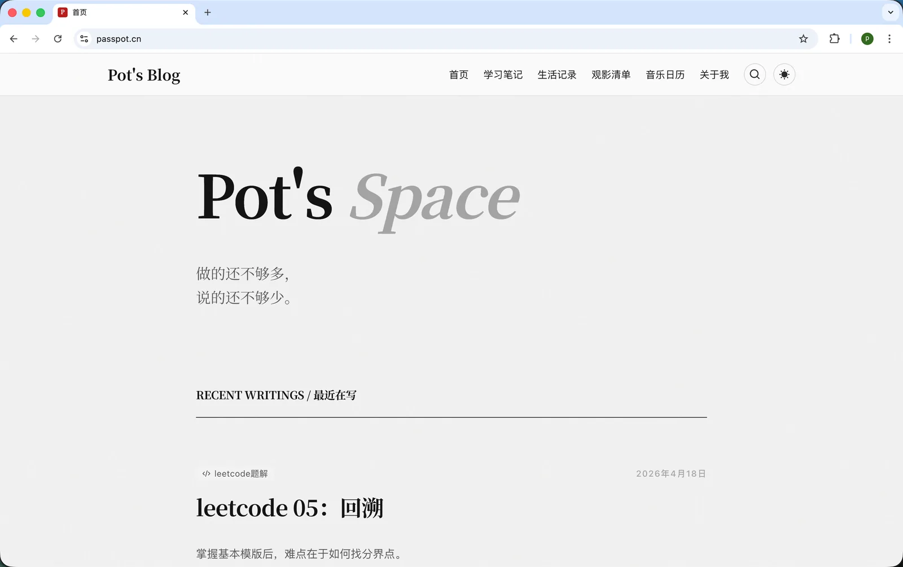 | 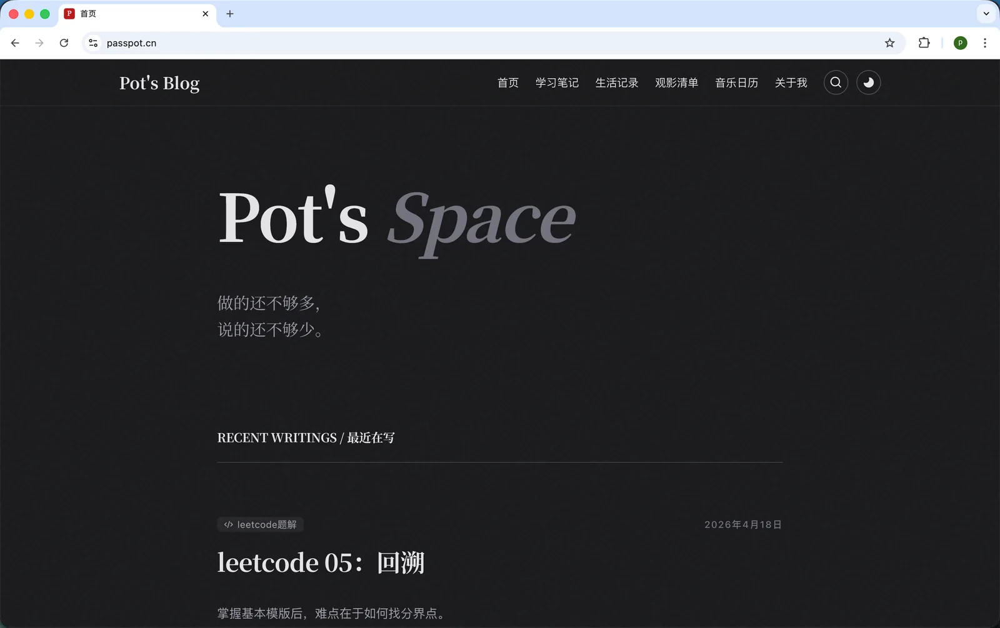 |

| Recent Watches | Recent Listening |
| --- | --- |
| 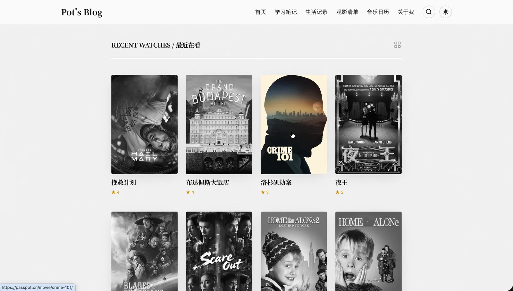 | 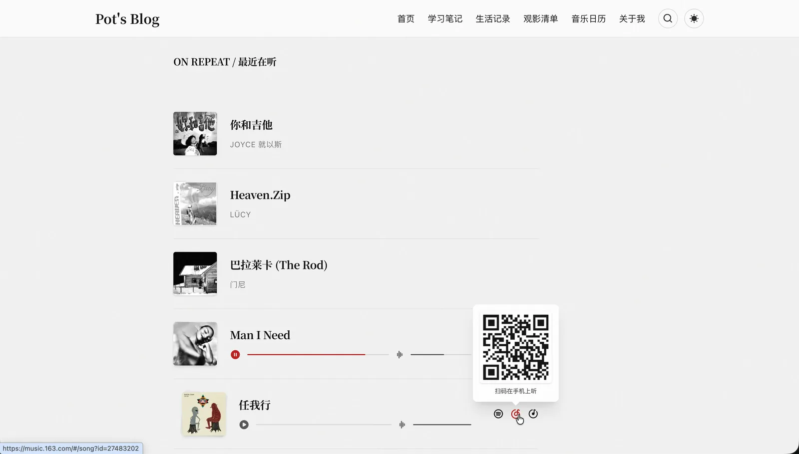 |

### Content Modules

| Learning List | Life List |
| --- | --- |
| 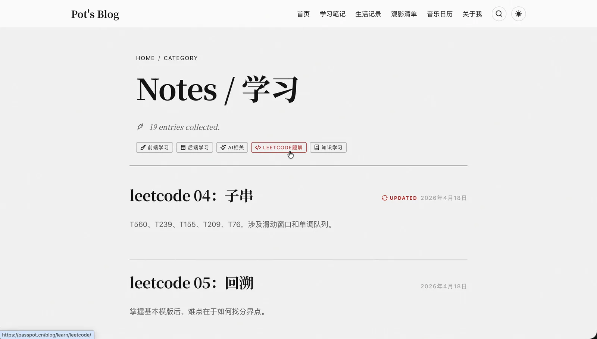 | 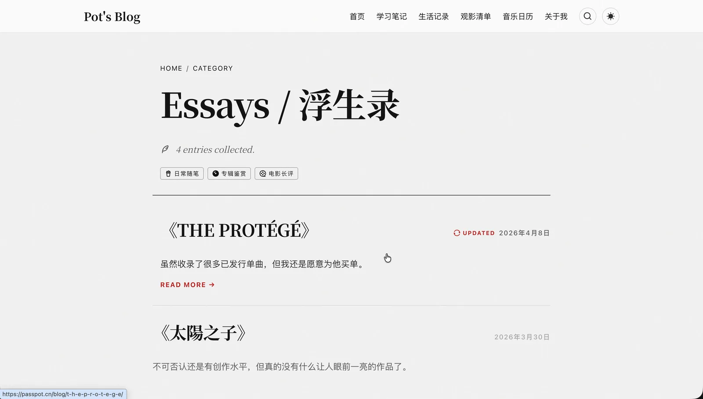 |

| Movie List | Music Calendar |
| --- | --- |
| 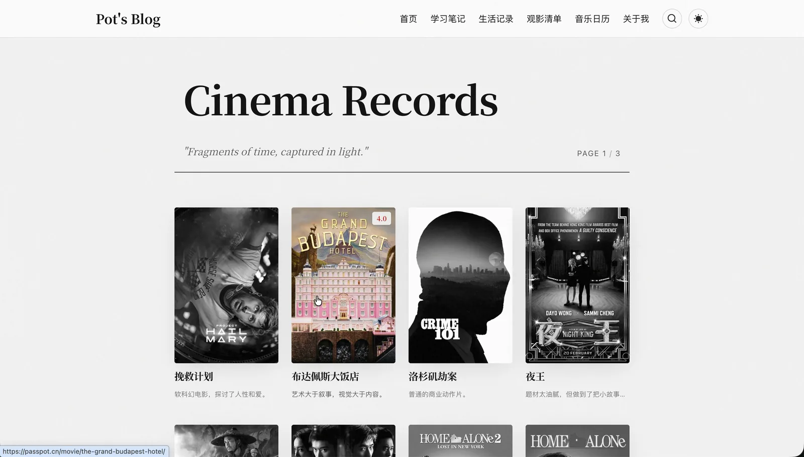 | 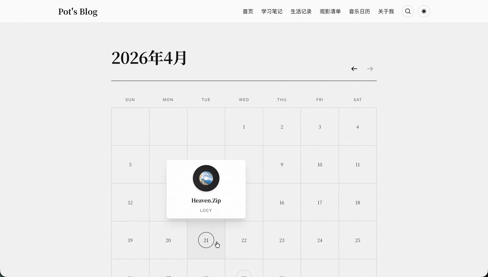 |

| About Page |
| --- |
| 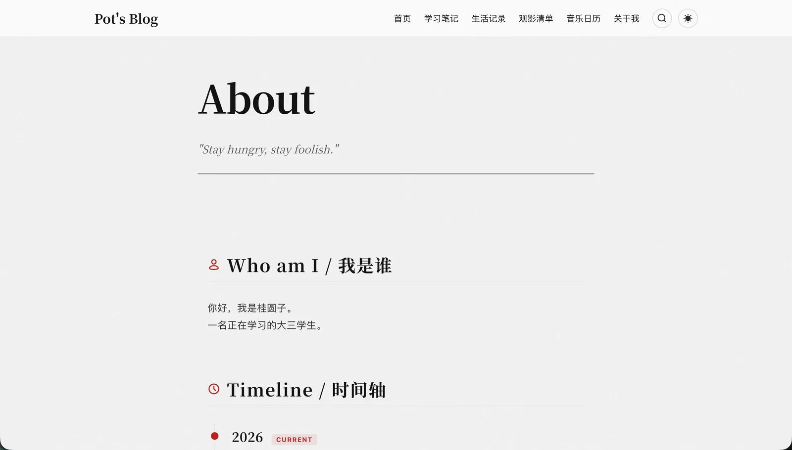 |

## Features

- Blog archive for technical notes, life writing, album reviews, and movie essays.
- Movie records with cards, ratings, and Grid/Scroll views.
- Music records with recent listening, calendar views, album entries, and track entries.
- Static full-site search powered by Pagefind.
- Reading-focused MDX experience with table of contents, math rendering, custom code blocks, and dark mode.
- Interaction polish with Lenis smooth scrolling, Astro View Transitions, and a global audio player.
- Responsive layouts for mobile reading and browsing across the main pages and content modules.

## Feature Details

| Blog Post | Code Block |
| --- | --- |
| 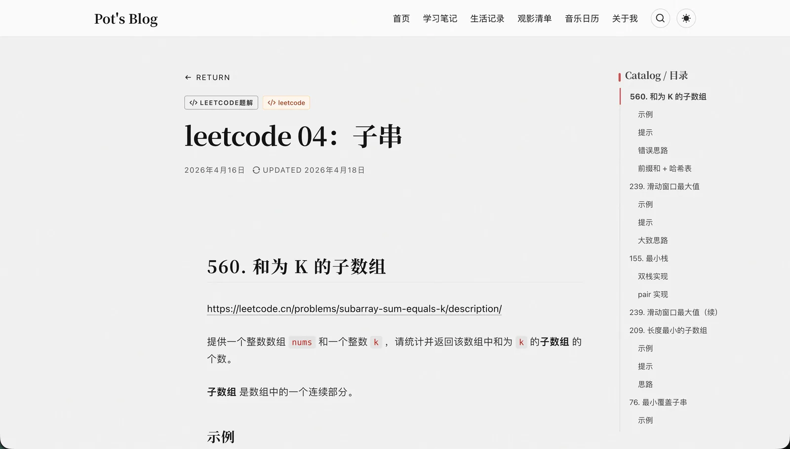 | 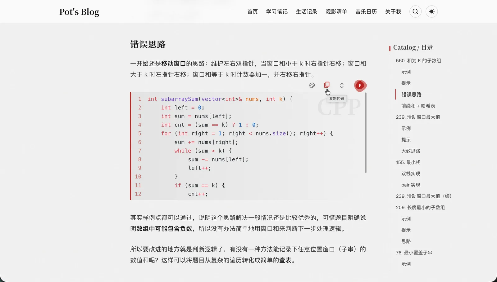 |

| MDX Component | Search UI |
| --- | --- |
| 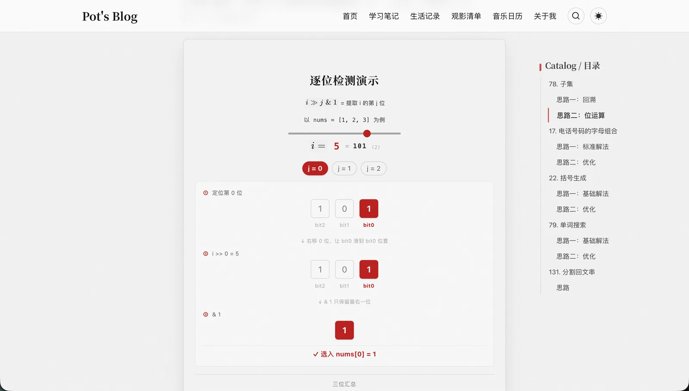 | 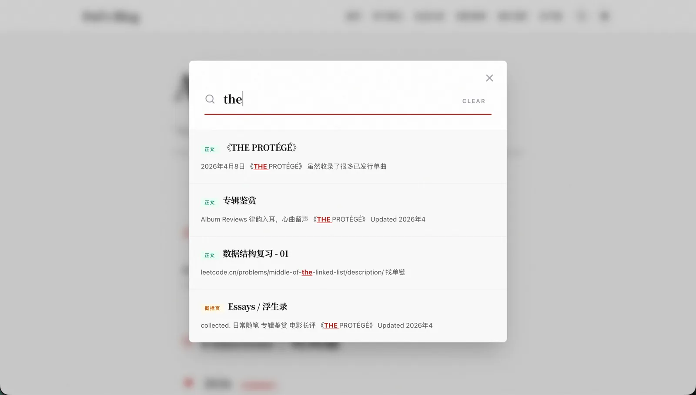 |

| Album Post | Movie Post |
| --- | --- |
| 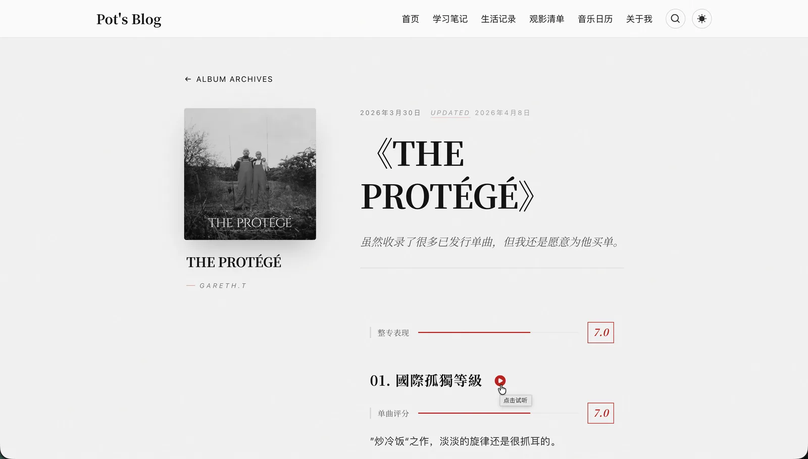 |  |

## Tech Stack

- Astro 5
- Tailwind CSS v4
- Astro Content Collections
- MDX and YAML content sources
- Pagefind
- `astro-icon` and Iconify icon sets
- Lenis

## Getting Started

```bash
npm install
npm run dev
```

Production build:

```bash
npm run build
npm run preview
```

Content scripts:

```bash
npm run new
npm run update
npm run album
```

## Project Documentation

- Collaboration entry: [AGENTS.md](AGENTS.md)
- Project documentation index: [docs/project/README.md](docs/project/README.md)
- Architecture: [docs/project/architecture.md](docs/project/architecture.md)
- Routes: [docs/project/routing.md](docs/project/routing.md)
- Content model: [docs/project/content-model.md](docs/project/content-model.md)
- Styling system: [docs/project/styling.md](docs/project/styling.md)
- Components: [docs/project/components.md](docs/project/components.md)
- Interactions: [docs/project/interaction.md](docs/project/interaction.md)

## Repository Shape

```text
src/
  assets/      imported images and content assets
  components/  reusable UI and article demo components
  content/     blog, movie, and music content collections
  layouts/     page and post layout shells
  pages/       Astro routes
  styles/      global and Markdown styles
  utils/       taxonomy, tag, and calendar helpers
docs/project/  maintained project knowledge base
scripts/       content automation scripts
public/        static passthrough assets
```
