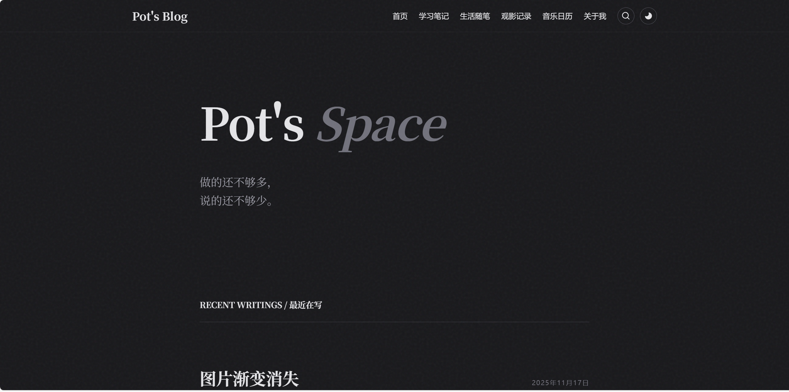
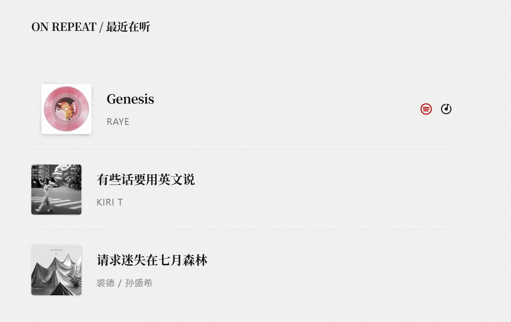
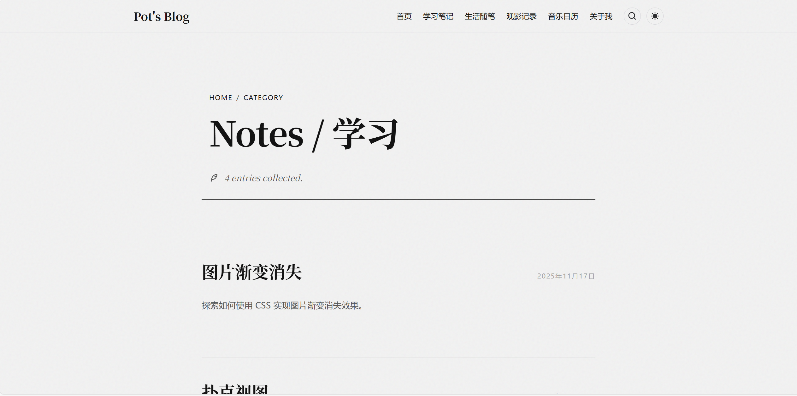
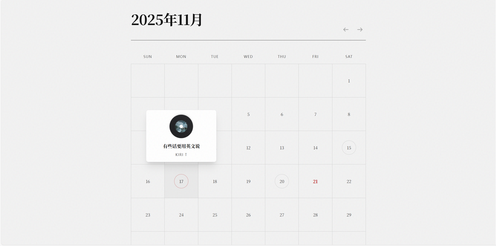
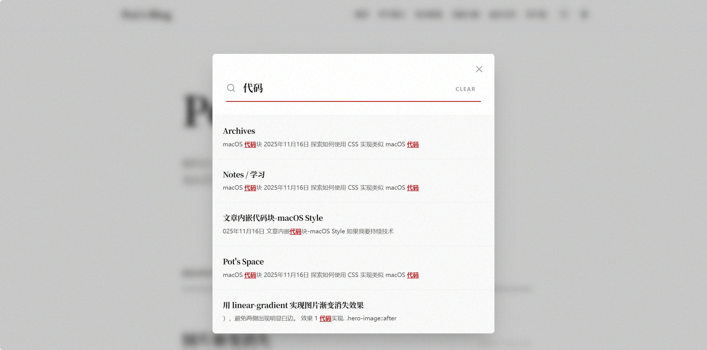

# Pot's Blog (Ink Style Astro Blog)

这是一个基于 **Astro v5** 和 **Tailwind CSS v4** 构建的个人博客项目。

项目采用了独特的“墨色系统”设计语言，旨在提供一种现代东方美学的阅读体验，同时集成了音乐日历、观影记录等个性化功能模块。

## ✨ 特性 (Features)

### 🎨 视觉与设计

- **墨色系统 (Ink System)**: 精心调配的明暗主题。亮色模式下如纸上墨迹（焦墨/浓墨/淡墨），暗色模式下呈现深邃质感，辅以“朱红”印章色作为点睛之笔。
  
  
- **macOS 风格代码块**: 高度定制的 Shiki 代码块，模拟 macOS 窗口样式，集成行号显示、复制按钮及折叠功能。
- **噪点材质**: 全局叠加柔和的噪点纹理，增加页面的质感与厚度。





### 🧩 功能模块

- **音乐日历 (Music Calendar)**: 以月历形式展示每日听歌记录，支持专辑封面网格展示。
  
- **观影记录 (Cinema Records)**: 提供 **Grid（网格）** 和 **Scroll（横向卷轴）** 两种视图切换，带交互式评分印章与海报动效。
  
- **全局搜索**: 集成 **Pagefind**，提供快速、精准的静态全站搜索体验。
  
- **搜索可观测性 (本地轻量版)**: 内置前端事件统计（无后端依赖），会记录搜索成功/无结果/错误、最近查询结构和基础计数，默认保存在浏览器 `localStorage`。
- **平滑体验**: 集成 **Lenis** 实现平滑滚动，并结合 Astro 的 **View Transitions** 实现无缝页面切换。

## 🛠️ 技术栈 (Tech Stack)

- **核心框架**: [Astro v5](https://astro.build/)
- **样式库**: [Tailwind CSS v4](https://tailwindcss.com/) (Vite 插件版)
- **内容驱动**: Astro Content Collections (MDX, YAML)
- **图标库**: Astro Icon + MingCute / Tabler
- **搜索**: Pagefind
- **动画与交互**: Lenis (平滑滚动), View Transitions

## 🚀 快速开始 (Getting Started)

1.  **安装依赖**:

    ```bash
    npm install
    ```

2.  **启动开发服务器**:

    ```bash
    npm run dev
    ```

3.  **构建生产版本** (包含搜索索引生成):
    ```bash
    npm run build
    ```

## 🔎 搜索统计查看

项目当前没有接入第三方统计平台（如 Umami/GA），搜索统计使用站内轻量方案：

1. 打开调试日志（可选）

```js
localStorage.setItem("pot-search-debug", "1");
```

2. 读取统计

```js
window.__potSearchMetrics?.read();
```

3. 清空统计

```js
window.__potSearchMetrics?.clear();
```

统计存储键：`pot-search-metrics-v1`

## 🔐 Dashboard 访问保护（Nginx）

本项目约定后台路径为 `/dashboard`，不在站内提供跳转入口。

推荐最小防护：`Basic Auth + 限流（中等档 20 req/min per IP）`

1. 生成密码文件（服务器执行）

```bash
sudo apt-get install apache2-utils -y
sudo htpasswd -c /etc/nginx/.htpasswd-dashboard your_admin_name
```

2. 在站点 Nginx 配置中加入（示例）

```nginx
# 全局或 server 内：中等限流（每 IP 每分钟 20 请求）
limit_req_zone $binary_remote_addr zone=dashboard_limit:10m rate=20r/m;

server {
  # ... 你的现有配置

  location ^~ /dashboard {
   auth_basic "Dashboard";
   auth_basic_user_file /etc/nginx/.htpasswd-dashboard;

   limit_req zone=dashboard_limit burst=5 nodelay;

   try_files $uri $uri/ /dashboard/index.html;
  }
}
```

3. 重载配置

```bash
sudo nginx -t && sudo systemctl reload nginx
```

4. 验证
1. 未登录访问 `/dashboard` 返回 401。
1. 输入正确账号口令后可访问。
1. 压测高频访问可触发 429。

## ✅ 待办清单 (ToDo List)

### 🔧 功能增强

- [ ] **评论系统**: 接入 Giscus 或 Waline，增加博客互动性。

### ⚡️ 工程与 SEO

- [ ] **SEO 增强**: 为影评和文章页面添加 Schema.org (JSON-LD) 结构化数据。

## 📂 目录结构

```text
src/
├── assets/        # 静态资源 (图片、字体)
├── components/    # 通用组件 (Header, Footer, Search, Cards...)
├── content/       # 内容集合 (Blog MDX, Movie MDX, Music YAML)
├── layouts/       # 页面布局 (BaseLayout, BlogPost, MoviePost)
├── pages/         # 路由页面
└── styles/        # 全局样式 (Tailwind @theme 配置)
```
