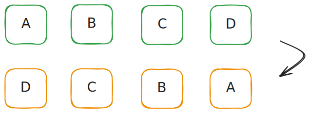
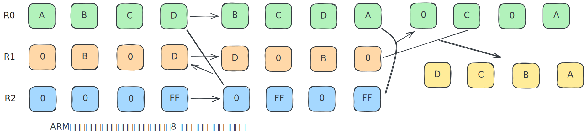

## 01.字节序反转 (Endianness Swap)
场景：将 32 位数据从大端（Big-Endian）转为小端（Little-Endian），或反之。


### 异或交换法
```asm
EOR     R1, R0, R0, ROR #16    ; 计算高低位差异
BIC     R1, R1, #0xFF0000      ; 清除 R1 无用位
MOV     R0, R0, ROR #8         ; R0 整体轮转
EOR     R0, R0, R1, LSR #8     ; 再次异或修正
```


- **思路**：利用“异或（XOR）”运算的特性来交换数据。
- **优势**：用计算“位差异”避免临时存储空间来保存具体的字节值。
- **总结**：非常“数学”、非常精练的写法，代码紧凑。

### 掩码位移法
```asm
MOV R2, #0xFF
ORR R2, R2, #0xFF0000      ; 选中第1、3字节
AND R1, R2, R0             ; 提取 R0 第1、3字节
AND R0, R2, R0, ROR #24    ; R0 右移24位后提取
ORR R0, R0, R1, ROR #8     ; 把 R1 右移8位，与 R0 拼合
```


- **思路**：通过掩码（Mask）提取特定位，然后位移拼合。
- **优势**：逻辑清晰（分治法），通用性强，不依赖特定数学特性，可读性高。
- **总结**：适合初学者理解字节操作的基本原理。

### 好奇一下
以上的汇编代码是针对“**一个 32 位整数内部的字节翻转**”场景设计（即大小端转换，`BSWAP` 或 `std::byteswap`）。

而 C++ 标准库中的 `std::reverse` 作为一个**通用函数**，其面向**数组、容器、字符串**等任意长度的序列而设计。

#### 它的底层实现？

1. **C++ 源码逻辑：双指针 + 交换**

    `std::reverse` 的核心逻辑非常简单，首尾指针（迭代器）不断向中间靠拢并交换内容。

    ```cpp
    template<typename BidirectionalIterator>
    void reverse(BidirectionalIterator first, BidirectionalIterator last) {
        // 只要首尾没有相遇
        while ((first != last) && (first != --last)) {
            std::iter_swap(first, last); // 交换两个指针指向的内容
            ++first;                     // 首指针向后移
        }
    }
    ```

    #### 这里的 `swap` 用的是什么算法？
    在 C++ 中，`std::swap` 的标准实现通常是 “中间变量法”（Temp variable）。

    ```cpp
    // std::swap 的大概逻辑
    T temp = std::move(a);
    a = std::move(b);
    b = std::move(temp);
    ```

    #### 为什么不用 XOR 交换？
    其实在现代 CPU 上，异或交换通常比使用临时寄存器更慢。

    * **原因**：异或交换会产生很强的**数据依赖（Data Dependency）**，导致 CPU 流水线停顿。而使用临时变量（寄存器重命名技术）能让 CPU 并行处理得更快。

2. **编译器的优化**

    虽然 C++ 源码写的是简单的 `while` 循环，但编译器（GCC/Clang）会根据操作的数据类型，把这个循环编译成极其高效的汇编。

    #### 情况 A：`char` 数组
    如果代码是 `std::reverse(str, str + 4)` 。

    编译器识别出其实是一个 4 字节的翻转，它不会生成循环，也不会调用 `std::swap`，而是直接生成一条汇编指令：
    - x86/x64: `bswap` （Byte Swap）
    - ARM: `rev` （Reverse bytes）

    对应了“掩码移位法”的最终版。

    #### 情况 B：大型数组
    如果代码是 `std::reverse(arr, arr + 1000)` 。

    编译器不会一个一个数去交换，而是使用 SIMD 指令（单指令多数据）：
    1. 一次加载 128位 或 256位（比如 AVX2 指令集）的数据到向量寄存器。
    2. 使用向量指令（`vperm` 等）在寄存器内部直接把顺序打乱。
    3. 再一次性存回内存。