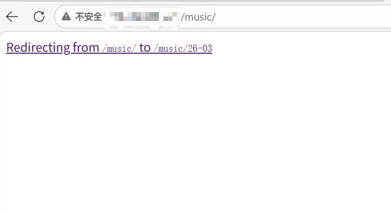

## 问题背景
- 在设计音乐日历功能时，我的思路是用户点击 BaseHead 上的“音乐日历”后跳转到当前月份页面，在当前月份页上点击切换访问历史月份。

    用编程语言来说就是：在 BaseHead 上设置 `/music` 路由，用户点击链接后，通过服务器端实时计算当前月份，再重定向到 `/music/YY-MM`。

    这是在当下主流 Vue/React 框架里很常见的 router 思维。但当我在 `index.astro` 中写下 `Astro.redirect()` 后，发现重定向过程被“可视化”了。



- 想要解决这个问题，就必须要理解动态路由和静态生成的区别，以及 Astro 的静态生成逻辑。

## 底层原理
- **前端路由（SPA）的本质**：
    
    前端路由是通过 JavaScript 在浏览器中动态改变 URL 和页面内容的技术。
    
    用户点击链接后，JS 会拦截到浏览器的 History API，在触发跳转事件的同时，框架在内存中卸载当前页面组件并挂载新组件，更新 URL。
    
    这项技术实现了在不重新加载整个页面的情况下，更新浏览器地址栏和显示不同的内容。

- **Astro 的静态生成（SSG）逻辑**：
    
    Astro 通过在构建时提前生成静态 HTML 文件来提升访问速度。但失去 JavaScript 的运行时动态能力，也意味着所有**路由**都在构建时确定，天然不擅长“按当前时间动态跳转”。

    我在 Astro 中使用 `Astro.redirect()` 时，Astro 编译器无法像前端 router 一样直接操作内存，只能在构建阶段生成一个中介页面，再由它把用户重定向到指定 URL。

    ### 闪屏流程

        1. 浏览器发出 GET 请求。
        2. 下载中介 HTML（重定向页面）。

            ```html
            <meta http-equiv="refresh" content="0;url=/music/YY-MM">
            ```

        3. 解析 DOM 遇到 meta 标签，触发重定向。
        4. 浏览器发出新的 GET 请求，访问目标 URL。

---

## 解决方案一
- 既然静态生成无法优雅实现“动态重定向”，那就回归 SSG 思路，直接在两个路由入口（`/music/index.astro` 和 `/music/[month].astro`）分别渲染完整日历。

    这很符合 SSG 的设计哲学：**一个 URL 对应一个组装好的 HTML**。

- 但这样的设计一定是需要被优化的：

    1. **代码冗余**：两个路由入口都需要渲染完整的日历，导致代码重复。
    2. **易出错**：由于 JS 计算脚本也重复存在，在调整算法时维护成本增加，容易出现不一致的情况。

## 解决方案二
- 最终采用的方案是**路由层和渲染层解耦**：

    路由文件（`pages/*.astro`）只负责两件事：声明路径、解析参数。

    视图组件（`components/*View.astro`）负责真正的渲染：接收参数、读取 collection 数据、执行日历计算、输出 HTML。

- 重构后的构建执行流可以概括为：

    `index.astro` -> 生成当月 key（构建时） -> 传给 `MusicCalendarView` -> 输出当月静态 HTML。

    `[month].astro` -> `getStaticPaths` 生成月份列表 -> 逐个传给同一个 `MusicCalendarView` -> 输出历史月份静态 HTML。

- 这样做的结果是：

    1. 不同 URL 入口在构建时复用同一套渲染引擎。
    2. 最终产物是多份独立静态 HTML，不再需要中介重定向页。
    3. 代码逻辑收敛在一个 View 里，维护成本明显下降。

## 代码实例
### `index.astro`：入口路由只传参
`src/pages/music/index.astro` 中，`/music` 路由只做参数生成，不做视图计算。

```astro
import MusicCalendarView from "../../components/MusicCalendarView.astro";
import { getMonthKey } from "../../utils/calendar";

const currentMonthKey = getMonthKey(new Date());
---

<MusicCalendarView targetMonthKey={currentMonthKey} />
```

### `[month].astro`：构建期生成月份路由
`src/pages/music/[month].astro` 通过 `getStaticPaths` 把历史月份路由一次性产出。

```astro
export async function getStaticPaths() {
    const allMusic = await getCollection("music");
    const months = new Set(
        allMusic.map((post) => getMonthKey(post.data.pubDate)),
    );

    months.add(getMonthKey(new Date()));

    return Array.from(months).map((monthKey) => ({
        params: { month: monthKey },
    }));
}
```

### `MusicCalendarView.astro`：统一渲染与前后月导航
`src/components/MusicCalendarView.astro` 里，月份导航和日历渲染都收敛到同一个 View。

```astro
const currentIndex = monthsKeys.indexOf(targetMonthKey);
const prevKey = monthsKeys[currentIndex + 1] || null;
const nextKey = monthsKeys[currentIndex - 1] || null;

<MusicCalendar
    ...
    prevMonthUrl={prevKey ? `/music/${prevKey}` : null}
    nextMonthUrl={nextKey ? `/music/${nextKey}` : null}
/>
```

## 待优化点
- 这里有一个容易忽略的边界：`getMonthKey(new Date())` 在 SSG 中是**构建时执行**，不是用户访问时执行。

    也就是说，`/music` 展示的是“构建当月”，如果站点长期不重新构建，就可能和真实当前月份出现偏差。

- 所以更准确的表述应该是：

    这个方案解决了重定向闪屏和代码重复问题，但它不是“访问时动态跳转到当前月”，而是“构建时静态确定默认月份”。

- 如果后续要做到“访问时永远落到真实当前月”，我在查询后考虑两条路线：

    1. 改为 SSR / 混合渲染，让 `/music` 在请求时计算月份。
    2. 保持 SSG，但在 `/music` 加一层轻量客户端跳转（权衡可访问性和体验）。

## 沉淀与反思
- 这次的改错让我完成“动态思维”向“静态思维”的转变：

    在 SSG 场景下，遇到“跳转需求”时，第一反应不该是“怎么重定向”，而应该是“能不能直接把目标视图提前生成出来”。

- 换句话说，问题的关键不是“把用户引过去”，而是“把页面端过去”。参数化组件复用，往往比重定向更符合静态站点的工作方式。

- 对 Astro 的理解也更清晰了：`---` 代码栅栏里的代码，本质是构建期脚本，不是运行时逻辑。

    我们写的不是“控制浏览器怎么跳”，而是“告诉构建器要产出什么 HTML”。

- 最后记录一句这次的经验结论：

    **在 Astro 的 SSG 模式里，能直出页面，就尽量不要中转重定向。**