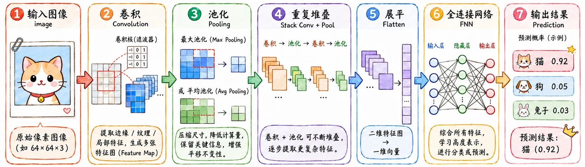

> 当 DL 来到图像领域，CNN 登上舞台。
>
> 面对图片的大量特征，FNN 手足无措。
>
> CNN 干脆把图像本身的性质写进网络结构里。

## 图像的性质

在学习 CNN 之前，先看图片本身。

为什么图像领域会与之前涉及的常规任务不同，至少有三个关键性质。

### 1. pattern 相对尺度小

图片里的大部分 pattern 都比整张图小得多。

识别一只猫，不需要每个神经元一上来就看完整张图。很多低级特征只发生在一个局部区域里，比如边缘、角点、纹理、颜色过渡。更进一步说，大部分高级特征（猫耳）在全局的尺度来看，也不过是沧海一粟。

如果用 FNN，每个像素都和下一层的每个神经元相连，模型会被迫为大量并不相关的位置关系准备参数。

这可以推出最直接的优化思路：**局部区域应该先由局部参数处理。**

### 2. pattern 可复用

一条竖直边缘出现在左上角，和出现在右下角，本质还是同一个特征。

在 FNN 里，它们没有任何关系。但怎么想都不应该为每个位置都训练一套独立的 detector（这个词其实不准确，囊括了 filter + 激活函数，我主要想说的是 filter，但打了这么多字也不舍得删了）。

更合理的做法是：**同一组参数在整张图上反复扫描。**

### 3. down sample 的可行性

把一张猫的照片等比例缩小并不影响特征识别，这说明图像里含有大量冗余信息。

没必要保留每一个像素级细节。尤其是在识别任务里，我们往往更关心“有没有这个特征”，而不是特征的具体位置。

所以 CNN 会提出 pooling 和 stride，它们都在做同一件事：**压缩空间尺寸，让后面的网络用更少参数处理更抽象的特征。**

## CNN 架构

经典 CNN 的基本流程：

$$
\text{image}
\rightarrow
\text{convolution}
\rightarrow
\text{pooling}
\rightarrow
\text{convolution}
\rightarrow
\text{pooling}
\rightarrow
\text{flatten}
\rightarrow
\text{FNN}
$$

> 卷积 + 激活 + 池化 = 卷积层，这个过程会重复。

先提取空间特征，再根据这些特征做分类或回归。

## convoluiton

卷积（convolution）在针对图像的前两个性质时有优异的表现：**局部连接**和**参数共享**。

### 卷积过程

在 CNN 里，一个卷积核不会一次性看完整张图，而是只看一个小窗口。它从图片左上角开始，按照固定步长从左到右、从上到下滑动。

在每个窗口都做一次简单运算：对应位置相乘，然后求和。

$$
\text{output} = \sum X_{ij} W_{ij}
$$

这其实就是**内积**：把局部图像区域看成向量 $X$，把卷积核看成向量 $W$，卷积输出就是 $X \cdot W$。

内积越大，说明这块区域越像这个卷积核的目标 pattern。

### Kernel & Filter

这里有两个容易混的词：`Kernel` 和 `Filter`。

#### Kernel

Kernel 即卷积核，指一个二维权重矩阵。

在一次卷积操作里，一个 Kernel 只处理输入特征图中的一个通道。

#### Filter

Filter 即滤波器，指一个三维权重集合（张量）。

考虑输入是一张 RGB 图片。

一个 Filter 如果要完整处理这张图片，就需要包含 3 个 Kernel，分别处理 _R、G、B_ 三个通道。

每个 Kernel 得到一个卷积结果，最后把这些结果沿通道方向加起来，再加上 bias，就得到输出特征图里的一个通道。

#### 实例辨析（单卷积层）

举个例子，输入图片大小是 $32 \times 32 \times 3$，我们想提取一种边缘特征：

1. 需要 1 个 Filter。
2. 这个 Filter 内部有 3 个 Kernels，各处理一个颜色通道。
3. 三个卷积结果逐像素相加，输出一个 $32 \times 32 \times 1$ 的特征图。

如果希望网络提取 64 种不同特征，就需要 64 个 Filters。于是这一层的输出就有 64 个通道。

卷积层常见的权重张量维度就是：

$$
K_h \times K_w \times C_{in} \times C_{out}
$$

比如 $3 \times 3 \times 3 \times 64$。

不过现在业界一般不对两个名次作严格区分，如果比较在意的话，就用卷积核同意替代好了。

### stride & padding

卷积核的实际滑动也是大有讲究。

`stride` ：每次滑动几格。步长越大，输出特征图越小。

`padding` ：在输入边缘补 0。

如果不 padding，边缘像素被计算的次数会明显少于中心像素。随着网络层数加深，边缘信息会越来越快地丢失。

常见的两种模式是：

- `Valid Padding`：不填充（默认模式），输出会缩小。
- `Same Padding`：等长填充（保留模式），四周补 0，让输出尺寸尽量和输入**保持一致**。

`stride` 和 `pooling` 会让感受野扩张得更快。代价也很直接：**视野变大，但空间定位会更粗略**。

### 感受野

**感受野（Receptive Field）** 即代表：某个神经元，最终能“看见”原图里的多大一块区域？

#### conv layer 1

一个 $3 \times 3$ 的卷积核，每次只看**原图**里的 $3 \times 3$ 小窗口，所以第一层输出里的一个值，感受野就是 $3 \times 3$。

#### conv layer 2

第二层卷积核看的是**第一层特征图**的 $3 \times 3$ 小窗口。第一层里的每个位置，本来又各自对应原图里的一个 $3 \times 3$ 区域。叠起来看，第二层的一个值就能间接看到原图里更大的一块区域。

#### 整体效果

**单层只做局部连接，但层数叠起来后，深层神经元会获得越来越大的视野。**

这也是为什么浅层偏向边缘、纹理，深层会开始接近部件和语义。这正是因为深层卷积核拥有了综合更大范围信息的能力。

### 优势之处

在卷积的思路下，CNN 相比 FNN 的最大优势，就是**参数少**。

假设输入还是老朋友，一张 $32 \times 32 \times 3$ 的图片。如果接一个有 1000 个神经元的全连接层，参数量大概是：

$$
32 \times 32 \times 3 \times 1000
$$

但如果用 64 个 $3 \times 3$ 的 Filter 作单层卷积层，参数量是：

$$
3 \times 3 \times 3 \times 64
$$

差距显而易见。

## pooling

池化（pooling）针对的是第三个性质：**下采样**后，物体通常仍然可识别。

### Max Pooling

最大池化（Max Pooling）会在一个小窗口里取最大值。比如 $2 \times 2$ 的 max pooling，就是每 4 个值压缩成 1 个最大值。

#### 直觉

如果某个局部区域里已经检测到了一个强特征（比如鲜明的边缘），我不必记住这个特征在区域内的精确位置，只需要知道*这附近有它*。

适合提取显著的、辨识度高的特征。

### Average Pooling

平均池化（Average Pooling）则是在一个小窗口里取平均值。同样是 $2 \times 2$ 的窗口，它会将这 4 个值相加后除以 4。

#### 直觉

它关心这个区域内的**整体表现**或**背景信息**，起到一种平滑信号的作用。

在现代网络中，常在最后一层使用全局平均池化 GAP，将整张特征图压缩成一个值，用来融合全局信息并防止过拟合。

### 包饺子

无论是哪种池化，都会带来两个核心结果：

- 特征图变小，后续的参数量和计算量大幅下降。
- 引入了局部平移不变性，使模型对小范围的位置偏移更不敏感。

当然，如果任务非常依赖精确的空间位置，比如语义分割、关键点检测，或者后面要讲到的[围棋落子](toconnect)，那么粗暴的池化（尤其是最大池化）就可能损失关键的定位信息。

在这些场景下，网络设计往往会尽量减少池化层，或者采用其他方式（如空洞卷积）来维持分辨率。

## flatten & FNN

经过多层卷积和池化后，我们得到的是**一组抽象特征图**。

浅层可能是边缘和纹理；中层可能是局部结构；深层可能已经接近眼睛、轮廓、部件这类语义特征。

最后把这些特征图 `flatten` 成一维向量，交给 FNN 或其他分类头输出结果。

这里的 FNN 不再负责从原始像素里硬学空间关系。它拿到的是 CNN 已经整理过的特征。
