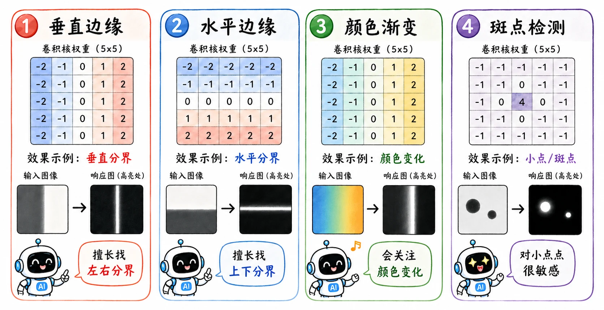
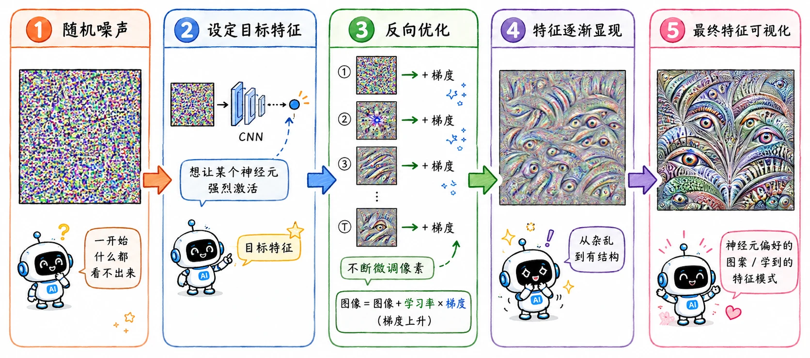

> 当年发文章是怎么水图片的，怎么水着水着就不一样了。

## 第一层学到了什么

第一层卷积核的输入是**原始图片**。

原始图片里的每个数字都有明确的物理含义：_红色强度、绿色强度、蓝色强度，或者灰度明暗_。这是人类能天然理解的信号。

所以第一层卷积核直接作用在这些像素上时，它的权重矩阵也还保留着某种可视化意义。

我们以垂直边缘检测核为代表来观察。

### Prewitt 算子（Prewitt operator）

$$
\begin{bmatrix}
-1 & 0 & 1 \\
-1 & 0 & 1 \\
-1 & 0 & 1
\end{bmatrix}
$$

- 当它扫过一片纯色区域时，左边负数和右边正数会互相抵消，输出接近 $0$。
- 但当它扫过一条左黑右白的边界时，乘积求和会变大。
- 所以这个卷积核在偏向**左暗右亮的垂直边缘**。

### Sobel 算子

$$
\begin{bmatrix}
-1 & 0 & 1 \\
-2 & 0 & 2 \\
-1 & 0 & 1
\end{bmatrix}
$$

Sobel 算子给中间行分配了更大的权重，这得以让它在检测边缘时对**中心像素**更敏感，同时能起到一定的**平滑噪声**的作用。

### 卷积核的进化方向

卷积的本质是内积。把局部区域看成向量 $X$，把卷积核看成向量 $W$：

$$
X \cdot W = |X| |W| \cos(\theta)
$$

当两个向量方向越接近，内积越大。

所以如果一个卷积核希望在“垂直边缘”出现时**高度激活**，它自己就会被训练得**越来越像垂直边缘**。

## 深层学到了什么

但从第二层开始就困难重重了。

第二层看到的是第一层输出的特征图。第三层看到的是第二层输出的特征图。越往后，一个通道里的数字越不像*红色强度、灰度明暗*，而是更高维的组合特征。

到了深层，卷积核处理的是由几十、几百个通道组成的抽象空间。这个空间已经脱离了我们熟悉的物理坐标维度，那还有办法可视化吗？

## 特征可视化

特征可视化，也叫激活最大化（Activation Maximization）。

反其道而行之：**既然我想知道某个神经元喜欢什么，那就我去寻找让它最兴奋的输入**。

### 具体过程

假设目标 CNN 的第 2 个 conv layer 里有 50 个卷积核，每个卷积核的输出都是一个 $11 \times 11$ 的矩阵。

#### 1. “兴奋度”

对第 $k$ 个卷积核，我们定义一个“兴奋度”：

$$
a^k = \sum_{i=1}^{11} \sum_{j=1}^{11} a_{ij}^k
$$

其实就是把这个卷积核输出特征图里的所有数字加起来。

如果总分很低，说明输入图片里没有它想找的东西；总分很高，说明这张图片很符合它的审美。

#### 2. 逆向工程

冻结这个核的所有参数，从一张随机噪声图 $x$ 开始，不断修改这张图的像素，让 $a^k$ 尽可能大：

$$
\arg\max_x a^k
$$

随着优化进行，随机噪声会慢慢变成一张奇怪的图。它不一定像自然图片，但它会极度刺激目标卷积核。

我们看这张图就能大概猜出这个卷积核在找什么。

### 可视化差异

不同层可视化出来的东西差异很大。

浅层通常是**边缘、颜色、纹理**。它们和原始像素很近，所以我们还能直接看出一些规律。

中层开始出现**局部形状**，比如*重复纹理、小块结构、曲线组合*。

深层就更接近**语义部件**，比如*眼睛、轮廓、动物脸、建筑结构*。

## 全连接层学到了什么

同样的方法也可以用在全连接层，但观察结果和卷积层不太一样。

卷积核因为局部连接，通常学习的是较小的 pattern。全连接层看到的是前面 CNN 整理过的一整组特征，所以它学到的往往是更大范围、更整体的组合。

## 输出层学到了什么

对输出层做激活最大化，效果出人意料。

比如最大化“数字 8”的输出，理想情况下应该生成一个标准的 8。

但结果并不是这样。

机器学到的*能让 8 这个类别高分的东西*，不等于我们设想的标准数字。它往往抓住了某些对分类有效、但人类看起来很怪的统计特征。

这个结果很重要，它说明了模型确实在学习，但学习到的东西不一定和人类解释完全对齐。

如果只是识图还没关系，但在生图时，这种不一致是致命的。

## 从可视化到生成

一开始，这类方法只是为了看懂 CNN。

研究者想证明某些卷积核真的学到了边缘、纹理、猫耳或者其他东西，方便把自己的成果可视化，在论文放张图片闪耀众人。

但做着做着，大家发现一件更大的事：

> 如果固定网络权重，然后通过梯度反向修改输入像素，我们就能直接操控图片。

就此，从**解释模型**走向**生成图像**。
