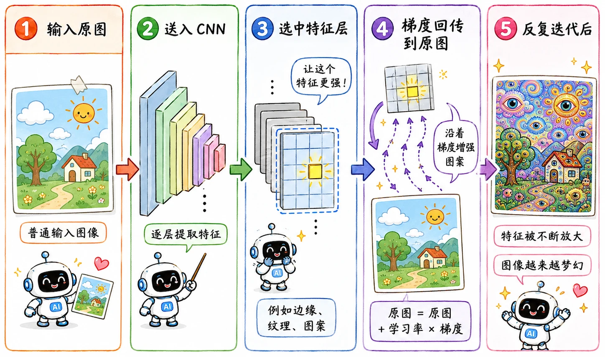
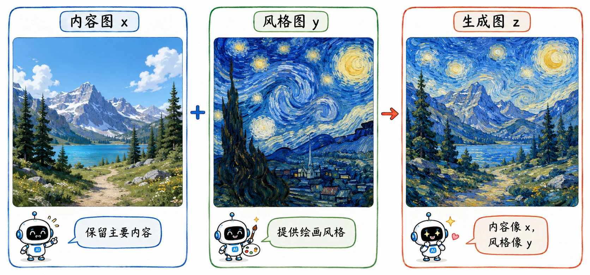
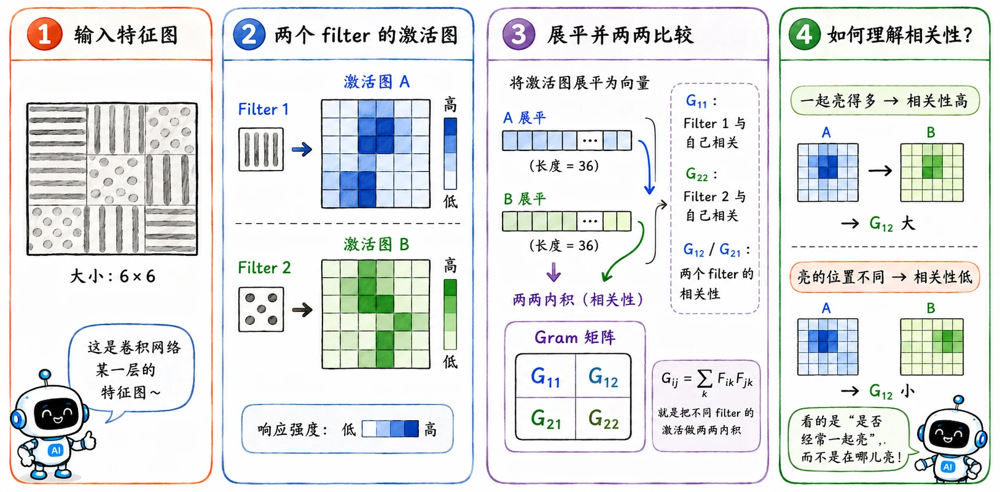

import deepDreamLayerImage from "../../assets/blog/content/ml-to-llm/cnn/03-2.webp";

> 如果说真正的生成模型是从白纸开始作画，那 Deep Dream 和 Style Transfer 更像是在已有的画布上涂改。
>
> 它们的核心法则一致：**神经网络的权重不动，改让图片的像素去试探。**

正是这两个技术，一脚踹开了早期生成式视觉的大门。

## Deep Dream

Deep Dream 是研究者早期一次非常有趣的尝试：如果让 AI 把**幻觉**落入实际，会发生什么？

好比我们躺在草地上看云。你觉得某朵云的形状有点像狗，大脑就会不自觉地往狗的样子去脑补；Deep Dream 也是一样，只不过它是个行动派：如果它觉得这朵云像狗，就直接动手把云改造成一只真的狗。

这个过程本质上是一个**自我强化的死循环**：

1. **正向试探**

   先把一张再正常不过的风景照 $x$ 扔进 CNN。当数据流过深层网络时，模型可能在草地、云层或者树叶的某个角落里，捕捉到了极其微弱的“动物纹理”特征。在正常的分类任务里，这点微弱的激活值掀不起什么风浪。

2. **强行放大**

   Deep Dream 的骚操作来了——它把这些微弱的激活值强行放大。本来只有 1% 像狗脸的阴影，它非要推到 100%。

3. **逆向改图**

   接下来就是常规的逆向工程：
   1. 冻结 CNN 的所有参数。
   2. 对着输入图片 $x$ 的像素求梯度，顺着梯度去更新像素值。
   3. 把改好的新图片 $x'$ 再扔回网络，继续寻找“幻觉”，继续放大。

循环几次之后，原本正常的风景图生长出大量奇怪纹理和语义部件，说实话有点吓人。

### 为什么总是眼睛和狗头

如果看过早期的 Deep Dream 产物，会发现它们简直就是**克苏鲁动物园**：到处都是密密麻麻的眼睛、狗嘴、鸟类羽毛和塔楼。这是其实是由训练数据决定的。

当年做实验用的老前辈模型，基本都是在 ImageNet 上炼出来的。而 ImageNet 的分类体系里，包含了大量细分的狗类品种等。模型见过太多这类特征，所以它在云、树叶、草地里找到一点相似纹理后，就很容易往那些方向放大。

### 浅层与深层的不同幻境

Deep Dream 最有意思的玩法，是可以手动选择放大 CNN 的哪一层（让哪一层做梦）。

- 如果你选择**浅层网络**，梦境会相对克制。因为浅层只懂边缘、颜色和基础纹理，图片会浮现出密集的几何图案、波浪线、甚至梵高式的笔触感。
- 如果你选择**深层网络**，梦境就放飞自我了。深层网络掌握的是高级语义，它放大的全是具体的实物。于是图片里就会硬生生长出动物器官、诡异的人脸或是建筑结构，甚至一些完全不存在的缝合怪。

<figure className="sensitive-image" data-sensitive-label="密恐慎点">
  
</figure>

## Deep Style

Deep Style 的学术名是 Neural Style Transfer（神经风格迁移）。

同为**逆向改图**，它的目的性更强。相比 Deep Dream 漫无目的地做梦，它被塞了两个硬性 KPI：

- **骨架** 必须像原图 $x$。
- **画风** 必须像参考图 $y$。

假设手头有一张普通的风景照 $x$，又找来一张梵高的《星空》$y$，打算炼出一张新图 $z$：

$$
z = \text{content}(x) + \text{style}(y)
$$

### 内容：提取骨架

要保留原图的内容，我们通常去求助 CNN 的**深层特征**。

当风景照 $x$ 被送到网络深处时，CNN 已经不太关心具体的像素颜色、光照细节了。深层特征记录的是一种抽象的**语义布局**：

> “左边站着个人，后面是座山，头上是天空”。

这就是我们所需要的**内容骨架**。所以，我们通过计算内容损失，强迫生成图 $z$ 在深层特征上的表现，必须跟原图 $x$ 对齐：

$$
L_{content} = ||F_l(z) - F_l(x)||^2
$$

### 风格：共生关系

相比之下，**风格**是个非常主观且玄乎的词。它到底该怎么用数学定义？

作者极其聪明地把它看作是颜色、纹理、笔触在画面中的**共生频率**。比如在梵高的画里，只要出现了深蓝色的旋涡，附近大概率会跟着出现粗糙的黄色亮斑。

神经风格迁移用**Gram Matrix（格拉姆矩阵）**来专门记录这种特征间的相关性。它不在乎某个特征“出现在画面的哪里”，只看不同的 filter（滤波器）是不是经常**同时激活**。

代价是图片的**空间位置信息**被完全丢弃。

但这恰恰是我们想要的！画风本来就是一种弥漫在全图的全局属性，不需要被框死在特定坐标里。

### 融合生成

现在，我们手里有了两把尺子：生成图 $z$ 既要让自己的深层特征贴合原图（内容），又要让自己的 Gram Matrix 贴合名画（风格）。

于是，最终的**总损失函数**就是这两者的 trade-off：

$$
L = \alpha L_{content} + \beta L_{style}
$$

接下来的炼丹流程就轻车熟路了：

1. 找一张随机噪声图（或者为了快速收敛，直接拿内容图打底）。
2. 把图扔进 CNN。
3. 分别计算内容损失和风格损失。
4. 网络参数固定，只用梯度去更新这盘图片的像素。

几百步迭代之后，$z$ 就会在保留原图的山水结构的同时，披上一层梵高独有的狂野笔触。

## 时代的局限

不管是让人掉 san 的 Deep Dream，还是惊艳一时的 Style Transfer，它们都展现了深度学习在视觉上的巨大潜力。

但严格来说，它们依然困在**优化器**的范畴里。Deep Dream 需要一张现成的风景照来滋生幻觉；Style Transfer 也需要内容图和风格图的严格约束。

它们本质上是一套**滤镜算法**。要实现真正的**无中生有**，我们要等到[生成模型](/blog/gen-01-early-generative-models/)的登场。
