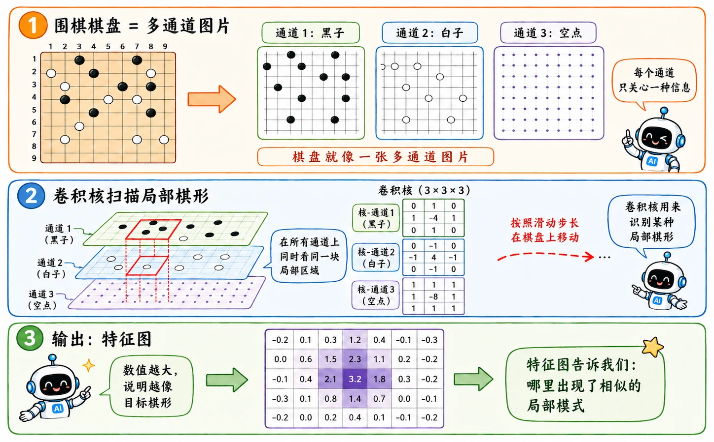
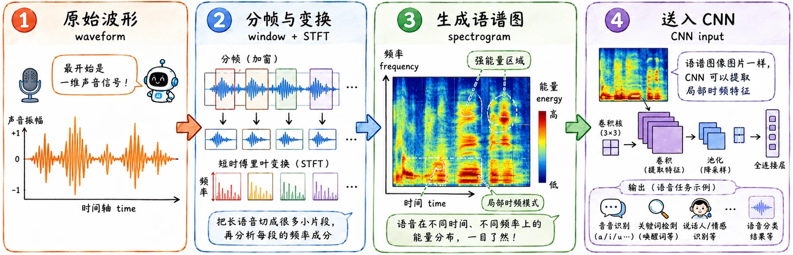
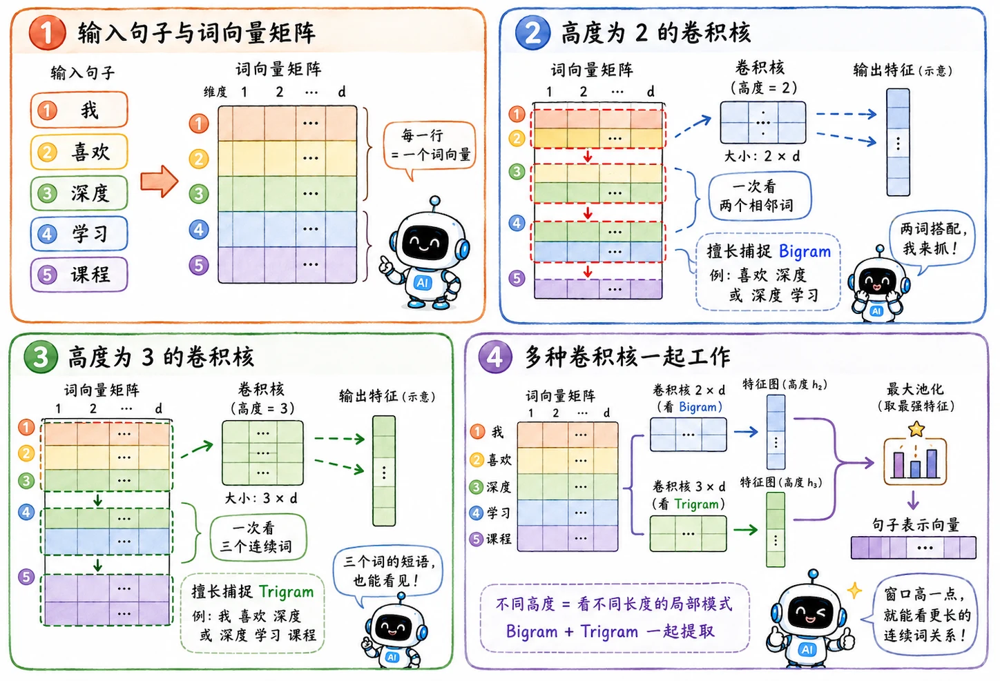

> CNN 不止在图像领域大放光彩。
>
> 它在任何“数据有局部结构、且局部模式可复用”的领域都有亮眼表现。

## 围棋

围棋棋盘是 $19 \times 19$ 的网格。

完全可以把棋盘以及内含数据抽象成一张单通道或者多通道图片。每个交叉点可以表示黑子、白子、空位、气、历史落子等特征。

### CNN 驾到

围棋和图片还有两个相似点。

1. **局部模式**

   图像里有边缘、纹理、角点。围棋里有虎口、打吃、定式、局部死活形状。一个**局部感受野**，正好可以识别局部形状。

2. **平移复用**

   一个好形出现在左上角，平移到右下角，通常仍然是一个好形。同一个卷积核可以在全盘寻找同一种战术结构。

### no pooling!

围棋跟图像识别还是有区别的，围棋不使用池化下采样。

围棋参数量小，对精确度的要求高，局部如果差一个交叉点，结果可能完全不同。如果加入 max pooling，把 $19 \times 19$ 压成 $9 \times 9$，网络会丢掉精确坐标。而且这个量级的下采样优化完全没必要

这是一个很重要的提醒：结构先验要匹配任务，不是看到网格就把全套 CNN 模板复制过去。

## 语音

声音本质上是一维时间序列，但我们可以通过时频分析，把声音变成二维表示，也就是**语谱图（Spectrogram）**。

语谱图里：

- X 轴是时间。
- Y 轴是频率。
- 颜色深浅表示能量或幅度。

这样声音就变成了一张“图片”。

### 频率方向的平移

语音里的卷积有一个直观例子：**音高不变性**（类似平移不变性）。

男生和女生说同一个词，语义是一样的，但因为声带和音高不同，能量图案可能在频率轴上整体上移或下移。

让卷积核沿频率方向滑动，就能用同一组参数捕捉高音和低音里的相同语音 pattern。

### 时间顺序

不过语音的时间轴会更麻烦。

时间顺序本身包含因果和上下文关系，不能简单当成图片的 X 轴处理。所以很多语音系统会把 CNN 和 RNN、LSTM 或 Transformer 结合起来。

CNN 负责提取局部时频特征，序列模型负责处理更长的时间依赖。

## 文本

文本本质上也是一维序列。

比如一句话：

> 这部电影非常好看！

它不是二维图片，但存在局部结构。

相邻词之间会组成短语，比如“非常好看”。

### 词向量

第一步是把每个词变成 vector。

如果每个词向量长度是 100，一句 5 个词的话就可以表示成一个 $5 \times 100$ 的矩阵。

### 一维卷积

文本里的卷积核通常沿着词序方向滑动。

卷积核的宽度等于词向量维度，高度决定一次看几个词。

- 如果高度是 2，它每次看 2 个词，也就是 Bigram。
- 如果高度是 3，它每次看 3 个词，也就是 Trigram。

这样 TextCNN 就可以在句子里寻找局部短语：

- “非常 好看”
- “极其 糟糕”
- “不 太 行”

经过卷积和池化后，网络能抓住最强烈的情感短语，而且不太在乎这个短语出现在句首还是句尾。

文本处理是一项复杂的任务，在之后会有[更详细的学习](toconnect)。
