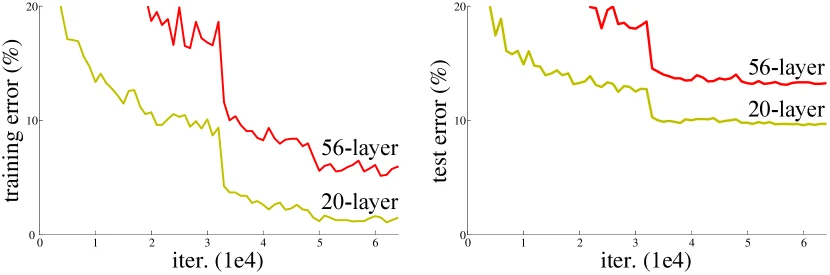
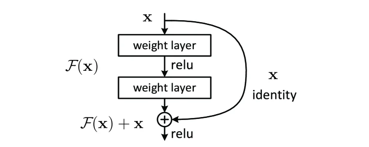
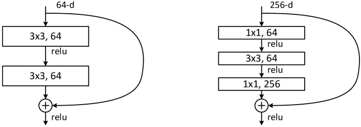

> ResNet：残差学习的数学原理与架构演进
>
> 这一篇文章在看完 RNN 基础后食用更佳~

在 CNN 前几篇文章中，我们探讨了**卷积**操作提取局部特征的数学机理，通过**特征可视化**窥探了神经网络逐层抽象的“黑盒”过程，并在**风格迁移**与**跨模态卷积**的实践中，见证了深层特征在空间形态与高级语义上的强大解耦及泛化能力。

然而，这些令人惊叹的高阶视觉应用，都建立在一个隐式的前提之上：**网络具备足够强大的特征提取与表征能力**。直觉告诉我们，网络越深，其能够拟合的函数空间就越广，提取的特征层次就越丰富。但当研究者们真正尝试将网络深度推向极限时，却撞上了一堵无形的物理之墙。

今天，我们将回到现代深度学习架构的分水岭——2015 年何恺明团队提出的 **ResNet（残差网络）**。从**网络退化**这一核心痛点出发，深入拆解残差学习的数学原理、梯度回传机制以及架构设计。

[论文原文](https://arxiv.org/abs/1512.03385)

---

## 网络退化问题 Degradation Problem

在 ResNet 诞生之前，以 VGG 为代表的经典卷积神经网络确立了“大道至简”的设计范式：通过持续堆叠小尺寸（**3x3**）卷积核，有效扩大感受野并增强非线性表达。

理论上，一个深层网络应当至少能够达到其对应浅层网络的性能底线。原因直观：我们完全可以在深层网络的后半部分构建**恒等映射（Identity Mapping）**，使其直接输出上一层的结果。

但在实际的工程训练中，当网络层数激增（例如从 **20层** 跃升至 **56层**）时，研究者观察到了反常现象：**网络退化问题**。

正如原论文实验所示，**56层**网络在训练集和测试集上的误差均显著高于**20层**网络。必须强调的是：

1. 这**并非过拟合（Overfitting）**，因为过拟合的特征是训练误差极低而测试误差高，但此处训练误差同样居高不下。
2. 这也**并非传统的梯度消失/爆炸**，因为当时的现代网络已普遍配备了 Batch Normalization (BN) 层，确保了前向传递与反向梯度的方差稳定。

退化问题的数学本质在于：对于由非线性激活函数和权重矩阵组成的传统网络层（Plain Network），在高度复杂的非凸优化空间中，依靠随机梯度下降（SGD）去硬性拟合一个完美的恒等映射 $H(x) = x$ 是一个极其困难的优化陷阱。

> 在传统网络中，参数（权重矩阵）在最开始都是**随机初始化**的。
>
> 想象一下，如果把一个包含重要信息的 $x$ 交给一层充满随机数字的矩阵进行乘法运算，结果会怎样？它会瞬间变成一堆毫无意义的**噪声**。
>
> 要想让这些随机的权重在训练中慢慢调整，直到能完美地把 $x$ 原封不动地输出出来（**恒等映射**），这无异于让猴子敲出莎士比亚著作。

---

## 残差块 Residual Block

为了解开这一死结，ResNet 引入了**深度残差学习框架（Deep Residual Learning Framework）**。

### 数学表达

假设某几层神经网络原本期望拟合的潜在最优映射为 $H(x)$，其中 $x$ 为该模块的输入。

**传统网络**的解法是让堆叠的权重层直接逼近 $H(x)$；而 **ResNet** 进行了一次精妙的数学重构：将网络需要学习的目标转化为**残差映射（Residual Mapping）**：

$$
F(x) := H(x) - x
$$

此时，原始的映射关系即被等价重写为：

$$
H(x) = F(x) + x
$$

在工程拓扑上，这一公式体现为在网络主干侧边架设的一条**捷径连接（Shortcut Connection / Skip Connection）**。

### 优化直觉

**为何这种转化能产生奇效？**

如果此时网络的最优状态恰好就是恒等映射，神经网络只需将非线性主干部分的权重参数全部衰减至 **0**（使得 $F(x) \rightarrow 0$），即可轻松实现 $H(x) = x$。相比于用极其复杂的非线性矩阵去“捏造”一个恒等输出，将参数归零显然是一条阻力极小的捷径。残差连接赋予了深层网络一个绝对无损的“保底机制”。

> 事实上，在现代深度学习的很多实践中，大家都会**把每个残差块的最后一层权重初始化为 0**。
>
> 这样一来，网络在训练的最开始，输出就绝对等于 $x$。网络先从**不破坏输入**的状态起步，然后再慢慢学习如何**锦上添花**。

---

## 反向传播 BP

除了正向传播的恒等保底，ResNet 能够在成百上千层的深度下保持收敛，其深层数学威力体现在反向传播时的梯度流动（Gradient Flow）上。

### 数学推导

我们将残差块的计算推广至任意层。假设第 $l$ 层的输出为 $x_l$，经过残差函数 $F$ 计算并与前向信号相加后得到下一层输出：

$$
x_{l+1} = x_l + F(x_l, W_l)
$$

将上述递推公式展开，从较浅的第 $l$ 层一直推演至极深的第 $L$ 层，可得：

$$
x_L = x_l + \sum_{i=l}^{L-1} F(x_i, W_i)
$$

其揭示了 ResNet 网络的颠覆性特征：**深层特征 $x_L$ 等价于浅层特征 $x_l$ 与所有中间残差函数总和的加性叠加**。这彻底打破了传统网络中特征按层**连乘传递**的壁垒。

在此基础上，根据链式法则求解损失函数 $E$ 对浅层输入 $x_l$ 的梯度：

$$
\frac{\partial E}{\partial x_l} = \frac{\partial E}{\partial x_L} \frac{\partial x_L}{\partial x_l} = \frac{\partial E}{\partial x_L} \left( 1 + \frac{\partial}{\partial x_l} \sum_{i=l}^{L-1} F(x_i, W_i) \right)
$$

观察括号中的核心项，可以被拆分为两部分：

1. **常数 $1$**：这一项如同**高速公路**，将深层的误差信号 $\frac{\partial E}{\partial x_L}$ 高质量地传回浅层 $x_l$。
2. **复合梯度项**：需要经过多层权重链路反向计算的**常规梯度**。

在极深的网络架构中，即便复合梯度项因层层连乘而趋近于 **0**（即传统意义上的**梯度消失**），常数 **$1$** 的存在依然确保了反向传播通道的绝对顺畅。这种加性结构从微积分的底层逻辑上，彻底避免了梯度危机。

> 学完 LSTM 再往回看，颇有异曲同工之妙。

---

## 架构设计 Basic vs. Bottleneck

在追求极度深度的实践中，算力瓶颈是一个无法回避的工程现实。ResNet 为此设计了两种不同量级的残差块结构。

1. **基础残差块 (Basic Block)**

   多用于中等深度网络（如 ResNet-18, ResNet-34）。它由两个 **3x3** 的卷积层串联构成。

   > 当输入与输出特征图的通道维度不一致时，会在捷径上额外施加**一次 $1\times1$ 的线性投影 $W_s$**，即 $y = F(x) + W_s x$，以完成**维度对齐**。

2. **瓶颈结构 (Bottleneck Block)**

   当网络深度下探至 **50层、101层甚至 152层**时，基础块的计算开销将呈指数级膨胀。为此，研究团队引入了由 **1x1 $\rightarrow$ 3x3 $\rightarrow$ 1x1** 组成的“沙漏型”三层结构：
   - **降维**：首个 **1x1** 卷积负责将高维通道数大幅压缩。
   - **特征提取**：在压缩后的低维空间内，执行计算密集的 **3x3** 卷积。
   - **升维**：末尾的 **1x1** 卷积将通道数重新拉伸至原维度，以便与捷径传来的主干信号融合。

   > 瓶颈结构以极小的参数量与计算代价，维持了与基础块**等效的特征表达能力**，是支撑百层级深度网络落地的核心工程构件。

---

## 架构分歧 ResNet or Highway

在探讨跳跃连接的演进路线时，学术界曾出现过另一条分支：**Highway Networks**。受到 RNN 序列模型中 [LSTM](/blog/rnn-04-lstm/) 机制的启发，Highway 尝试将门控机制（Gating）直接移植到前馈神经网络中：

$$
y = H(x) \cdot T(x) + x \cdot C(x)
$$

其中 $T(x)$ 为变换门，$C(x)$ 为携带门。

从数学形态上看，ResNet 实际上是 Highway 的一种极简特例（即强制 $T(x)=1, C(x)=1$）。但在空间特征的提取任务中，ResNet 却取得了压倒性的胜利：

1. **图像与序列的数据差异**
   - 在**自然语言等时间序列**中，信息存在长程依赖与噪声，必须依赖复杂的动态门控进行取舍。
   - 但在**视觉图像的层次化特征提取**中，底层的边缘与顶层的语义同样重要，网络需要的是无障碍的特征积累，而非刻意的遗忘。

2. **更省算力，梯度更稳**
   - Highway 需要耗费庞大的参数去计算门控矩阵；且在 $C(x)$ 极小的情景下，没有有效解决梯度链条断裂的风险。
   - ResNet 无参数的纯加性捷径，不仅释放了海量算力，更确保了优化的绝对稳定性。

---

## 结语 Conclusion

ResNet 提出 $F(x) + x$ 的结构性优化，不仅解决了深层视觉模型的训练难题，更确立了现代 AI 模型设计的底层基调。今天，无论是主导语言生成的 Transformer，还是融合多模态的 VLA 模型，其核心算子的外围，依然包裹着这层简洁而强大的残差连接。
