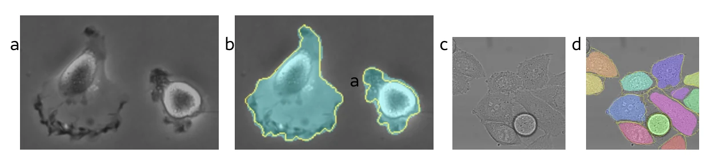
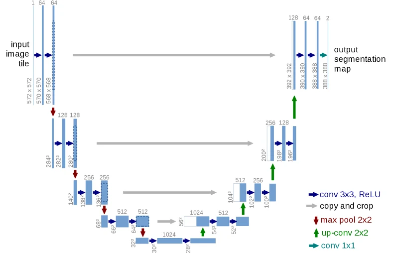

> U-Net 解决了视觉模型在空间维度上的核心矛盾：如何在提取高级语义特征的同时，精确恢复每一个像素的位置信息。

## 局限

在经典的 CNN 架构中，网络的核心诉求是**特征提取与分类**。

分类任务的输出粒度极粗，本质上是整张图像到单一标签（如 $\text{image} \to \text{cat}$）的映射。这种任务天然契合不断**下采样**的网络结构，因为分类只关心“图里有什么”，不在乎特征的具体空间坐标。

但在**医学图像分割**等任务中，需求是**像素级预测**。模型不仅要知道“图里有没有肿瘤”，还要输出一张与原图对齐的 Mask，明确每一个像素的归属。

此时的映射关系变成了：

$$
H \times W \times C \to H \times W \times K
$$

- $H$：图像高度。
- $W$：图像宽度。
- $C$：输入通道数。
- $K$：输出通道数，即分割类别总数。
  - 二分类（背景&肿瘤）：$K=2$。
  - 多分类（背景&器官&肿瘤&血管）：$K$ 等于类别数量。

分割模型由此陷入矛盾：既需要通过下采样获取足够大的感受野以理解全局，又需要保留极高的空间分辨率以还原边界。

[U-Net](https://arxiv.org/abs/1505.04597) 就此诞生。

## 架构

U-Net 呈 U 型拓扑形状，整体分为左右两个对称的部分。

### 编码 Encoder

左侧是收缩路径（Contracting Path），即经典的 CNN 特征提取器。

随着网络加深，常规的 $3 \times 3$ 卷积配合 Max Pooling 不断压缩特征图的空间尺寸，同时 Channel 逐步翻倍（例如从 64 一路增加到 1024）。在这个过程中：

- **空间分辨率降低**：位置信息变得模糊。
- **语义信息增强**：网络越来越懂目标的整体轮廓和类别。

### 解码 Decoder

右侧是扩张路径（Expanding Path），负责将极小分辨率的特征图逐步还原回原始尺寸。

这就是**上采样（Upsampling）**。在 U-Net 及其后续演进的架构中，关于如何上采样，通常有两种截然不同的核心策略：

1.  **转置卷积（Transposed Convolution）**

    这是原版 U-Net 采用的方案（论文中称为 Up-convolution）。虽然名字带着转置，但它其实并不是卷积的逆运算。

    转置卷积的优势在于**参数可学习**，网络可以通过反向传播自己决定如何“捏造”放大的细节。但它也存在致命缺陷：**棋盘效应**。

    我们设定情景参数（只观察空间结构，所以假设权重都是 1）：
    - **输入特征图 $\mathbf{X}$**：尺寸 $2 \times 2$
    - **卷积核 $\mathbf{W}$**：尺寸 $3 \times 3$
    - **步长**：$2$，则输出特征图的尺寸为 $5 \times 5$

    则输入和卷积核的矩阵如下：

    $$
    \mathbf{X} = \begin{bmatrix} 1 & 1 \\ 1 & 1 \end{bmatrix}, \quad \mathbf{W} = \begin{bmatrix} 1 & 1 & 1 \\ 1 & 1 & 1 \\ 1 & 1 & 1 \end{bmatrix}
    $$

    后续的计算落在实际工程上其实是直接调用底层框架的矩阵运算，但为了方便理解，我在这里给出两种等价视角：
    - **分数步长卷积（Fractionally Strided Convolution）**
      1. **内部插零**

         $\mathbf{X}$ 内部插零后，被撑成了一个 $3 \times 3$ 的稀疏矩阵 $\mathbf{X}'$：

         $$
         \mathbf{X}' = \begin{bmatrix}
         \mathbf{1} & 0 & \mathbf{1} \\
         0 & 0 & 0 \\
         \mathbf{1} & 0 & \mathbf{1}
         \end{bmatrix}
         $$

      2. **外侧补零**

         为了让卷积核扫过之后能得到 $5 \times 5$ 的输出，我们需要在 $\mathbf{X}'$ 的最外围再做 padding：

         $$
         \mathbf{X}_{pad} = \begin{bmatrix}
         0 & 0 & 0 & 0 & 0 & 0 & 0 \\
         0 & 0 & 0 & 0 & 0 & 0 & 0 \\
         0 & 0 & \mathbf{1} & 0 & \mathbf{1} & 0 & 0 \\
         0 & 0 & 0 & 0 & 0 & 0 & 0 \\
         0 & 0 & \mathbf{1} & 0 & \mathbf{1} & 0 & 0 \\
         0 & 0 & 0 & 0 & 0 & 0 & 0 \\
         0 & 0 & 0 & 0 & 0 & 0 & 0
         \end{bmatrix}
         $$

      3. **标准 Conv**

         最后得到最终输出 $\mathbf{Y}$。

    - **重叠相加（Overlap-Add）**

      我们也可以理解成：输入特征图上的每一个像素，都与其对应的卷积核相乘，并“投影”到输出画布上。每投影一次都在输出画布上移动 $S$ 格。
      1. 左上角像素 $X_{0,0}$：在输出画布左上角印下一个 $3 \times 3$ 的全 1 矩阵。
      2. 右上角像素 $X_{0,1}$：向右平移 2 格，印下一个 $3 \times 3$ 矩阵。**此时与左边产生 1 列重叠**。
      3. 左下角像素 $X_{1,0}$：向下平移 2 格，印下一个 $3 \times 3$ 矩阵。**重叠**。
      4. 右下角像素 $X_{1,1}$：向右下各平移 2 格，印下一个 $3 \times 3$ 矩阵。

    - **棋盘效应（Checkerboard Effect）**

      最后得到的输出是一致的：

      $$
      \mathbf{Y} = \begin{bmatrix}
      1 & 1 & \mathbf{2} & 1 & 1 \\
      1 & 1 & \mathbf{2} & 1 & 1 \\
      \mathbf{2} & \mathbf{2} & \mathbf{4} & \mathbf{2} & \mathbf{2} \\
      1 & 1 & \mathbf{2} & 1 & 1 \\
      1 & 1 & \mathbf{2} & 1 & 1
      \end{bmatrix}
      $$

      很明显，输出的结果极度不均匀，这种十字形亮斑在特征图很大时，就会形成如同国际象棋棋盘一样的网格状伪影。

      用重叠相加的过程可以很简单发现：只有**卷积核大小正好被步长整除**（即恰好无重叠）时，才能避免效应。

2.  **插值缩放（Interpolation）**

    为了规避棋盘效应，现代视觉网络（包括 Stable Diffusion 中的 U-Net）更倾向于使用这种平滑且解耦的策略：
    - **第一步（纯几何放大）**：使用双线性插值（Bilinear Interpolation）或最近邻插值，直接在空间维度上把特征图的长宽拉伸一倍。这一步没有可学习的参数，纯靠周围像素的值做线性平滑过渡。
    - **第二步（特征提炼）**：紧接着接入一个常规的 $3 \times 3$ 卷积。因为上一步插值拉伸会让特征变得平滑且模糊，这个常规卷积的作用就是重新强化特征的锐度，同时将 Channel 减半，为后续的拼接做准备。

## 跃连

Skip Connection（跳跃连接）是 U-Net 能够实现高精度像素级预测的关键。

### 拼接（Concatenation）

与 ResNet 中用于缓解梯度消失的元素级相加不同，U-Net 的跳跃连接是在**通道维度**上进行的拼接。

$$
\text{concat}(\text{decoder\_feature}, \text{encoder\_feature})
$$

这个操作的物理意义在于**缝合语义与细节**：

- 解码器的深层特征负责指明大方向：“这块区域大概是个细胞。”
- 编码器的浅层特征负责提供局部证据：“细胞的边界和纹理具体在这里。”

通过在对应层级将浅层特征直接引流到右侧，U-Net 在下采样时将容易丢失的边缘信息“存档”，在上采样时再作为局部线索提取出来。

### 裁剪（Crop）

在 U-Net 的原始论文实现中，还有一个小细节：**特征图尺寸并不完全对齐**。

原版 U-Net 在卷积时使用了 Valid Padding（无填充），这意味着每次经过 $3 \times 3$ 卷积，特征图的边缘都会损失两圈像素。因此，左侧 Encoder 输出的特征图，尺寸总是略大于右侧 Decoder 对应层级的特征图。

为了能够进行通道拼接，U-Net 在横向连接时必须执行**裁剪**操作：将左侧较大的特征图按中心裁剪至与右侧相同大小，再进行 `concat`。

当然，现代深度学习框架使用 Same Padding 就可以规避尺寸不匹配了。

## 演进

U-Net 最初针对的是生物医学领域的图像分割任务，但在扩散模型中焕发了新生。扩散模型中的去噪任务本质上也是极其纯粹的像素级预测：

$$
x_t \to \epsilon_\theta(x_t, t)
$$

输入一张带噪图，输出一张同尺寸的噪声预测图。模型同样需要兼顾全局内容的理解与局部纹理的生成。

在 DDPM 和 Stable Diffusion 中，U-Net 自然而然地成为了去噪器的主干。现代的 Diffusion U-Net 引入了 Time Embedding 来注入时间步信息，加入了 ResBlock 提升稳定性，并通过 Cross-Attention 让特征感知文本条件。
