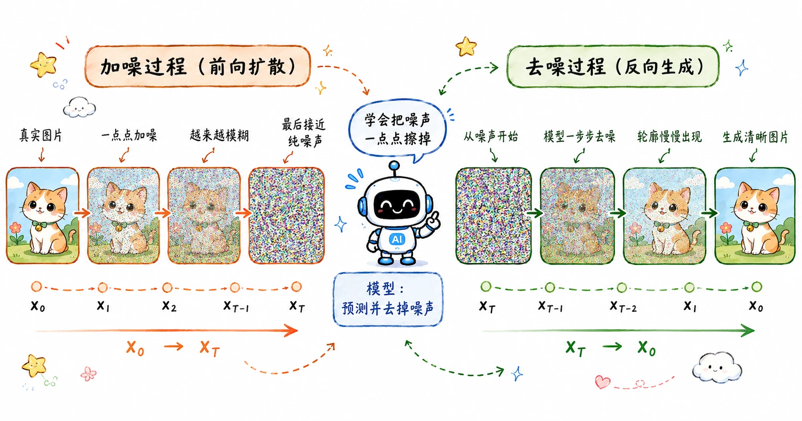

> 比起直接从噪声一步生成图片，不如学习如何一步步去噪。
>
> 毁灭比创造更容易。

[前面的文章](/blog/gen-01-early-generative-models/)中，我们已经讨论过 PixelRNN、VAE 和 GAN 了。这些早期的生成模型在思路上有一个共同点：它们大多试图通过网络结构设计，将一个隐变量（通常是简单的随机噪声）“一步”或通过一次前向传播映射成高清的真实图像。

而扩散模型（Diffusion Models）则提供了一个完全不同的视角：既然直接生成高清图像很难，那我们可以先将一张清晰的图片一步步打碎成纯噪声，记录下这个过程；然后训练一个模型，让它学会把这个过程倒放，一步步从纯噪声中恢复出原本的图像。

其思想最早可以追溯到 2015 年一篇受非平衡热力学启发的论文。但直到 2020 年 Ho et al. 提出了 DDPM，扩散模型才真正在视觉生成领域大放异彩，并在此后逐步击败了 GAN。

## DDPM

DDPM（Denoising Diffusion Probabilistic Models，去噪扩散概率模型）的伟大之处并不止于发明前向加噪这个物理过程，更在于它通过一系列**精妙的参数化技巧**和**极简的目标函数**，把一个原本在数学上极其复杂、难以计算的概率模型，变成了一个在工程上极其容易训练的深度学习任务。

## 前向过程 Forward Process

前向过程是一个纯粹的数学过程，不需要模型去进行学习。它的目标是：给定一张真实的干净图片 $x_0$，在 $T$ 个时间步内，不断向其中注入微小的高斯噪声。

在任意时间步 $t$，单步的加噪过程可以表示为：

$$
q(x_t | x_{t-1}) = \mathcal{N}(x_t; \sqrt{1 - \beta_t} x_{t-1}, \beta_t \mathbf{I})
$$

### 符号拆解

- $q(x_t | x_{t-1})$

  **条件分布**：表示在已知第 $t-1$ 时刻图像的情况下，第 $t$ 时刻带噪图像的概率分布。

- $\mathcal{N}(\cdot;\ \mu,\ \Sigma)$

  **多元高斯分布**，格式可以记成 $\mathcal{N}(x;\ \mu,\ \Sigma)$。其中 $x$ 是随机变量，$\mu$ 是均值向量，$\Sigma$ 是协方差矩阵。

- **均值**：$\boldsymbol{\mu} = \sqrt{1-\beta_t}\,x_{t-1}$
  - $\beta_t \in (0,1)$：预先设置好的噪声调度系数（随时间步 $t$ 缓慢增大）。
  - 原图 $x_{t-1}$ 乘上一个略小于 1 的缩放系数，意味着在加入噪声的同时，保留一小部分上一时刻的图像信息。

- **协方差**：$\Sigma = \beta_t \mathbf{I}$
  - $\mathbf{I}$ 为单位矩阵，代表图像中每个像素的加噪过程是相互独立的。
  - 噪声的方差等于 $\beta_t$。$\beta_t$ 越大，当前这一步注入的高斯噪声就越强。

这里的 $\beta_t$ 构成了预先定义好的**噪声调度表（Variance Schedule）**，控制着每一步加噪的强度。当总时间步 $T$ 足够大时，图像的信息被完全破坏，最终的 $x_T$ 会变成一个各向同性的标准高斯噪声。

### 公式解析

如果每次都要从 $t=1$ 一步步推导到 $t$，计算成本会非常高。幸运的是，基于高斯分布叠加依然是高斯分布的优雅性质，我们可以直接推导出任意时间步 $t$ 的加噪图像 $x_t$。

如果我们定义 $\alpha_t = 1 - \beta_t$，并记其累乘为 $\bar{\alpha}_t = \prod_{i=1}^t \alpha_i$，那么从 $x_0$ 直接到 $x_t$ 的分布可以表示为：

$$
q(x_t | x_0) = \mathcal{N}(x_t; \sqrt{\bar{\alpha}_t} x_0, (1 - \bar{\alpha}_t) \mathbf{I})
$$

结合**重参数化技巧（Reparameterization Trick）**，我们可以将上述分布转化为一个可以直接进行采样的代数式。只需采样一个标准高斯噪声 $\epsilon \sim \mathcal{N}(0, \mathbf{I})$，就能一步到位得到 $x_t$：

$$
x_t = \sqrt{\bar{\alpha}_t} x_0 + \sqrt{1 - \bar{\alpha}_t} \epsilon
$$

## 逆向过程 Reverse Process

前向过程构建了一条从数据分布到纯噪声的单向通道。而生成图像的本质，则是在未知的概率空间中寻找一条原路返回的路径：从一个各向同性的标准高斯噪声 $x_T \sim \mathcal{N}(0, \mathbf{I})$ 开始，通过逐步去噪，最终还原出服从真实数据分布的干净图像 $x_0$。

### 不可解的真实后验分布

理想情况下，我们当然希望能精确掌握逆向的条件转移概率 $q(x_{t-1} | x_t)$，这样就可以实现完美倒推。根据贝叶斯定理，这个逆向概率可以表示为：

$$
q(x_{t-1} | x_t) = \frac{q(x_t | x_{t-1}) q(x_{t-1})}{q(x_t)}
$$

但这在数学上是不现实的：公式的分母 $q(x_t)$ 是边缘概率分布，它要求我们对数据集中**所有可能的初始图像 $x_0$** 进行积分（即遍历整个真实数据分布）。在高维图像空间中，这是一个典型的不可解问题。

> 前向过程是增量工程，但逆向过程想知道 $q(x_i)$ 的具体值，就好比眼前有一张半噪点图片，我们想知道它被生成的概率是多少，换言之，我们需要知道任意图生成这张图的总概率。我们哪里可能穷举全部图片呢？

### 高斯分布的渐进性质

虽然真实的逆向分布 $q(x_{t-1} | x_t)$ 无法直接计算，但基于马尔可夫链和随机微分方程的性质，数学上有一个极其重要的结论：**当每一步的加噪步长 $\beta_t$ 足够小（即前向扩散过程足够平缓）时，逆向转移也可以用一个高斯分布来近似。**

> 我告诉你我在吉大北门，你肯定没法推出前一天我在什么位置（复杂分布）。
>
> 但前一分钟、前一秒的位置是有迹可循的（高斯分布）。
>
> 这也反过来解释了，为什么在正向过程中我们只加一个微小的高斯噪声。

这一性质为我们提供了新的思路：既然已知真实的逆向路径是一个高斯分布，我们就可以用深度学习模型去拟合它的参数。

### 参数化近似

基于上述结论，我们引入一个可学习的神经网络（通常记作参数化模型 $p_\theta$），来近似这个未知的真实逆向过程：

$$
p_\theta(x_{t-1} | x_t) = \mathcal{N}(x_{t-1}; \boldsymbol{\mu}_\theta(x_t, t), \boldsymbol{\Sigma}_\theta(x_t, t))
$$

在这个公式中，神经网络 $p_\theta$ 的核心任务是：给定当前的带噪图像 $x_t$ 以及当前所处的时间步 $t$，去预测前一时刻的分布参数——即**均值向量 $\boldsymbol{\mu}_\theta$** 和**协方差矩阵 $\boldsymbol{\Sigma}_\theta$**。

#### 符号拆解

- $\boldsymbol{\theta}$：代表**神经网络中所有可学习的权重参数**。

- **输入**：$(x_t, t)$
  - $\boldsymbol{x_t}$：当前时间步的带噪图像。
  - $\boldsymbol{t}$：当前所处的时间步（通常通过 Time Embedding 注入）。

- **输出一**：均值 $\boldsymbol{\mu}_\theta(x_t, t)$
  - 这是神经网络基于当前输入给出的**最优猜测**。
  - 物理意义：网络认为在 $t-1$ 时刻，图像最有可能长成什么样。这是指导去噪方向的绝对主力。

- **输出二**：协方差 $\boldsymbol{\Sigma}_\theta(x_t, t)$
  - 这是神经网络对刚才猜测的**不确定度估算**。
  - 物理意义：值越大，代表网络越没有把握。

#### 公式解析

公式的工程本质非常清晰：

数学家提供了一个叫 $p_\theta$ 的框架，然后对工程师说：“去造一个神经网络吧，只要你喂给它一张带噪图 $x_t$ 和时间 $t$，它能吐出一个均值 $\boldsymbol{\mu}_\theta$，这个去噪模型就算造出来了。”

在这个前提下，图像扩散模型通常会选择 [**U-Net**](/blog/cnn-06-unet/) 来充当这个 $p_\theta$ 的角色。

## 从预测均值到预测噪声

在上一节，我们把希望寄托在了神经网络 $p_\theta$ 上，指望它能猜出逆向过程的均值 $\boldsymbol{\mu}_\theta$。

但别忘了我们还有问题没解决：想训练网络，就必须要拿**网络的预测值**和**真实均值**计算 Loss。可是已经知道，真实的逆向分布 $q(x_{t-1} | x_t)$ 不可解，拿不到**真实均值**，怎么指导网络学习？

在这里，DDPM 提出了一个巧妙的解决办法：**假设已知 $x_0$**。

直接求解 $q(x_{t-1} | x_t)$ 走不通，那如果我们额外知道原始图片 $x_0$ 呢？此时，前向过程诱导出来的条件后验分布是可推的：

$$
q(x_{t-1} | x_t, x_0) = \frac{q(x_t | x_{t-1}) q(x_{t-1} | x_0)}{q(x_t | x_0)}
$$

> 可以理解为：遍历所有 $\text{原图} \to t-1 \to t$ 的加噪路径，用贝叶斯归一，得到 $x_{t-1}$的分布。

这个式子是 DDPM 可被训练的基石。它说明：首尾两端的 $x_0$ 和 $x_t$ 固定，中间 $x_{t-1}$ 的分布就退化成一个**均值和方差都已知的高斯分布**。

根据这个条件后验，我们可以用贝叶斯公式严格推导出它的真实均值 $\tilde{\boldsymbol{\mu}}_t$：

$$
\tilde{\boldsymbol{\mu}}_t = \frac{\sqrt{\bar{\alpha}_{t-1}}\beta_t}{1 - \bar{\alpha}_t} x_0 + \frac{\sqrt{\alpha_t}(1 - \bar{\alpha}_{t-1})}{1 - \bar{\alpha}_t} x_t
$$

有了真实均值，按理说就已经可以拿去算 Loss 了。但 DDPM 觉得还不够！

我们先前用**重参数化**实现了 $x_0 \to x_t$ 的转换，反向推导，可以用 $x_t$ 和注入的噪声 $\epsilon$ 来表示 $x_0$：

$$
x_0 = \frac{1}{\sqrt{\bar{\alpha}_t}}(x_t - \sqrt{1 - \bar{\alpha}_t}\epsilon)
$$

将这个 $x_0$ 代入 $\tilde{\boldsymbol{\mu}}_t$，经过化简，我们得到了终极结论：

$$
\tilde{\boldsymbol{\mu}}_t = \frac{1}{\sqrt{\alpha_t}} \left( x_t - \frac{\beta_t}{\sqrt{1 - \bar{\alpha}_t}} \epsilon \right)
$$

**这是 DDPM 的灵魂。** 在这个真实的均值 $\tilde{\boldsymbol{\mu}}_t$ 里，$x_t$ 是网络当前的输入，$\alpha_t$ 和 $\beta_t$ 是预设常量。**唯一未知的，就是前向过程中加入的那个随机噪声 $\epsilon$。**

既然如此，神经网络的任务就只有一件事：**预测出在第 $t$ 步时加入的那部分噪声 $\epsilon$**（记作 $\epsilon_\theta$）。

## 训练目标

按照严谨的数学推导，为了拉近预测分布和真实分布的距离（通常使用 KL 散度），我们会得到一个包含变分下界的复杂 Loss 形式，每一项前面都带有随时间步 $t$ 变化的复杂权重系数。

但 DDPM 的作者发现，**直接丢掉那些复杂的权重系数**，不仅让公式看起来极其清爽，而且生成的图像质量反而更好。这是因为去掉权重后，模型被迫在那些更难去噪的时间步投入了更多的注意力。

最终，我们得到了一个极简的损失函数：

$$
L_{simple} = \mathbb{E}_{t, x_0, \epsilon} [\| \epsilon - \epsilon_\theta(x_t, t) \|^2]
$$

这里的 $\epsilon$ 是前向过程中真实添加的标准高斯噪声，而 $\epsilon_\theta$ 是模型（通常是一个 U-Net）预测出的噪声。网络只要用均方误差（MSE）算出它们俩的距离，梯度下降就完事了。

> 从更宏大的数学视角来看，**预测噪声**的本质其实等价于**预测数据分布的对数梯度**，这一发现直接促成了**扩散模型**与 **SGM** 的理论大统一。相关内容我在下一篇[详细拆解](/blog/diffusion-02-sampling-acceleration/#预测噪声到底在预测什么)。

## 参考内容

- DDPM 论文：[Denoising Diffusion Probabilistic Models](https://arxiv.org/abs/2006.11239)
