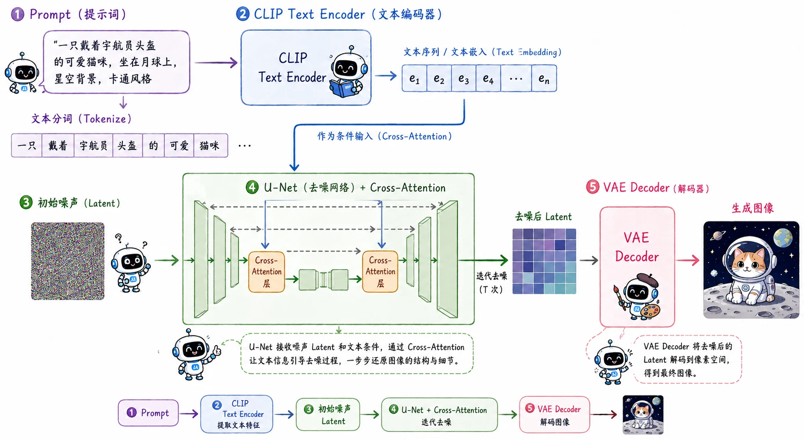

> Stable Diffusion 的突破之举，是把这套昂贵的扩散逻辑，搬到了低维的“潜空间”里。

我们已经跑通了扩散模型的核心闭环：预测噪声的数学框架和训练目标，上千步的采样延迟问题。

理论上，我们已经拥有了一个能生成高质量图像、采样速度又相对可控的模型。但在工业界真正落地时，直接在像素空间运行的扩散模型遇上了**显存与算力**的双重黑洞。

## 转向 Latent Space

算一笔账：一张 $512 \times 512$ 分辨率的 RGB 图像，包含了 $512 \times 512 \times 3 \approx 78 \text{万}$ 个维度。如果直接在这个空间里做扩散，U-Net 在每一次去噪迭代中，都要处理这 78 万维的数据。即便采样步数被压缩到了 20 步，对于消费级显卡来说依然是一场灾难。

**Latent Diffusion Models(LDM)** 的核心思路在于：图像信息其实存在严重冗余。人眼对高频的微小细节并不敏感，真正决定图像内容的是底层的语义结构。

基于此，LDM 设计了一套分层处理逻辑：

1. **感知压缩（Perceptual Compression）**：由预训练变分自编码器（VAE）实现。Encoder 将庞大的像素图压缩成高度浓缩的隐变量，Decoder 则负责在最后把隐变量解码/重建为像素图。

2. **语义生成（Semantic Generation）**：交由扩散模型（U-Net）完成。在维度大幅缩减的潜空间中执行加噪、去噪的扩散流程。

以 Stable Diffusion v1.5 为例，原本 $512 \times 512 \times 3$ 的图像，经过 VAE 的 Encoder $\mathcal{E}$ 处理后，会降采样 8 倍，变成 $64 \times 64 \times 4$ 的潜变量 $z$。空间尺寸缩小到原来的 $1 / 64$。这使得扩散模型终于卸下了渲染底层高频像素的重担，可以把绝大部分算力倾注在宏观的语义排布和结构生成上。

## 条件生成

原始的 DDPM 是“开盲盒式”的，给一个纯噪声，随机吐出一张图。而真正引爆 AIGC 浪潮的 Stable Diffusion 是 Text-to-Image （文生图）模型——想要模型走入千家万户，必须有理解 Prompt 的能力。

为了让文本条件 $y$ 能够深度介入到去噪过程中，模型引入了两大核心机制：**Cross-Attention** 和 **Classifier-Free Guidance (CFG)**。

### 1. Cross-Attention

首先，Prompt 会通过一个强大的预训练语言模型（如 CLIP Text Encoder）转化为高维的特征序列 $\tau_\theta(y)$。
随后，在 U-Net 的每一层特征图中，都会插入 Cross-Attention 模块。如果我们借用 Transformer 中经典的 QKV 公式，在 Stable Diffusion 的语境下，它的数学表达如下：

$$
Q = ZW^Q,\quad K = CW^K,\quad V = CW^V
$$

- 其中 **$Z$** 是当前图像的潜空间特征（Latent Feature），它作为查询的主体，映射出 **Query (Q)**。
- 其中 **$C$** 是文本 Encoder（如 CLIP）输出的条件特征序列，它作为被检索的知识库，映射出 **Key (K)** 和 **Value (V)**。

在计算注意力机制时，图像的每一个空间位置（Query）都在查询文本序列（Key/Value）中与自己最相关的词元。比如画面左上角的区域在去噪时，通过 Attention 捕捉到了 Prompt 中的“太阳”，它就会朝着太阳的特征方向进行演化。

### 2. Classifier-Free Guidance（CFG）

除了听懂需求，还要能**控制它听话的程度**。如果模型完全听从文本，生成的图像可能会过于死板；如果完全不听，又变成了随机抽卡。

**Classifier-Free Guidance（CFG）** 给出一套简洁的推理计算公式，用以平衡上述矛盾。

在训练阶段，模型会有大概 $10\%$ 的概率故意丢弃文本条件（用一个空字符串 $\emptyset$ 替代），迫使模型同时学会**无条件去噪 $\epsilon_\theta(z_t, \emptyset)$** 和**有条件去噪 $\epsilon_\theta(z_t, y)$**。

在推理阶段，对于当前的带噪潜变量 $z_t$，我们让 U-Net 同时进行两次前向传播（一次带条件，一次不带条件），然后利用一个引导系数 $w$（Guidance Scale）对它们的方向进行外推：

$$
\hat{\epsilon}_t = \epsilon_\theta(z_t, \emptyset) + w \cdot \left( \epsilon_\theta(z_t, y) - \epsilon_\theta(z_t, \emptyset) \right)
$$

这个公式的物理意义：

- $\epsilon_\theta(z_t, y) - \epsilon_\theta(z_t, \emptyset)$ 代表了“引入文本条件后，去噪方向的偏移量”。
- 如果 $w = 1$，就是标准的条件生成。
- 如果 $w > 1$（例如 Stable Diffusion 常用的 $7.0$），相当于把这个偏移量放大了。模型会更加激进地朝着贴合文本提示的方向生成，从而大幅提升图文匹配度（代价是如果 $w$ 过大，图像色彩和结构可能会失真）。

## 结语

用 VAE 解耦感知与生成；用 Cross-Attention 将文本语义注入视觉骨架；用 CFG 掌控图文平衡。这就是 Latent Diffusion / Stable Diffusion 能够统治开源文生图生态的底层密码。

但是在 AI 领域，几乎所有主流序列任务的尽头都站着同一个统治者——Transformer。既然 U-Net 可以用来预测噪声，那么拥有更强全局感受野、扩展性更恐怖的 Transformer 能不能替换掉 U-Net？

## 参考资料

- Latent Diffusion / Stable Diffusion 论文：[High-Resolution Image Synthesis with Latent Diffusion Models](https://arxiv.org/abs/2112.10752)
- CLIP 论文：[Learning Transferable Visual Models From Natural Language Supervision](https://arxiv.org/abs/2103.00020)
- Classifier-Free Guidance 论文：[Classifier-Free Diffusion Guidance](https://arxiv.org/abs/2207.12598)
