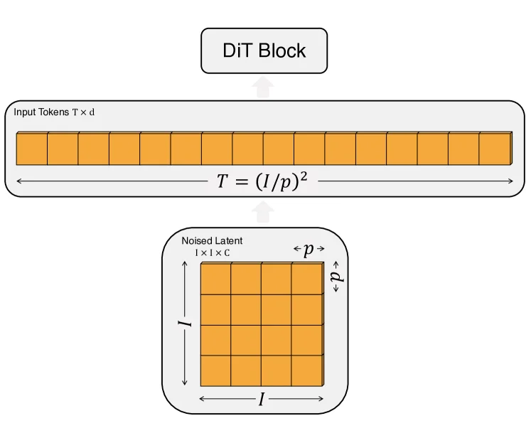
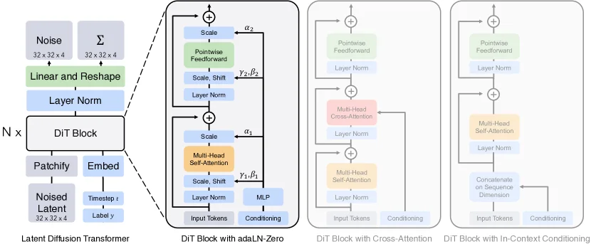

> 既然 Transformer 已经在 ViT 中证明了其作为通用视觉骨架的能力，扩散模型中的去噪器（Denoiser）完全可以直接替换为 Transformer。这就是 DiT（Diffusion Transformer）的核心逻辑。

## U-Net 的瓶颈

U-Net 适合图像去噪，因为它保留了二维空间结构。下采样提取全局语义，上采样恢复空间细节，跳跃连接保留局部纹理。

但随着模型规模扩大（Scaling up），U-Net 的架构劣势开始显现：

- **工程复杂度高**：网络加深时，特征图分辨率和通道数需要重新对齐，定制化调优成本极高。
- **硬件效率低**：高分辨率下的二维卷积和跨层拼接消耗大量显存，计算效率远低于 Transformer 纯粹的矩阵乘法。

相比之下，Transformer 的扩展规则高度统一，且已在大语言模型中验证了明确的 Scaling Law。因此，DiT 直接在去噪算子层面进行了替换：

$$
\epsilon_\theta(z_t, t) : \text{U-Net} \to \text{Transformer}
$$

## Latent Patch

类似 [ViT](/blog/transformer-03-vit/)，DiT 中图像 Token 化的过程同样采用切块（Patchify）策略，但核心区别在于：**DiT 切分的不是原始像素图，而是经过 VAE 压缩后的潜变量（Latent）特征图。**

输入从 $x_t \in \mathbb{R}^{H_0 \times W_0 \times 3}$ 的像素图，变成了带噪潜变量：

$$
z_t \in \mathbb{R}^{H \times W \times C} \to \text{tokens} \in \mathbb{R}^{N \times D}
$$

公式拆解：

- $H, W$：潜变量的空间维度（通常是原图的 $1/8$）。
- $N = \frac{H \times W}{P^2}$：切分后的 Patch 总数（序列长度）。
- $D$：每个 Token 经过线性投影后的隐藏层维度。

这一步大幅降低了计算成本。在低分辨率的潜空间中切块，生成的 Token 数量远少于直接切分原图。

## 动态指令

原生 Transformer（如处理 NLP 的 BERT 或处理纯视觉的 ViT）应对的是**静态任务**。输入一串文本或一张图片，上下文信息已经完全包含在 Token 内部，网络内部闭环计算即可。

但扩散模型是一个**动态的去噪流水线**。去噪网络在每一层前向传播时，都必须明确接收两个外部的全局指令：

1. **时间步 $t$**：当前处于去噪的哪个阶段？（这决定了网络当前是应该抓取大轮廓，还是修补小细节）。
2. **生成条件 $c$**：用户要求的文本提示或类别标签是什么？

这两个指令必须被高频、平滑且低成本地注入到网络的每一个计算块中。

## 传统注入方案

为了把 $t$ 和 $c$ 喂给 Transformer，DiT 论文测试了传统的注入手段，但都存在明显的局限：

- **In-Context（上下文拼接）**

  **将 $t$ 和 $c$ 作为额外的 Token，拼接到图像 Patch 序列的末尾**，像前缀 Prompt 一样参与全网计算。

  **缺陷**：控制力太弱。Self-Attention 会将它们视作普通序列元素，无法强制全网特征听从这两个全局指令的调度。

- **Cross-Attention（交叉注意力）**

  沿用 U-Net 的经典做法。在每个 Transformer Block 中保留原有的 Self-Attention 模块，**额外新增一层 Cross-Attention，让图像 Token 强制去“读取” $t$ 和 $c$**。

  **缺陷**：计算过于沉重。每层增加一个注意力矩阵乘法，会导致极大的算力开销，不利于扩展网络深度。

## 自适应层归一化

DiT 最终采用的方案是 **adaLN（Adaptive Layer Normalization）**。

在标准的神经网络中，LayerNorm（层归一化）通过缩放系数（$\gamma$）和平移系数（$\beta$）来稳定每一层的数据分布。标准的 $\gamma$ 和 $\beta$ 是全局共享的**死参数**，由模型在训练中固定下来。

adaLN 将其变成了**活参数**。它抛弃了沉重的 Cross-Attention，只用一个极其轻量的多层感知机（MLP），直接把当前的时间步 $t$ 和条件 $c$ 映射为每一层需要的 $\gamma$ 和 $\beta$：

$$
\text{adaLN}(x, c, t) = \gamma(c, t) \cdot \text{LayerNorm}(x) + \beta(c, t)
$$

公式拆解：

- $x$：当前层的输入特征序列。
- $c, t$：经过嵌入层（Embedding）处理后的条件与时间特征。
- $\gamma(c, t)$：由条件实时算出的动态缩放系数。
- $\beta(c, t)$：由条件实时算出的动态平移系数。

这相当于用极低的计算成本，给每一层的特征流施加了一个由 $t$ 和 $c$ 决定的全局滤镜，直接从分布层级接管了当前层的计算状态。

## Zero 初始化与恒等映射

除了控制 $\gamma$ 和 $\beta$，DiT 还在残差连接处引入了门控参数 $\alpha$。

DiT Block 中包含门控的完整残差输出公式：

$$
x_{\text{out}} = x_{\text{in}} + \alpha(c, t) \cdot \text{Network}(x_{\text{in}})
$$

公式拆解：

- $x_{\text{in}}$：当前模块（多头自注意力 MSA 或前馈网络 MLP）的输入。
- $\text{Network}$：具体的 MSA 或 MLP 计算逻辑。
- $\alpha(c, t)$：同样由 $t$ 和 $c$ 计算得出的残差门控因子。

**adaLN-Zero 的“Zero”操作，就是在模型初始化阶段，将输出 $\gamma, \beta, \alpha$ 的那个轻量 MLP 的最后一层权重强制清零。**

在训练的第一步，$\alpha$ 会被严格输出为 $0$。此时上述残差公式退化为：

$$
x_{\text{out}} = x_{\text{in}} + 0 = x_{\text{in}}
$$

这构成了**恒等映射（Identity Function）**。

这是深层大模型训练的保命机制。在开局阶段，未经训练的深层 Transformer 内部充斥着随机噪声矩阵。如果信号强行穿透这些矩阵，会迅速导致梯度爆炸或消失。Zero 初始化让所有复杂的计算模块在开局时被物理“屏蔽”，确保信号从第一层到最后一层 100% 无损穿透。

随着反向传播的推进，模型会慢慢将某些层的 $\alpha$ 学习成非零值，渐进式地唤醒各层网络，从而保证了极高的训练稳定性。

## DiT Block 结构

剥离掉 adaLN-Zero 的条件注入后，DiT Block 的内部运算就是标准的 Transformer Block：

1. **多头自注意力（MSA）**：Latent Patch 之间相互通信，进行全局特征重组。
2. **前馈网络（MLP）**：对单个 Token 独立进行非线性升维与降维。

与 U-Net 强行通过卷积核物理滑动来传播局部语义不同，DiT 依靠自注意力矩阵的点积运算，直接建立全局关联。它彻底移除了卷积，Attention 机制只负责评估：当前 Latent Patch 应该从全图其他 Patch 中读取多少信息。

## 规模效应

DiT 论文的核心价值在于证明了：**扩散模型同样遵循可预测的 Scaling Law**。

模型生成质量（如 FID 分数）直接由计算复杂度（Gflops）决定，而计算复杂度受三个核心变量控制：Transformer 深度、网络宽度（$D$），以及 Patch Size（$P$）。其中，减小 $P$ 会导致 Token 数量 $N$ 呈平方级增加，从而大幅拉高自注意力的计算量（$O(N^2)$）。

## 技术演进路线

梳理几代核心模型的生成范式，可以清晰看到底层引擎的更替过程。

Stable Diffusion 的主线公式：

$$
\text{VAE Latent} + \textbf{U-Net Denoiser} + \text{Text Conditioning}
$$

DiT 的主线公式：

$$
\text{VAE Latent} + \textbf{Transformer Denoiser} + \text{Conditioning}
$$

DiT 没有推翻 Latent Diffusion（潜在扩散）框架，而是将其内部的计算引擎进行了升级：

- **DDPM**：奠定底层数学基础。
- **DDIM / DPM-Solver**：优化采样步数。
- **Latent Diffusion**：将扩散过程从像素空间降维至潜空间。
- **DiT**：打破 U-Net 扩展瓶颈，用 Transformer 兑现算力与参数的 Scaling Law。

> **配图建议**：绘制或插入一张从 DDPM 指向 DDIM，汇聚到 LDM，最后分支出 U-Net / DiT 架构的树状发展路线图。

## 参考资料

- DiT 论文：[Scalable Diffusion Models with Transformers](https://arxiv.org/abs/2212.09748)
- Latent Diffusion 论文：[High-Resolution Image Synthesis with Latent Diffusion Models](https://arxiv.org/abs/2112.10752)
