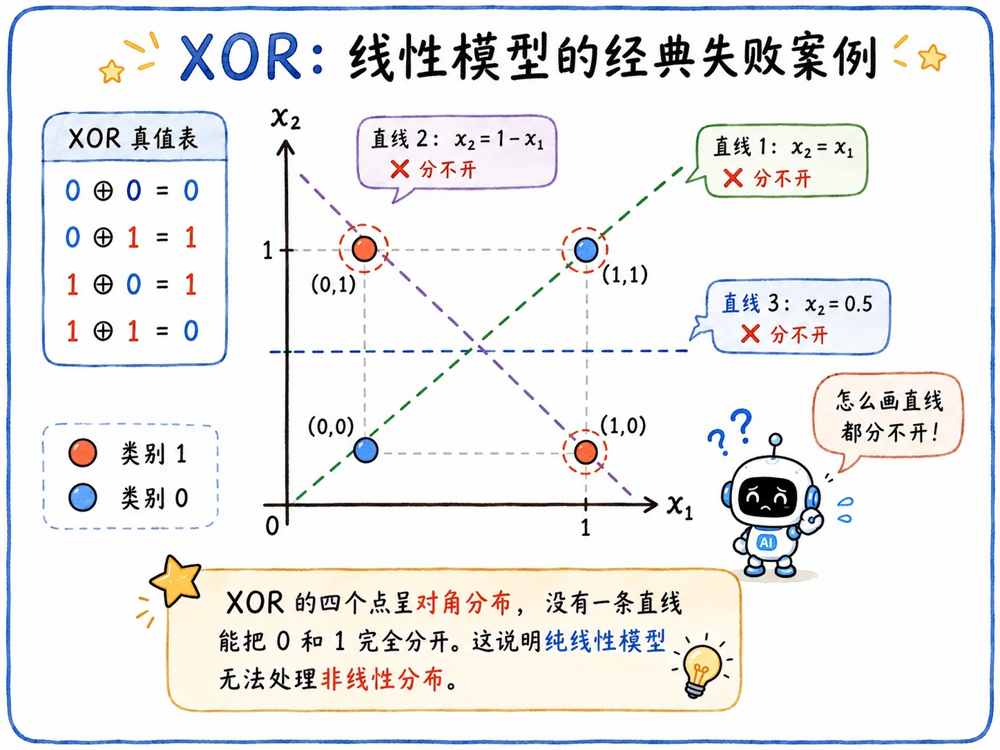

> 感知机本质上还是线性模型。
>
> 从多层感知机开始，机器学会了特征变换。

## 从感知机开始

### 何为感知机

_1958 年_，心理学家 Rosenblatt 提出了感知机。这是神经网络的 V1.0 版本。

听起来很唬人，但其实做的事情并不神秘：拿输入 $x$，乘上一组权重 $w$，加上偏置 $b$，再过一个阈值：

$$
y = \mathbf{1}(w^Tx + b > 0)
$$

- 若 $w^Tx + b > 0$ **成立**，输出 $y = 1$。
- 若 $w^Tx + b > 0$ **不成立**，输出 $y = 0$。

在二维平面上考虑，感知机本质就是**画一条直线，把样本分置两侧**。

### XOR 问题

_1969 年_，Minsky 和 Papert 在《感知机》一书中指出了感知机的一个重要局限：只能处理**线性可分**问题。

最经典的失败案例就是**异或问题**：

- 两个输入相同，输出 $0$。
- 两个输入不同，输出 $1$。

在二维平面上选取四个代表点：

$$
\begin{aligned}
(0,0) &\to 0 \\
(1,1) &\to 0 \\
(0,1) &\to 1 \\
(1,0) &\to 1
\end{aligned}
$$

没有一条直线能把 0 和 1 分开！

## 多重感知机

### 基本概念

1980 年代，研究者们提出**多重感知机 MLP**。其实就是借助多级隐藏层，实现了非线性数据的[**特征变换**](/blog/ml-09-classification-to-neural-network/#特征变换)。

> 既然原始空间里切不开数据，那就先把原始空间变成更好切的新空间。

### 特征变换

原来的 $(x_1, x_2)$ 空间里，XOR 无法划分。

但如果中间层学出两个新特征：

$$
\begin{aligned}
f_1 &= x_1 \lor x_2 \\
f_2 &= x_1 \land x_2
\end{aligned}
$$

最后一层就可以在 $(f_1, f_2)$ 空间中实现划分了：

$$
\text{XOR} = f_1 \land \neg f_2
$$

## 神经网络结构

一个最简单的神经网络，可以大致分为三部分：

- **输入层（Input Layer）**
- **隐藏层（Hidden Layers）**
- **输出层（Output Layer）**

### 输入层

输入层实际上就是输入，并不是什么真正的“层”。

比如图片任务里，输入可能是一堆像素；表格任务里，输入可能是一组特征；文本任务里，输入可能是一串 token。

它负责把原始数据送进模型。

### 隐藏层

隐藏层是输入层和输出层之间的层。

Deep Learning 中的 Deep 即指多个隐藏层叠加，不过多少层才算 Deep，并没有统一标准。

隐藏层可以看成**特征提取器**，作用是代替**特征工程**。

之前的很多任务都依赖人工设计特征：比如做**房价预测**，人要先想清楚*面积、楼层、地段*这些变量怎么组织；做**图片识别**，人要先想清楚*边缘、纹理、颜色*这些特征怎么提。

神经网络的理念就激进多了：

> 不只学习最后的分类边界，还要学习分类前应该怎么**改造特征**。

也就是说，模型前面的层不断把原始输入变成新的表示，后面的层再拿这些表示做判断。

### 输出层

输出层是最后一层。

它可以看成**分类器**，也可以看成**回归器**，这取决于任务本身需要什么输出。

如果是分类任务，输出层可能给出每个类别的分数，再交给 Softmax 变成概率；如果是回归任务，输出层可能直接给出一个连续值。

所以总的来看，神经网络干的事就是：

$$
\text{输入}
\longrightarrow
\text{隐藏层做特征变换}
\longrightarrow
\text{输出层完成任务}
$$

## 激活函数

不过，即使是多层网络，如果每一层都只是线性变换：

$$
y = W_3\big(W_2\big(W_1 x + b_1\big) + b_2\big) + b_3
$$

最后合并一看，本质还是一个线性变换函数（白忙活）：

$$
y = Wx + b
$$

所以每一层之间必须插入**非线性激活函数**，比如早期常用的 Sigmoid：

$$
\sigma(x)=\frac{1}{1+e^{-x}}
$$

激活函数直接折叠、弯曲、截断空间，让每一层的输出真正实现了**特征变换**。

这就是 MLP 的基本形态：

$$
\text{线性变换}
\longrightarrow
\text{非线性激活}
\longrightarrow
\text{线性变换}
\longrightarrow
\text{非线性激活}
\longrightarrow
\cdots
$$

Sigmoid 作为最早期的激活函数，存在很多不足，后人提出了很多[优化方案](/blog/dl-06-vanishing-gradient-activation/)。

## 深度学习框架

学到这里，其实不难发现。深度学习仍然是机器学习的底层框架：

1. 确定模型（Model）/函数集（Function Set）
2. 确定如何评价函数的好坏
3. 确定如何找到最好的函数

只是在深度学习里，模型从一条线、一个逻辑回归分类器，变成多层函数的组合。

### 确定模型

在深度学习中，确定模型就是定义一个神经网络。

不同的神经元连接方式会构成多样的网络结构。

全连接层（FNN）是一种结构，后面会学到的 CNN、RNN、Transformer 也是结构。它们都仍然遵循机器学习流程，区别只在于怎么组织函数、怎么让参数共享、怎么适配不同形态的数据。

### 确定评价标准

第二步还是定义 Loss，思路没有变：

> Loss 把**模型好不好**变成一个可以优化的数字。

有了 Loss，模型才知道自己错在哪里，才能用梯度下降更新参数。

### 找到最好的函数

第三步还是 Gradient Descent。

神经网络模型对应的函数比较复杂，而[**反向传播算法**](/blog/dl-04-backpropagation/)是一个很有效的计算神经网络梯度的方法。
