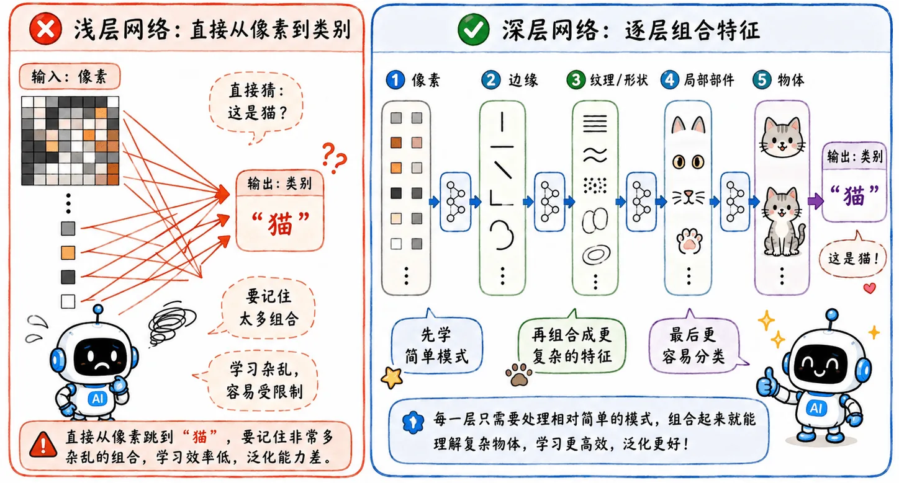

> 如果浅层网络足够，我们为什么还执着于深层网络。

## 通用近似定理

_1989 年_，有人证明了“通用近似定理”：只要隐藏层里的神经元足够多，哪怕只有一个隐藏层，也能无限逼近任何复杂的函数。

### 尴尬之处

一边是理论：一层隐藏层足够宽，也能拟合复杂函数。

另一边是现实：网络一深，训练就开始出问题。_梯度消失、训练不动、调参崩溃_。

一套组合拳，深层网络看起来像自找没趣。

### 客观分析

通用近似定理提出后，大家纷纷又回头奔向传统机器学习模型。

但从现在来看，浅层网络注定被深层网络淘汰。

## 矮胖网络

通用近似定理只证明了**存在性**，在实际工程上的表现一塌糊涂。

就像我可以把一个完整项目全写进一个 `main.cpp` 里。理论上能跑，但稍微有一点代码素养的人都不会接受这种高耦合度的堆屎山写法。

这就是矮胖网络的问题，它像一个巨大的单层函数，试图在一层里把所有关系全部记住。

以图像任务为例：

$$
\text{像素} \to \text{边缘} \to \text{纹理} \to \text{部件} \to \text{物体}
$$

如果希望矮胖网络直接学会从**像素**到**类别**的映射关系，那就需要记住无数种组合：

- A 边缘 + B 颜色：猫耳朵
- B 边缘 + A 纹理：车轮
- C 轮廓 + D 明暗：字母
- ...

这种大胃袋良子的学习模式严重束缚了模型的上限。

## 高瘦网络

### 模块化思维

深层网络就像是在模拟**模块化工程**。

- **低层**：负责学通用的小组件，比如*边缘、颜色变化、局部纹理*。
- **中层**：把这些小组件拼成更大的组件，比如*眼睛、轮廓、轮胎、窗框*。
- **高层**：最后组合成*猫、车、人脸、房子*。

底层学到的东西比较局部、简单、通用；越往上，表示越抽象，越接近任务本身。

这倒不是说每一层都有人类指定好的职能。

准确地说，是网络在训练过程中，被数据和结构逼着学出这种层级表示，这是一个有点形而上学的结论。

### 特征复用

这样做的好处很直接：**中间特征可以复用**。就像是函数的封装使用一样。

同一条边缘检测不只服务于“猫耳”，也可以服务于“车轮”；同一类纹理也不只属于某一个类别。

深层神经网络虽然参数量庞大，但如果合理实现参数复用，训练开销反而会低于浅层网络，同时模型的性能表现也更为出色。

## 复杂任务

