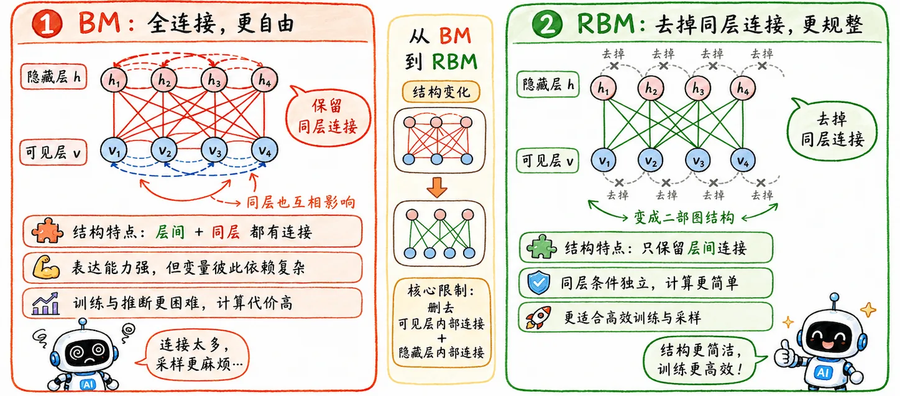
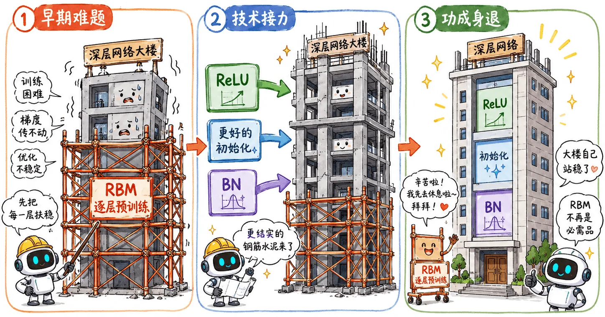

> 深度学习不是什么新兴产物，但早期的机器和训练技巧无法支撑其发展。

## 早期问题

1980 年代，多层感知机和反向传播已经出现。

从结构上看，它和后来的深度神经网络已经没有本质区别：

$$
\text{输入}
\longrightarrow
\text{线性层}
\longrightarrow
\text{激活函数}
\longrightarrow
\text{线性层}
\longrightarrow
\cdots
\longrightarrow
\text{输出}
$$

但当时遇到了[梯度消失](/blog/dl-06-vanishing-gradient-activation/)问题，加之通用近似定理的提出。

大家都转向了更容易分析、更容易训练、数学基础更严密的传统机器学习方法，比如 SVM。深层网络慢慢淡出视野。

## BM

玻尔兹曼机 (Boltzmann Machine, BM) 的灵感来源于物理学中的热力学。

物理学里有一个概念：一个系统总是倾向于达到**能量最低、最稳定**的状态。

BM 很理想化：

- 把神经元分为**可见层**和**隐藏层**。
- 可见层**接收数据**，隐藏层**提取特征**。
- 网络里的节点不断**互相影响**，最后达到一个**稳定状态**。

但这样的网络结构太复杂了，每一个神经元都要和其他所有神经元相连。可见层内部互相连，隐藏层内部互相连，层与层之间也连。

这样的结构下，如果要更新权重，就必须计算网络里所有可能状态的概率分布。

如果有 $N$ 个节点，状态空间就是 $2^N$。

所以 BM 只是一个理论上的上帝机器，不具备现实意义。不过其提出的**隐藏层概念**影响深远，成为深度网络中间层的通用称呼。

## RBM

为了让理论落地，Hinton 做了个工程妥协：**去掉所有同层连接**。

**受限玻尔兹曼机 (Restricted Boltzmann Machine, RBM)** 就此诞生。

### 实现原理

RBM 做的是无监督学习。

给它一张猫的图片，它的隐藏层被激活，然后它尝试用隐藏层的激活信号反向重构出一张猫的图片。如果重构结果和原图差距很大，它就调整权重。

反复训练后，RBM 可以学到这批输入数据的内部特征分布。

### 条件独立

在 RBM，**连接只允许在可见层和隐藏层之间存在**。

这个限制带来了一个很重要的性质：**条件独立**。

给定可见层的数据时，隐藏层每一个节点的概率计算相互独立，转化成了可以并行处理的矩阵运算。

### 逐层预训练

_2006 年_，Hinton 用 RBM 做了一套逐层预训练的方法：

1. 用原始数据训练一号 RBM。
2. 训练好后，把第一层权重固定（冻结）。
3. 把一号 RBM 的隐藏层输出当作二号 RBM 的输入，训练二号。
4. ...
5. 一层一层往上叠。
6. 最后在顶层加分类器，再用反向传播整体微调。

这叫**贪心逐层预训练**。

这个方案的实用性不强，但它实打实地证明了深层网络是可以被训练的。

这是个关键转折。深层网络之前两次失败（线性 & 梯度消失），学术界对它早已没有耐心。

Hinton 把多层神经网络重新包装：**Deep Learning** 就此诞生。

## Deep Learning

### RBM 的退场

但如果今天去看主流框架，已经没有 RBM 的影子了。

因为后来出现了大量优化方案：

- **ReLU 激活函数**：从数学根源上缓解 Sigmoid 带来的梯度消失。
- **科学初始化**：比如 Xavier、Kaiming 初始化，让随机初始权重不至于一开始就把信号搞崩。
- **Batch Normalization**：强行把中间层分布拉回稳定范围。

RBM 功成身退，把舞台留给了年轻人。

### GPU

这是改变格局的物理转折点。

_2009 年_，学者们发现，神经网络里海量的矩阵乘法（$w^Tx$），完美契合为了打游戏而发明的显卡（GPU）的并发计算架构。

以前用 CPU 跑几个月的大模型，现在用 GPU 几天就能跑完。**算力瓶颈被打碎**。

### 走到台前

- 算法已经成熟（ReLU 激活函数解决了梯度消失问题）。
- 硬件已经到位（GPU 让大规模训练成为可能）。
- 数据已经准备好（ImageNet 等大数据集让模型有机会学到复杂规律）。

_2012 年_，Hinton 的学生使用深度卷积神经网络（AlexNet）在 ImageNet 大赛中以碾压性的优势击败了所有传统视觉算法。

至此，深度学习正式站在了舞台中央。
