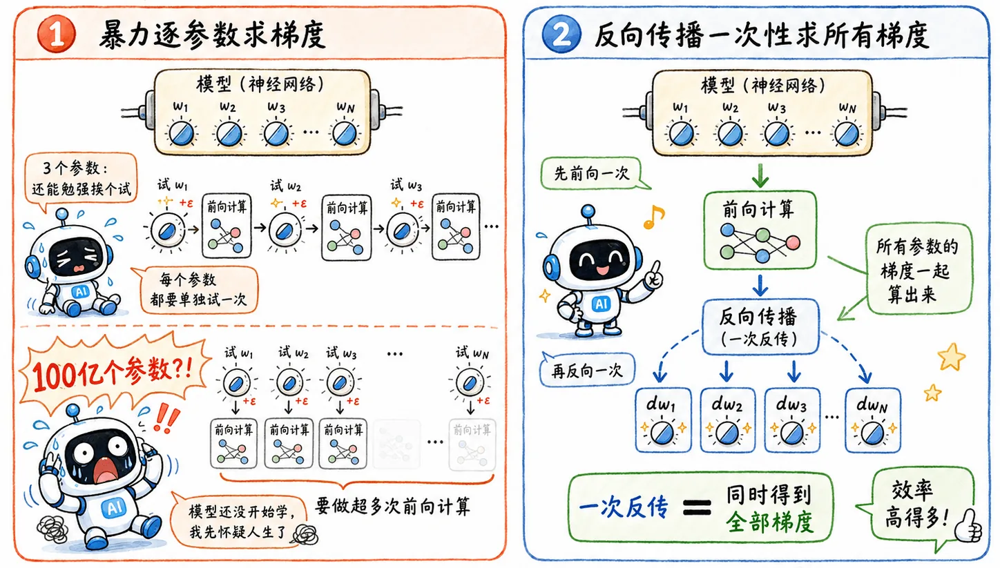
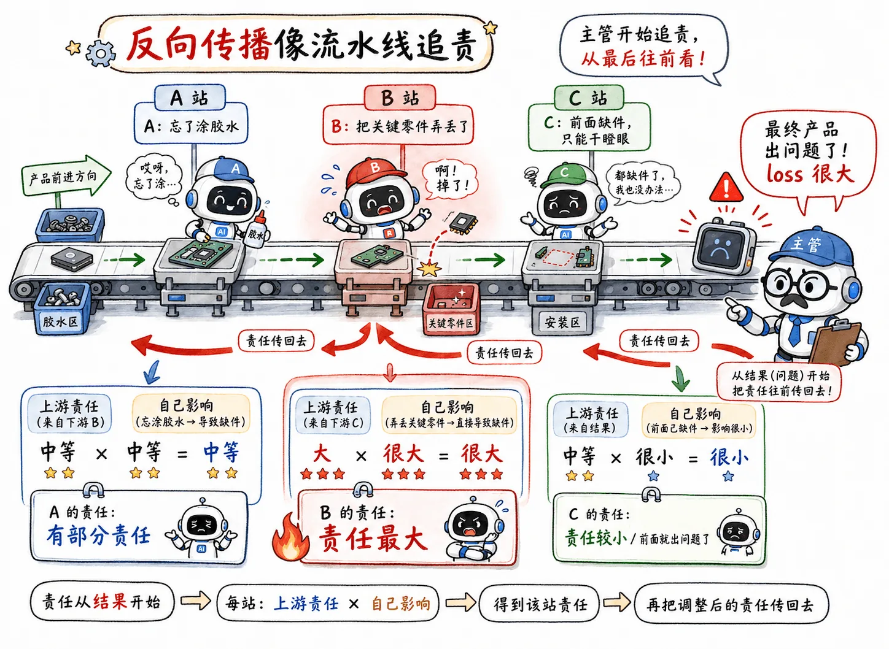
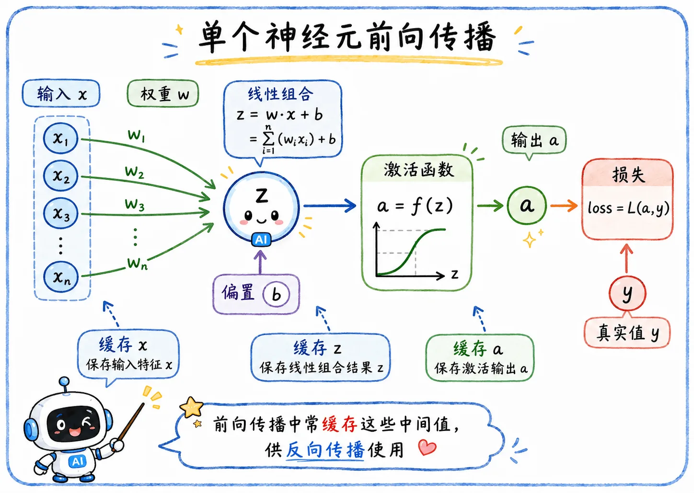
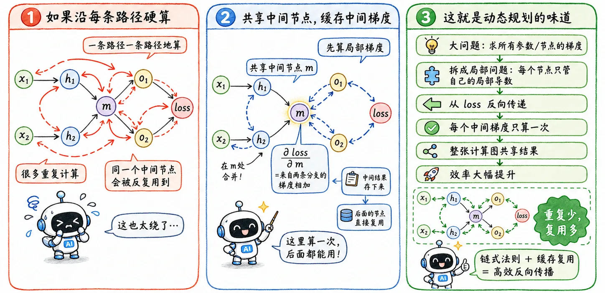
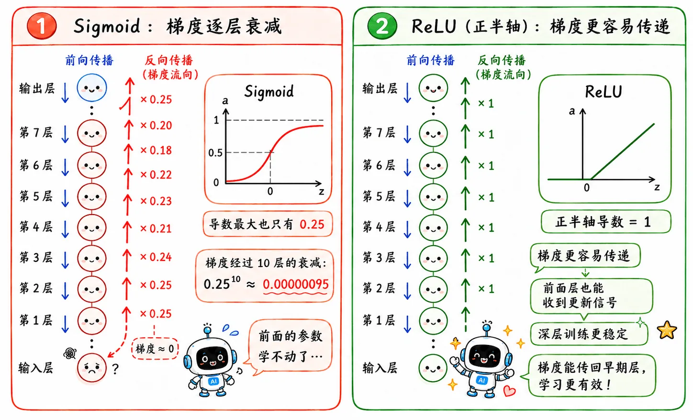

> 明确了深层网络的训练方向。
>
> 但新的问题马上出现：
>
> **参数量爆炸，谁来拯救我冒烟的电脑？**

## 算力困境

### 传统优化

在机器学习阶段，已经学过了参数优化的[基本流程](/blog/ml-02-linear-regression/#总结)：

$$
\text{取随机权重} \to \text{计算当前 loss} \to \text{计算梯度} \to \text{更新权重}
$$

线性回归的模型小，算是小打小闹。参数不多，公式也好推。

我们甚至可以针对每一个参数单独试探并优化：如果它变大一点，loss 会怎么变？

### 水土不服

等到了 DNN 就不是这么个事了。

面对动辄百万级、甚至百亿级的参数量，暴力穷举法显然行不通。

好比多米诺骨牌，前面某个参数一动，后面的所有激活值都会跟着变，最后 loss 面目全非。

模型还没开始学，机器先冒烟了。

所以我们需要一个更聪明的办法：

> 一次前向计算，一次反向传播，把所有参数的梯度一网打尽。

## 链式法则

### 复合函数

神经网络本质上是一串**复合函数**：

$$
x \to f_1 \to f_2 \to f_3 \to \text{loss}
$$

前面的层会影响后面的层，后面的层又影响最终 loss，影响层层叠加。

所以问题变成：

> 最底层某个参数，对最终 loss 到底有多大影响？

这就绕不开链式法则。

### 实际场景

想象一下，你当上了**富士康流水线**的主管。

现在最终产品出了问题（loss 很大），你必须从成千上万的工人中揪出罪魁祸首并扣绩效（更新参数）。

在这么长的流水线上，**责任判定**是一件很微妙的事。

1. 毋庸置疑，肯定是丢失零件的员工 B 问题最大。
2. 但前面的员工 A 就干干净净吗？如果 A 没有忘记涂胶水，B 也不一定会出岔子。
3. 后面的员工 C 就更是无辜了，前置零件丢失，只剩干瞪眼的份。

### 数学映射

于是你依据微积分里的**链式法则**，提出了一套“基于责任继承的打分制度”。

在数学上，这就是：

$$
\frac{\partial L}{\partial x}
=
\frac{\partial L}{\partial y}
\cdot
\frac{\partial y}{\partial x}
$$

翻译成流水线语义就是：

> **往前传的责任 = 上游传给你的责任 × 你自己这一步产生的影响**

loss 从最后开始追责，追到某一层时，这一层只需要回答一个问题：

> 我本地这一步对输入有多敏感？

然后把这个局部影响乘以上游传来的责任，继续往前甩锅。

这就是**反向传播**的核心直觉。

## 梯度计算

### Forward Pass

#### 基本流程

前向传播就是传统的计算。

数据从输入层进来，一层层往后算。

比如某个线性层：

$$
\begin{aligned}
z &= wx + b \\
a &= \sigma(z)
\end{aligned}
$$

最后得到预测结果，再和真实标签比较，算出 loss。

#### 缓存中间量

Forward Pass 的任务不止于此。

它在向前传播时，顺手把反向传播需要的中间量也保存了下来。

比如算 $z = wx + b$ 时，后面要求 $w$ 的梯度，就会用到当时的输入 $x$。

如果前向传播时不缓存，反向传播时就要重新算很多东西。

这在小模型里还能忍，在深层网络里就是灾难。

### Backward Pass

反向传播从 loss 出发，从输出往输入“追责”。

每经过一个节点，就做一次乘法：

> **上游梯度 × 局部导数 = 往前传的梯度**。

回到刚才的 $z = wx + b$。

上游把对 $z$ 的责任 $\frac{\partial L}{\partial z}$ 传过来，当前层轻易算出对参数 $w$ 的梯度：

$$
\frac{\partial L}{\partial w}
=
\frac{\partial L}{\partial z}
\cdot
\frac{\partial z}{\partial w}
=
\frac{\partial L}{\partial z}
\cdot x
$$

可以发现，反向传播**直接用到了前向传播里的 $x$**。

这就是为什么 Forward Pass 必须缓存中间激活值。

### 梯度本质

这里的 $x$，既是嵌套函数中单层求导的得值，又是**输入本身**。

所以参数梯度的本质可以理解成：

> **参数梯度 = 后面传回来的误差信号 × 这个参数当时碰到的输入**

参数的优化方向由两件事共同决定：

- 后面说错了多少。
- 自己当时参与了多少。

如果后面的误差信号很大，但这个参数几乎没参与，那它不该背太多锅。

如果这个参数参与很深，但最终结果没怎么错，那也没必要大幅更新。

反向传播把这两件事乘在一起，变成每个参数应该更新的方向和幅度。

### 动态规划

在神经网络巨大的计算图里，一个中间节点可能影响后面无数条路径。

如果顺着每一条路径都从头去算导数，会出现海量重复计算。

反向传播的聪明之处在于**缓存复用**。

它把已经算过的中间梯度存下来，后面的节点直接拿来用。

这就是算法上的**动态规划**思路：

> 把大问题拆成局部问题，每个局部的计算结果只算一次，并被整张计算图共享。

## 梯度消失

反向传播完美解决了“多层参数怎么算梯度”的问题。

但其链式法则的底层逻辑，也存在致命缺陷：**梯度的计算是连乘实现**。

如果每一层的局部导数都小于 1，乘到前面几层时，梯度就会呈**指数级衰减**。

以早期常用的 Sigmoid 激活函数为例，它的导数最大只有 `0.25`。

哪怕每层的影响力都拉满，连续经过 10 层后：

$$
0.25^{10} \approx 0.00000095
$$

梯度几乎归零。

前面的参数根本收不到有效的误差信号，不再更新。出现“训不动”的问题。

