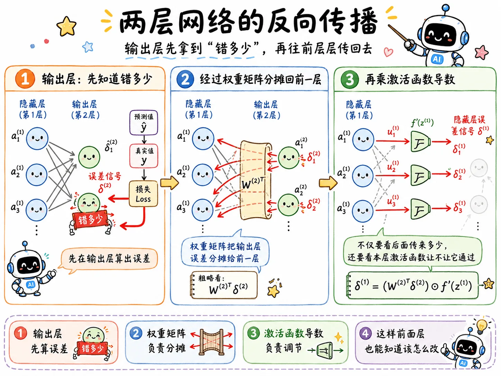

## 单神经元

先看一个最简单的神经元：

$$
z = wx + b
$$

$$
a = \sigma(z)
$$

最终 loss 是 $L$。

如果我们想更新参数 $w$，就要知道：

$$
\frac{\partial L}{\partial w}
$$

链式法则告诉我们：

$$
\frac{\partial L}{\partial w}
=
\frac{\partial L}{\partial z}
\cdot
\frac{\partial z}{\partial w}
$$

而：

$$
\frac{\partial z}{\partial w}=x
$$

所以：

$$
\frac{\partial L}{\partial w}
=
\frac{\partial L}{\partial z}
\cdot x
$$

这就对应上：

> 参数梯度 = 后面传回来的误差信号 × 当前参数碰到的输入。

偏置 $b$ 的偏导更简单，在传递中没有任何损耗：

$$
\frac{\partial L}{\partial b}
=
\frac{\partial L}{\partial z}
\cdot
\frac{\partial z}{\partial b}
=
\frac{\partial L}{\partial z}
$$

因为：

$$
\frac{\partial z}{\partial b}=1
$$

## 误差信号

为了简化记法，通常会把 $\frac{\partial L}{\partial z}$ 记成一个误差信号：

$$
\delta = \frac{\partial L}{\partial z}
$$

那么参数梯度就可以写成：

$$
\frac{\partial L}{\partial w}=\delta x
$$

$$
\frac{\partial L}{\partial b}=\delta
$$

神经网络里每一层都在做同一件事：

1. 前向传播时，拿输入乘权重、加偏置、过激活函数。
2. 反向传播时，拿误差信号乘当时的输入，得到参数梯度。

所以关键问题就变成：

> 每一层的 $\delta$ 怎么算？

## 两层网络

考虑一个两层网络：

$$
z^{(1)} = W^{(1)}x + b^{(1)}
$$

$$
a^{(1)} = \sigma(z^{(1)})
$$

$$
z^{(2)} = W^{(2)}a^{(1)} + b^{(2)}
$$

$$
\hat y = a^{(2)} = \sigma(z^{(2)})
$$

最终 loss 是：

$$
L(\hat y, y)
$$

输出层的误差信号是：

$$
\delta^{(2)} = \frac{\partial L}{\partial z^{(2)}}
$$

隐藏层的误差信号是：

$$
\delta^{(1)} = \frac{\partial L}{\partial z^{(1)}}
$$

根据链式法则：

$$
\frac{\partial L}{\partial z^{(1)}}
=
\frac{\partial L}{\partial z^{(2)}}
\cdot
\frac{\partial z^{(2)}}{\partial a^{(1)}}
\cdot
\frac{\partial a^{(1)}}{\partial z^{(1)}}
$$

写成神经网络里的形式就是：

$$
\delta^{(1)}
=
\big(W^{(2)}\big)^T \delta^{(2)}
\odot
\sigma'(z^{(1)})
$$

这里有两个部分：

- $\big(W^{(2)}\big)^T \delta^{(2)}$：后面传回来的误差信号，按权重分摊回来。
- $\sigma'(z^{(1)})$：当前这一层激活函数自己的局部导数。

这就是误差信号往前传的核心公式。

## 参数梯度

只要有了每一层的 $\delta$，参数梯度就很容易写出来。

对于第 $l$ 层：

$$
z^{(l)} = W^{(l)}a^{(l-1)} + b^{(l)}
$$

对应的参数梯度是：

$$
\frac{\partial L}{\partial W^{(l)}}
=
\delta^{(l)}\big(a^{(l-1)}\big)^T
$$

$$
\frac{\partial L}{\partial b^{(l)}}=\delta^{(l)}
$$

这和单神经元的结果完全一致。

只是单神经元里是：

$$
\frac{\partial L}{\partial w}=\delta x
$$

到了矩阵形式里，输入从 $x$ 变成了上一层激活值 $a^{(l-1)}$，参数从一个 $w$ 变成了矩阵 $W^{(l)}$。

## 递推公式

所以反向传播可以总结成一套递推：

输出层先算：

$$
\delta^{(L)}=\frac{\partial L}{\partial z^{(L)}}
$$

然后从后往前：

$$
\delta^{(l)}
=
\big(W^{(l+1)}\big)^T\delta^{(l+1)}
\odot
\sigma'(z^{(l)})
$$

每一层的参数梯度：

$$
\frac{\partial L}{\partial W^{(l)}}
=
\delta^{(l)}\big(a^{(l-1)}\big)^T
$$

$$
\frac{\partial L}{\partial b^{(l)}}=\delta^{(l)}
$$

这就是反向传播最核心的数学骨架。

前向传播负责算出并缓存每层的 $z^{(l)}$ 和 $a^{(l)}$。

反向传播负责从最后一层开始，递推算出每层的 $\delta^{(l)}$。

最后再由 $\delta^{(l)}$ 和上一层激活值 $a^{(l-1)}$ 算出参数梯度。

## 计算图

把神经网络看成计算图，会更容易理解。

每个节点只需要做两件事：

1. 前向时，算出自己的输出。
2. 反向时，拿上游梯度乘自己的局部导数，把梯度传给输入。

这就是现代自动微分框架的核心思路（`loss.backward()`）。

{/* 配图建议：计算图像一张流程图，每个节点前向吐出 value，反向吐出 gradient。节点旁边标“我只知道自己的局部导数”。 */}
