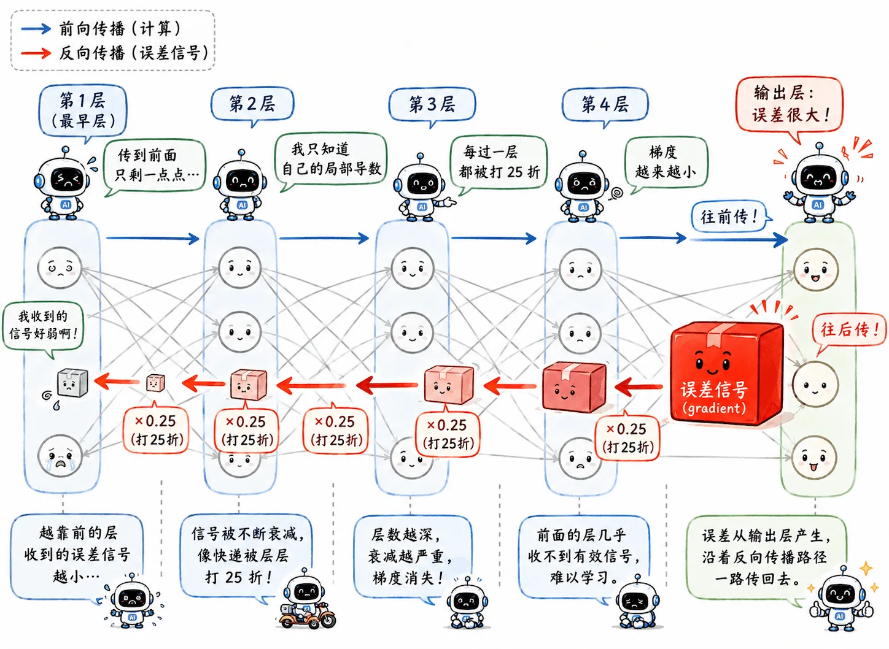
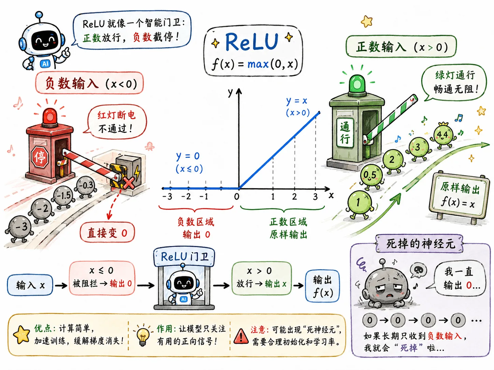

> 为了解决 Sigmoid 梯度消失问题，提出了多种激活函数的变体。

## ReLU

ReLU (Rectified Linear Unit) 简单粗暴。

它的公式是：

$$
f(x)=\max(0,x)
$$

- 如果输入 $x>0$，原样输出。
- 如果输入 $x \le 0$，直接变成 0。

### 优势

#### 缓解梯度消失

在 $x>0$ 的部分，它是一条斜率为 1 的直线，导数就是：

$$
1
$$

反向传播时，如果路径上的神经元都处在正半轴，梯度就不会像 Sigmoid 那样一层层被压扁。

$$
1 \times 1 \times 1 \times \cdots = 1
$$

#### 计算便宜

Sigmoid 需要指数运算，ReLU 只需要判断正负。

### 尚存痛点

ReLU 在负半轴直接输出 0，此时导数也是 0。

如果某个神经元在训练过程中不幸进入了长期负数区间：之后不管遇到什么输入，都可能输出 0；在反向传播时，它也拿不到梯度。这个神经元就像脑死亡一样，丧失学习能力。

这被称作 **Dying ReLU**。

## Leaky ReLU

Leaky ReLU 的改进很自然：给负半轴数据留一口气。

公式是：

$$
f(x)=\max(\alpha x, x)
$$

其中 $\alpha$ 是一个很小的常数，比如 0.01。

- 正半轴还是原样输出。
- 负半轴不再直接变成 0，而是保留一个很小的斜率。

### 改进之处

改进之后，即使神经元掉进负数区间，也仍然有一点梯度可以传回来。

## PReLU

Parametric ReLU (PReLU) 和 Leaky ReLU 很像。

区别在于，Leaky ReLU 里的 $\alpha$ 是人工设定的常数；PReLU 里的 $\alpha$ 变成了可以学习的参数。

也就是说，网络不仅学习权重 $w$ 和偏置 $b$，还顺手学习负半轴的处理程度。

可以理解为把**调参**的一部分也交给反向传播。

## Maxout

Maxout 则干脆跳出激活函数框架：针对同一特征，一次生成多组线性结果，取最大值。

$$
f(x)=\max(w_1^Tx+b_1, w_2^Tx+b_2,\dots)
$$

宽泛来说，ReLU 可以看成 Maxout 的一个特例：

$$
\max(0,x)
$$

一条线是 $y=0$，另一条线是 $y=x$。

甚至所有常见激活函数都可以看成 Maxout 的特例。但这样做的代价也很明显：参数量增加，计算开销显著变大。

所以如今的主流工程里，大家更多还是用 ReLU 及其变体。

{/* 配图建议：一张四联图，对比 Sigmoid、ReLU、Leaky ReLU、Maxout 的函数形状。漫画化标注：Sigmoid“压扁”、ReLU“一刀切”、Leaky ReLU“留气”、Maxout“多条线选最高”。 */}

## Train Bad

激活函数解决了训练过程里的信号传递问题，提升了模型在训练集上的效果。

所以更换激活函数，属于处理 Train Bad 的方法。
