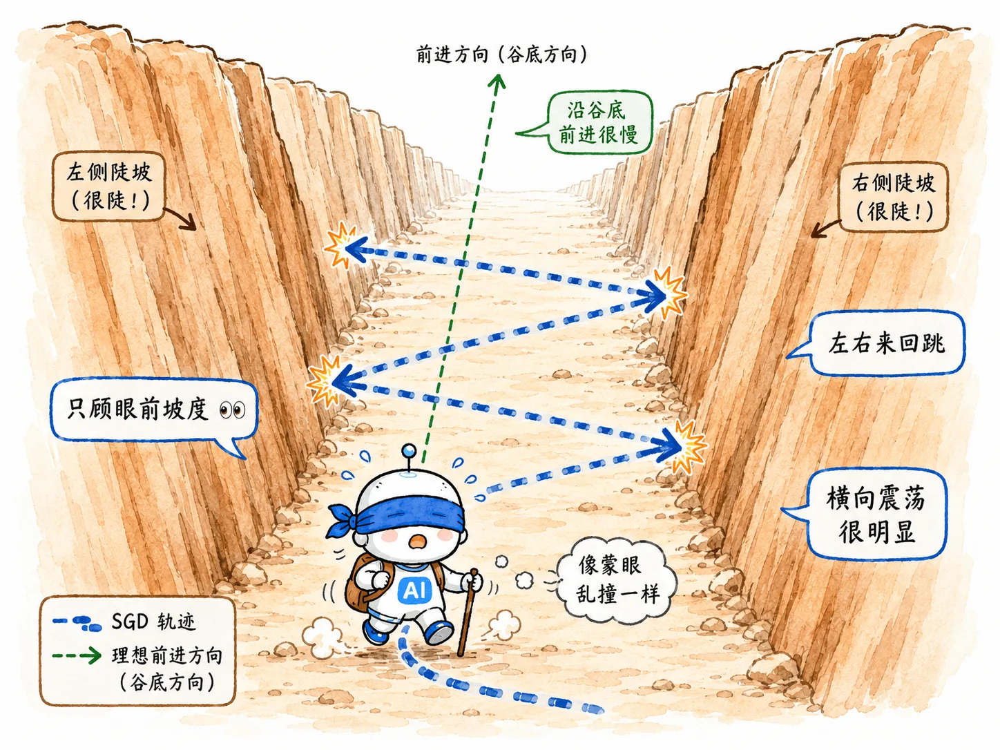

> 反向传播计算出梯度，相当于给出了下山的方向。
>
> 但是步幅大小怎么调整？这是优化器要干的活。

## Train Bad

如果把优化神经网络当成给模型看病，病症无非两种：

- **训练集效果差 (Train Bad)**
- **测试集效果差 (Test Bad)**

优化器主要处理的也是 Train Bad 问题。

当 loss 曲线像我的心电图一样平缓，或者在山谷间来回震荡就是降不下去时，就说明我们需要更换**更聪明的下山策略**了。

前面激活函数解决的是“梯度能不能传回来”。

优化器解决的是另一个问题：

> 梯度已经算出来了，怎么走才更快、更稳？

## SGD

`Stochastic Gradient Descent`（随机梯度下降）是最古老、最符合直觉的策略。

### 核心思想

SGD 就像**盲僧**，只能用脚简单感受当前踩着的这一小块地。

哪里最陡，就直接往反方向迈出固定的一步。

$$
\theta_t = \theta_{t-1} - \eta g_t
$$

$$
\text{新参数} = \text{旧参数} - \text{学习率} \times \text{梯度}
$$

这里的 $\eta$ 是学习率。

它决定每次更新走多大一步。

### 致命痛点

SGD 的问题在于它极度短视，完全没有记忆。

如果恰好走到了一个**狭长的 U 型峡谷**中，悲剧就发生了：

1. 觉得左边陡，向右猛跨一步。
2. 到了右边发现也很陡，又向左猛跨一步。

结果**在峡谷两壁之间疯狂横跳，真正该往前的路却走得很慢**。

SGD 不是不知道方向。

它的问题是每一步只看当前梯度，不知道历史上自己一直在往哪个方向走。

## SGDM

`Stochastic Gradient Descent with Momentum`（带动量随机梯度下降）是紧接而来的优化。

`Momentum`（动量）的出现，就是为了治好 SGD 的*反复横跳*。

### 核心思想

我们在盲僧身上绑一块大石头，引入物理学中的惯性。

当他顺着一个方向往下冲时，速度会慢慢叠加，越冲越快。

在计算梯度时，把历史方向的平均趋势也纳入考量：

$$
v_t = \beta v_{t-1} + g_t
$$

$$
\theta_t = \theta_{t-1} - \eta v_t
$$

$$
\text{新动量} = \text{惯性系数} \times \text{旧动量} + \text{当前梯度}
$$

$$
\text{新参数} = \text{旧参数} - \text{学习率} \times \textbf{动量}
$$

### 为什么管用

- **通向谷底的正确方向**：因为每次都在往下走，惯性不断累加，步伐越来越大，加速冲刺。
- **峡谷两壁的震荡方向**：上一秒向左，下一秒向右，正负抵消。横跳的幅度被惯性强行抹平。

Momentum 没有给每个参数单独调整学习率。

它改变的是更新方向的稳定性。

它让参数不再只看脚下这一瞬间，而是带着过去的趋势一起走。

## RMSProp

`Root Mean Square Propagation`（均方根传播）。

动量解决了方向问题，但还有问题没解决：**地形极度不均匀**。

### 核心痛点

神经网络动辄几千万个参数，也就是很多很多维度。

有些维度简直是悬崖峭壁，梯度长期很大。

有些维度又是一马平川，梯度长期很小。

如果所有参数都共用同一个步伐大小：

- 悬崖边的人一步跨进深渊。
- 平地上的人却像在原地踏步。

这就需要给不同参数配不同的步伐。

### 核心思想

RMSProp 给每一个维度都单独配备了**智能刹车系统**。

它悄悄记下了这个维度过去一段时间的*平均陡峭程度*，也就是梯度平方的指数移动平均。

$$
s_t = \beta s_{t-1} + (1-\beta)g_t^2
$$

$$
\text{新平方累积} = \text{衰减系数} \times \text{旧平方累积} + \text{权重} \times \text{当前梯度平方}
$$

更新时，把原始学习率**除以这个历史陡峭度**：

$$
\theta_t = \theta_{t-1} - \eta \frac{g_t}{\sqrt{s_t}+\epsilon}
$$

$$
\text{新参数} = \text{旧参数} - \text{基础学习率} \times \frac{\text{当前梯度}}{\text{历史梯度均值幅度}+\text{极小防零值}}
$$

- **坡太陡？** 分母变大，强制把步伐缩减。
- **坡太缓？** 分母很小，放大步伐，鼓励多走一点。

RMSProp 真正改的是每个参数自己的学习率。

它不是所有人统一迈一步，而是让每个维度根据自己的历史梯度情况调整步伐。

## Adam

`Adaptive Moment Estimation`（自适应矩估计）。

### 核心思想

看到这里，Adam 的诞生就顺理成章了。

既然 **Momentum（动量）** 擅长利用惯性找准方向，而 **RMSProp** 擅长根据地形自动调整步伐，那为什么不把它们缝合在一起呢？

于是，Adam 同时记录了两个东西：

1. **方向积累（一阶矩 $m_t$）**

   之前主要往哪个方向走？继承自 Momentum。

2. **陡峭度积累（二阶矩 $v_t$）**

   之前走过的路有多坑洼？继承自 RMSProp。

然后用它们一起指导下山：

$$
\theta_t = \theta_{t-1} - \eta \frac{\hat{m}_t}{\sqrt{\hat{v}_t}+\epsilon}
$$

就此，Adam 顺理成章地成为了深度学习时代的默认优化器。

需要注意，这里的 $\hat{m}_t$ 和 $\hat{v}_t$ 做了[偏差校正](/blog/dl-08-adam-adamw/#4-偏差校正)。

这是因为 $m_0$ 和 $v_0$ 初始为 0，会导致训练初期对梯度统计严重低估。
