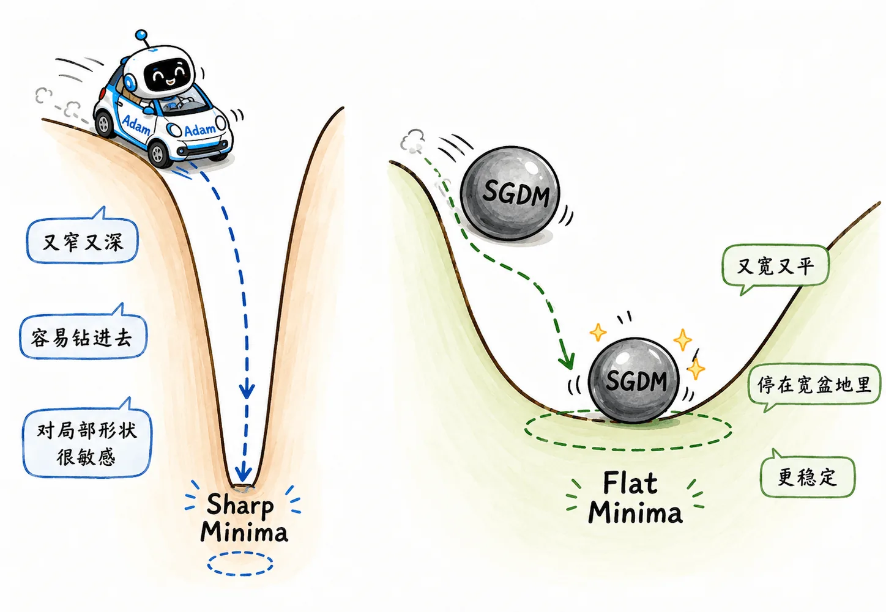
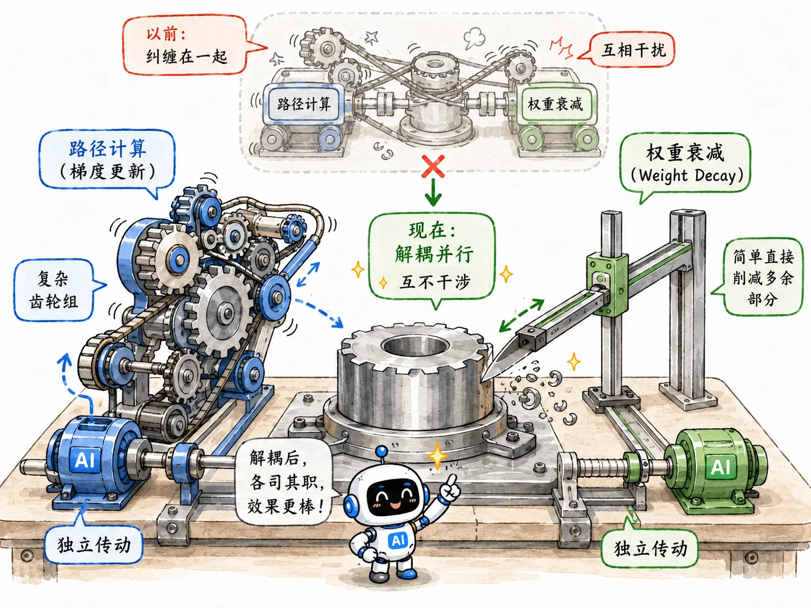

## 拆解 Adam

Adam 的完整过程可以拆成五步。

### 1. 当前梯度

假设在第 $t$ 步，我们对某个参数求导，得到当前原始梯度：

$$
g_t
$$

它就是当前这一步的地形测量结果。

### 2. 一阶动量

Adam 会维护一个梯度的一阶指数移动平均值：

$$
m_t = \beta_1m_{t-1} + (1-\beta_1)g_t
$$

$\beta_1$ 通常设置为 0.9。

这对应 Momentum 的**惯性系统**。

### 3. 二阶动量

Adam 同时维护一个梯度平方的指数移动平均：

$$
v_t = \beta_2v_{t-1} + (1-\beta_2)g_t^2
$$

$\beta_2$ 通常设置为 0.999。

这对应 RMSProp 的**刹车系统**，负责记录某个参数历史梯度的剧烈程度：

- 如果 $v_t$ 很大，说明这个参数过去经常震荡（环境恶劣），更新时应该收小步子。
- 如果 $v_t$ 很小，说明这个参数一直比较平，更新时可以适当放大步伐。

### 4. 偏差校正

这是 Adam 中最容易被忽略的细节。

为什么需要校正？

因为初始权重对冷启动的影响太大了：

$$
m_0 = 0
$$

$$
v_0 = 0
$$

第一步时：

$$
m_1 = \beta_1 \cdot 0 + (1-\beta_1)g_1
$$

考虑 $\beta_1=0.9$：

$$
m_1 = 0.1g_1
$$

一开始的真实梯度明明是 $g_1$，但一阶动量只拿到了 10%。

二阶动量也有同样问题，而且因为 $\beta_2$ 通常是 0.999，初期低估会更严重。

这种因为初始值为 0 导致的低估，叫**向零偏置**。

Adam 用下面两个式子修正：

$$
\hat m_t = \frac{m_t}{1-\beta_1^t}
$$

$$
\hat v_t = \frac{v_t}{1-\beta_2^t}
$$

训练越往后，$\beta_1^t$ 和 $\beta_2^t$ 越趋近于 0，偏差校正的影响也就越来越小。

### 5. 最终更新

最终参数更新是：

$$
\theta_t = \theta_{t-1} - \frac{\alpha}{\sqrt{\hat v_t}+\epsilon}\hat m_t
$$

这里：

- $\alpha$ 是基础学习率。
- $\hat m_t$ 提供方向。
- $\hat v_t$ 提供每个参数的自适应刹车。
- $\epsilon$ 防止分母为 0。

## Adam 的泛化问题

Adam 收敛很快，但在一些场景，尤其是早期经典 CV 模型复现中，大家发现古老的 SGDM 反而泛化更好。

一个常见解释：

> Adam 容易跑进 Sharp Minima，SGDM 更容易停在 Flat Minima。

### Sharp Minima

可以想象成又窄又深的坑。

在训练集上，它的 loss 可能非常低。

但测试集稍微有一点分布偏移，参数一动就撞到陡峭坑壁，loss 立刻变差。

### Flat Minima

可以想象成宽而平的盆地。

它在训练集上不一定是最极致的低点，但周围都比较平缓，测试数据稍微变化也不容易崩。

- Adam 因为每个参数都有自适应学习率，跑得很灵活，也更容易钻进狭窄深坑。
- SGDM 带着统一学习率和惯性，反而可能直接冲过某些窄坑，最后停在更宽的区域。

## SWATS

既然 Adam 前期跑得快，SGDM 后期泛化好，那能不能让它们俩再配合起来？

SWATS (Switching from Adam to SGD) 人如其名，思路就是先用 Adam，后期切到 SGDM。

SWATS 在 Adam 模式下的训练过程中同步估算一个等效的 SGD 学习率。当这个等效学习率趋于稳定时，无痕切换到 SGD。

这个思路很清晰，但在实际工程中并不是主流。

这是因为后来 AdamW 用更简单的方式修掉了 Adam 泛化问题里的一个关键部分。

## AdamW

### L2 与 Weight Decay

在传统 SGD 里，L2 正则化和 Weight Decay 是等价的。

L2 正则化是在 Loss 后面加一项：

$$
L_{\text{new}} = L_{\text{data}} + \frac{\lambda}{2}w^2
$$

对它求导：

$$
g_{\text{new}} = \nabla L_{\text{data}} + \lambda w
$$

放进 SGD：

$$
w_{\text{new}} = w - lr(\nabla L_{\text{data}}+\lambda w)
$$

展开：

$$
w_{\text{new}} = w(1-lr\lambda) - lr\nabla L_{\text{data}}
$$

这说明在 SGD 语境下，把 L2 惩罚加进 Loss，等价于每次更新时把权重按比例缩小一点。而后者就叫 Weight Decay。

这是 SGD 时期的数学巧合。

### Adam 失效

问题是，这个巧合在 Adam 里水土不服。

如果继续把 $\lambda w$ 加到梯度里，它会进入 Adam 的一阶动量和二阶动量统计。

Adam 最终更新时有一个分母：

$$
\sqrt{\hat v_t}
$$

如果某个参数历史梯度很大，分母也会变大。这本意是为了给陡峭维度踩刹车。

但现在 L2 惩罚项也混在梯度里，它也会被这个分母一起缩小。

这就直接导致了荒谬结果：

> 越活跃、越该被惩罚的权重，反而可能因为分母巨大而逃过惩罚。

### AdamW 诞生

AdamW 由此出现，它把两件事分开处理：

1. 用纯净的数据梯度计算 Adam 更新。
2. 单独对权重做衰减。

最终形式可以粗糙写成：

$$
w_t
=
w_{t-1}
-
\eta \frac{\hat m_t}{\sqrt{\hat v_t}+\epsilon}
-
\eta\lambda w_{t-1}
$$

也就是：

$$
\text{新权重}
=
\text{旧权重}
-
\text{Adam 自适应更新量}
-
\text{权重衰减缩放量}
$$

惩罚项被抽离到了 Adam 分母外面。无论二阶动量有多大，权重衰减该罚多少罚多少。

