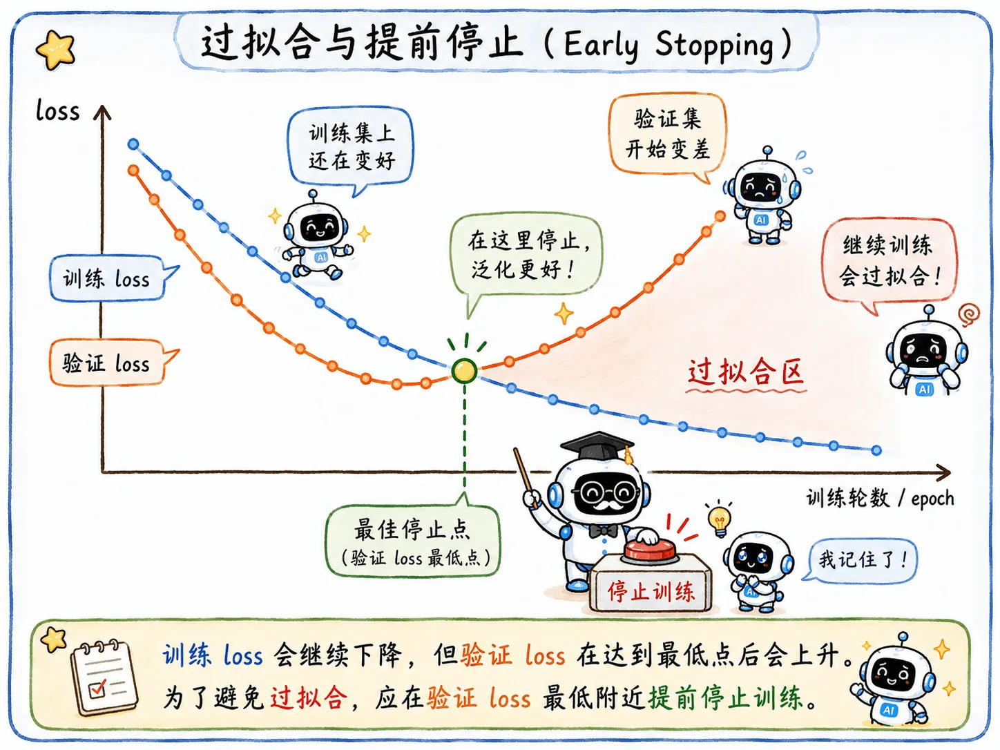
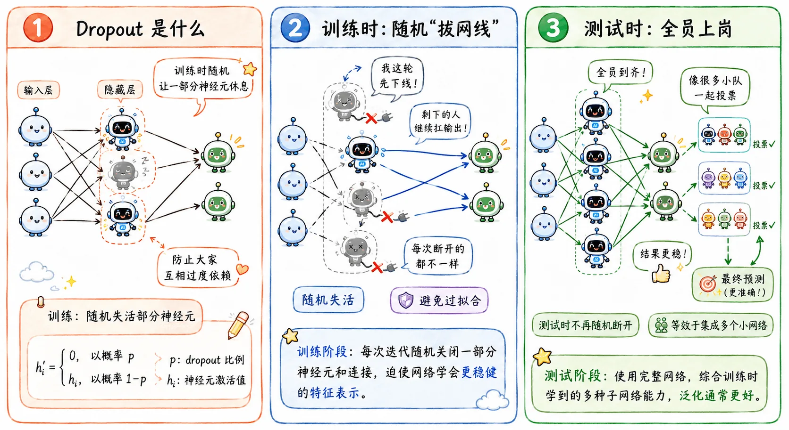

> 分析完 Train Bad 问题，我们再来看 Test Bad。
>
> 看看如何避免培养出一个个小镇做题家。

## Test Bad

如果模型在训练集上大杀四方，一到验证集/测试集就原形毕露，那就是 **Test Bad**（过拟合）问题。

这时的模型就像一个卷得要死的小镇做题家，把往年真题背得滚瓜烂熟，在训练集上效果好得惊人。

结果反转来了，期末考试大变样，除了知识点没变，什么都变了。这下彻底懵逼，测试集直接挂科。

它甚至会把训练集里偶然的噪声也背下来。

比如靠记住背景里的水印来识别猫。

这就是**泛化问题**：

> 训练集表现好，不代表模型真的理解了任务。

## Early Stopping

早停逻辑很好理解。

训练时除了训练集，还会专门切出一小块**验证集**。模型每训练完一轮，就让它做一次验证集的卷子。

一开始，训练集 loss 和验证集 loss 都在下降。但训练到某个阶段，会出现很危险的分叉：

- 训练集 loss 还在下降。
- 验证集 loss 停滞，甚至开始上升。

这其实就是模型从**还不错**走到**过拟合**的关键节点。再练下去，模型就要开始背诵噪声和细枝末节了。

Early Stopping 就是在这个拐点直接结束训练。

## L2 正则化

L2 正则化在之前的机器学习中[已经讲过](/blog/ml-04-bias-variance-cross-validation/#正则化)，这里放到深度学习语境里再看一遍。

它的形式是：

$$
L' = L + \frac{\lambda}{2}\|w\|^2
$$

可以理解成考试规则对偏科高手的精准打击：

> 每有一科不及格，总分扣十分。

这么做是因为模型有时为了强行记住一些特殊样本，很容易把某些局部权重拉得极其夸张。

比如某个训练样本背景里有水印，模型发现“有这个水印就大概率是猫”，于是把水印相关特征权重调得很高。

训练集上砍瓜切菜，但一到测试集就崩了。

L2 可以有效压制这种极端行为，逼迫模型老老实实去寻找**更平滑、更普适**的特征。

权重分配越平均，受的惩罚越少。

## Dropout

Dropout 原理很简单，但非常牛逼：

> 每次前向传播时，随机让网络里的一部分神经元假死。

这是因为神经网络节点间极易出现 **协同适应 (Co-adaptation)** 现象。

就像是大学里的小组作业。

三个人在大一的时候机缘巧合组上了队，结果三年间的每一次分组他们都习惯性抱团，彼此的默契度高得惊人。

突然，有一门课的老师要求随机分组，这三个人被拆散后完全丧失能力。

神经元也是这样。

比如识别“猫”的时候，节点 A 专门负责找耳朵，节点 B 发现 A 找得挺准，B 就开始偷懒，直接把自己的输出绑定在 A 身上。

一旦测试集里的猫耳朵被遮住了，A 宕机，B 也跟着瘫痪，整个网络直接崩溃。

Dropout 的暴力操作是：

> 在每一次前向传播训练时，随机屏蔽掉一部分神经元。

这会带来两个效果。

### 打破依赖

任何一个神经元都不能再指望别人，因为它知道，自己的队友下一秒可能就被 Dropout 踢下线。每个神经元都被迫去学习更加独立、普适的特征。

这就弱化了协同适应。

模型不再把能力集中在几个固定搭档上，而是让更多节点都能独当一面。

### 隐式 Ensemble

还可以从另一个很有意思的角度解读 Dropout：

> 每次随机屏蔽神经元，其实都在训练一个不同的**瘦身版子网络**。

假如一个网络有 1000 个节点，每次训练随机屏蔽 50%。那么每次前向传播，参与训练的都是一个不同的子网络。训练多轮，相当于联立起很多个不同的子模型。

到了正式测试，关掉 Dropout，让全部神经元上岗，再按概率缩放输出。

**这就像让很多个子模型一起投票**，所以准确率和鲁棒性会提升。

### 其意义

Dropout 是深度学习里很有代表性的泛化技巧，优化的思路很有深度学习的味道。
