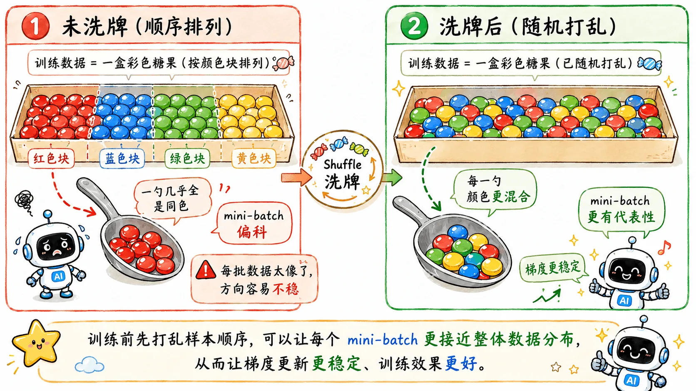
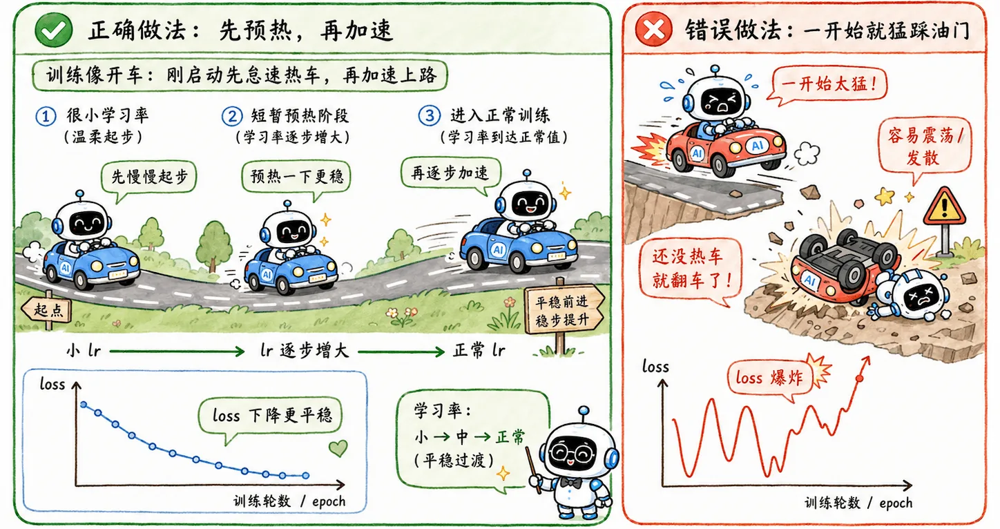

> 这些训练技巧没有改变模型本质。
>
> 而是在调整训练过程的节奏、噪声和尺度。

## 三类技巧

除开前面已经讲过几类训练问题与解决方案，还有一些零散的技巧，在工程里经常出现。

可以大致分成三类：

1. **增加随机性**，鼓励模型 exploration。
2. **调整学习率和数据难度**，让训练过程更平滑。
3. **控制数据和中间激活的尺度**，避免数值爆炸或极端参数。

## 增强随机性

这类技巧就是在鼓励 exploration。

不让模型一开始就定死路径，而是允许它多试探一些可能。

### Shuffling

Shuffling（数据洗牌）看起来毫无技术含量，但很关键。

如果训练数据按类别连续排列：

- 前 1000 条全是猫。
- 后 1000 条全是狗。

模型会被严重干扰，它先会被训练成类似**猫的特化模型**，然后又被狗的特征吓一大跳。

如果数据顺序带有明显规律，梯度更新会被这种顺序带偏。

随机洗牌后，每个 [mini-batch](/blog/ml-03-gradient-descent/#用多少数据算梯度) 都更像整体数据的缩影。

### Gradient Noise

Gradient Noise 是在计算完梯度后，给梯度加上一点**高斯噪声**。

像是在崎岖山谷里推一颗弹珠，有时候弹珠滚进了半山腰的小坑，就以为自己到底了，躺平不动。Gradient Noise 就像是一阵风，说不定就把弹珠吹出小坑，继续向下。

- 训练初期噪声大，可以帮助模型跳出一些局部最优或鞍点。
- 训练后期模型已经接近最低点，所以噪声逐渐变小，避免破坏收敛。

## 学习率和数据调整

### Warmup

Warmup 是学习率预热。

刚开始训练时，模型的参数随机分配，优化器记录的梯度历史也还没建立起来。在两眼一抹黑的状态下，如果直接大脚步猛跑，很容易一脚踩进沟里。

Warmup 的思路是：

> 冷车启动时，先用极小的学习率怠速运行。

等模型热身完毕，再切到正式学习率，进入正常训练。

### Curriculum Learning

Curriculum Learning（课程学习）很像金牌教师的课程设计。

人类的学习是循序渐进的，我们需要避免一开始就给小学生看偏微分方程。

模型也一样。

训练初期，模型能力还很弱。这时先用干净、简单、特征明显的数据训练，可以帮它更快建立基本判断能力；等基础打牢后，再逐渐混入模糊、遮挡、噪声更重的困难样本。

这样可以提高模型的鲁棒性。

### Fine-tuning

Fine-tuning（微调）则是另一种非常常见的训练策略。

从零开始训练一个大模型，代价很高。而且如果自己的数据集很小，模型很容易过拟合。

于是更现实的一般做法是：

> 拿一个已经在大规模数据上预训练过的模型作为起点，再在自己的任务上微调。

类似基于大厂提供的半成品改装微调。

预训练模型已经学到了很多底层通用特征，微调只需要在这个基础上去适配新任务。

它通常训练更快，也更稳定。但如果微调动作过大，也可能引发**灾难性遗忘**，洗掉预训练模型的高质量特征。

## Normalization

随着网络变深，还会出现一个工程灾难：

> 高层输入的变化过于剧烈。

第一层参数稍微动一点点，然后层层放大，等传到第十层时已经面目全非。高层每次学习都在面对完全不同的数据分布，收敛效率很低。

Normalization（归一化）的目标是把中间层的激活值限制在稳定尺度。

常见家族包括：

- Batch Normalization
- Instance Normalization
- Group Normalization
- Layer Normalization
- Position Normalization

### BatchNorm

BatchNorm 在 batch 维度上做归一化，在 CNN 里非常常见。

但它极度依赖 batch size，如果 batch 太小，统计出来的均值和方差就不稳定。

### LayerNorm

LayerNorm 在单个样本内部做归一化。

它不依赖 batch 里的其他样本，所以在 Transformer 和 LLM 里更常见。

这些归一化手段在后面会有更详细的介绍。

{/* 等后面写到相关内容，补一个直链 */}

## Regularization

Regularization（正则化）前面已经讲过 L2 和 Dropout。

放到训练稳定性的角度，它的作用是约束模型自由度，避免模型为了迎合少数极端样本做出参数的极端变化，让模型更倾向于平滑解。
