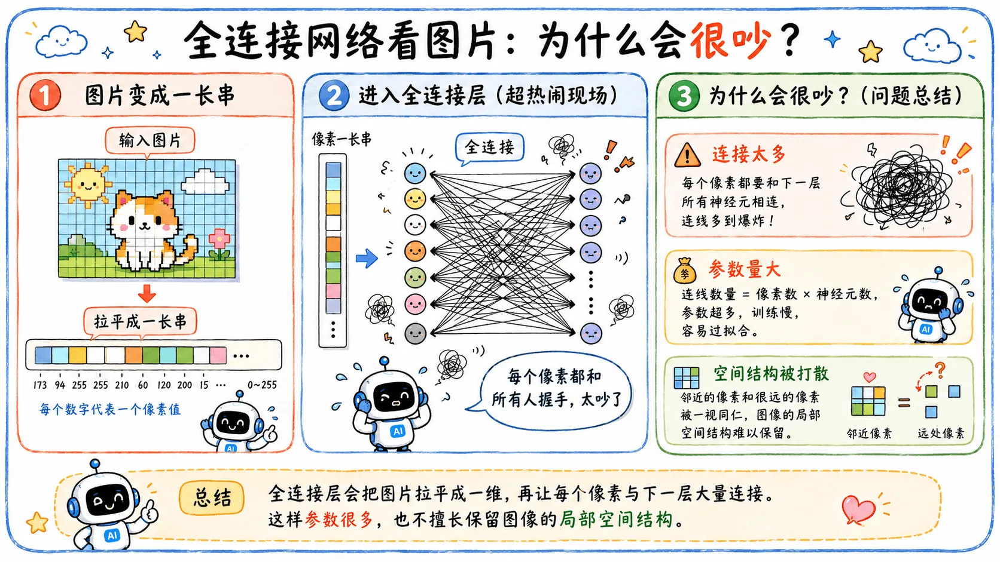

> 深度学习结束了人工特征工程时代。
>
> 但人工设计的目标并没有消失，它只是从提取特征（Feature），转向了设计结构（Structure）。

## FNN

前面讨论的多层感知机，本质上属于前馈神经网络（FNN）。

这是网络最基础、最直观的形态：信息从前向后单向流动。在全连接的设定下，每一层的每个神经元，都与上一层的所有神经元相连。

$$
\text{输入}
\longrightarrow
\text{隐藏层}
\longrightarrow
\text{输出}
$$

**全连接的核心问题在于：太平均。**

它对所有输入位置一视同仁。以图像识别为例，当一张图片被展平输入全连接网络时，每个像素都直接和下一层的全量神经元相连。

但真实世界的数据往往自带空间或时间结构：图像相邻像素之间关系密切，远处的像素则未必；全连接网络粗暴地打破了这种二维关联，导致模型需要耗费巨大的代价去**重新学习**这些显而易见的先验知识。

## 结构即先验

特征工程时期，专家需要对目标领域有极深的理解，手动提取规则。而深度学习将这份压力转移到了**模型结构、训练策略和数据规模**上。

如果所有任务都用同一种全连接网络，虽然在算力堆叠下也能出结果，但效率极低。因此，深度学习向后演进的核心命题就是：**什么样的结构，匹配什么样的数据？**

不同的数据有着截然不同的形态：

- **图像**有空间局部性。
- **文本**有序列与上下文关系。
- **语音**有时间连续性。

后来大放异彩的网络架构，本质上都是对特定数据结构的工程学回应：

- **CNN** 适合图像，是因为它的卷积核、局部连接和参数共享，完美契合了二维空间的局部特征。
- **RNN** 曾经统治序列，是因为它按时间步处理输入，天然附带时序的递推状态。
- **Transformer** 后来居上，是因为其注意力机制能够突破时序距离，直接在庞大的上下文中建立全局的 Token 关联。

{/* 讲到对应的，补直链 */}
