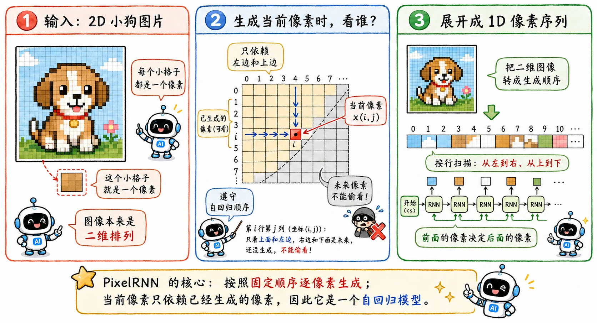
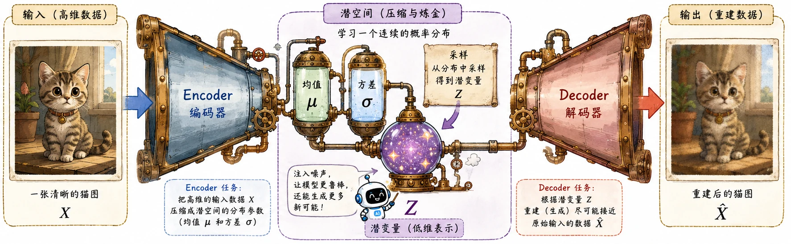
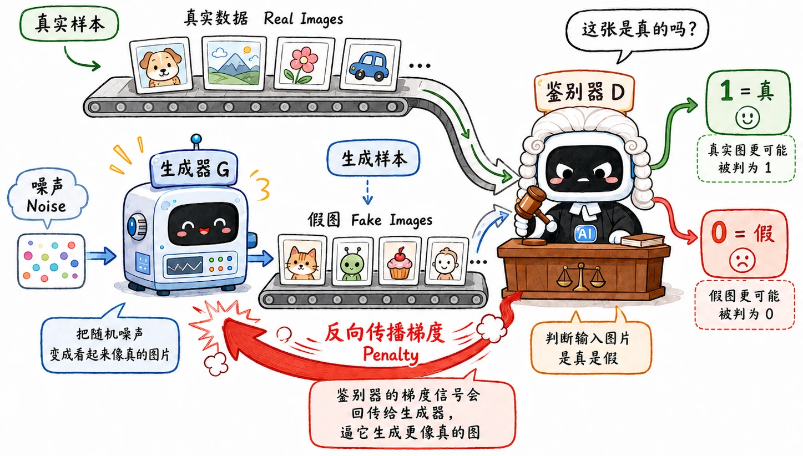

> 前面的 [Deep Dream 和 Style Transfer](/blog/cnn-03-deep-dream-style-transfer/)，本质上是在已有内容上修改，做的是**风格迁移和特征放大**。
>
> 但从这篇开始，我们要接触真正**从分布里采样**的生成模型。

在大红大紫的 Diffusion 之前，我们先聊聊几位**老前辈**——PixelRNN、VAE 和 GAN。它们都在试图解决深度学习的一个核心问题：

**如果扔给模型一堆真实图片，它到底得掌握什么规律，才能画出一张这个世界上压根不存在的新图？**

## PixelRNN

PixelRNN 直白且暴力：把图片看成一篇长文章，而像素就是文章里的字。

类似 RNN 根据上文猜下一个词一样，它根据已经画好的像素，去推测下一个像素该涂什么颜色。生成图片时，它从左上角开始，按照固定顺序一个像素一个像素地往后填。

从数学上看，它把二维图片的生成拆成了一长串一维条件概率的连乘：

$$
P(x) = \prod_{i=1}^{n} P(x_i | x_1, x_2, ..., x_{i-1})
$$

它真的在学习“已知左边和上边的像素，当前这个点大概率是什么”。

这种自回归（Autoregressive）的思想非常正统，其实就是现在大火的视觉大模型（比如把它 Token 化后的各种方案）的一个极早期雏形。

**但这也带来了一个致命缺陷——极其慢的推理速度。**

因为它必须纯串行生成。一张 256x256 的小图都有六万多个像素。训练的时候还可以通过 Mask 机制并行，但生成的时候，这种像素级的逐个敲击，就显得过于笨重了。

## VAE

相比之下，**VAE（Variational Autoencoder，变分自编码器）** 换了一种更聪明的思路。

### 自编码器 AE

可以把 AE 想象成一个沙漏，上下两部分分别由 Encoder 和 Decoder 组成。

假设我们有一大堆猫的图片。Encoder 会去把每张猫图进行极致压缩，提炼成一个低维的**潜变量（Latent Variable）**。在这个潜空间里，留下的全是核心特征的抽象法则：_耳朵的尖锐度、脸部的朝向、毛色的深浅_。

只要这个空间学得够好，我们随便在里面采样一个坐标，再把这个坐标丢给 Decoder 解码，就能**无中生有**地还原出一张全新的猫图。

> seq2seq 是 Encoder-Decoder 在变长序列监督转换任务下的特例。

### 变分 Variational

- AE 只能把输入映射成潜空间里一个**固定的死点**。在两个点中间取一个值去解码，出来的可能是一坨毫无意义的马赛克。
- VAE 的 Encoder 输出的是一个**多维的高斯概率分布**（带有均值和方差）。这就把原本离散的潜空间，抹平变成了一个连续且丝滑的域。

  这意味着如果在表示“黑猫”和“白猫”的两个分布之间平滑过渡，中间区域大概率能解码出一只合乎逻辑的“灰猫”。

**但 VAE 也有其缺陷所在：生成的图片往往带有毛玻璃般的模糊感。**

这主要是因为它的损失函数（通常包含均方误差 MSE）。

当模型对某个细节（比如猫的一根胡须到底该长在哪）拿捏不准时，会选择**和稀泥**——给出一个所有可能性的均值。落到视觉上，结果就是细节被糊成了一团。

## GAN

**GAN（Generative Adversarial Network，生成对抗网络）** 的思路是深度学习里最狂野的。

在 GAN 出现之前，大家都在发愁：怎么用数学公式来衡量**图片的真实性**？MSE 已经证明了不行（会模糊）。GAN 的作者 Ian Goodfellow 给出的答案是：**与其自己定义规则，不如让神经网络学习规则。**

它引入了竞争机制：用一个**鉴别器（Discriminator）** 充当动态的损失函数，倒逼牛马**生成器（Generator）** 内卷。

一开始，生成器画出来的图全是噪点，鉴别器一眼就能看穿。为了骗过鉴别器，生成器不得不去修改图片细节；而鉴别器的眼光也变得越来越毒辣。

博弈到最后，生成器会生成极度逼真、锐利的视觉细节，彻底解决 VAE 的模糊问题。**StyleGAN** 就是这条路线的巅峰。

**成也对抗，败也对抗。GAN 的缺陷是训练难度。**

两个网络的平衡就像走钢丝一样脆弱。

- 如果鉴别器太强，生成器就会因为收不到有效的梯度而直接摆烂。
- 而如果生成器偶然发现了某种能稳定骗过鉴别器的套路（比如特定角度人脸），它就会投机取巧，反复生成同类图片——这就是臭名昭著的 **Mode Collapse（模式崩塌）**。

## Diffusion

最后一统江湖的 [Diffusion](/blog/diffusion-01-overview/) 其实是基于这些经验和教训的产物，它回应了 GAN 视觉质量高但训练不稳定的问题，同时后来的 Latent Diffusion 也借用了 VAE 式潜空间。
