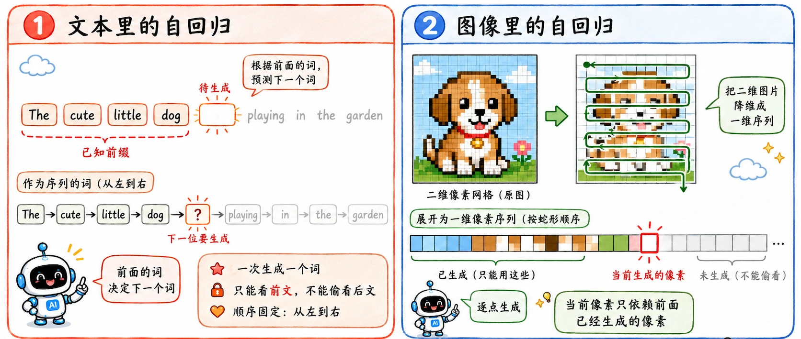
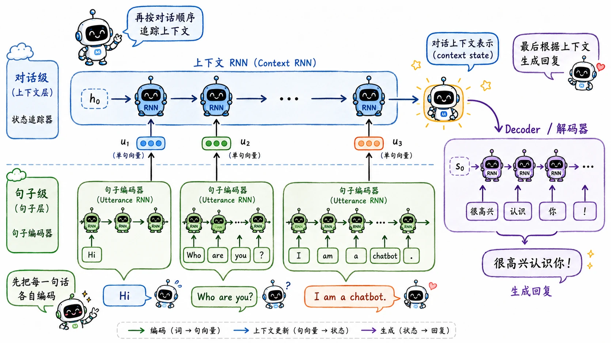

> 真正的生成就像是一个孤独的码字者——一边写，一边又要返回去看之前的剧情，绞尽脑汁地想接下来该写什么。

## 自回归思想

无论是之前讲过的文本处理任务，还是 PixelRNN，我们人类最擅长的就是把宏大的目标拆解成一长串的 Next to do。

假设要生成一段序列：

$$
X = (x_1, x_2, ..., x_T)
$$

那么它的联合概率完全可以被拆解成一系列条件概率的连乘：

$$
P(X) = \prod_{t=1}^{T} P(x_t | x_1, ..., x_{t-1})
$$

这就是后来统治了无数大模型的 **Autoregressive（自回归）** 思想。

> 所谓的创造，不过是对历史的必然延续。

在文本里，它就是根据上文推测下一个 Token；而哪怕是二维的图像，也可以被人为地规定好一条路线（比如从左到右、从上到下），强行压扁成一维序列来排队预测。

## 在 RNN 时代

既然是按时间顺序层层递进，自带时间轴的 RNN 自然成为那个年代做生成的最佳容器。

比如 Alex Graves 的**手写轨迹生成模型**。它用 LSTM 加上混合密度网络，成功做到了预测笔尖的下一个连续落点在哪、连笔该怎么甩。

还有后来横空出世的 **WaveNet**。虽然它的底层架构换成了更擅长一次性抓取长程信息的空洞卷积（Dilated CNN），其灵魂依然是自回归：参考前面的历史声音细节，精准算出下一个极小音量值，一点一点拼出完整音频。

## 条件生成

“无中生有”的自由生成固然有意思，但在真实的工程世界里，我们不需要一个胡言乱语的 AI。我们更需要让它**听命行事**，即**条件生成**：

$$
\begin{aligned}
\mathbf{Task}_1&:\; \mathbf{X}_{\text{en}} \rightarrow \mathbf{Y}_{\text{zh}} \quad (\text{英文输入} \Rightarrow \text{中文翻译}) \\
\mathbf{Task}_2&:\; \mathbf{X}_{\text{img}} \rightarrow \mathbf{Y}_{\text{caption}} \quad (\text{图像输入} \Rightarrow \text{图片描述}) \\
\mathbf{Task}_3&:\; \mathbf{X}_{\text{greet}} \rightarrow \mathbf{Y}_{\text{reply}} \quad (\text{问候语句} \Rightarrow \text{对话回复})
\end{aligned}
$$

此时，目标公式也悄然变化，多了一个条件 $C$：

$$
P(Y|C) = \prod_{t=1}^{T} P(y_t | y_{<t}, C)
$$

为了解决这个多出来的 $C$，RNN 时代端出现了统治级架构：**Encoder-Decoder（编码器-解码器）**。Encoder 负责把条件输入压缩成一个 Context Vector（上下文向量）；Decoder 则用这个向量分步生成最终的答案。

关于这个过程的具体细节，可以看 [Seq2Seq](/blog/rnn-03-sequence-tasks/#seq2seq) 相关内容。

**但传统 Encoder-Decoder 也有局限，它希望可以把任意长的条件信息都压缩成一个定长向量。**

这个漏斗式的瓶颈设计，迟早会被爆炸的信息量给撑破（这正是 Attention 机制诞生的最根本动力）。

## HRED

在对话系统这个具体的分支里，普通的 Seq2Seq 还暴露了另一个短板：鱼的记忆。

在实际聊天情景中，用户上一轮刚说完 context，下一轮紧接着问相关问题，模型就已经忘得一干二净了。这是因为它只能处理**单回合**的一问一答。

为了解决这个问题，**HRED（Hierarchical Recurrent Encoder-Decoder）** 做了一个巧妙的扩展：分层结构。

1.  **第一层 RNN（Utterance Level）**：底层速记员。专门负责读懂单句话，把用户说的每一句都独立压缩成一个局部向量。
2.  **第二层 RNN（Session Level）**：全局主管。它负责把第一层递上来的句子向量按时间顺序串起来，维护整场聊天的全局状态。

等到 Decoder 最终要开口说话时，它依赖其实是主管手里那份跨越了多回合的**历史档案**。

这其实已经非常有现代 Agent **记忆池（Memory）** 的味道了。

现在的我们在面对多轮上下文时，裤兜里一掏，全是暴力破解手段：向量数据库、RAG 或者几十万 Token 的超长上下文窗口；但在算力和架构都受限的年代，前辈们靠精巧的嵌套循环状态，也实现了历史记忆的保持。
