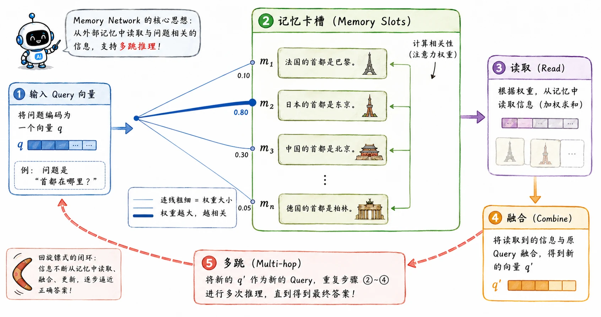
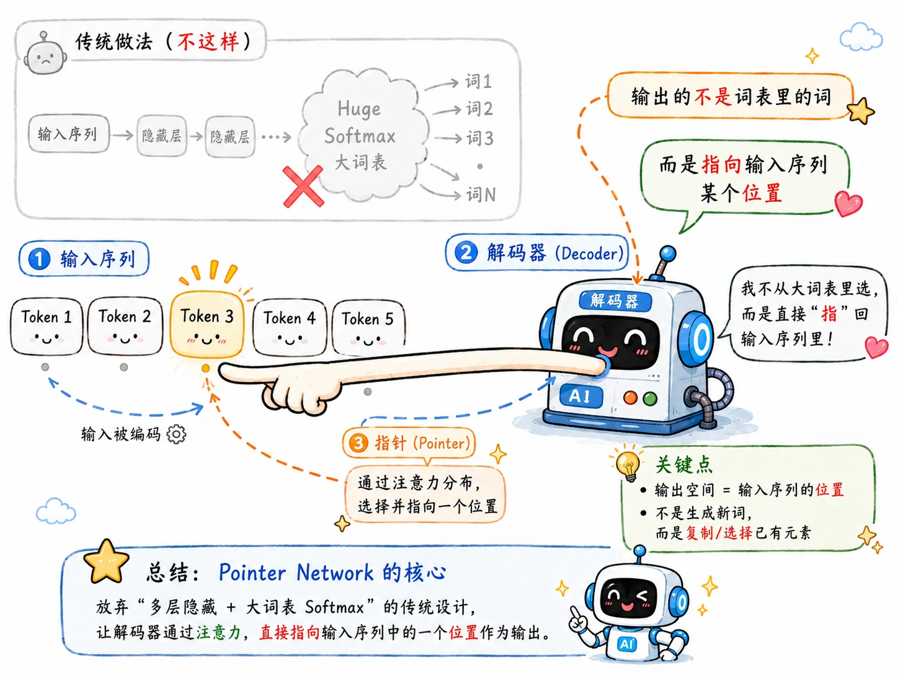

> 传统的 Encoder-Decoder 架构的硬伤在前文中已经多次提及。

## Attention

当 Decoder 准备憋出下一个词时，终于不再只是死盯着 Context Vector（已经爆满的瓶颈向量）。

1. Decoder 拿出自身当前（或上一步）的隐状态，分别和 Encoder 每一个时间步留存的隐状态计算匹配分数。
2. 将所有匹配分数在输入序列维度做 Softmax 归一，所有权重总和为 $1$，得到一组注意力权重 $\alpha_{t,i}$
3. 用这组权重对 Encoder 全部隐状态加权求和，生成解码第 $t$ 步专属的动态上下文向量 $c_t$：

   $$
   c_t = \sum_i \alpha_{t,i} h_i
   $$

> $\alpha_{t,i}$ 就像是在原文上滑动的**手电筒光束**，数值越高代表解码当前词时越聚焦对应输入位置。

需要注意，这里的 Attention 发生在一个序列（Decoder）去跨界观察另一个序列（Encoder）的隐状态上。这与后来 Transformer 赖以成名的 **Self-Attention** 有着本质的区别——Self-Attention 是让同一个序列内部的 Token 之间互相审视和读取。

无论如何，这套机制让**模型学会了按需读取记忆。**

Attention 的视觉流程：[Visualizing A Neural Machine Translation Model](https://jalammar.github.io/visualizing-neural-machine-translation-mechanics-of-seq2seq-models-with-attention/) 。

## Memory Network

既然 Attention 可以在句子的隐状态里“淘宝”，那难免让人想更进一步：是不是可以在更大的外部数据库里找东西？

Memory Network（记忆网络）就这样水灵灵地出现了。

假设我们把一整篇长文档拆成很多个句子，每个句子都编码成一个向量，整整齐齐地码放在一块 Memory（内存）里。当用户抛来一个问题 $q$ 时，模型就用 $q$ 去和 Memory 里的每一条记录做 Attention 匹配，把最相关的信息拽出来。

如果遇到复杂问题，它甚至可以把第一次取出的线索和原问题合并，再拿着升级后的问题去 Memory 里查第二次、第三次——这就是极具前瞻性的 **Multi-hop（多跳推理）**。

有没有 RAG（检索增强生成）和 Agent 记忆池的味道？这说明虽然现代工程系统的形态愈发庞大，但底层依然在解决同一个问题：**面对当前问题，我到底怎样才能从茫茫记忆中，精确检索出所需信息？**

## NTM

Memory Network 相对还是保守，它偏向于**只读**。

**Neural Turing Machine（NTM，神经图灵机）** 的野心就大得多了。它希望神经网络拥有一块可以自己决定读写的“外接硬盘”。

它引入了一个 Controller（RNN/LSTM/GRU），外加一块二维的 Memory 矩阵。Controller 通过类似 Attention 的寻址机制，决定去内存的哪个地址读、哪个地址写。写入还拆分成两步动作：

- **Erase：** 先抹除该位置过时的信息。
- **Add：** 再写入新鲜的信息。

这种硬核设计，实际上是在尝试用可微的数学公式，去逼近经典的计算机冯·诺依曼架构。

## Pointer Network

普通 Decoder 的输出空间被限制在预先定义好的固定词表（Vocabulary）里，这就会出现 OOV（Out-Of-Vocabulary）问题。

Pointer Network（指针网络）给出了一个暴力解法：

Attention 权重落在哪个输入元素上最高，直接把那个元素作为结果丢出去。

在 NLP 领域，这个思想后来演化成了极为重要的 **Copy Mechanism（复制机制）**。做文本摘要遇到没见过的奇葩人名、地名时，与其让模型抓耳挠腮地用固定词表硬拼，不如直接从原文里复制粘贴，堪称神来之笔。

## Recursive Network

最后提一嘴 Recursive Network（递归网络）。

RNN 的底色是链式的，但人类的语言并不总是这样，句子往往潜藏着复杂的树状语法：几个单词合并成短语，短语再合并成从句，最后拼成整句。

Recursive Network 试图把共享的神经网络函数，强行挂载到这样一棵树状结构上。每次合并两个子节点，得到一个父节点表示，一路向上，直到得到整棵树的根节点。

这条路线虽没能像 Transformer 那样名垂青史，但它留下的工程哲学值得我们思考：**每一次架构设计，本质上都是我们在强行往模型里塞入某种“结构先验”。**

- RNN 关于时间顺序的先验。
- CNN 关于空间局部性的先验。
- Recursive Network 关于语法树的理想化先验。

而后来一统天下的 Transformer 之所以如此可怕，恰恰是因为它用 Self-Attention **放宽了所有的结构假设**。它把所有元素铺开，让数据自己决定联系。
