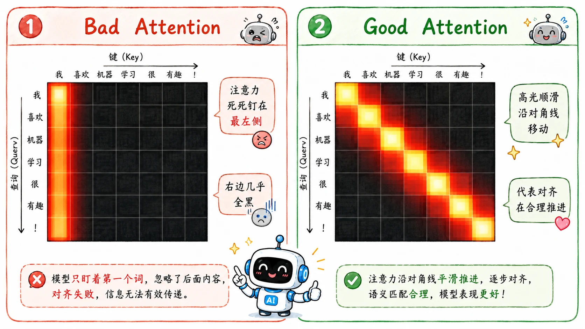
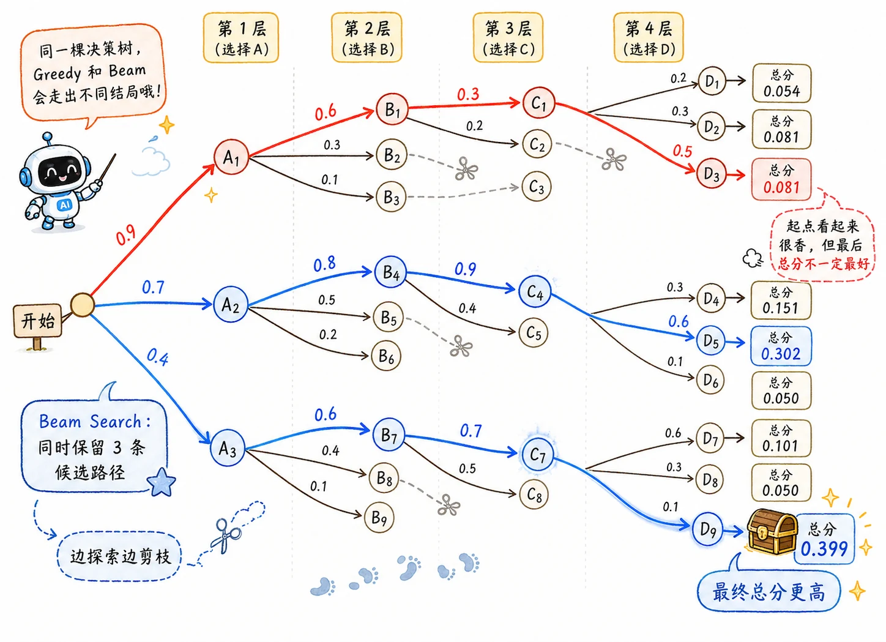

> 跟之前的各式模型一样，除了结构的提出，调优也是一大难点。

## Bad Attention

Attention 的数学公式写在纸上足够优雅，但在现实中经常会有不尽人意的地方。

最典型的一个灾难就是：**模型死死盯着某个地方不放。**

想象一下，我们正在做视频字幕生成，输入是连续几十帧的画面。我们希望模型每吐出一个词，它的“注意力聚光灯”就应该平移到对应帧上。但如果 Attention 学坏了，就可能会一直盯着某一帧。结果就是，不管视频演到哪，它永远在复读同一句话，彻底跑偏。

为了纠正这种现象，研究人员不得不给 Attention 强加一些物理约束。例如**惩罚覆盖率（Coverage）偏差**：

$$
\sum_i \left(\tau - \sum_t \alpha_{t,i}\right)^2
$$

这个公式的核心逻辑是：**不许长期无视某些特征，也不许像狗屎一样永远粘在同一个位置。**

## Exposure Bias

在训练阶段，为了保证收敛，我们通常会给模型开启“新手保护”——**Teacher Forcing**。

意思是，在教模型写第 $t$ 个词时，不管它上一步猜的是什么，我们都会直接把“标准答案”里的上一个词塞给它作为输入。这让训练变得极其平滑，因为模型每走一步，脚下踩的都是绝对正确的历史基石。

**但等新手保护期一过，问题浮现了：推理阶段是没有标准答案的。**

一旦真正上线部署，模型就只能用自己的瑕疵词了。只要前面稍微出错，整个上下文的分布就面目全非了。错误会像滚雪球一样在自回归的链条上疯狂放大，这就是经典的 **Exposure Bias（曝光偏差）**。

## Scheduled Sampling

为了解决曝光偏差，大家想出了补救措施：**Scheduled Sampling（计划采样）**。

其逻辑就像教小孩骑自行车：

- **刚开始：** 后轮装上两个辅助轮（100% 使用 Teacher Forcing 标答），让它先找到平衡的语感。
- **慢慢地：** 按一定概率偷偷把辅助轮悬空（掺入模型自己上一轮生成的 Token）。
- **最后：** 完全撤掉辅助轮，让它暴露在真实的推理环境下。

但这个方法在学术界一直伴随着“破坏了原始目标分布”的数学争议。

## Greedy vs. Beam Search

模型在输出端给出的是下一个词的概率分布。我们之前一贯的解码策略是**每次都选择概率最高的那个。**

这就是 **Greedy Search（贪婪搜索）**。它的实现速度很快，但代价是非常容易走进死胡同。

第一步概率最高的词，像是一剂诱惑力极强的毒药，有时候会把后面的句子带进一个极其生硬的语境；而第一步稍微逊色一点的词，如果往后多看两步，可能反而能铺垫出一段极其惊艳的流畅表达。

于是，**Beam Search（束搜索）** 站了出来。

它不再是一条道走到黑，而是像一个谨慎的棋手，每一步都同时保留 $\texttt{Top-k}$ 个最有潜力的“平行宇宙”。假设 Beam Size 是 3，那它就同时追踪 3 条不同的句子前缀，每次往前探一步，把所有的可能性摊开重新排序，掐头去尾，始终只留下最优秀的 3 根独苗。极大避免了“一脚踩空，满盘皆输”的低级错误。

_(注：至于如今 LLM 里的 Temperature、Top-k、Top-p，它们追求的已经是“多样性”和“创造力”了。这部分等写到 [GPT 系列](toconnect)时再展开。)_

## Object-level Optimization

我们之前学习的交叉熵损失（Cross Entropy）是局限性很强的**字词级监工**。它只在乎你当前这个词填得对不对。

但在我们的实际视角里，一句话到底好不好（比如用 BLEU 或 ROUGE 去评判），是 **Sentence-level** 的。

尴尬的是，文本生成中间夹杂着极其离散的采样和 `argmax` 操作。梯度根本无法穿透这段不可微的黑盒，直接去优化最终的 BLEU 分数。

> 选单词这个操作不可微，即不可通过梯度下降来优化。

研究者们只好套上**强化学习**的框架，把句子生成建模成**马尔可夫决策过程 MDP**：

- **State 状态**：已经生成好的前文（句子前缀）。
- **Action 动作**：选下一个单词。
- **Reward 奖励**：**延迟奖励**——只有整句话全部生成完毕，才一次性算出 BLEU 作为回报，中间每一步选词都没有任何反馈。

模型训练目标改为调整选词策略，让完整句子的全局 BLEU 总分更高，实现真正的「句子级 / 目标级 Object-level 优化」。

这个思路是大模型 RLHF 的直系源头，两者底层逻辑同源：

1. 老方案：
   $$
   \text{无法直接优化 BLEU} \to \text{引入 RL} \to \text{用机器自动计算的 BLEU 作延迟奖励优化生成}
   $$
2. 现在的 RLHF：
   $$
   \text{无法直接优化人类主观偏好} \to \text{引入 RL} \to \text{用人类标注训练的奖励模型 RM 作延迟奖励优化生成}
   $$
