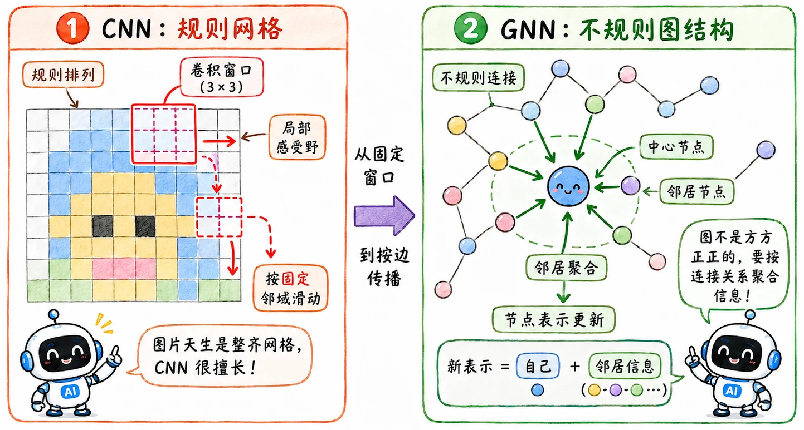
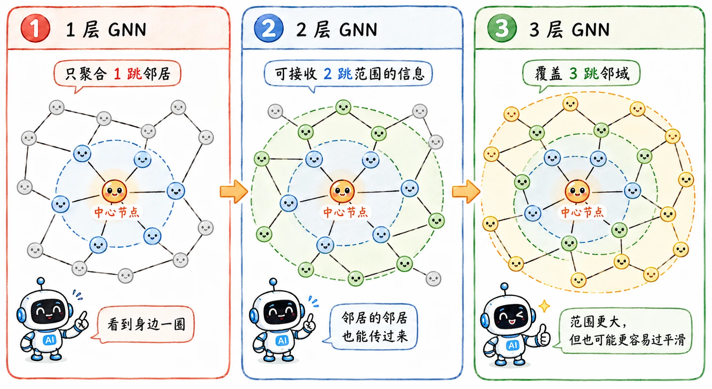

> CNN 虽然厉害，但并非万能，应用场景的前提是数据要能放在规则网格上。
>
> 但实际上绝大多数真实数据都有着极其复杂的拓扑图结构。
>
> 社交网络、化学分子...

## 为什么需要 GNN

传统神经网络经常默认**样本之间相对独立**。

图像分类里，一张图片就是一条样本。模型看这张图，然后判断它是什么。

但图结构数据不是这样。

比如**论文引用网络**里，一篇论文*本身的标题和摘要*很重要，但*它引用了谁、谁又引用了它*，同样重要。

如果一篇论文被很多 Transformer 相关论文引用，它很可能和注意力机制、序列建模有关。这个信息是图结构特有的。

所以我们需要一种新的结构，**让节点在图上从邻居处收集信息**（让我想到无线传感器的拓扑结构）。

这就是 GNN 的基本出发点。

## 消息传递

GNN 的核心机制是**节点间的信息传递（Message Passing）**，一个节点要认识自己，必须先认识它的邻居。

每一层 GNN 通常做两件事：聚合和更新。

### 聚合

**聚合（Aggregation）** 是收集邻居信息。

对于节点 $v$，它会查看所有直接相连的邻居节点，把它们的特征向量拿过来，然后合成一个信息包。

最简单的方式是**求和**：

$$
m_v = \sum_{u \in N(v)} h_u
$$

也可以**取平均**、**取最大值**，或者用**注意力机制**给不同邻居不同权重。

关键是：邻居数量不固定，但聚合之后要得到一个固定维度的向量。方便后面的神经网络处理。

### 更新

**更新（Update）** 是把邻居信息和自己原本的信息结合起来。

可以写成：

$$
h_v^{(k+1)} = \text{Update}(h_v^{(k)}, m_v^{(k)})
$$

其中 $h_v^{(k)}$ 是第 $k$ 层里节点 $v$ 的表示，$m_v^{(k)}$ 是这一层聚合来的邻居信息。

经过更新后，节点 $v$ 的表示就不再只包含自己原始特征，也包含了一圈邻居的信息。

### 感受野

1. 一层 GNN，节点知道了**直接邻居**的信息。
2. 两层 GNN，节点知道了**邻居的邻居**的信息。
3. 三层之后，信息继续**向外扩散**。

GNN 层数越深，一个节点能接触到的图结构范围越远。

## 空间域和频域

> 如何完美地聚合邻居信息？

为了回答这个问题，GNN 领域衍生出了两大派系。

这里简单介绍，以后也许会有[更详细的学习](toconnect)（点不开就是没有）。

### 空间域卷积

**Spatial-based** 方法直接，核心逻辑是直接在图的物理拓扑结构上进行特征的搬运与计算。

- **均值聚合（GraphSAGE）**

  GraphSAGE 结合了**采样**思想。随机抽取固定数量的邻居，将其特征取平均值或最大值。

  让 GNN 终于有能力处理包含数亿节点的**超大规模图数据**。

- **加权聚合（GAT - Graph Attention Network）**

  GAT 引入**自注意力机制（Self-Attention）**。

  节点在聚合前先计算与各个邻居的“匹配度”，赋予重要邻居更高的权重。

### 频域卷积

**Spectral-based** 方法更数学。

它绕开了空间结构的复杂性，借助信号处理中的**拉普拉斯矩阵（Laplacian Matrix）**，通过**傅里叶变换**将图上的信号映射到“频域”去进行卷积操作，然后再逆变换回空间域。

- **GCN (Graph Convolutional Network)**

  是 GNN 领域的**里程碑**。

  通过极其精妙的**一阶切比雪夫多项式展开**，将原本极其昂贵的**频域特征值分解过程**，化简成了极高效率的**矩阵乘法**。

  GCN 真正做到了**统一理论与工程实践**，成为了图网络领域的“ResNet”。

[完整推导](toconnect)比较长，说实话我现在也没太搞懂，以后再单独展开。

## GNN 能做什么

### 节点级任务

预测某个节点的类别。

比如在引用网络里，预测一篇论文属于哪个研究方向。即使只有少数论文带标签，GNN 也能通过图结构把标签信息传到相邻节点。

### 边级任务

预测两个节点之间是否应该有边，或者边的类型是什么。

比如推荐系统里，预测某个用户是否会点击某个商品。

### 图级任务

预测整张图的性质。

比如把一个化学分子表示成图，原子是节点，化学键是边。GNN 可以学习整个分子的表示，然后预测它是否有毒性、是否具有某种药理性质。

## 和 CNN 的关系

CNN 和 GNN 都在做结构先验：

- CNN：数据在规则网格上，局部 pattern 可以平移复用。
- GNN：数据在不规则图上，节点意义由邻居关系共同决定。

GNN 让深度学习从图片、文本、语音这类相对规整的数据，走向了更复杂的关系世界。
