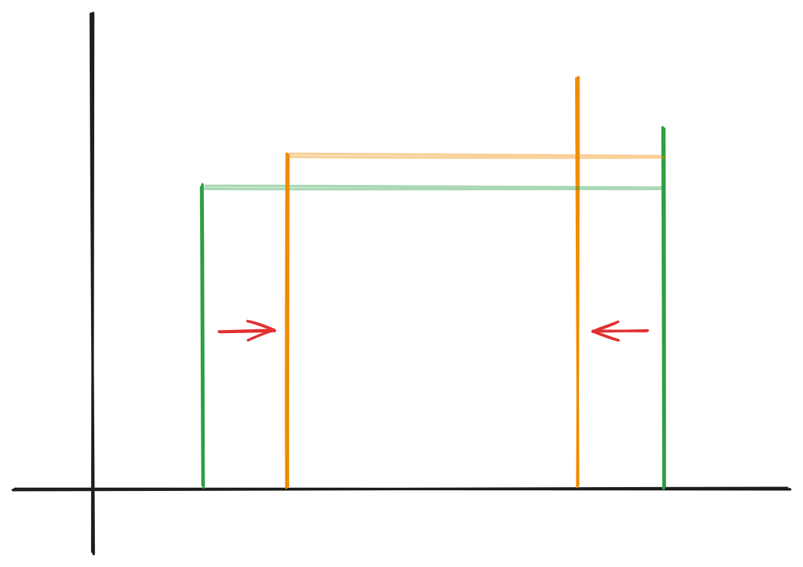
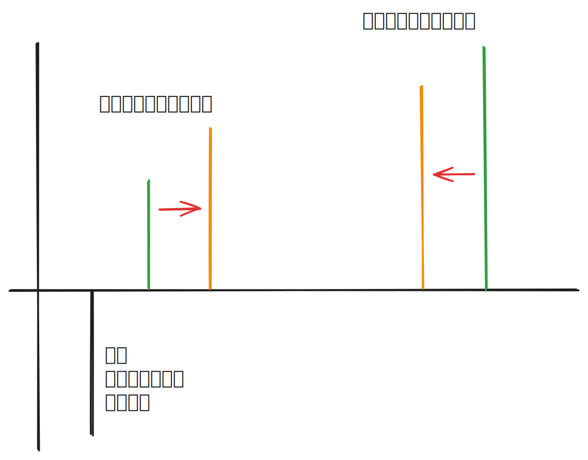
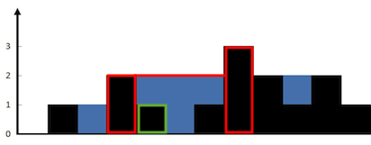

import TrappingWater from "../../components/blog/leetcode/TrappingWater.astro";

## 283. 移动零

https://leetcode.cn/problems/move-zeroes/description/

给定一个数组 `nums`，编写一个函数将所有 `0` 移动到数组的末尾，同时保持非零元素的相对顺序。

### 示例

> **输入：** nums = [0,1,0,3,12]
>
> **输出：** [1,3,12,0,0]

### 提示

- $1 \leq \text{nums.length} \leq 10^4$
- $-2^{31} \leq \text{nums}[i] \leq 2^{31} - 1$
- **必须在原数组上操作，不能拷贝额外的数组。**

### 快慢指针解法

挺简单的题，需要注意**迭代器**的使用，如果用 `:` 方法遍历，`fast` 是实数值，没有办法 `swap`。

#### 实现

```cpp
void moveZeroes(vector<int>& nums) {
    auto slow = nums.begin();
    for (auto fast = nums.begin(); fast != nums.end(); fast++){
        if (*fast){
            iter_swap(slow, fast);
            slow++;
        }
    }
    return;
}
```

## 11. 盛最多水的容器

https://leetcode.cn/problems/container-with-most-water/description/

给定一个长度为 `n` 的整数数组 `height`，有 `n` 条垂线，第 `i` 条线的坐标是 `(i, height[i])`。找出其中的两条线，使得它们与 `x` 轴共同构成一个容器，容器能够容纳最多的水。

### 示例

> **输入：** height = [1,8,6,2,5,4,8,3,7]
>
> **输出：** 49
>
> **解释：** 图中垂线代表输入数组，垂线之间蓝色部分的面积最大，面积为 49。

### 提示

- $n = \text{height.length}$
- $2 \leq n \leq 10^5$
- $0 \leq \text{height}[i] \leq 10^4$

### 大致思路

#### 暴力解法局限

一开始打算先写一个暴力的两层遍历解，结果跑不过，说明样例点已经不允许**暴力解法**了。

#### 双指针收缩策略

换个思路，可以想到**左右双边界同时收缩**，指针交汇时结束。这样只用一次遍历求解。

对吗？时间是省下来了，但为什么这样的处理可以保证没有遗漏？

不用想了，这个解法很明显没有对全部可能容器遍历，它的巧妙之处在于边界移动前的**判定条件**：

- 在移动前先比较两端高度，**长边不动，较短边向内移动**。

要想明白这个思路，就必须要理清题目的核心：**容器的容量由较短边决定**。如果长边向内收缩，哪怕下一条边更长，也一样受到短边限制；如果短边向内收缩，找到一个更高的边增加容量是有可能的。



换言之，这样的收缩策略保证了不会错过任何一个可能的最大容量，因为每次移动都是基于当前的 **限制条件（短边）** 进行的。

### 代码实现

```cpp
int maxArea(vector<int>& height) {
    int max_v = 0;
    int cur_v = 0;
    int left = 0;
    int right = height.size() - 1;
    while (left != right){
        cur_v = (right - left) * min(height[left], height[right]);
        max_v = max(max_v, cur_v);
        if (height[left] > height[right]) right--;
        else left++;
    }
    return max_v;
}
```

#### 优化点总结

当然，我的代码还有可优化的点：

- `cur_v` 变量其实没必要，可以直接在 `max` 函数里计算。
- `while (left < right)` 可以避免一些未知的边界情况，防止死循环。
- **重要：** 如果下一条边**小于等于当前边**可以直接跳过。

## 15. 三数之和

https://leetcode.cn/problems/3sum/description/

一个包含 `n` 个整数的数组 `nums`，判断 `nums` 中是否存在三个元素 `a`，`b`，`c`，使得 `a + b + c = 0`。找出所有满足条件的三元组。

### 示例

> **输入：** nums = [-1,0,1,2,-1,-4]
>
> **输出：** [[-1,-1,2],[-1,0,1]]
>
> **解释：** 结果中不可以包含重复的三元组。

### 提示

- $0 \leq \text{nums.length} \leq 3000$
- $-10^5 \leq \text{nums}[i] \leq 10^5$

### 大致思路

#### 降维打击：从三数到两数

这道题想上三层循环暴力解的话，时间复杂度已经是 $O(n^3)$ 了，显然不行。

很容易想到，这道题需要用 `for` 循环固定一个元素，循环内部设定双指针，把题目降级成**两数之和**。

#### 初始尝试：中间扩散

我的第一思路是先对数组进行**排序**，然后**固定中间元素，双指针向外扩散**，把时间复杂度降到 $O(n^2)$。

这样的遍历非常**粗糙**，遇到大量边界情况都需要单独处理，最后虽然通过，但写出来的代码很丑，逻辑也很复杂。

#### 进阶思路：固定边界

回头看这道题，我的问题在于没有利用好排序后的特性，这道题其实和上一题思路很像，都是要求写者发现最佳的**收缩策略**。

之前的策略是取中间数为固定元素，用上一题的视角来观察，相当于人为地把中间的**连续地带**劈开，导致两侧指针经常被牵扯到与中间元素的**大小比较**和**指针移动处理**上。

所以可以明确的思路是：**固定元素一定要在最左侧 / 最右侧**。这样的 `for` 循环内部其实就是在执行上一题的双指针，**目标值是 `-nums[i]`**。

现在问题就很简单了，找到一定不会遗漏的收缩策略：这个时候之前的排序就派上用场了，**如果和大于目标值，右指针向左移动；如果和小于目标值，左指针向右移动**，因为有排序存在，可以保证总和一定向目标值靠拢。



### 代码实现

```cpp
vector<vector<int>> threeSum(vector<int>& nums) {
    vector<vector<int>> ans;
    sort(nums.begin(), nums.end());
    int l = nums.size() - 1;
    for (int i = 0; i < l - 1; i++){
        // 剪枝：最小都大于零
        if (nums[i] > 0) break;
        // 去重
        // [-2, -2, 1, 1] [-1 -1 -1 2]
        if (i > 0 && nums[i] == nums[i - 1]) continue;
        int left = i + 1;
        int right = l;
        while (left < right){
            int sum = nums[i] + nums[left] + nums[right];
            if (sum == 0) {
                ans.push_back({nums[i], nums[left], nums[right]});
                // 去重
                while (left < right && nums[left] == nums[left + 1]){
                    left++;
                }
                while (left < right && nums[right] == nums[right - 1]){
                    right--;
                }
                // 同时向内收缩
                // [-4(固), -2, 0, 4, 6]
                left++;
                right--;
            }
            else if (sum < 0) {
                left++;
            }
            else {
                right--;
            }
        }

    }
    return ans;
}
```

## 42. 接雨水

https://leetcode.cn/problems/trapping-rain-water/description/

给定 `n` 个非负整数表示每个宽度为 `1` 的柱子的高度图，计算按此排列的柱子，下雨之后能接多少雨水。


### 示例

> **输入：** height = [0,1,0,2,1,0,1,3,2,1,2,1]
>
> **输出：** 6
>
> **解释：** 上面是由数组 [0,1,0,2,1,0,1,3,2,1,2,1] 表示的高度图，在这种情况下，可以接 6 个单位的雨水（蓝色部分表示雨水）。

### 提示

- $n = \text{height.length}$
- $0 \leq n \leq 3 \times 10^4$
- $0 \leq \text{height}[i] \leq 10^5$

### 大致思路

#### 思维误区

一开始进入了思维误区，把蓝色区域想成一块一块的整体，想从左往右扫描出每一个蓝区，加和求解。结果发现根本行不通：

- 这个思路的**边界条件**非常多，例如何时能确定蓝区的边界。
- 要保存的**临时状态**也很多，确定的区域每个 slot 的高度不一致，不像之前的题可以简单乘算。
- 没有明确的遍历包裹，写出来的散装遍历会相互冲突。

#### 核心思想

马上明确思路，需要**针对每一列单独计算**后加和。这下子题目就亲切很多了：需计算列就是 `for` 循环元素，现在的问题是如何计算每列的雨水量。

到这一步其实就把题目拆分的很清楚了，多观察两眼例图不难发现，雨水量就是**左右区域分别的最高点取较小者**，与当前列高度作差。



这个方案的代码我就不放出来了，因为没过...

#### 性能优化

我对左右最高点的处理太粗暴了，直接每次都遍历寻找，时间复杂度到了 $O(n^2)$ ，然后挂了两个点。

优化的方案也很好想，就是在遍历的过程中**维护左右最高点**的状态：

- 左边的维护很简单，每次当前列右移后，左区新增列（上次的当前列）和前左区最高点比较。
- 右边就麻烦了，当前列右移后判断右区移除列（上次的当前列）是否是右区最高点，如果是，重新遍历右区就无法避免了。

这个解法是我个人能想到的最终解，接下来是学习到的更优雅解法：

### 双指针解法

#### 核心逻辑

这个解法的核心在于不再显式的使用中间元素，而是由双指针分别代表数组两端（`left` 和 `right`）向中间汇合，在汇合的过程中动态更新：

- 维护 `left_max`：`left` 指针左侧走过的最大高度。
- 维护 `right_max`：`right` 指针右侧走过的最大高度。

#### 关键推理

1. 如果 `left_max < right_max`：即 `left` 指针的左侧最大值已经确定是 `left_max`。而且是两侧最高点中的 **“短板”** 。
   - 因此 `left` 位置的水量可以直接计算：`left_max - height[left]`。
   - 计算后，`left` 向右移动。
2. 反之，如果 `left_max >= right_max`：说明 `right` 位置的 **“短板”** 必定是 `right_max`，计算 `right` 位置的水量并向左移动。

这个策略让 `left` 和 `right` 动态调整谁当遍历的中心 i。能确定自己的 **“短板”** 的，就计算并走下一步，直到相遇。

#### 代码实现

```cpp
int trap(vector<int>& height) {
    int left = 0, right = height.size() - 1;
    int left_max = 0, right_max = 0;
    int sum = 0;
    while (left < right) {
        left_max = max(left_max, height[left]);
        right_max = max(right_max, height[right]);
        if (left_max < right_max) {
            sum += (left_max - height[left]);
            left++;
        } else {
            sum += (right_max - height[right]);
            right--;
        }
    }
    return sum;
}
```

#### 可视化

以下是这个解法的可视化演示组件：

<TrappingWater />
