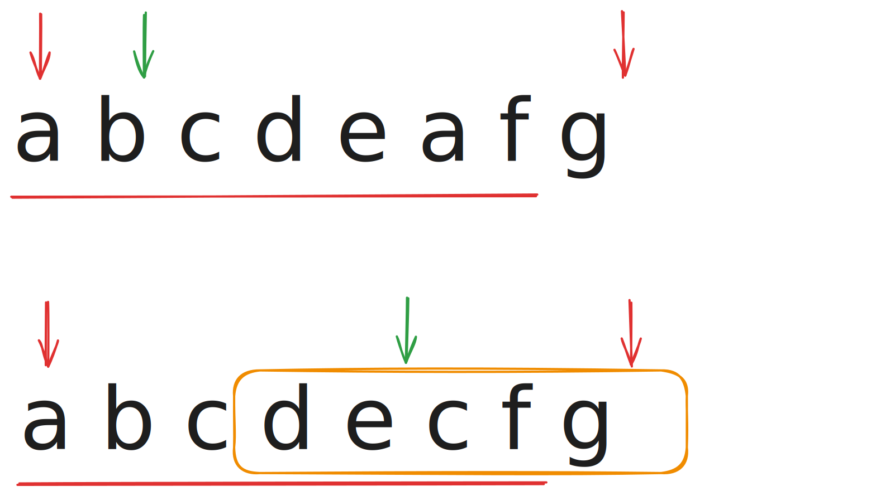
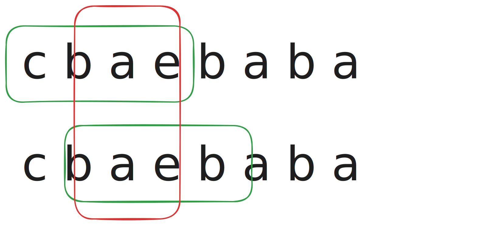

import SlidingWindow from "../../components/blog/leetcode/SlidingWindow.astro";

## 3. 无重复字符的最长子串

https://leetcode.cn/problems/longest-substring-without-repeating-characters/description/

给定一个字符串 `s` ，请找出其中不含有重复字符的最长子串的长度。

### 示例

> **输入:** s = "abcabcbb"
>
> **输出:** 3
>
> **解释:** 因为无重复字符的最长子串是 "abc"，所以其长度为 3。

### 提示

- $0 \leq \text{s.length} \leq 5 \times 10^4$
- $s$ 由英文字母、数字、符号和空格组成

### 大致思路

指向的思路还是很明显的，两个需要解决的问题：

1. 如何判断当前循环是否重复，当然是查表，那么表应该存储什么样的数据。
2. 尾指针如何移动，在优化路径的同时不用重建表。

用数据结构的思路想到此处应该维护一个 path 表（数组即可），记录每个字符最后一次出现的位置（**1**）。

如何遍历？不难想到需要维护两个指针 `left` 和 `right`。`right` 负责不断向前递进，`left` 则指向当前不重复子串的起始位置。

每次递进时，查表判断是否重复：如果重复就把尾指针移动到上次出现位置的下一位（**2**），然后更新该字符位置和判断最大长度。

### 代码实现

```cpp
int lengthOfLongestSubstring(string s) {
    vector<int> path(128, -1);
    int left = 0;
    int max_len = 0;
    for (int right = 0; right < s.size(); right++){
        int cur = s[right];
        // 出现重复
        if (path[cur] >= left){
            left = path[cur] + 1;
        }
        path[cur] = right;
        max_len = max(max_len, right - left + 1);
    }
    return max_len;
}
```

### 补充

这个解法就是滑动窗口的基本思路了，可以规避大量边界条件的处理，颇有一力破万法之感。

两个指针分工明确。右指针负责递进，探索最大长度；左指针则处理重复问题，收缩窗口。

为什么 `left = path[cur] + 1` 可以保证不重复？



这里是两种情况：

1. 如果 `left` 就是那个重复元素，直接移到下一位（跳过它）即可。换言之，也可以想象成我们把子串 **a b c d e** 更换成了 **b c d e a**。
2. 如果 `left` 在重复元素的前面，可以看到图中的 **c d e c** 即组成一个**重复窗口**。包含这个子窗口的任意父窗口一定不满足条件，所以我们把 **c d e** 调换成 **d e c** 后再继续。

## 438. 找到字符串中所有字母异位词

https://leetcode.cn/problems/find-all-anagrams-in-a-string/description/

给定两个字符串 `s` 和 `p`，找到 `s` 中所有 `p` 的 **异位词** 的子串，返回这些子串的起始索引。不考虑答案输出的顺序。

### 示例

> **输入:** s = "cbaebabacd", p = "abc"
>
> **输出:** [0,6]
>
> **解释:**
>
> 起始索引等于 0 的子串是 "cba", 它是 "abc" 的异位词。
> 起始索引等于 6 的子串是 "bac", 它是 "abc" 的异位词。

### 提示

- $1 \leq \text{s.length},\ \text{p.length} \leq 3 \times 10^4$
- $s$ 和 $p$ 仅包含小写字母

### 暴力解法 - 固定窗口

最简单的遍历法：找定 `p` 的长度 `len`，然后遍历 `s` 中所有长度为 `len` 的子串，判断是否是 `p` 的异位词。

```cpp
vector<int> findAnagrams(string s, string p) {
    vector<int> ans;
    int len_s = s.size(), len_p = p.size();
    if (len_s < len_p) return ans; // 边界
    vector<int> p_cnt(26, 0);
    for (char c : p) {
        p_cnt[c - 'a']++;
    }
    // a b a b 面对 a b 可以遍历到 2
    for (int i = 0; i <= len_s - len_p; i++) {
        vector<int> cur_cnt = p_cnt;
        bool done = true;
        for (int j = i; j < i + len_p; j++) {
            int idx = s[j] - 'a';
            // 出错，跳过
            if (cur_cnt[idx] <= 0) {
                done = false;
                break;
            }
            cur_cnt[idx]--;
        }
        if (done) ans.push_back(i);
    }
    return ans;
}
```

你别说，糙是糙了点，但真能过。就是**时间复杂度**和**空间复杂度**皆失。

### 滑动窗口

刚刚的解法问题很明显：我们遍历了全部可能性，没有对**可跳过情况**作优化，如图。



可以发现，`i = 0` 和 `i = 1` 的窗口中，有相当大的重合部分（**b a**），窗口在滑动时，实际上只发生了两件事。

1. 字符 `c` 被移出了窗口。
2. 字符 `a` 被移入了窗口。

中间的 `b` 和 `a` 根本没动！

所以，我们并不需要每次都重置 `cur_cnt` 并重新计数。只需要维护一个**当前窗口的字符频次表**。每次滑动窗口时，移出窗口的字符频次减一，移入窗口的字符频次加一，最后作判断即可。

```cpp
vector<int> findAnagrams(string s, string p) {
    vector<int> ans;
    int len_s = s.size(), len_p = p.size();
    if (len_s < len_p) return ans; // 边界
    vector<int> p_cnt(26, 0);
    vector<int> cur_cnt(26, 0); // 初始窗口
    for (int i = 0; i < len_p; i++) {
        p_cnt[p[i] - 'a']++;
        cur_cnt[s[i] - 'a']++;
    }
    if (p_cnt == cur_cnt) ans.push_back(0);
    // 正式滑动，i 代表被移出字符索引
    // a b a b 面对 a b 时只需考虑到 b(1)
    for (int i = 0; i < len_s - len_p; i++) {
        cur_cnt[s[i] - 'a']--;
        cur_cnt[s[i + len_p] - 'a']++;
        if (p_cnt == cur_cnt) ans.push_back(i + 1);
    }
    return ans;
}
```

这个思路是由暴力解法平滑优化而来，利用了 c++ 中的 `vector` 可以直接比较的特性。

但两个数组略显冗余，既然我们将窗口的滑动已经看成字符的 **“一进一出”** 了，那就完全可以只维护一张**当前字符频次表**。

### 题解 - 不定长滑动窗口

```cpp
vector<int> findAnagrams(string s, string p) {
    vector<int> ans;
    int len_s = s.size(), len_p = p.size();
    int cnt[26]{0};
    for (char c : p) {
        cnt[c - 'a']++;
    }
    int left = 0;
    for (int right = 0; right < len_s; right++) {
        int idx = s[right] - 'a';
        cnt[idx]--; // 右边界加一
        while (cnt[idx] < 0) { // 同字符超量
            cnt[s[left] - 'a']++;
            left++; // 左边界不断右移
        }
        if (right - left + 1 == len_p) {
            ans.push_back(left);
        }
    }
    return ans;
}
```

这就是“正统”滑动窗口了：窗口大小不定。

最巧妙的地方就在于 `while (cnt[idx] < 0)` 这个条件。它利用一个很简单的条件实现了左边界的**快速收敛**，完全规避了**数组比较**。

一旦没有字符超量了，就进入右边界**扩张阶段**，不断试探解。**无字符超量**和**窗口等长**两个条件结合起来，刚好代表着得解。

想吃透这个题解思路，需要拆解逻辑：

#### 核心定律：窗口内任何字符绝对不超标

cnt 数组的初始值即代表 `p` 中各字符数量（配额），当窗口滑动时：

- `cnt[c]--`：窗口吃进一个字符，消耗一个配额。
- `while (cnt[c] < 0)`：某个字符的配额已被透支。
- 只要发生透支，`left` 就一直向右边界逼近，直到把透支字符“吐出来”，配额恢复到 $0$。

这就保证了强大的前提：`for` 循环单次内部走到尾时，一定可以保证**窗口内任何字符都不超标**。

#### 为什么左指针不会“跳过”正确答案？

假设真的有一个完全正确的异位词子串存在于区间 `[L, R]`（长度恰好等于 `p.size()`，且字符种类数量完全一致）。

代码有没有可能在 `right` 即将到达 `R` 的时候，`left` 提前越过 `L`（错过真正的起点）？

**答案是：绝对不可能。**

因为 `left` 的向右移动很消极。它只有一种情况往右走：当前窗口内包含“超标”字符。

既然 `[L, R]` 是 `p` 的完美异位词，那其任意子集也一定不会触发消极移动。

换而言之，只要 `right` 进入并开始遍历 `[L, R]` ，`[L, right]` 这个区间就不可能触发 `cnt[c] < 0` 这个条件。

如果触发，则一定是 `[left, L]` 中有超量字符，在经历多次 `while` 循环后，`left` 一定会停靠在 `L` 上。

#### 为什么长度相等就是异位词？（鸽巢原理）

这是这个算法得以省略 $O(26)$ 数组比较的妙手：

根据 `left` 的收缩机制，算法保证了：窗口字符一定小于等于 `p`。

此时再判断 `right - left + 1 == p.size()`，即：窗口总长等于 `p` 总长。

试想一下，如果我有 $N$ 个萝卜坑，每个颜色的萝卜数量都 $\le$ 目标要求，且最终我手里的萝卜总数恰好等于 $N$。那唯一的数学可能性就是：每种颜色的萝卜数量都恰好等于目标要求。

因此不再需要遍历 `cnt`，只要不透支且长度达标，它就必定是完美的异位词。

为了更直观地感受 `left` 指针是如何“保守”地处理配额透支的，可以操作下面这个交互组件，一步步观察它是如何精确锁定有效区间的：

<SlidingWindow />
