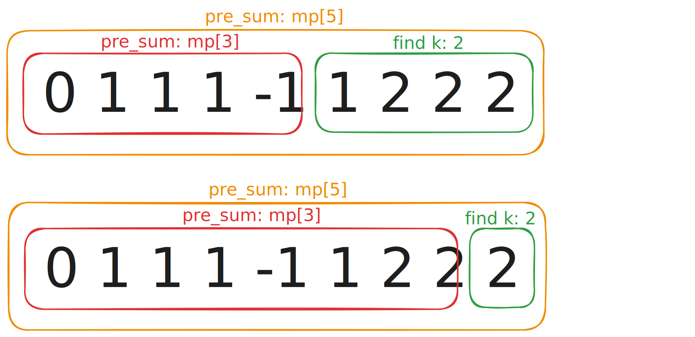
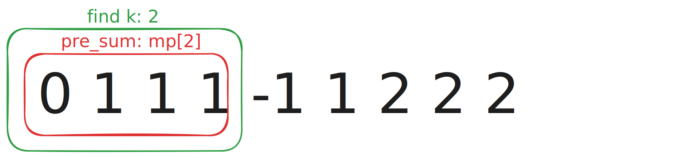
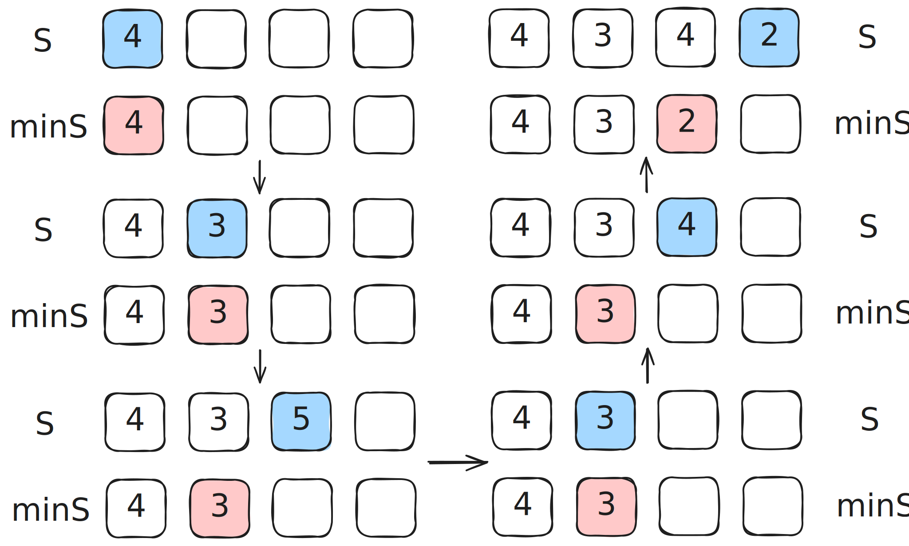
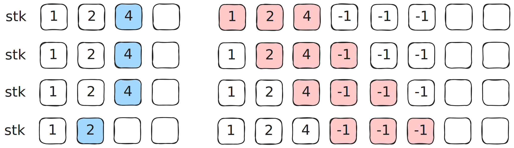

## 560. 和为 K 的子数组

https://leetcode.cn/problems/subarray-sum-equals-k/description/

提供一个整数数组 `nums` 和一个整数 `k` ，请统计并返回该数组中和为 `k` 的**子数组** 的个数。

**子数组** 是数组中的一个连续部分。

### 示例

> **输入：** nums = [1,1,1], k = 2
>
> **输出：** 2

### 提示

- $1 \leq \text{nums.length} \leq 2 \times 10^4$
- $-1000 \leq \text{nums}[i] \leq 1000$
- $-10^7 \leq k \leq 10^7$

### 错误思路

一开始还是**移动窗口**的思路：维护左右双指针，当窗口和小于 k 时右指针右移；窗口和大于 k 时左指针右移；窗口和等于 k 时计数器加一，并右移右指针。

```cpp
int subarraySum(vector<int>& nums, int k) {
    int left = 0;
    int sum = nums[left];
    int cnt = (sum == k) ? 1 : 0;
    for (int right = 1; right < nums.size(); right++) {
        sum += nums[right];
        while (sum > k) {
            sum -= nums[left];
            left++;
        }
        if (sum == k) {
            cnt++;
        }
    }
    return cnt;
}
```

其实样例点都可以通过，说明这个思路解决一般情况还是比较优秀的，可惜题目明确说明**数组中可能包含负数**，所以没有办法简单地用窗口和来判断下一步处理逻辑。

所以要改进的地方就是判断逻辑了，有没有一种方法能记录下任意位置窗口（子串）的数值和呢？这样可以将题目从复杂的遍历转化成简单的**查表**。

### 前缀和 + 哈希表

当然有，可以使用哈希表 `unordered_map<int, int>` 来存储每个位置的前缀和（从数组开头到当前位置的数值和），具体映射关系是：**前缀和 —— 该前缀和出现次数**。

假设有满足条件的子串 `[i, j]`，数值之和 $k=2$：

1. 在 `for` 循环中遍历到位置 `i` 时，首先计算出当前位置前缀和 $3$。
2. 在遍历到位置 `j` 时，计算出当前位置前缀和 $5$（`pre_sum`）。
3. 查找 `mp.count(pre_sum - k)`，存在则发现 `[i, j]` 解。



如何确定有多少个 $3$ 子串呢？这就是哈希表的作用了，在 `for` 循环中遍历到位置 `i` 时，结束循环前将前缀和 $3$ 子串频次加一 `mp[pre_sum]++`。

在遍历到位置 `j` 时，如果 `mp.count(pre_sum - k)` 存在，执行 `cnt += mp[pre_sum - k]`。

```cpp
int subarraySum(vector<int>& nums, int k) {
    unordered_map<int, int> mp;
    mp[0] = 1;
    int cnt = 0;
    int pre_sum = 0;
    for (int i = 0; i < nums.size(); i++) {
        pre_sum += nums[i];
        // | (pre_sum - k) | k |
        if (mp.count(pre_sum - k)) {
            // 有多少配对串，就有多少 k 串
            cnt += mp[pre_sum - k];
        }
        mp[pre_sum]++;
    }
    return cnt;
}
```

还有一点值得学习，在初始化时先写 `mp[0] = 1`，这是为了处理前缀和直接等于 `k` 的情况。



当然，也可以选择在 `for` 循环中先执行 `mp[pre_sum]++`，再计算前缀和以及查 `count`，相当于每次循环都处理了当前位置之前的前缀和，这样就无需在初始化时写 `mp[0] = 1` 了。

## 239. 滑动窗口最大值

https://leetcode.cn/problems/sliding-window-maximum/description/

给你一个整数数组 `nums`，有一个大小为 `k` 的滑动窗口从数组的最左侧移动到数组的最右侧。你只可以看到在滑动窗口内的 `k` 个数字。滑动窗口每次只向右移动一位。

返回滑动窗口中的最大值。

### 示例

> **输入：** nums = [1,3,-1,-3,5,3,6,7], k = 3
>
> **输出：** [3,3,5,5,6,7]
>
> **解释：**
> | 滑动窗口的位置 | 最大值 |
> | --- | --- |
> | [1 3 -1] -3 5 3 6 7 | 3 |
> | 1 [3 -1 -3] 5 3 6 7 | 3 |
> | 1 3 [-1 -3 5] 3 6 7 | 5 |
> | 1 3 -1 [-3 5 3] 6 7 | 5 |
> | 1 3 -1 -3 [5 3 6] 7 | 6 |
> | 1 3 -1 -3 5 [3 6 7] | 7 |

### 提示

- $1 \leq \text{nums.length} \leq 10^5$
- $-10^4 \leq \text{nums}[i] \leq 10^4$
- $1 \leq k \leq \text{nums.length}$

### 大致思路

先用最直接的思路写了一版代码：两个指针一左一右维护窗口范围，如果 `max` 离开窗口则重新遍历寻找，剩两个样例点遗憾拿到超时。

```cpp
vector<int> maxSlidingWindow(vector<int>& nums, int k) {
    if (k == 1) return nums;
    vector<int> ans;
    int maxV = nums[0];
    for (int i = 0; i < k; i++) {
        if (nums[i] > maxV) maxV = nums[i];
    }
    ans.push_back(maxV);
    int left = 0, right = k;
    while (right < nums.size()) {
        if (nums[left] == maxV) {
            maxV = nums[left + 1];
            for (int i = left + 1; i <= right; i++) {
                if (nums[i] > maxV) maxV = nums[i];
            }
        }
        else {
            if (nums[right] > maxV) maxV = nums[right];
        }
        ans.push_back(maxV);
        left++, right++;
    }
    return ans;
}
```

这个解法的问题在于每次丢失最大值都需要重新遍历窗口，在最坏情况下时间复杂度为 $O(nk)$。

为此我们引入**最小栈**的思想。

## 155. 最小栈

https://leetcode.cn/problems/min-stack/description/

设计一个支持 `push`，`pop`，`top` 操作，并能在常数时间内检索到最小元素的栈。

实现 `MinStack` 类：

- `MinStack()` 初始化堆栈对象。
- `void push(int val)` 将元素 val 推入堆栈。
- `void pop()` 删除堆栈顶部的元素。
- `int top()` 获取堆栈顶部的元素。
- `int getMin()` 获取堆栈中的最小元素。

这题有两个实现方式，一个是用两个栈分别维护元素和最小值；一个是用 `pair<int, int>` 维护元素和当前最小值。

### 双栈实现

独立出一个辅助栈 `minS` 来维护当前最小值，主栈 `S` 维护元素。在元素进行 `push` 和 `pop` 操作时均需要与当前最小值（`minS.top()`）比对。



```cpp
class MinStack {
private:
    stack<int> S;
    stack<int> minS;
public:
    MinStack() {

    }
    void push(int val) {
        S.push(val);
        if (minS.empty() || minS.top() >= val) minS.push(val);
    }
    void pop() {
        if (S.top() == minS.top()) minS.pop();
        S.pop();
    }
    int top() {
        return S.top();
    }
    int getMin() {
        return minS.top();
    }
};
```

### pair 实现

也可以选择直接在主栈 `S` 中维护一个 `pair<int, int>`，其中 `first` 代表元素值，`second` 代表当前最小值。

```cpp
class MinStack {
private:
    stack<pair<int, int>> stk;
public:
    MinStack() {
        stk.emplace(0, INT_MAX);
    }
    void push(int val) {
        stk.emplace(val, min(getMin(), val));
    }
    void pop() {
        stk.pop();
    }
    int top() {
        return stk.top().first;
    }
    int getMin() {
        return stk.top().second;
    }
};
```

思路大同小异，不过这个题解有两点可以学习：

1. 在 C++17 后，用 `emplace` 代替 `push`，可以直接在栈顶构造元素，避免了不必要的复制。
2. 在初始化时先 `emplace` 一个 `(0, INT_MAX)` 作栈底哨兵，避免了多余的 `empty` 判断。

## 239. 滑动窗口最大值（续）

现在大概知道怎么去维护一个存储**最大值**的数据结构了，但像**最小栈**里那样的“简易版”不能直接拿来用。



这是因为滑动窗口有元素在持续退出，而形似**最小栈**的结构只能弹出栈顶元素，无法直接删除任意位置的元素。而且换个角度，就算可以实现任意位置的删除，那每次在有元素退出时都要进行一次遍历与删除，时间复杂度也根本没有得到优化。

思路就很明确了：一定要维护一个**单调队列**，且需要可以对队列的两头均进行操作。

当当当，这就是我们伟大的**双端队列**（`deque`）了！

```cpp
vector<int> maxSlidingWindow(vector<int>& nums, int k) {
    vector<int> ans;
    deque<int> dq; // 存储元素下标，所指元素从大到小

    for (int i = 0; i < nums.size(); i++) {
        // 维护左边界
        if (!dq.empty() && dq.front() < i - k + 1) {
            dq.pop_front();
        }
        // [Important]
        // 新元素即比队尾元素长寿，又比队尾元素大
        while (!dq.empty() && nums[dq.back()] <= nums[i]) {
            dq.pop_back();
        }
        dq.push_back(i);
        // 记录最大值
        if (i >= k - 1) {
            ans.push_back(nums[dq.front()]);
        }
    }
    return ans;
}
```

## 209. 长度最小的子数组

https://leetcode.cn/problems/minimum-size-subarray-sum/description/

给定一个含有 `n` 个正整数的数组和一个正整数 `target` ，找出该数组中满足其和**大于或等于** `target` 的长度最小的 **连续子数组** 。如果不存在符合条件的连续子数组，返回 0。

### 示例

> **输入：** target = 7, nums = [2,3,1,2,4,3]
>
> **输出：** 2
>
> **解释：** 子数组 [4,3] 是该条件下的长度最小的子数组。

### 提示

- $1 \leq \text{target} \leq 10^9$
- $1 \leq \text{nums.length} \leq 10^5$
- $1 \leq \text{nums}[i] \leq 10^4$

### 思路

把这道题的滑动窗口想象成一个**存钱罐**，在总数额不足目标时，只管往里存钱就好；一旦总数额超过目标，开始取钱出来，直到总数额再次不足目标。

用动态的方式维护窗口的左右边界，保证 `sum` 总是在 `target` 上下浮动，同时规避了不必要的遍历。

```cpp
int minSubArrayLen(int target, vector<int>& nums) {
    int length = INT_MAX;
    int sum = 0, n = nums.size();
    int left = 0, right = 0;
    for (right; right < n; right++) {
        sum += nums[right];
        while (sum >= target) {
            length = min((right - left + 1), length);
            sum -= nums[left];
            left++;
        }
    }
    return length > n ? 0 : length;
}
```

## 76. 最小覆盖子串

https://leetcode.cn/problems/minimum-window-substring/description/

给定一个字符串 `s` 、一个字符串 `t` 。返回 `s` 中涵盖 `t` 所有字符的最小子串。如果 `s` 中不存在涵盖 `t` 所有字符的子串，则返回空字符串 `""` 。如果 `s` 中存在这样的子串，我们保证它是唯一的答案。

### 示例

> **输入：** s = "ADOBECODEBANC", t = "ABC"
>
> **输出：** "BANC"
>
> **解释：** 最小覆盖子串 "BANC" 包含 "A"、"B" 和 "C"。

### 提示

- $1 \leq s.length, t.length \leq 10^5$
- `s` 和 `t` 由英文字母组成

### 思路

这道题就是我把 209 放进来的原因，两题的思路非常相似，题目的要求都是找到**涵盖**要求的**最小子串**，所以都可以使用先扩张后收缩的滑动窗口策略。

```cpp
string minWindow(string s, string t) {
    unordered_map<char, int> need;
    for (const auto& c : t) {
        need[c]++;
    }

    int left = 0, right = 0;
    int valid = 0;

    int start = 0, minLen = INT_MAX;

    while (right < s.size()) {
        // 待入窗字符
        char c = s[right];
        right++;

        if (need.count(c)) {
            need[c]--;
            if (need[c] == 0) {
                valid++;
            }
        }

        // 收紧左边界
        while (valid == need.size()) {
            if (right - left < minLen) {
                start = left;
                minLen = right - left;
            }

            char d = s[left];
            left++;

            if (need.count(d)) {
                need[d]++;
                if (need[d] == 1) {
                    valid--;
                }
            }
        }
    }
    return minLen == INT_MAX ? "" : s.substr(start, minLen);
}
```
