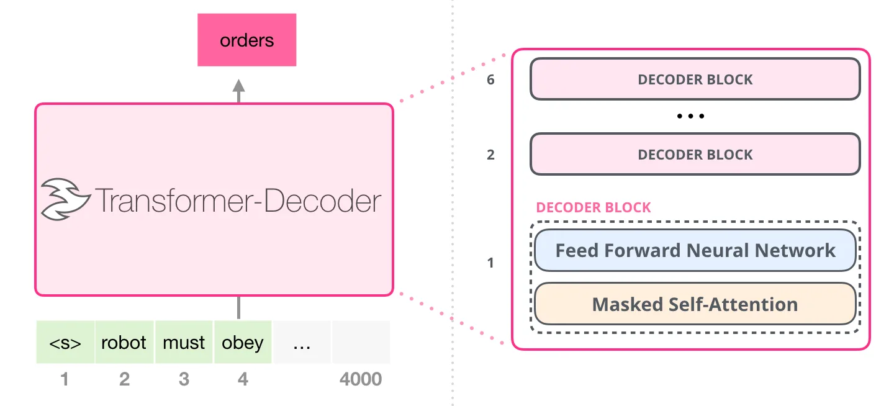
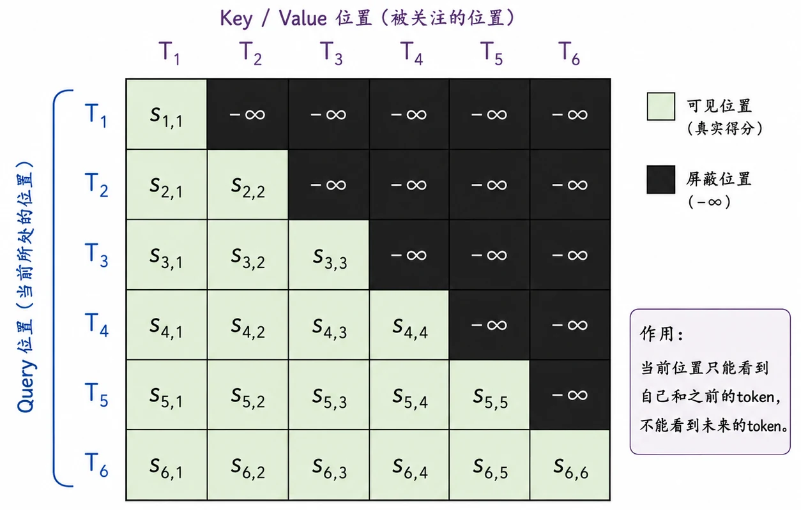

> Transformer 原本是为机器翻译任务设计的 Encoder-Decoder 架构。但当研究视线从“序列到序列的转换”转移到“无监督的语言生成”时，GPT 及其后续的 GPT-2 证明了一件事：仅保留 Decoder，结合足够多的数据和庞大的参数量，简单的“预测下一个词”任务足以让模型涌现出惊人的泛化能力。

这篇文章主要探讨 GPT-2 的核心机制：如何通过 Decoder-only 架构实现大规模自回归预训练。

## Decoder-Only 架构

机器翻译需要结合完整的源语言上下文（Encoder）来生成目标语言（Decoder）。但在纯粹的语言建模任务中，目标是**基于已有上文生成下文**。

将 Encoder 移除后，GPT-2 的核心结构变成了多层 Decoder block 的堆叠。语言建模的本质是一个自回归过程，其**联合概率分布**可以表示为条件概率的乘积：

$$
P(X) = \prod_{i=1}^n P(x_i | x_1, x_2, ..., x_{i-1})
$$

- $X$：完整的文本序列。
- $n$：序列的总长度。
- $x_i$：序列中的第 $i$ 个 token。
- $x_1, ..., x_{i-1}$：生成 $x_i$ 时模型可见的历史上下文。

为了在单次前向传播中并行处理并满足这种严格的时序依赖，模型必须引入特定的掩码机制。

## Causal Mask 机制

在标准的 Self-Attention 中，序列中的每个 token 都可以看到所有其他 token（包含**未来信息**）。但在自回归生成中，第 $i$ 个 token 的表示只能依赖于位置 $\le i$ 的输入。GPT-2 通过 Causal Mask（因果掩码）来实现**信息隔离**。

带掩码的注意力机制公式如下：

$$
\text{Attention}(Q, K, V) = \text{softmax}\left(\frac{QK^T + M}{\sqrt{d_k}}\right)V
$$

这里重点拆解掩码矩阵 $M$ 的构造：

- $Q, K, V \in \mathbb{R}^{L \times d_k}$：分别为查询、键、值矩阵（$L$ 为序列长度，$d_k$ 为特征维度）。
- $QK^T \in \mathbb{R}^{L \times L}$：未经过滤的注意力打分矩阵。
- $M \in \mathbb{R}^{L \times L}$：下三角掩码矩阵。

矩阵 $M$ 中的元素 $M_{ij}$ 的取值规则为：

$$
M_{ij} = \begin{cases} 0, & \text{if } i \ge j \text{ (当前及历史位置)} \\ -\infty, & \text{if } i < j \text{ (未来位置)} \end{cases}
$$

在输入 `softmax` 函数之前，加上这个掩码矩阵 $M$，会导致所有 $i < j$（即试图看向未来的连接）的注意力得分为 $-\infty$。经过 `softmax` 指数归一化后，这些位置的权重将趋近于 0。这从数学层面绝对切断了未来信息的泄漏。

## 自回归预训练目标

GPT-2 的训练没有复杂的监督标签，其唯一的预训练任务就是基于极大似然估计（Maximum Likelihood Estimation, MLE）的 Next-token prediction。

模型优化的目标函数（损失函数）为**最小化负对数似然**：

$$
\mathcal{L}(\Theta) = - \sum_{i=1}^{n} \log P(x_i | x_{<i}; \Theta)
$$

- $\Theta$：模型的所有可学习参数。
- $x_{<i}$：表示上下文序列 $(x_1, ..., x_{i-1})$。
- $P(x_i | x_{<i}; \Theta)$：模型在给定参数 $\Theta$ 和上下文的情况下，预测出真实目标 token $x_i$ 的概率。

这个目标看似简单，但当数据量足够大时，为了准确预测下一个词，模型被迫在其内部权重 $\Theta$ 中压缩**大量的语法规则、事实知识甚至逻辑推理模式**。

## 规模效应（Scale Effect）

相比 GPT-1，GPT-2 在架构上仅做了微调（如将 LayerNorm 移到输入层，增加残差层的初始化缩放等），其真正的质变来源于规模的扩张：

1. **参数规模**：从 1.17 亿扩大到了 15 亿（1.5B）。
2. **数据规模**：使用了 WebText 数据集（约 40GB 的高质量网页文本）。

参数和数据的双重扩大，使得模型的容量突破了单纯记忆文本片段的范畴，开始展现出**泛化能力**。这也是深度学习中首次明确展示“暴力美学”——即 **Scale 能够直接兑现为模型能力的提升**。

## Zero-Shot 与多任务学习的涌现

GPT-2 论文的标题是 _Language Models are Unsupervised Multitask Learners_。在 GPT-2 之前，解决不同任务（如翻译、摘要、问答）通常需要针对具体任务进行模型微调（Fine-tuning）。

常规的监督学习可以表示为估计 $P(\text{output} | \text{input})$。而多任务学习本质上是在估计 $P(\text{output} | \text{input}, \text{task})$。

GPT-2 证明了，当语言模型足够庞大时，**自然语言本身就可以作为任务的指令（Task specification）**。不需要在结构上引入 Task 变量，只需在输入序列中以 Prompt 的形式构造上下文：

- **翻译任务**：输入 `Translate English to French: [English Text] =>`，模型会输出法文。
- **问答任务**：输入 `Question: [Q] Answer:`，模型会输出答案。

这就是 Zero-Shot（零样本）能力的体现。由于训练数据包含了互联网上形式各异的语料，模型在预训练阶段其实已经被动见过了这种“任务描述+下文”的分布。GPT-2 证明了无需修改目标函数，只要预测下一个词，语言模型就能成为一个无监督的多任务学习器。

## 参考资料

- Jay Alammar 的 [The Illustrated GPT-2](https://jalammar.github.io/illustrated-gpt2/)
- OpenAI 的 GPT-2 论文：[Language Models are Unsupervised Multitask Learners](https://cdn.openai.com/better-language-models/language_models_are_unsupervised_multitask_learners.pdf)
