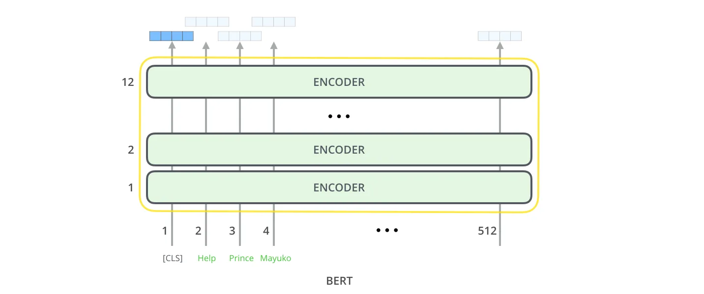
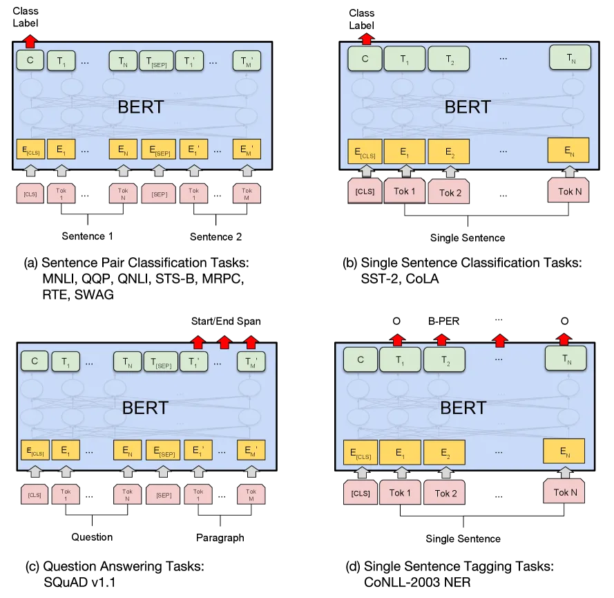

> 与 GPT 专注于自回归生成不同，BERT 的设计初衷是为了彻底解决语言理解（Language Understanding）任务。理解文本需要构建全局的语义上下文，这意味着模型不能像 Decoder 那样为了防止信息泄漏而切断未来的视线。

这篇文章主要探讨 BERT 的核心机制：如何通过 Encoder-only 架构与双向预训练任务服务于语言理解。

## Encoder-Only 架构

在标准的 Transformer 中，Encoder 的作用是充分吸纳输入序列的全局信息，并将其转化为上下文关联的特征向量。BERT 完全抛弃了 Decoder，仅堆叠 Encoder 块（例如 BERT-Base 堆叠了 12 层，BERT-Large 堆叠了 24 层）。

由于不需要负责自回归生成，BERT 内部的自注意力机制是完全自由、无掩码的。

## 双向上下文机制

BERT 的核心优势在于其真正的**双向（Bidirectional）特征提取**。在计算某个 Token 的表示时，它能同时看到该 Token 左侧和右侧的所有上下文。

其标准的自注意力计算公式为：

$$
\text{Attention}(Q, K, V) = \text{softmax}\left(\frac{QK^T}{\sqrt{d_k}}\right)V
$$

这里拆解公式中的各个要素并与 GPT-2 进行对比：

- $Q \in \mathbb{R}^{L \times d_k}$：查询矩阵（Query）。
- $K \in \mathbb{R}^{L \times d_k}$：键矩阵（Key）。
- $V \in \mathbb{R}^{L \times d_v}$：值矩阵（Value）。
- $L$：输入序列的长度。
- $d_k$：缩放因子，用于防止点积结果过大导致 `softmax` 梯度消失。

对比 GPT-2 可以发现，此处**移除了下三角掩码矩阵 $M$**。在矩阵乘法 $QK^T$ 得到 $L \times L$ 的注意力打分矩阵后，每一行（代表当前 Token）都不会受到任何阻碍，能够直接与所有的列（代表序列中的任意位置）进行特征交互。

## 掩码语言模型

如果直接在标准的语言模型中引入双向注意力，会导致每个词在预测自身时都可以直接“偷看”到答案。为了解决这个逻辑闭环，BERT 提出了**掩码语言模型（Masked Language Model, MLM）**。

MLM 的操作是在输入端随机选择 15% 的 Token 进行特殊处理，其中：

- 80% 的概率替换为特定的 `[MASK]` 标记。
- 10% 的概率替换为一个随机的 Token。
- 10% 的概率保持原词不变。

模型优化的目标是**仅对这些被选中的特征受损位置进行还原**。其损失函数为交叉熵：

$$
\mathcal{L}_{\text{MLM}}(\Theta) = - \sum_{i \in M} \log P(x_i | X_{\setminus M}; \Theta)
$$

- $M$：被选中进行掩码处理的 Token 索引集合。
- $X_{\setminus M}$：经过掩码替换策略后、带有受损信息的输入序列。
- $x_i$：位置 $i$ 上的原始真实 Token。
- $P(x_i | X_{\setminus M}; \Theta)$：模型在当前参数 $\Theta$ 下，基于双向上下文对受损位置预测出真实词的条件概率。

这种设计带来了深层的语义理解能力，但同时也引入了一个缺陷：`[MASK]` 标记在**下游的微调（Fine-tuning）任务**中是绝对不会出现的，这导致了预训练和微调之间的**训练/测试不一致性（Pre-train-Fine-tune Discrepancy）**。上述 10% 随机替换和 10% 保持不变的策略，正是为了让模型被迫在每个位置都保持对真实上下文的敏感度，以此缓解该差异带来的负面影响。

## 下句预测任务

为了让模型理解句子与句子之间的关系（这在问答和自然语言推理任务中至关重要），BERT 引入了第二个辅助预训练任务：下句预测（Next Sentence Prediction, NSP）。

输入端会构建两个句子（Sentence A 和 Sentence B），并以 50% 的概率组合连续的上下句，50% 的概率组合随机抽取的无关句子。其损失函数形式如下：

$$
\mathcal{L}_{\text{NSP}}(\Theta) = - \left[ y \log P(\text{IsNext} | X_{\text{pair}}; \Theta) + (1-y) \log P(\text{NotNext} | X_{\text{pair}}; \Theta) \right]
$$

- $X_{\text{pair}}$：拼接了特殊标记后的句子对输入，形式为 `[CLS] Sentence A [SEP] Sentence B`。
- $y \in \{0, 1\}$：真实标签。若 B 确实是 A 的下一句，则 $y=1$；若为随机抽取的句子，则 $y=0$。
- $P(\cdot | X_{\text{pair}}; \Theta)$：模型通过特殊标记 `[CLS]` 对应的输出向量接入二分类器后，输出的概率预测。

虽然 NSP 任务在 BERT 的初代版本中提升了下游任务的表现，但在后续的许多研究（如 RoBERTa）中被证实并非必不可少。移除 NSP 并在训练时增加单条输入的序列长度，往往能带来更稳定的效果。

## 微调范式

BERT 的核心价值在于其开创了极简的微调范式：同一个预训练模型，只需在最顶层更换不同的任务头（Task-specific head），就能直接适配完全不同的下游任务。

1. 句子对分类任务（如 MNLI，利用 `[CLS]` 输出进行分类）。
2. 单句子分类任务（如 CoLA，同样利用 `[CLS]`）。
3. 问答任务（如 SQuAD v1.1，利用每个 Token 的输出预测 Answer 的 Start/End 位置）。
4. 单句标注任务（如 NER，利用每个 Token 的输出预测实体标签）。

在微调过程中，由于基础语义特征已经在预训练阶段被大范围吸收，通常只需要在下游特定数据集上进行 2-3 个 Epoch 的全参数更新，模型就能快速收敛并达到顶尖的性能。这彻底改变了此前针对特定任务重构复杂网络结构的繁琐流程。

## 参考资料

- Jay Alammar 的 [The Illustrated BERT, ELMo, and co.](https://jalammar.github.io/illustrated-bert/)
- BERT 论文：[BERT: Pre-training of Deep Bidirectional Transformers for Language Understanding](https://arxiv.org/abs/1810.04805)
