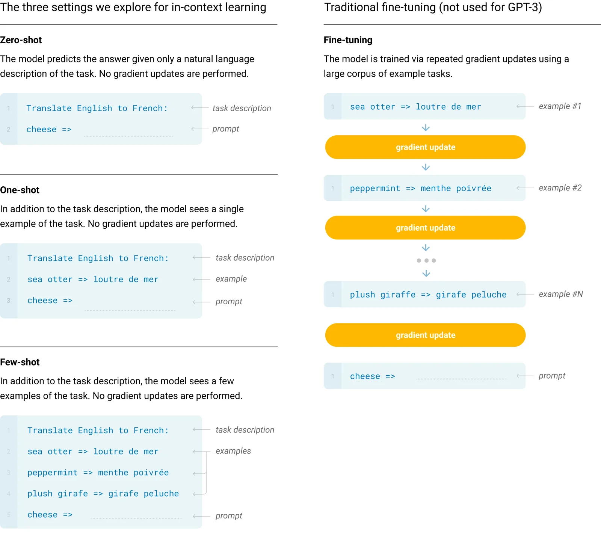

> GPT-3 的核心突破在于彻底确立了参数规模（Scale）与上下文学习（In-Context Learning）在现代大语言模型中的统治地位。它并没有在底层网络结构上做颠覆性的修改，而是通过体量的量变引发了学习范式的质变。

这篇文章主要探讨 GPT-3 的核心机制：极端的规模扩张以及无需更新权重的提示词范式。

## 架构延续

在模型架构层面，GPT-3 严格继承了 GPT-2 的 Decoder-only 架构，依然由多层掩码自注意力（Causal Masked Self-Attention）和前馈神经网络（FFN）堆叠而成。主要的微调在于引入了交替的稠密注意力（Dense Attention）与局部带状稀疏注意力（Sparse Attention），以在处理长序列时降低计算复杂度。

这意味着，GPT-3 的全部能力完全来源于在**相同结构下放大规模所带来的涌现效应**。

## 规模扩张

GPT-3 的核心逻辑可以归结为三个变量的极端放大：参数量（Parameters）、数据量（Tokens）以及总计算量（Compute）。

在深度学习中，训练 Transformer 模型所需的总计算量（FLOPs）与参数量和数据量之间存在一个经典的近似线性关系：

$$
C \approx 6PD
$$

- $C$：预训练所需的总计算量（单位为 FLOPs）。
- $P$：模型的非嵌入层参数量。前向传播中每个参数大约涉及 2 次浮点运算（一次乘法，一次加法），反向传播的计算量约为前向传播的 2 倍（计算梯度与更新权重），因此每处理一个 Token，每个参数大约需要 6 次浮点运算。
- $D$：整个预训练数据集的总 Token 数量。

在 GPT-3（175B 版本）中，参数量 $P$ 达到了 $1.75 \times 10^{11}$，预训练数据量 $D$ 约为 $3.0 \times 10^{11}$ 个 Token。代入公式计算，其总计算量 $C$ 达到了惊人的 $3.14 \times 10^{23}$ FLOPs。这种规模的计算使得模型能够在其海量的参数空间中构建极其复杂的低维语义流形。

## 提示范式

伴随规模扩张而来的，是下游任务评测范式的根本性改变。GPT-3 重新定义了零样本（Zero-shot）、单样本（One-shot）和多样本（Few-shot）提示。

在数学形式上，这些范式都可以统一在给定上下文求条件概率的框架下：

$$
P(y^* | x^*, \mathcal{D}_{\text{context}}; \Theta)
$$

- $\Theta$：模型的整体参数。在 GPT-3 的所有提示范式中，**$\Theta$ 保持完全冻结，不发生任何梯度更新**。
- $x^*$：当前需要解答的目标输入。
- $y^*$：模型预测的生成输出。
- $\mathcal{D}_{\text{context}}$：显式拼接在目标输入前的上下文示例集合。

根据上下文集合 $\mathcal{D}_{\text{context}}$ 中包含的示例数量 $k$，可以严格定义以下三种模式：

1. **Zero-shot ($k=0$)**：

   $$
   \mathcal{D}_{\text{context}} = \{\text{Instruction}\}
   $$

   仅提供任务的自然语言描述（如“请将以下英文翻译成中文：”）。模型完全依赖预训练阶段隐式学到的泛化特征进行推理。

2. **One-shot ($k=1$)**：

   $$
   \mathcal{D}_{\text{context}} = \{\text{Instruction}, (x_1, y_1)\}
   $$

   在任务描述后，额外给出一个完备的输入输出示例对 $(x_1, y_1)$，用于明确输出的格式和语义边界。

3. **Few-shot ($k > 1$)**：

   $$
   \mathcal{D}_{\text{context}} = \{\text{Instruction}, (x_1, y_1), (x_2, y_2), \dots, (x_k, y_k)\}
   $$

   通常包含 10 到 100 个示例。多样本能够形成稳定的模式流，让模型在单次前向传播中识别并对齐当前任务的分布。

## 上下文学习

In-Context Learning（上下文学习）是 GPT-3 最核心的边缘涌现能力。在传统的微调范式中，模型为了适应新任务，必须通过反向传播修改权重参数 $\Theta$。而上下文学习允许模型仅通过前向传播（Forward Pass）就在非结构化的文本中“学会”任务。

_传统微调（更新权重）与 GPT-3 倡导的三种提示范式（不更新权重，只在输入端堆叠样本）的本质区别。_

我们可以通过自注意力机制的数学机理来解释为什么这看起来像是在线学习。当目标输入 $x^*$ 与历史示例集合 $\mathcal{D}_{\text{context}}$ 共同送入模型时，在深层 Transformer 块中计算的查询向量 $Q_{x^*}$ 会与历史示例的键向量 $K_{\mathcal{D}}$ 进行点积交互：

$$
\text{Score} = \text{softmax}\left(\frac{Q_{x^*} K_{\mathcal{D}}^T}{\sqrt{d_k}}\right)
$$

这个点积操作本质上是在做**隐式的核回归（Implicit Kernel Regression）**或**梯度下降的数学等价模拟**。模型并没有改变底层的神经元突触权重（$\Theta$ 未变），而是通过激活值（Activations）之间的信息路由，动态地将新输入的特征向已知示例的特征空间进行投影。上下文中的示例实际上充当了在线引导前向传播特征变换的“临时权重”。

## 能力边界

尽管 GPT-3 展现出了强大的泛化能力，但其论文中也清晰地指出了以下核心局限性：

1. **自回归的结构局限**：作为单向自回归模型，GPT-3 在需要双向上下文的理解任务（如填空题、文本蕴含判断）上，表现有时反而不及 BERT 这种纯 Encoder 架构。
2. **长文本惩罚与记忆丧失**：受限于固定长度的上下文窗口（GPT-3 初代为 2048 Tokens），模型无法处理超长的文档关联，且注意力在极长序列的尾部容易出现稀释。
3. **预训练目标的错位**：Next-token prediction 引导模型去拟合整个互联网文本的统计概率，这导致它会无差别地学习人类文本中的偏见、虚假信息与错误逻辑。模型追求的是“统计上的合理性”，而非“绝对的事实正确性”。

## 参考资料

- Jay Alammar 的 [How GPT3 Works - Visualizations and Animations](https://jalammar.github.io/how-gpt3-works-visualizations-animations/)
- GPT-3 论文：[Language Models are Few-Shot Learners](https://arxiv.org/abs/2005.14165)
