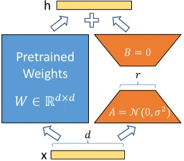

> 在 LLM 的参数量动辄达到百亿、千亿级别的背景下，传统的全量微调（Full Fine-Tuning）在工程上面临巨大的算力与存储挑战。LoRA（Low-Rank Adaptation）通过冻结原模型参数并引入低秩分解矩阵，大幅降低了微调的资源门槛。

这篇文章主要探讨 LoRA 的底层数学机理、参数削减效率以及在 Attention 机制中的插入与融合过程。

## 全量微调瓶颈

全量微调要求在训练过程中更新模型的所有参数。在反向传播时，这不仅需要存储大量的权重参数，还需要维持同样规模的梯度以及优化器状态（Optimizer States）。

以常用的 AdamW 优化器为例，对于每个可训练参数，除了需要 16 位的浮点数（FP16）存储权重和梯度外，还需要额外存储一阶动量（Mean）和二阶动量（Variance）。这使得全量微调的显存消耗急剧放大：

$$
\text{Memory}_{\text{Optimizer}} \approx 2 \times 4 \times P_{\text{train}}
$$

- $P_{\text{train}}$：可训练参数的数量。
- $\text{Memory}_{\text{Optimizer}}$：仅优化器状态就需要消耗的字节数（Byte）。对于每个参数，两个动量各需要一个 32 位浮点数（4 字节）来保证更新精度。

当模型规模扩大至数十亿以上时，这种显存开销使得单卡甚至单机微调变得难以为继。此外，为每个下游任务独立存储一份完整的模型权重，也带来了极高的部署成本。

## 低秩矩阵分解

LoRA 的核心思想建立在一个基本假设之上：**参数的更新量在本质上具有很低的“内在维度”（Intrinsic Dimension）**。也就是说，尽管原始权重矩阵的维度很高，但为了适应特定的下游任务，其所需的特征空间变换可以通过一个极低秩的矩阵来逼近。

_左侧蓝色块（冻结的预训练权重 $W$）与右侧橙色/黄色分支（低秩矩阵 $A$ 和 $B$）并行结构，输入 $x$ 分流后分别相乘再合并。_

在微调时，LoRA 将原始预训练权重矩阵进行静态冻结，使其不参与梯度更新。所有的增量训练全部由一条旁路的低秩矩阵组合来承担。

## 权重更新方程

将输入向量定义为 $x$，经过 LoRA 改造后的层前向传播输出 $h$ 可以表示为：

$$
h = W_0 x + \Delta W x = W_0 x + \frac{\alpha}{r} B A x
$$

这里详细拆解公式中的每个变量和矩阵维度：

- $x \in \mathbb{R}^{d}$：当前层的输入向量（或包含 Batch 和 Sequence 维度的张量）。
- $W_0 \in \mathbb{R}^{d \times k}$：预训练层固有的权重矩阵，在训练全过程中其梯度被关闭（**Frozen**）。
- $\Delta W \in \mathbb{R}^{d \times k}$：微调需要学习的参数增量矩阵。
- $B \in \mathbb{R}^{d \times r}$ 且 $A \in \mathbb{R}^{r \times k}$：为了避免直接训练高维的 $\Delta W$，将其拆解为两个低秩矩阵的乘积。其中 $r$ 为设定的低秩超参数（Rank），满足 $r \ll \min(d, k)$。
- $\alpha$：常数缩放因子（Scaling Factor）。在训练时，$\frac{\alpha}{r}$ 用于调节旁路特征对主路输出的影响权重。通常在选定 $r$ 后，将 $\alpha$ 固定为一个常数（例如 16 或 32），这有助于在调整 $r$ 时保持超参数梯度的稳定性。

为了确保在训练开始的第一步，旁路分支不会对冻结的模型输出产生任何干扰（即满足 $\Delta W = 0$），LoRA 采用了不对称的矩阵初始化策略：

- 矩阵 $A$：采用高斯分布 $\mathcal{N}(0, \sigma^2)$ 进行随机初始化。
- 矩阵 $B$：全部初始化为 0。

由于 $B = 0$，初始状态下的旁路输出 $B A x = 0$，此时模型等价于原始预训练模型，随后通过反向传播逐步使 $B$ 偏离 0 从而学习下游任务特征。

> **全随机初始化**：破坏预训练表征，引发初始输出震荡，导致训练极难收敛。
>
> **全零初始化**：导致参数更新停滞（无有效梯度传播），模型无法拟合下游任务。
>
> **LoRA 初始化**：初始状态为恒等映射（$\Delta W = 0$），无损保留基座先验知识；随训练平滑释放参数更新，实现稳定微调。

## 注意力机制插入点

理论上，LoRA 可以应用于 Transformer 结构中的任何全连接层（线性投影层）。但在实际策略中，研究者通常将其局限在自注意力（Self-Attention）机制的投影矩阵中：

- 查询投影矩阵：$W_q$
- 键投影矩阵：$W_k$
- 值投影矩阵：$W_v$
- 输出投影矩阵：$W_o$

LoRA 论文在实验中指出，将有限的参数预算分散分配给 $W_q$ 和 $W_v$，比将所有的参数预算集中分配给单一的 $W_q$ 矩阵，能带来更好的下游任务泛化表现。

## 权重合并融合

LoRA 在工程实现上的一个显著优势，在于它在推理阶段能够实现**零延迟引入**。

虽然在训练期间主路和旁路是分开计算并相加的，但在部署时，由于矩阵乘法满足分配律，我们可以提前将学到的低秩矩阵乘积并回原权重中：

$$
W_{\text{deploy}} = W_0 + \frac{\alpha}{r} (B \times A)
$$

- $W_{\text{deploy}} \in \mathbb{R}^{d \times k}$：直接融合了微调特征的新权重矩阵。

在模型上线前，直接将 $\frac{\alpha}{r} BA$ 的结果矩阵加到 $W_0$ 上，替代原有的 $W_0$。在实际推理时，输入 $x$ 只需与 $W_{\text{deploy}}$ 进行一次矩阵乘法：

$$
h = W_{\text{deploy}} x
$$

这不仅彻底消除了旁路分支带来的额外计算开销与显存同步延迟，而且当需要切换不同的下游任务时，只需动态减去当前任务的 $\Delta W$，并加上新任务的 $\Delta W$ 即可，实现了极高的多任务部署弹性。

## 参考资料

- LoRA 论文：[LoRA: Low-Rank Adaptation of Large Language Models](https://arxiv.org/abs/2106.09685)
- Hugging Face PEFT 文档：[工程实现参考](https://huggingface.co/docs/peft/main/en/package_reference/lora)
