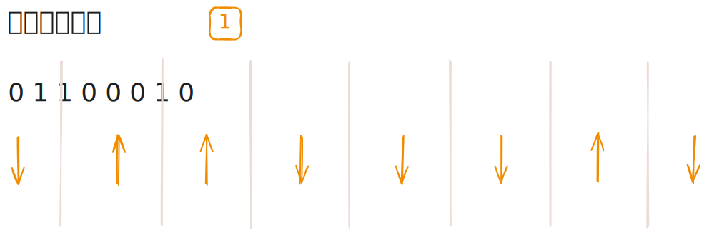
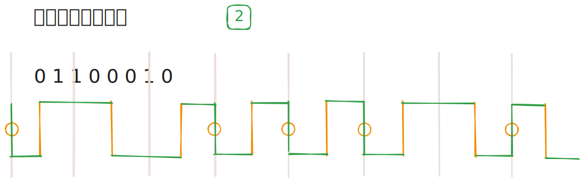

## 曼彻斯特编码
曼彻斯特编码在每个比特周期中间发生跳变，该跳变既用于同步又表示数据（下降沿为 0、上升沿为 1）。

### 绘制前置思路
曼彻斯特编码在每个比特都发生跳变，区别只是跳变的方向不同。

### 绘制步骤

1. **橙色**：先判断每一个比特
    - 0：绘制从上往下的箭头。
    - 1：绘制从下往上的箭头。

2. **绿色**：串联起相连箭头
    - 相异方向：箭头之间直线连接。
    - 相同方向：箭头之间需要跳变一次。

## 差分曼彻斯特编码
差分曼彻斯特编码在每个比特周期中间必跳变以实现同步，比特开始处是否跳变表示数据（跳变为 0、不跳变为 1）。

### 绘制前置思路
差分曼彻斯特编码也在每个比特都发生跳变，但这个跳变只代表同步信号（时钟）。

决定数据的是每个比特开始处是否跳变。

### 绘制步骤

1. **橙色**：先在每一个比特处画一条无方向竖线，再判断比特
    - 0：在比特前位置画一个圈（需要跳变穿过）。
    - 1：不作操作。

2. **绿色**：串联起每一个圆，观察两个比特竖线（橙色）之间
    - 有圆：表示跳变，需要转折。
    - 无圆：无跳变，直线连接。

