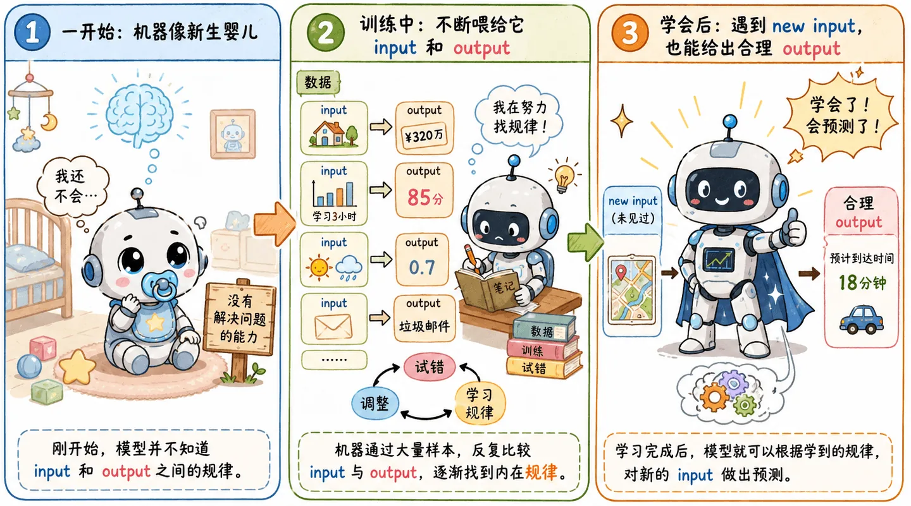
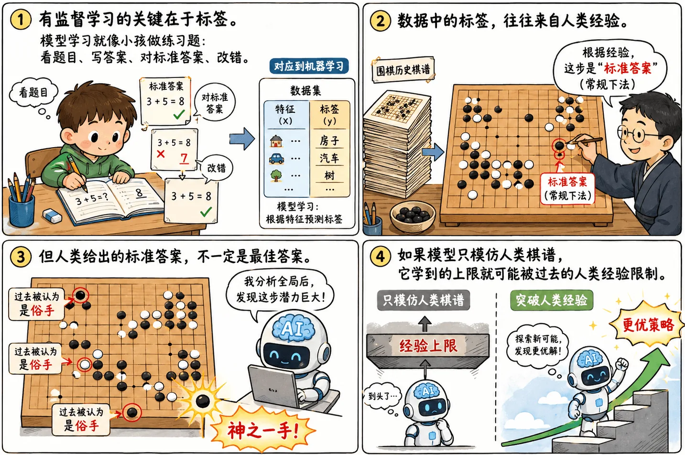

> 机器学习的知识量多且杂，之前学的第一遍跟没学一样，已经是忘了个七七八八。
>
> 我打算借助 codex 神力，从头再学一遍。
>
> 既然是机器学习，难免牵扯到最根本的问题：
>
> “机器学习里的“机器”，到底在学什么？”

## 从“万能机器”开始

可以把机器学习理解成：我们希望训练出一个能解决目标领域问题的 **“万能机器”**。

一开始，机器就像一个新生的婴儿，没有我们希望的解决问题能力。我们不断喂给它 `input` 和 `output`，让它在大量试错中找到内在规律。等它学完之后，再给它一个新的 `input`，它应该能吐出正确或者至少合理的 `output`。

### 训练集

我们人为提供的 `input` 和 `output`，其实就是**训练集**。可以理解成一本练习册：

- `input` 是题目。
- `output` 是答案。
- 模型要做的事，是从大量题目和答案里摸索出一套解题方法。

但这里需要区分：如果模型只是把题目和答案死记硬背下来，那不叫学习，只叫背题（过拟合）。

我们真正需要的模型，应该在没见过的新题上也能给出合理答案。换而言之，我们希望它学到的不是某几道题，而是题目背后的**规律**。

### 上帝函数

换成更宏观的说法，机器学习就是在找一个**上帝函数**：

$$
\text{input } x \longrightarrow f \longrightarrow \text{output } y
$$

这个函数是不可知的，就像明天股价的计算函数，我们只能希望机器在大量的训练后，可以逼近真实值。机器学习里的“机器”，本质上就是一个可以被不断调整的函数容器。

也可以把机器学习看作一个 **“黑盒”**，我们只能在外部框架上“叮叮咣咣”，例如调整数据集、模型结构、训练算法。然后望着终端的进度条，祈祷它能慢慢把这个黑盒里的函数调整到我们想要的样子。

### 参数

那模型到底是怎么“学”的？

浅显理解：模型内部有很多可调整**参数**。训练时，模型先用当前参数算出一个答案，再和真实答案比较差距，然后根据差距回头修改参数。

这个差距一般会被写成一个函数，也就是 **loss（损失）**。

所以训练过程可以理解成：

$$
\text{预测答案} \longrightarrow \text{计算 loss} \longrightarrow \text{调整参数} \longrightarrow \text{继续预测}
$$

模型在一次次“做错题、改错题”的过程中，把内部参数慢慢拧到更合适的位置。

## 输出决定任务形态

从函数输出的角度看，任务可以分成三类：

### 回归任务

[**回归任务**](/blog/ml-02-linear-regression)输出的是连续数值，比如房价、温度、分数。

> 给定面积、地段、楼层，预测这套房子大概值多少钱？

这里的答案不是固定选项，而是一条**连续数轴**上的某个点。

### 分类任务

[**分类任务**](/blog/ml-05-classification)输出的是类别，比如猫/狗、正/负、A/B/C。

> 给定一张图片，判断里面是猫还是狗？

模型最后输出的不是一个开放结果，而是在**有限选项**里做判断。

### 生成任务

**生成**任务输出的是一个新的样本，比如文本、图片、音频。

> 给定一段提示词，生成一段文字；给定一段描述，生成一张图片。

生成任务看起来很神奇，但拆到最底层，它仍然是在学习**从输入到输出**的映射。

### 三者不是三座孤岛

这三种任务贯穿了机器学习，后面会有更详细的介绍。

它们也不是完全割裂的。比如大模型在预训练时常常是在做“预测下一个 token”，这有点像分类；但最后呈现出来的效果，又是完整文本生成。

## 学习方式

如果按训练时有没有“标准答案”来看，机器学习又可以分成几种典型方式。

### 有监督学习

有监督学习的关键在于**标签**。

数据集中不仅有特征，还有人类给出的标准答案（标签）。有监督下的模型学习就像小孩做练习题：看题目、写答案、对标准答案、改错。

举个例子：

- 输入：一张图片。
- 标签：猫。
- 模型预测：狗。
- 结果：错了，回去调整参数。

这个过程很直观，也很好理解。有监督学习的优势就在这里：它给了模型明确的学习方向。

#### 标签会成为天花板（束缚）

但这里就引出一个很重要的问题：人类给出的标准答案一定是最佳答案吗？

显而易见不一定！

比如 AlphaGo。很多在过去棋谱（观点）里被认为是“俗手”的走法，后来反而被证明是“神之一手”。如果模型只模仿人类棋谱，它所能学到的上限就会被人类过去的经验所限制。

> 标签让模型有了学习方向，但标签质量也会限制模型上限。

所以在有监督学习中，**数据质量**是一个严肃的问题。如果喂给婴儿的都是“劣质奶粉”，那其实也很难指望我们可以培养出一个姚明。

### 无监督学习

无监督学习没有人工给出的标准答案。

这听起来有点抽象：没有答案还怎么学？

其实是因为它和有监督学习面对的任务不同，它不负责解决“应该答什么”，而是负责辨认“这些数据都是什么”。比如把相似的数据聚在一起，或者把高维数据压缩成更容易观察的低维表示。

可以看作是把一堆没有标签的资料倒在桌上，让机器自己分门别类：

- 哪些样本更像一类？
- 哪些特征经常一起出现？
- 哪些信息可以压缩掉，哪些信息必须保留？

#### 聚类和降维

典型例子是**聚类**和**降维**。

聚类是在没有标签的情况下，把相似样本放到一起。比如给一堆用户行为数据，模型可能会自己分出“价格敏感型”、“重度使用型”、“偶尔路过型”几类。

降维则是把复杂数据压缩成更少的维度，方便观察、计算或可视化。

### 强化学习

#### 策略学习

强化学习就完全不一样了。

例如让机器玩贪吃蛇：在无数次的失败后，模式学会在不同局面下应该往哪个方向走，才能吃到更多的食物、避免撞墙。这不是在学一个固定的输入输出，而是在学一套**决策规则**。

在这个框架里，模型在一连串动作里不断选择：

- 当前局面是什么？
- 我可以做哪些动作？
- 做完之后环境会怎么反馈？
- 这个反馈会不会让我离目标更近？

早期的 AlphaGo 还在依赖人类棋谱（有监督学习），再后来的 AlphaGo Zero 就干脆放弃了人类棋谱，直接让自己和自己对弈（强化学习）。通过无数棋局的胜负总结，学会了很多人类棋谱里没有的走法，甚至在某些局面下打破了人类的常规思维。

> 强化学习像是跟自己对抗，它的上限更依赖训练量、环境和奖励设计。

#### 奖惩设计

强化学习里最麻烦的地方之一，就是奖惩规则的设计。

模型总是能学到一些“钻空子”的策略：还是贪吃蛇的例子，如果惩罚过于严苛，模型在得分永远为负的尝试下可能会直接“自杀”以结束游戏，反而得分更高。

### 自监督学习

自监督学习是近年来 AI 爆发的关键技术，它巧妙地结合了有监督和无监督的特点。

#### 面临困境

AI 模型越来越大，训练数据的需求量也越来越多。尤其是高质量数据，一面造数据，一面使用数据，就好像是游泳池一遍进水一遍出水。现在是严重的入不敷出，哪怕拉上全部的非洲哥们也实在是捉襟见肘了。

所以解决方法就很自然了：能不能让大模型自己来造数据？也就是说，**既然没有人工标准答案，那就自己给自己出题，自己对答案。**

#### 完形填空

最经典的自监督任务就是“完形填空”。

假设我们从网上随便抓取了一句没有标签的话：“今天天气很好，我想去公园散步。”

模型在训练时，故意遮住其中几个字：

> “今天天气很好，我想去 [MASK] 散步。”

然后让模型去猜这个被遮住的词是什么。猜完之后，直接拿原句里本来的“公园”两个字作为标准答案（标签）来计算 loss，回头更新参数。

在这个过程中，完全不需要人类介入打标签，模型就通过这种“左脚踩右脚”上天的办法，从海量的无标注文本中，生生学到了人类语言的**语法规律、上下文逻辑，甚至是世界常识**。

#### 摆脱人类标签的束缚

有了自监督学习，我们就不再被“高质量人工标签”卡脖子了。互联网上有着无穷无尽的网页、书籍、代码，它们不需要任何人去标注是猫还是狗，直接全部扔进黑盒子里让模型去“完形填空”。

量变引起质变，当模型做完了全世界几乎所有的“完形填空”后，它就不再只是个会背题的机器，而是掌握了人类语言内在逻辑的“万能机器”。

## 和大模型的关系

大模型听起来离线性回归、分类很远，但底层框架其实如出一辙，仍然是在学一个函数。

实际上，自监督学习正是当前所有大语言模型（LLM）的基石。只不过函数变得非常复杂：

$$
\text{输入 token 序列} \longrightarrow \text{Transformer} \longrightarrow \text{下一个 token 或最终回答}
$$

训练数据从几百条人工标注的样本，变成了海量自监督学习的原始文本；函数从简单的 $wx + b$ 变成了几百亿甚至上千亿参数的 Transformer 架构；训练目标也从简单的认猫认狗，变成了预训练（预测下一个词）、指令微调和偏好优化。

不过第一性问题没变：

> 给定输入，模型如何学会输出我们想要的东西？

这是学习机器学习的起点，也是大模型之所以能跑通的基石。
