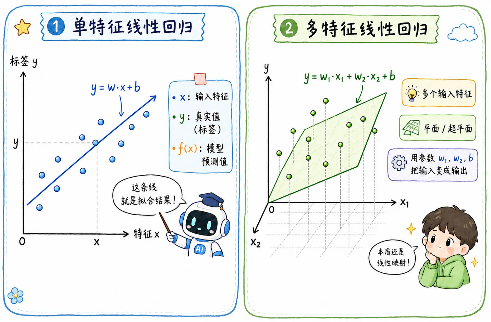
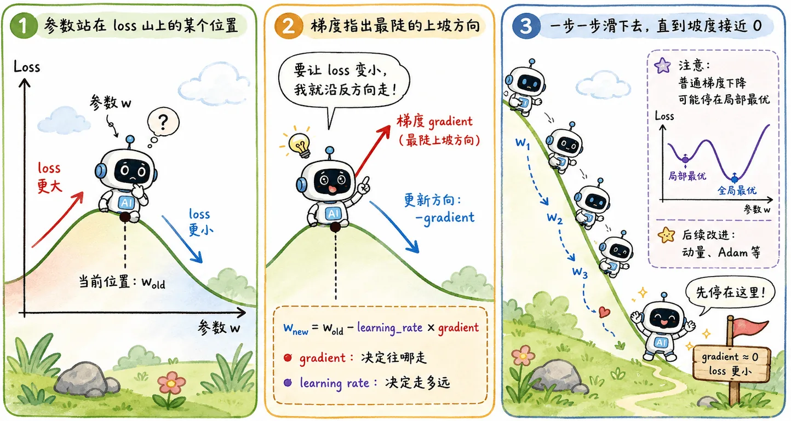

> 机器学习是在找一个函数。
>
> 那么最简单的函数长什么样？大概就是线性回归里的这条线了。

## 从一条线开始

线性回归解决的是**数值预测**问题。

比如输入一堆特征，输出一个连续值：

- 根据房子面积预测房价。
- 根据学习时间预测考试分数。
- 根据温度、湿度、风速预测某个数值指标。

它的基本形式是：

$$
y = f(x) = w \cdot x + b
$$

- `x` 是输入，即**特征**
- `y` 是真实值，即**标签**
- `w` 是**权重**
- `b` 是**偏置**
- `f(x)` 是模型预测出来的值

### 单特征

如果只有一个输入特征，回归函数就可以视作二维平面里的一条线。比如用房子面积预测房价，`x` 是面积，`y` 是价格，模型要做的事就是在一堆散点中间找出一条最像样的线。

这里的 `w` 决定线的倾斜程度，`b` 决定线从哪里开始。换成人话就是：

- `w` 越大，面积增加带来的房价变化越明显。
- `b` 像一个基础值，即使面积变化还没发生，模型也先给出一个起点。

### 多特征

当然，真实世界不会只看一个特征。如果输入不止一个，比如面积、楼层、地段、房龄一起上，那公式就会变成：

$$
\hat y = w_1x_1 + w_2x_2 + w_3x_3 + \cdots + b
$$

每个特征都有自己的权重。权重大，说明模型认为这个特征更重要；权重小，说明它对预测结果的影响更弱。

如果只有一个输入特征，它是一条线；如果有多个输入特征，它就是高维空间里的一个平面或者超平面。

但不管具体形式怎么变换，核心都是：用一组参数 $w, b$，把输入变成输出。

## 训练过程

一开始，模型并不知道什么样的 $w$ 和 $b$ 是好的，即不知道怎样才能逼近上帝函数。

所以训练可以理解为：不断调整 $w$ 和 $b$，让预测值越来越接近真实值。

如果模型预测的是 $\hat y$，真实答案是 $y$，那它们之间的差值就是**误差**。

### MSE

线性回归最常见的**损失函数 loss** 是**均方误差 MSE**：

$$
L = \frac{1}{n}\sum_{i=1}^{n}(\hat y_i - y_i)^2
$$

为什么要平方？

可以从这几点来理解：

1. 避免正负误差互相抵消。
2. 错得越离谱，惩罚越大。
3. 它是连续可导的，后面可以用梯度下降优化。

损失函数的作用，就是把“模型好不好”变成一个具体数字，为模型的后续优化提供指导：loss 越小，模型在训练集上表现越好。

需要注意的是，线性回归的最终目标并不是要找一条穿过所有点的线。现实数据本来就乱七八糟，还有噪声干扰。真正要找的只是一条**整体犯错最少**的线。

## 梯度下降

### 找最小 loss

有了损失函数之后，问题就变成：

> 怎么找到一组 $w, b$，让 loss 尽可能小？

这时候就轮到**梯度下降**登场了。

可以这样理解梯度下降：参数站在 loss 这座山的某个位置，梯度告诉它哪里是最陡的上坡方向。既然我们想让 loss 变小，就沿着反方向走。

也就是：

$$
w_{\text{new}} = w_{\text{old}} - \text{learning\_rate} \times \text{gradient}
$$

用更口语的话说，就是让模型顺着导数坡往山下滑，在导数为零的地方停下。

### 学习率

这里的 `learning_rate` 是学习率，也就是每次往下走多大一步。

- 步子太小，走得很稳，但可能慢得让人抓狂。
- 步子太大，可能直接跨过最低点，在山谷两边反复横跳。

所以训练模型并不是“算一下就完事”，而是在试探一个合适的更新节奏。

后面会有更详细的[学习](/blog/ml-03-gradient-descent/#学习率)。

## 总结

线性回归本身原理简单，但核心流程被机器学习广泛采用：

$$
\text{定义模型}
\longrightarrow
\text{定义损失函数}
\longrightarrow
\text{计算梯度}
\longrightarrow
\text{更新参数}
\longrightarrow
\text{重复训练}
$$

后面的逻辑回归、MLP、CNN、Transformer，本质上都没有逃开这个流程。只是模型从一条直线，变成了更复杂的函数。

所以学习线性回归，重点是第一次把机器学习的几个核心零件串起来：

- 模型：用什么形式表示函数。
- 损失：怎么衡量预测错得多离谱。
- 优化：怎么根据错误调整参数。
