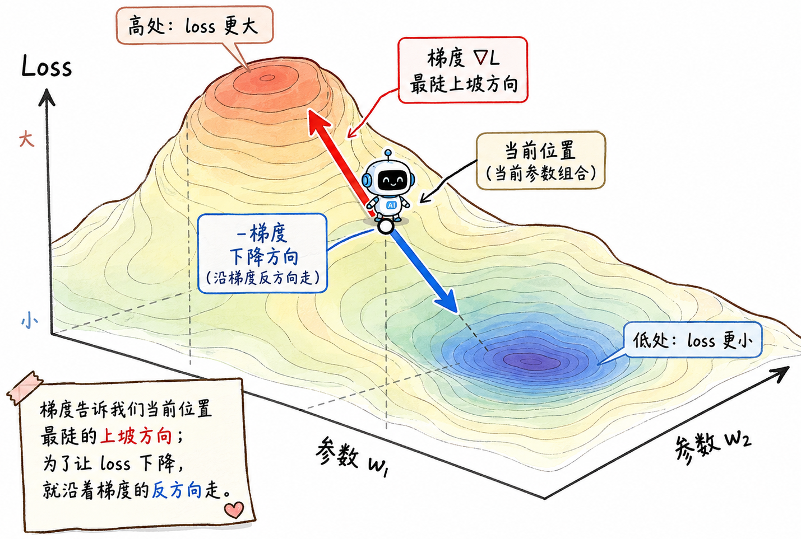
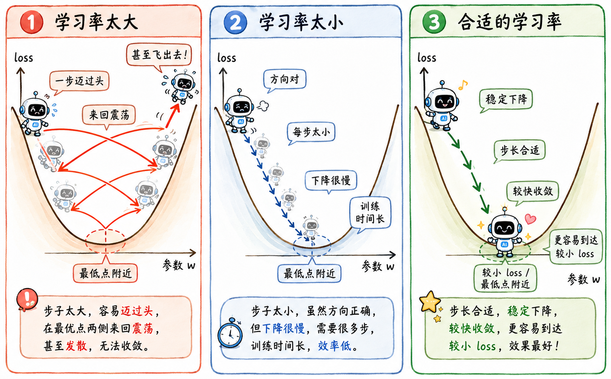
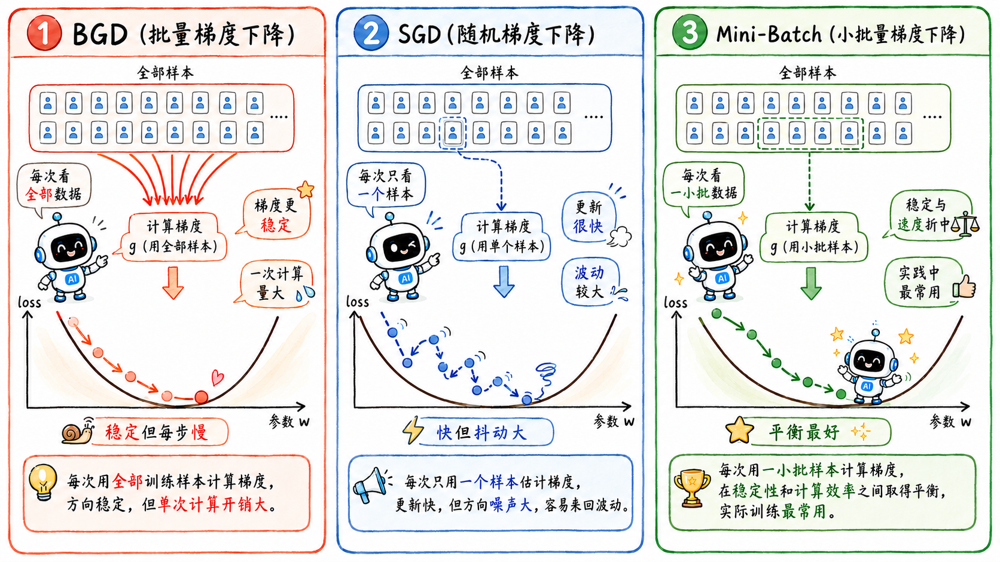

> 线性回归里简单介绍了梯度下降相关概念，但没有展开讲
>
> 这里就专门说说梯度下降的细节，尤其是学习率相关的内容

## 计算原理

### 梯度下降是什么

梯度下降的目的我们已经探讨过了：

> 调整模型参数，让损失函数的值尽可能小。

如果把损失函数想象成一张地形图，特定的参数组合就是这张地图上的一个坐标。

当前位置越高，说明 loss 越大；当前位置越低，说明 loss 越小。

我们想要做的事就是从随机选的起点出发，沿着地形图往下走，找到最低点。

梯度的数学定义就是“指向函数值增长最快的方向”，即当前位置最陡的上坡方向。既然我们想让 loss 下降，那就正好沿着梯度的反方向走。

机器学习里的大量优化问题，底层都绕不开这个动作。

### 梯度下降全流程

梯度下降可以拆成几个动作：

1. 初始化参数，为每一个特征都先随机选一个 $w^0$ 权重和一个 $b^0$ 偏置。
2. 计算当前参数下的梯度 $g_t$。
3. 按梯度反方向更新参数。
4. 重复第 2 步和第 3 步，直到满足某个停止条件（比如 loss 足够小，或者迭代次数达到上限）。

### 梯度计算

讲了这么多前置知识，现在就要开始硬核内容了：**当前梯度是怎么算的？**

用最简单的单特征线性回归场景分析。模型是：

$$
\hat y_i = wx_i + b
$$

损失函数用 MSE：

$$
L = \frac{1}{n}\sum_{i=1}^{n}(\hat y_i - y_i)^2
$$

梯度即为损失函数对参数的偏导数。也就是说，我们分别问：

- $w$ 动一点，loss 会怎么变？
- $b$ 动一点，loss 会怎么变？

算出来是：

$$
\frac{\partial L}{\partial w}
= \frac{2}{n}\sum_{i=1}^{n}(\hat y_i - y_i)x_i
$$

$$
\frac{\partial L}{\partial b}
= \frac{2}{n}\sum_{i=1}^{n}(\hat y_i - y_i)
$$

这里 $(\hat y_i - y_i)$ 是模型当前的误差。误差越大，梯度通常也越大，说明这个参数方向上还有比较明显的调整空间。

如果是多个参数，形式也差不多：每个参数各算一个偏导数，然后把这些偏导数组在一起，就是当前的梯度 $g_t$。

### 更新公式

写成公式就是：

$$
w^{t+1} = w^t - \eta \cdot g_t
$$

其中 $g_t$ 是当前梯度，$\eta$ 是学习率，也就是常见的 `lr`。

梯度决定方向，也带着当前坡度的信息；学习率则像人为设定的步长，决定模型每次迈出去多远。

### 导数正负

如果只有一个参数，可以直接看导数的正负：

- 导数小于 0，说明 $w$ 增大时 loss 会变小。
- 导数大于 0，说明 $w$ 减小时 loss 会变小。

这就是为什么更新公式里要**减去梯度**。梯度指向的是上坡方向，想下山就反着来。

如果模型有多个参数，就要计算损失函数对每个参数的偏导数。每个参数沿自己的方向更新，整体合起来就是一次参数移动。

## 学习率

### 固定步长

学习率如果太大，在更新权重时模型可能一步迈过头，在最低点附近来回震荡，甚至直接飞出去。

学习率如果太小，模型虽然方向对，但 loss 降得太慢，训练的时间会很长。

所以固定学习率肯定不够理想。

一个最朴素的优化思路是：刚开始离目标远，可以走快一点；后面接近低点了，就应该走慢一点。

### 自适应学习率

`Adaptive Learning Rate`

比如：

$$
\eta_t = \frac{\eta}{\sqrt{t + 1}}
$$

随着迭代次数上升，学习率逐渐变小。

优化总是做不完的，接下来难免又会提出进一步问题：可不可以**为每一个参数都定制一个学习率**？

可以想象成一张复杂的多维地图：有的方向是陡坡，有的方向是缓坡；有的参数方向很敏感，稍微动一下 loss 就变化很大；有的参数方向很迟钝，走很久才有变化。

{/* TODO: 配图：多维地形图，不同参数方向陡峭程度不同，统一步长显得粗暴。 */}

### Adagrad

`Adaptive Gradient Descent`

#### 定义

Adagrad 的核心当然还是**自适应学习率**。

它的更新形式可以粗略写成：

$$
w_i^{t+1} = w_i^t - \frac{\eta}{\sqrt{G_i^t + \epsilon}} \cdot g_i^t
$$

其中 $G_i^t$ 记录的是第 $i$ 个参数到目前为止的历史梯度平方和：

$$
G_i^t = \sum_{\tau=1}^{t}(g_i^\tau)^2
$$

这个历史记录，可以代表某个参数方向过去到底“陡不陡”：

- 如果某个方向历史梯度一直很大，说明这个方向比较陡，更新时就应该小心一点。于是分母变大，步幅变小。
- 如果某个方向历史梯度一直很小，说明这个方向比较平缓，就可以相对走大一点。

#### 看似矛盾

初接触 Adagrad 时，会感觉参数之间有矛盾性：

- 当前梯度 $g_t$ 大，参数更新步幅变大。
- 历史梯度平方和 $G_t$ 大，参数更新又步幅变小了。

其实它们针对的根本就不是同一维度：

- $g_t$ ：当前瞬时坡度。
- $G_t$ ：这个方向的过往长期特征。

一个看现在，一个看过去。相除之后，反而能实现配合：

- 陡峭方向：历史梯度大，分母大，小步慢走，防止震荡。
- 平缓方向：历史梯度小，分母小，相对大步，帮助收敛。

#### 后期走不动

当然，Adagrad 也有自己的问题：因为历史梯度平方和只会不断累加，分母会越来越大，后期学习率可能衰减得太厉害，最后几乎走不动。

在后面学到更深入内容（神经网络）时，会再提到一些改进算法。

## 用多少数据算梯度

梯度下降还有一个重要维度：每次用多少数据来算梯度。

### BGD

`Batch Gradient Descent`

- 每次用**全部训练集**计算梯度。
- 优点：梯度方向比较稳定，更新比较靠谱。
- 缺点：每次更新都要扫完整个训练集，数据集大了就太慢了。

### SGD

`Stochastic Gradient Descent`

- 每次只用**一个样本**计算梯度。
- 优点：更新很快，看一眼样本就走一步。
- 缺点：受噪声影响很大，方向不稳定。它可能整体是在下山，但具体每一步都歪歪扭扭。

### Mini-Batch

`Mini-Batch SGD` 则是折中：每次用**一小批样本**。

它既不会像 BGD 一样每一步都重得要命，也不会像 SGD 一样每一步都太随机。

这也解释了为什么训练神经网络时会有 `batch size` 这个东西：它决定了模型每次拿多少样本来估计当前应该往哪走。
