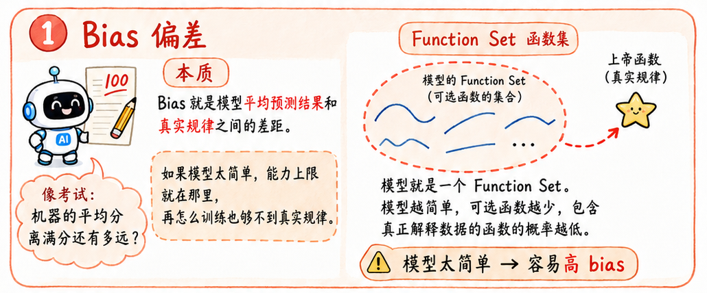
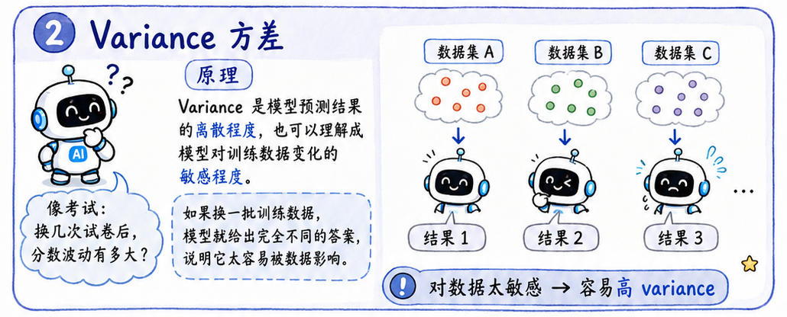
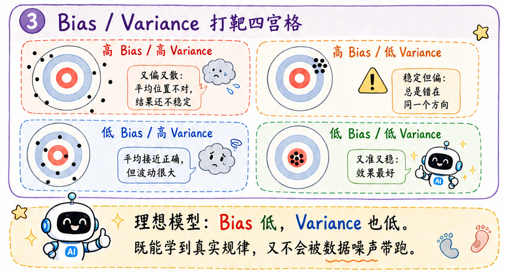
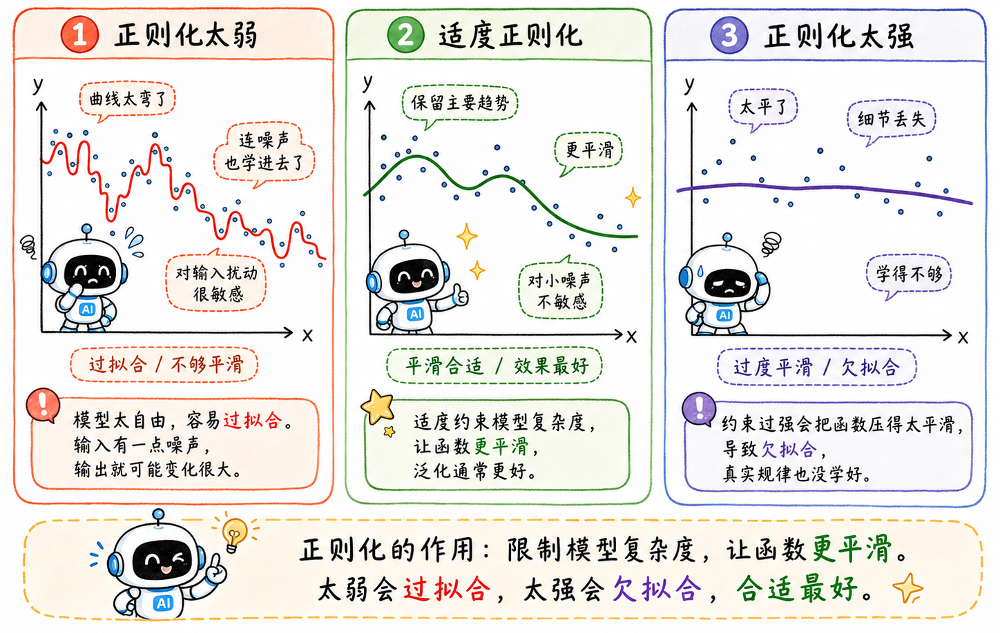

> 解决了梯度下降，训练集上的 loss 降下去了
>
> 但这真的代表模型学会了吗？

## Bias 偏差

### 本质

Bias 就是模型平均预测结果和真实规律之间的差距。

用考试这个场景来理解：

> Bias 相当于机器的考试分数和满分之间的差值。

### Function Set 函数集

模型就是一个 Function Set。模型越简单，包含的函数就越少，包含“上帝函数”的概率就越低，甚至可能根本不包含那个真正能解释数据的函数。说得难听一点，就是模型太笨。

这时候就容易出现高 bias。

## Variance 方差

### 本质

Variance 是模型预测结果的**离散程度**，也可以理解成模型对训练数据变化的敏感程度。

还是用考试来想：

> Variance 相当于机器在大批次考试下得分的波动性。

### 对数据的敏感性

模型越复杂，variance 往往越大。

这是因为复杂模型**感知数据变化**的能力更强，也更容易把训练集里的噪声、偶然路径、特殊样本都学进去。

所以高 variance 模型像是一个太会脑补的学生，总是把训练集里的每一个细节都当成规律。

## 欠拟合

### 本质

欠拟合就是 bias 大，variance 小。

偏差大，方差小。可以说是稳定地差劲发挥。

究其根本，可以在训练过程上看出端倪：模型太简单，训练集上都学不好。

就像一个只会加减法的人去做高数卷，答案很稳定，错得也很稳定。

## 过拟合

### 本质

过拟合就是 bias 小，variance 大。

偏差小，方差大。说明机器的总体接近正确，但表现的变化很大，时好时坏。

一般都是训练过程出了问题：模型在训练集上表现好，但测试集水土不服。

可以理解为，这个婴儿把知识学过头了，不仅学到了真正规律，还学到了很多不应该学的经验路径，甚至把噪声也当成规律。所以它做旧题很强，换一套新题就乱套了。

## 解决办法

显而易见的解决办法：添加数据，一力破万法。

但现实一点说，作为打工人，哪来的资格要更多更干净的数据集，一般都是从模型和特征上下手。

### 正则化

正则化就是给模型加约束，限制参数不能太大，压缩模型自由度，强行不让它乱拟合噪声。

#### 数学公式

如果原来的训练目标只是把训练误差压低：

$$
L = \frac{1}{n}\sum_{i=1}^{n}(\hat y_i - y_i)^2
$$

正则化就是在后面再加一个惩罚项：

$$
L_{reg}=L+\lambda\cdot\text{参数惩罚}
$$

这里的 $\lambda$ 控制惩罚力度。$\lambda$ 调大后可以有效地限制模型参数的大小，原因见下。

最常见的是 **L2 正则化**：

$$
\text{参数惩罚}=w_1^2+w_2^2+\cdots+w_m^2
$$

放回目标函数里，就是：

$$
L_{reg}=L+\lambda(w_1^2+w_2^2+\cdots+w_m^2)
$$

平方项会惩罚特别大的参数，所以 L2 会逼迫模型把参数整体调小。参数小一点，函数通常就没那么容易剧烈摆动。

还有一种形式是 **L1 正则化**：

$$
L_{reg}=L+\lambda(|w_1|+|w_2|+\cdots+|w_m|)
$$

L1 更像是把一部分不重要的参数直接压到 0。

#### 平滑

可以说，正则化让函数更平滑了。

平滑即指输入变化影响输出变化的程度。函数越平滑，输出对输入里的小噪声越不敏感。

- 优点：输出不会被输入里的噪声过度影响。
- 缺点：如果过于平滑，模型会丢掉重要特征。就像磨皮磨太狠，连本人特征都看不出来了。

所以正则化不是越强越好，要找到平衡点。

## 交叉验证

交叉验证解决的是一个很现实的问题：

> 如果所有数据都拿来训练，那拿什么来评估模型？

本质上是对数据集的**资源规划**。

我们希望既充分利用数据训练，又能比较靠谱地估计模型在新数据上的表现。

### Validation Set Approach

最简单的方法是直接切一块验证集，比如 80% 训练，20% 验证。

- 优点：简单、成本低。
- 缺点：结果很依赖怎么切分。如果运气不好，验证集刚好比较特殊，模型评估就会偏。

而且训练时没法用上全部数据。

### LOOCV

`Leave One Out Cross Validation`

假设有 $N$ 个样本，每次拿 1 个样本做验证集，剩下 $N-1$ 个做训练集。这样重复 $N$ 次，最后取平均误差。

#### 优点

- 不太受单次切分影响。
- 每次训练几乎用到了全部数据，bias 较小。

#### 缺点

- 计算量太大。

如果数据量很大，就很折磨人了。

LOOCV 有种很极端的节俭感：每次只舍得拿一个样本出来考试，剩下的全拿去训练。评估是细了，但机器也快被折磨死了。

### K-fold Cross Validation

**K 折交叉验证**是 LOOCV 的折中。

把数据分成 K 份，每次拿 1 份做验证，剩下 K-1 份做训练，重复 K 次。

常见选择是：$K = 5 \text{ or } 10$。

K 的选择本身也是 bias 和 variance 的 **trade-off**。

- K 越大，每次训练用的数据越多，bias 越小。
- 但 K 越大，不同训练集之间越相似，误差估计之间相关性更强，variance 可能更大。

最极端的情况就是 $K=N$，坍缩到 LOOCV 场景。每次训练集几乎一样，计算成本也爆炸。
