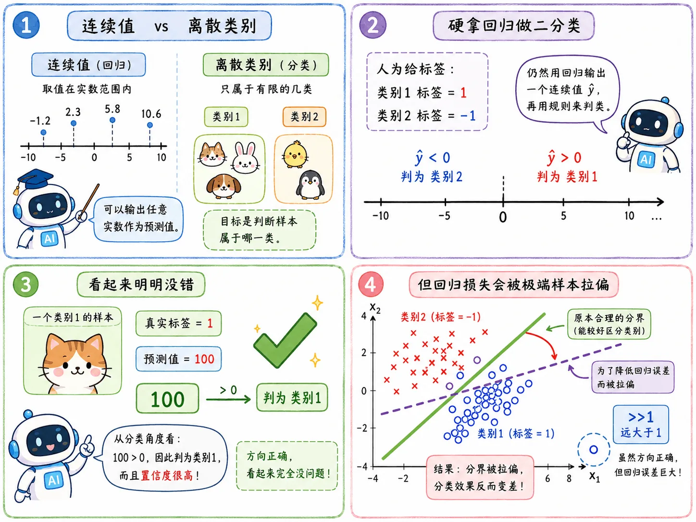
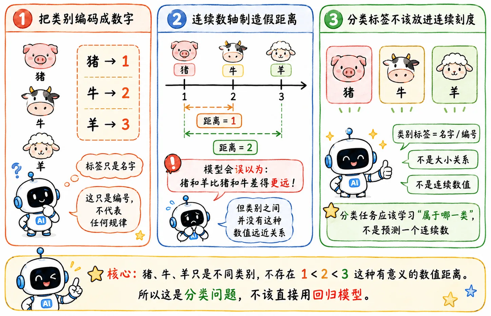
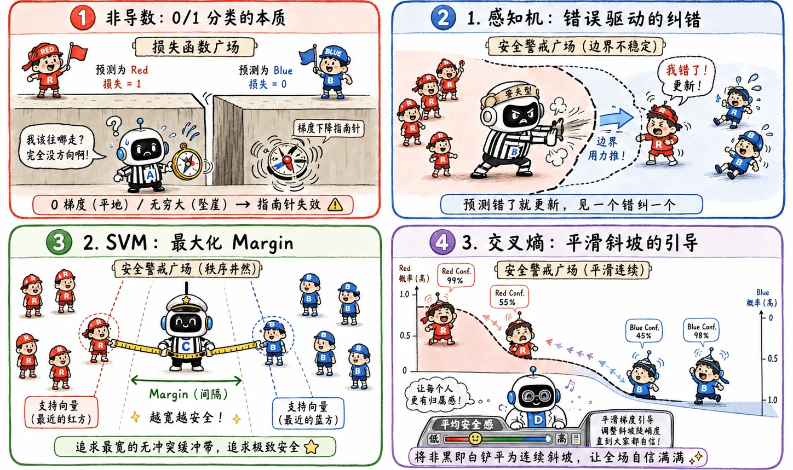

> 既然线性回归就能输出数字，那为什么面对分类任务，还要用专门的分类模型？

## 为什么要用分类模型

### 回归做分类任务

#### 基础场景

假设有两个类别：

- 类别 1 的标签是 `1`
- 类别 2 的标签是 `-1`

沿用之前的思路，不难想到，我们可以训练一个回归模型，然后规定：

$$
\begin{cases}
\text{输出} > 0 &\longrightarrow \text{类别 1} \\
\text{输出} < 0 &\longrightarrow \text{类别 2}
\end{cases}
$$

看起来还挺合理的。

#### “太正确”样本

但问题来了：回归模型会惩罚那些“太正确”的样本。

如果某个样本真实类别是 1，模型输出 100。从分类角度看，它相当于非常确定属于类别 1，没什么问题。

但回归损失会觉得：离标签 `1` 太远了，需要惩罚。

于是为了降低整体误差，模型可能会调整一条本来分类效果不错的边界，反而影响分类准确性。

这是处理问题的本质不同。

#### 遇到多分类

而且后面还会遇到多分类问题。

如果三个类别分别标注：

$$
\begin{cases}
\text{猪} \longrightarrow 1 \\
\text{牛} \longrightarrow 2 \\
\text{羊} \longrightarrow 3
\end{cases}
$$

那模型会天然以为 1 🐷 和 3 🐑 的距离比 1 🐷 和 2 🐄 更远，即类别两两之间是有差异性的。

但猪、牛、羊之间哪有这种数值距离关系？类别不应该被强行塞进连续数轴，赋予额外的意义。

### 分类模型

分类模型解决的是类别判断问题。

比如：

- 图片是猫还是狗。
- 评论是正面还是负面。
- 一只新来的宠物是猫还是狗。

#### 和回归的区别

这和回归不一样。

- 回归输出的是**连续值**，即任意改变输入特征，都可以借助函数关系得到一个新的数值输出。
- 分类输出的是**离散类别**，即依据样本的特征不同，被分配到不同的类别中。

这个区别直接影响了**模型形式**和**损失函数**。

## 损失函数

### 直觉函数

分类最直接的损失计算当然是直接去查输出结果，数一数预测错了几个。

$$
L = \text{预测错误的样本数量}
$$

这个目标非常符合直觉，但存在致命问题：不可微。

### 替代方案

不可微就意味着不可导，没法直接用梯度下降优化。

所以分类问题需要一些替代方案：

- 感知机：预测错了就更新。
- SVM：不只追求分对，还追求 margin。
- 可微替代损失：比如[**交叉熵**](/blog/ml-07-discriminative-model/#交叉熵)。

深度学习走的主要就是第三条路。

## 两条路线

到这里，分类问题的大方向已经清楚了：

> 输入一个样本，判断它属于哪个类别。

但具体怎么判断，业界有两条截然不同的路线：[**生成模型**](/blog/ml-06-probabilistic-generative-model)与[**判别模型**](/blog/ml-07-discriminative-model)。

### 生成派

核心思路：先掌握类别结构的内在逻辑，弄清楚猫和狗这两类数据分别长什么样，再去反推样本属于谁。

### 判别派

核心思路：不关心数据的内在逻辑，只关心怎么画一条线把它们分开。
