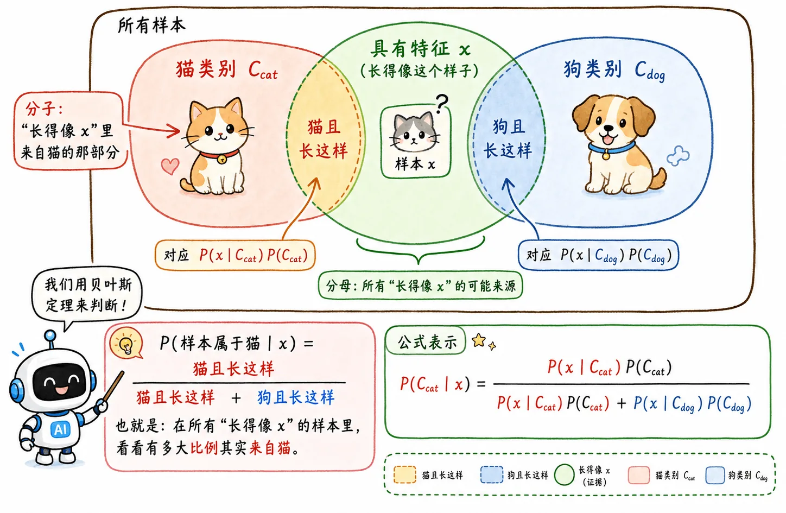
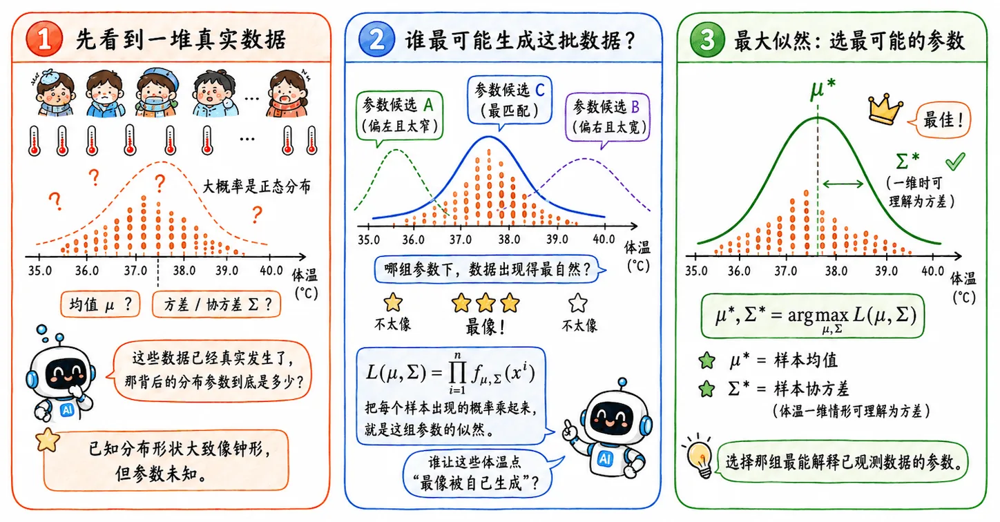
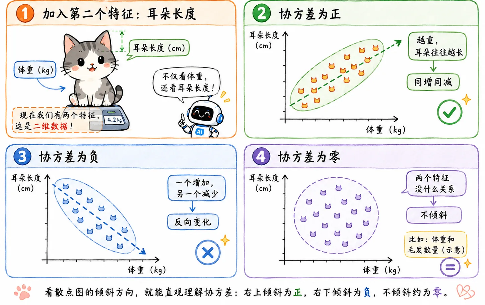
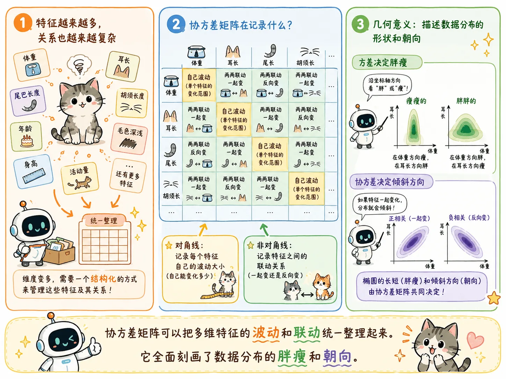

> 生成模型的思路：先假设世界长什么样，再从数据里反推这个世界的参数。

## 概率生成模型

### 实际场景

用 $x$ 表示某一样本特征，$C$ 为某一类别。

我们在二分类场景下讨论问题：宠物店里有 🐱 和 🐶 两种动物，要求机器在训练完所有店内的宠物样本后，可以实现智能识别到店宠物物种。

现在进来了一个陌生宠物，机器“哔嘟”一下完成了扫描和特征提取，得到了它的特征 $x$，比如叫声。

想知道这只宠物属于物种 $C_{cat}$ 还是 $C_{dog}$，概率生成模型的思路如下：

计算出 $P(C_{cat} \mid x)$ 和 $P(C_{dog} \mid x)$，哪个概率更大，就把它分到哪个类别。

### 贝叶斯与全概率公式

$$
P(C_{cat} \mid x) =
\frac{P(x \mid C_{cat})P(C_{cat})}
{P(x \mid C_{cat})P(C_{cat}) + P(x \mid C_{dog})P(C_{dog})}
$$

$$
P(\text{特征属于猫}) =
\frac{P(\text{猫有这个特征})P(\text{猫的占比})}
{P(\text{猫有这个特征})P(\text{猫的占比}) + P(\text{狗有这个特征})P(\text{狗的占比})}
$$

观察这个公式，要算出最后的分类概率，关键是估计两类东西：

- **先验概率 $P(C)$**
- **类条件概率 $P(x \mid C)$**

**先验概率**很好计算，比如店里 10 个样本里有 3 只猫，那概率就是 0.3。

但**类条件概率**算起来就可麻烦，如果特征简单还好办，比如当前场景，直接数样本的猫类别下，有这个叫声的猫占全部猫的多少。但现实中，特征往往是**连续且多维**的：比如病人体温 39.7°C，**轻微**头晕，这是一个没有办法直接数出来的概率值，就算数出来也没有实际意义。

### 极大似然估计

#### 多元正态假设

如何计算 $P(x \mid C)$？

根据我们小学二年级学过的概率论知识，在正态分布下，连续的特征是可以计算概率的。现在只是把它从一维扩展到了多维。

假设猫和狗这两类数据都各自服从多元正态分布，概率密度大概长这样（其实不重要，你别真背下来）：

$$
f_{\mu,\Sigma}(x)=
\frac{1}{(2\pi)^{\frac{D}{2}}|\Sigma|^{\frac{1}{2}}}
e^{-\frac{1}{2}(x-\mu)^T\Sigma^{-1}(x-\mu)}
$$

其中 $\mu$ 决定分布中心，$\Sigma$ 决定分布形状。我们的任务就变成了分别寻找猫和狗这两类的均值 $\mu$ 和协方差 $\Sigma$。

所以问题变成：怎么找到最能代表当前类别的 $\mu$ 和 $\Sigma$？

#### 极大似然估计 MLE

这里就要请出我们的老熟人了。

现在我手上有 9 万个感冒病人的体温数据，且我知道背后大概率是一个正态分布，但不知道均值和方差是多少。极大似然问的就是：

> 既然这批数据已经真实发生了，那参数设成什么样，才**最可能生成**这批数据？

如果某一类里有 $N$ 个样本，似然函数就是把每个样本出现的概率乘起来：

$$
L(\mu,\Sigma)=\prod_{i=1}^{N}f_{\mu,\Sigma}(x^i)
$$

要找的就是：

$$
\mu^*,\Sigma^*=\arg\max_{\mu,\Sigma}L(\mu,\Sigma)
$$

最后求出来的 $\mu^*$ 就是样本均值，$\Sigma^*$ 就是样本协方差。这是一个非常数学的演算过程。

这也是一种非常统计学的思路：先假设世界长什么样，再从数据里反推这个世界的参数。

### 协方差矩阵

发现没有，我们刚刚莫名其妙就接触了一个重要概念：**协方差**。

这个概念虽然不难，但还是值得单独拿出来讲讲的。

#### 方差家族的任务

方差 $\to$ 协方差 $\to$ 协方差矩阵，我们提出这一系列的概念都只是为了解决一个问题：当前这一类数据服从正态分布时，怎么用数学去描述这座“概率山峰”的形状？

#### 一维 —— 方差 Variance

如果我们在鉴定猫时，只看一个特征：**体重**。

除了算出这群猫的平均体重，即均值 $\mu$，我们还需要知道这群猫的体重差异有多大。

- 如果猫的体重都在 4kg 左右浮动，**方差很小**，分布就像一座陡峭的尖峰。
- 如果有 2kg 的小猫，也有 8kg 的胖猫，**方差很大**，分布就像一座平缓的矮丘。

方差描述了单一特征自己的离散程度。

#### 二维 —— 协方差 Covariance

现在加入第二个考量特征：**耳朵长度**。

除了分别计算体重的方差和耳长的方差，我们还会发现一个现象：通常体重越大的猫，体型骨架越大，耳朵往往也越长。

这就是特征之间的**联动关系**，数学上叫做**协方差**：

- **协方差为正**：两个特征同增同减。
- **协方差为负**：一个增加，另一个减少。
- **协方差为零**：两个特征完全没关系。

#### 多维 —— 协方差矩阵

当特征变成了成百上千维，怎么统一管理这些错综复杂的关系？数学家引入了**协方差矩阵 $\Sigma$**。

对于一个二维特征（比如 $x_1$ 体重，$x_2$ 耳长），它的协方差矩阵长这样：

$$
\Sigma =
\begin{bmatrix}
Var(x_1) & Cov(x_1, x_2)
\\
Cov(x_2, x_1) & Var(x_2)
\end{bmatrix}
$$

- **对角线上的元素（$Var$）**：每个特征**自己**的方差，决定了这座山峰在各个坐标轴方向上的“胖瘦”。
- **非对角线上的元素（$Cov$）**：特征**两两之间**的协方差，决定了这座山峰在空间里的“倾斜角度”。

可以说，协方差矩阵 $\Sigma$ 全面刻画了这座山峰的形态。

