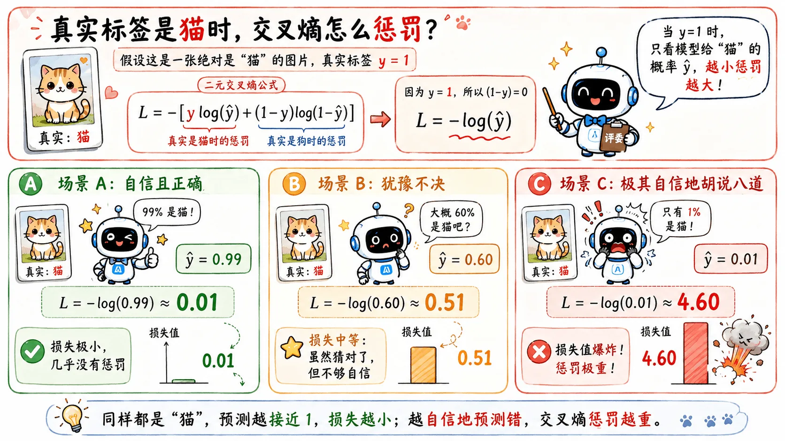

> 判别模型的思路简单粗暴：别管世界怎么生成，能不能直接把样本分对？

## 逻辑回归

`Logistic Regression`

判别模型不关心猫和狗这两类数据到底怎么生成，只关心一件事：

> 给我一个样本，我怎么把它分到正确类别？

所以它的目标直接：跳过繁琐的类条件概率，直接通过训练学习到 $P(C \mid x)$，或者更粗暴一点——直接学一条分类边界。

**逻辑回归**就是最基础、也最经典的判别模型。

### 从生成模型到逻辑回归

为了理解逻辑回归是怎么来的，我们可以先看生成模型里的一个特殊情形。

我们已经讨论过，在生成模型中，如果对“猫狗”分类，通常需要为它们分别计算均值 $\mu$ 和协方差矩阵 $\Sigma$。相当于猫和狗各自拥有一座“概率山峰”，它们不仅建在地图的不同位置，而且形态截然不同。

#### 共享协方差矩阵

那如果我们想偷个懒，**强行规定猫和狗共享同一个协方差矩阵**呢？

$$
\Sigma_{cat} = \Sigma_{dog} = \Sigma
$$

也就是说，我们允许猫和狗的山峰建在不同的位置（均值不同），但强迫这两座山峰的**胖瘦形态必须一模一样**。

除了能大幅减少参数量、防止过拟合之外，它在数学上引发了一个极其漂亮的化学反应：复杂的二次项被完美抵消了。

### 核心形态

在共享协方差矩阵的前提下，原本极其复杂的**贝叶斯后验概率**，被惊人地化简成以下形式：

$$
P(C_1 \mid x) = \sigma(w^T x + b)
$$

（完整推导过程极其精彩，请[选择观看第八章](/blog/ml-08-bayes-to-sigmoid)，这里我们先专注于结论本身。）

最终发现，复杂的概率模型，最后退化成一个**线性打分**外面套一个 **Sigmoid 函数**。

这正是**逻辑回归**的核心形态：

1. **线性打分**：先算出 $z = w^T x + b$，得到一个没有上下限的倾向得分。
2. **Sigmoid 概率化**：用 $\sigma(z)$ 把这个分数强行压进 0 到 1 的区间，变成 $\hat y$。

这个 $\hat y$，就可以直接被理解成该样本属于类别 1 的概率。

## 交叉熵

`Cross-Entropy`

既然逻辑回归直接把 $w$ 和 $b$ 当成了要学习的参数，那就又回到了回归模型的训练思路：需要一个**损失函数**来指引参数的更新方向。

分类问题最经典的损失函数，叫做交叉熵。对于二分类问题，它的公式长这样：

$$
L = -\left[ y\log(\hat y) + (1-y)\log(1-\hat y) \right]
$$

- $y$ 是真实标签（必须是 1 或者 0）。
- $\hat y$ 是模型预测的概率（0 到 1 之间的小数）。

这串公式看起来复杂，其实工作机理很简单。我们直接带入一个实例来看看。

### 训练实例

假设现在有一张绝对是“猫”的图片，真实标签 $y = 1$。

既然 $y=1$，那么公式后半部分的 $(1-y)$ 就变成了 0，整个后半段直接消失。此时公式极度简化为：

$$
L = -\log(\hat y)
$$

现在让模型做三次预测，看看交叉熵会给出怎样的惩罚（损失值 $L$）：

- **场景 A：自信且正确**

  模型看了图片，非常笃定地说：“这 99% 是一只猫！” ($\hat y = 0.99$)

  代入公式：$L = -\log(0.99) \approx 0.01$

  裁判：损失极小，几乎没有惩罚。

- **场景 B：犹豫不决**

  模型看了图片，挠了挠头：“这...勉强算是有 60% 的可能是猫吧？” ($\hat y = 0.60$)

  代入公式：$L = -\log(0.60) \approx 0.51$

  裁判：损失中等。虽然猜对了，但犹犹豫豫，需要给你一点惩罚。

- **场景 C：极其自信地胡说八道**

  模型看了图片，信誓旦旦地说：“这绝对是一只狗！它只有 1% 的可能是猫！” ($\hat y = 0.01$)

  代入公式：$L = -\log(0.01) \approx 4.60$

  裁判结果：损失值爆炸！

依靠公式里的那个 $\log$，交叉熵化身成一名严父：**可以不确定，但绝不能普信！**

### 为什么不用 MSE

逻辑回归为什么不能继续用 [**MSE**](/blog/ml-02-linear-regression/#mse) ？

根本原因在于 Sigmoid 函数的**饱和特性**。

#### Sigmoid 饱和

Sigmoid 是一条两头平缓、中间陡峭的 S 型曲线。

如果搭配 MSE 使用，当预测错得非常离谱时（比如真实标签是 1，但线性打分是 -100，预测概率接近 0），此时由于落在 Sigmoid 极其平缓的尾部，**梯度无限接近于 0**。

这就导致了一个尴尬局面：**模型明明错得离谱，但因为找不到梯度，参数几乎不更新。**（训不动）。

而交叉熵恰好破解了这个死局，它的对数特性完美抵消了 Sigmoid 的平缓，确保了“误差越大，梯度越强”。

#### 两条路线的对比归纳

| 维度         | 线性回归             | 逻辑回归                       |
| :----------- | :------------------- | :----------------------------- |
| **输出目标** | 连续的数值           | 0 到 1 之间的概率              |
| **模型结构** | 直接输出 $w^T x + b$ | $w^T x + b$ 外面套一层 Sigmoid |
| **损失函数** | MSE                  | 交叉熵                         |
| **物理意义** | 处理“数值离多远”     | 处理“分类概率对不对”           |

虽然两者形似，但本质完全不同。
