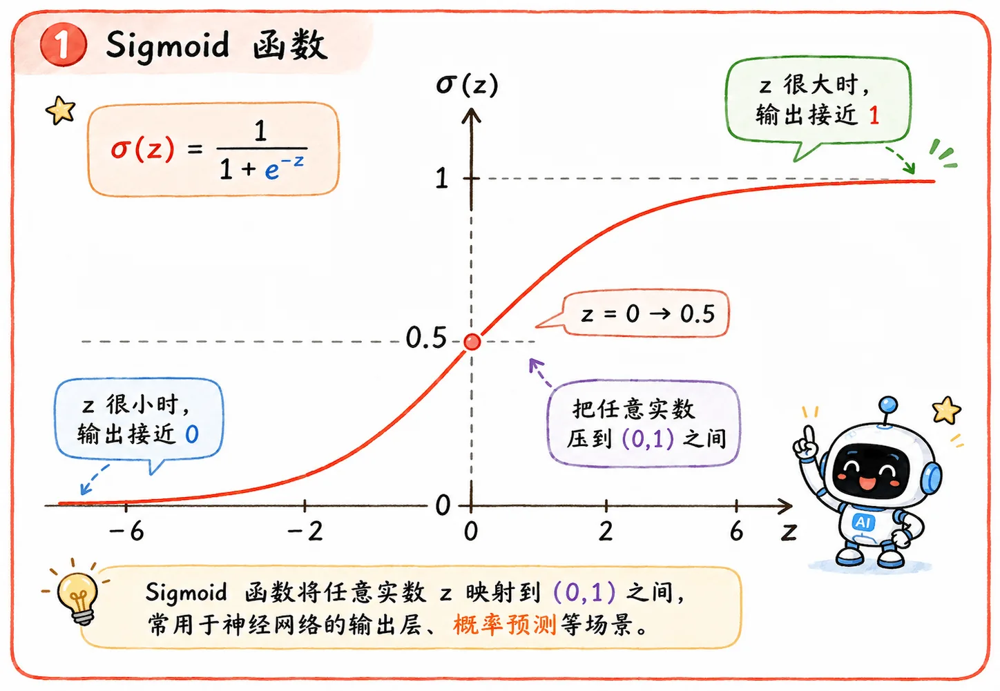

> 逻辑回归对我们来说像是一个黑盒：
>
> 线性打分，再用 Sigmoid 变成概率。
>
> 但为什么偏偏是 Sigmoid？这个线性打分又是从哪来的？

## 这篇要解释什么

逻辑回归的计算公式：

$$
P(C_1 \mid x) = \sigma(w^T x + b)
$$

看起来很简洁，但其实藏着两个问题：

1. 为什么是 Sigmoid？
2. 为什么括号里是线性打分 $w^Tx+b$？

所以这一节就拆开看：

- Sigmoid 为什么适合把分数变成概率。
- 贝叶斯后验为什么能化简成 Sigmoid 套线性打分。

## 为什么是 Sigmoid

### 背景知识

Sigmoid 是最早使用的激活函数之一。但是由于其固有存在的一些缺点，如今很少将其作为激活函数，但是依然常用于**二分类问题中的概率划分**。

[**激活函数**](/blog/dl-01-perceptron-to-mlp/#激活函数)会在后面的**神经网络**部分专门讲到，这里只说 Sigmoid 在逻辑回归中的应用。

我们假定判别模型的输出是一个实数 $z$，它可以是任意实数。

它可能是 `-100`，也可能是 `0.7`，还可能是 `42`。

但概率不能这么随便。概率必须在 0 到 1 之间。

所以问题变成了：

> 怎么把一个任意实数，变成一个可以理解成概率的数？

### 压到 0 和 1 之间

Sigmoid 做的就是这件事：

$$
\sigma(z)=\frac{1}{1+e^{-z}}
$$

它会把任意实数压到 $(0, 1)$ 之间。

直观感受：分数越高，越像类别 1；分数越低，越像类别 0。

### Log Odds

到这里还有一个合理的疑问：

> 可以压缩数值分布的函数那么多，为什么偏偏是 Sigmoid？

Sigmoid 不只是一个“挤压工具”，它和分类概率之间有一层更自然的关系。

如果从概率 $p$ 出发，先把它变成几率，再取对数，就会得到一个可以覆盖整个实数轴的值。

#### 数学推导

1. **引入几率**

   几率的定义：一件事发生的概率除以不发生的概率。

   $$
   \text{Odds} = \frac{p}{1-p}
   $$

   如果赢的概率是 0.8，输的概率是 0.2，那赢的几率就是 4（这也是赌场里常说的**赔率**）。

   经过这一步转换，$p$ 从 $(0, 1)$ 被拉伸到了 $(0, +\infty)$。但还不够，因为线性打分是可以有负数的。

2. **取对数**

   这个映射就很好想了，我们给几率取一个自然对数，得到**对数几率**：

   $$
   \text{Logit}(p) = \ln\left(\frac{p}{1-p}\right)
   $$

   当 $p$ 接近 0 时，对数几率趋近于 $-\infty$；当 $p$ 接近 1 时，它趋近于 $+\infty$。

   对数几率的值域就这样变成了 $(-\infty, +\infty)$。

3. **Sigmoid 的真面目**

   现在，等式两端的值域终于匹配。我们让线性打分等于对数几率：

   $$
   w^Tx + b = \ln\left(\frac{p}{1-p}\right)
   $$

   这一步就是**逻辑回归**的精髓了：**用线性回归去拟合事物发生概率的对数几率**。

   这就是为什么它明明在处理分类任务，名字里却还带着“回归”。

4. **反解 $p$**

   $$
   \frac{p}{1-p} = e^{w^Tx + b}
   $$

   $$
   p = e^{w^Tx + b}(1-p) = e^{w^Tx + b} - p \cdot e^{w^Tx + b}
   $$

   $$
   p (1 + e^{w^Tx + b}) = e^{w^Tx + b}
   $$

   $$
   p = \frac{e^{w^Tx + b}}{1 + e^{w^Tx + b}}
   $$

   分子分母同除以 $e^{w^Tx + b}$，就得到了最终结果：

   $$
   p = \frac{1}{1 + e^{-(w^Tx + b)}} = \sigma(w^Tx + b)
   $$

   经过数学推算，真相终于浮出水面：Sigmoid 函数其实就是对数几率在代数上的逆函数！

#### 直觉定义

所以机器输出的 $z$ 就是 **log odds**：

$$
z = \log \frac{P(C_1 \mid x)}{P(C_2 \mid x)}
$$

- 如果 $z$ 很大，说明 $C_1$ 相对 $C_2$ 的优势很大。
- 如果 $z$ 很小，甚至是负数，说明 $C_1$ 没什么优势，样本更可能属于 $C_2$。

## 为什么 z 会变成线性打分

前面解释的是：如果有一个实数 $z$，Sigmoid 可以把它变回概率。

现在剩下的问题是：

> 这个 $z$ 为什么最后会变成 $w^Tx+b$？

这就要从贝叶斯后验概率开始推。

### 贝叶斯后验

让我们严肃启程，在拥有全部前置条件的情况下，开始推导贝叶斯后验概率：

1. **从贝叶斯公式开始**

   二分类下的贝叶斯后验概率公式：

   $$
   P(C_1 \mid x) = \frac{P(x \mid C_1)P(C_1)}{P(x \mid C_1)P(C_1) + P(x \mid C_2)P(C_2)}
   $$

   令分子分母同时除以分子 $P(x \mid C_1)P(C_1)$：

   $$
   P(C_1 \mid x) = \frac{1}{1 + \frac{P(x \mid C_2)P(C_2)}{P(x \mid C_1)P(C_1)}}
   $$

   是不是已经开始眼熟了？

   现在，把分母里的“大坨”分数强行写成 $e^{-z}$ 的形式。也就是说，我们令：

   $$
   z = \ln \frac{P(x \mid C_1)P(C_1)}{P(x \mid C_2)P(C_2)}
   $$

   带入 $z$ 之后，原公式奇迹般变成：

   $$
   P(C_1 \mid x) = \frac{1}{1 + e^{-z}} = \sigma(z)
   $$

   **Sigmoid 函数 $\sigma(z)$ 已经出现**。

2. **代入高斯分布展开 $z$**

   根据对数的运算法则，把 $z$ 拆开：

   $$
   z = \ln \frac{P(x \mid C_1)}{P(x \mid C_2)} + \ln \frac{P(C_1)}{P(C_2)}
   $$

   后半部分的 $\ln \frac{P(C_1)}{P(C_2)}$ 只是一个常数（基于先验概率算出来的具体数值）。

   先不管它，重点看前半部分。

   把多元高斯分布的概率密度公式（巨长那个）代入 $P(x \mid C_1)$ 和 $P(x \mid C_2)$。

   **共享协方差**发力！它们俩的 $\Sigma$ 相同，所以公式前面的复杂系数在相除时直接约掉！

   所以取对数后，只剩下指数部分相减：

   $$
   \ln \frac{P(x \mid C_1)}{P(x \mid C_2)} = \left[ -\frac{1}{2}(x-\mu_1)^T\Sigma^{-1}(x-\mu_1) \right] - \left[ -\frac{1}{2}(x-\mu_2)^T\Sigma^{-1}(x-\mu_2) \right]
   $$

3. **二次项抵消**

   把上面的式子乘开。因为矩阵相乘满足分配律，且协方差矩阵是对称的，所以 $(x-\mu)^T\Sigma^{-1}(x-\mu)$ 展开后长这样：

   $$
   x^T\Sigma^{-1}x - 2\mu^T\Sigma^{-1}x + \mu^T\Sigma^{-1}\mu
   $$

   把类别 1 和类别 2 展开式代回相减，神奇的一幕出现了：

   $$
   \begin{aligned}
    & \left( -\frac{1}{2} \color{red}{x^T\Sigma^{-1}x} + \mu_1^T\Sigma^{-1}x - \frac{1}{2}\mu_1^T\Sigma^{-1}\mu_1 \right) \\
    - & \left( -\frac{1}{2} \color{red}{x^T\Sigma^{-1}x} + \mu_2^T\Sigma^{-1}x - \frac{1}{2}\mu_2^T\Sigma^{-1}\mu_2 \right)
   \end{aligned}
   $$

   呦西！最棘手、代表非线性边界的二次项 $\color{red}{-\frac{1}{2}x^T\Sigma^{-1}x}$，因为两个类别共用同一个 $\Sigma^{-1}$，在相减时被完美抵消！

4. **化简为线性打分**

   二次项死后，场上只剩下 $x$ 的一次项和常数项，我们把它们重新组合归类：

   一次项提出： $(\mu_1 - \mu_2)^T \Sigma^{-1} x$

   剩下的纯常数项： $-\frac{1}{2}\mu_1^T\Sigma^{-1}\mu_1 + \frac{1}{2}\mu_2^T\Sigma^{-1}\mu_2$

   现在，把所有的推导拼回到最早的 $z$ 公式：

   $$
   z = \underbrace{(\mu_1 - \mu_2)^T \Sigma^{-1}}_{w^T} x + \underbrace{\left( -\frac{1}{2} \mu_1^T \Sigma^{-1} \mu_1 + \frac{1}{2} \mu_2^T \Sigma^{-1} \mu_2 + \ln \frac{P(C_1)}{P(C_2)} \right)}_{b}
   $$

   我们把 $x$ 前面的那一整坨常数系数叫做 $w^T$。

   把后面那一长串纯常数的尾巴叫做 $b$。

   于是，$z$ 彻底化简为：

   $$
   z = w^T x + b
   $$

   因为 $P(C_1 \mid x) = \sigma(z)$，所以最终结论：

   $$
   P(C_1 \mid x) = \sigma(w^T x + b)
   $$

   推导完毕。
