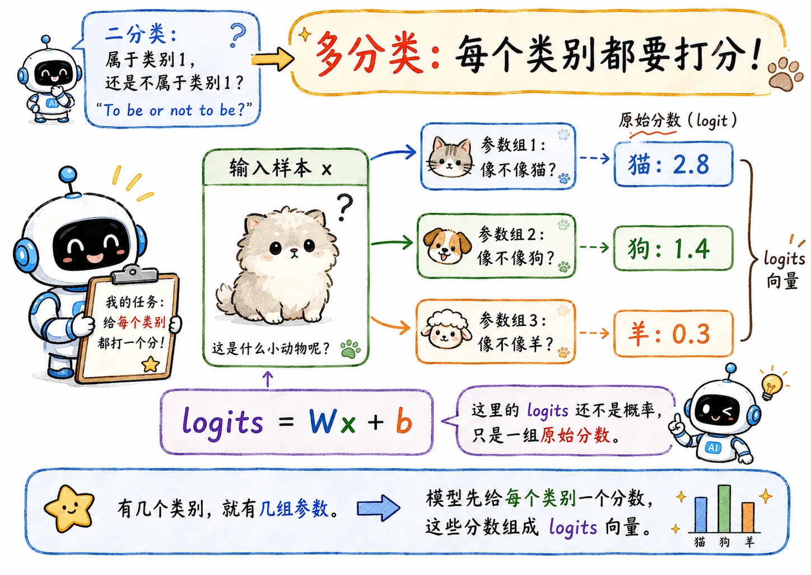
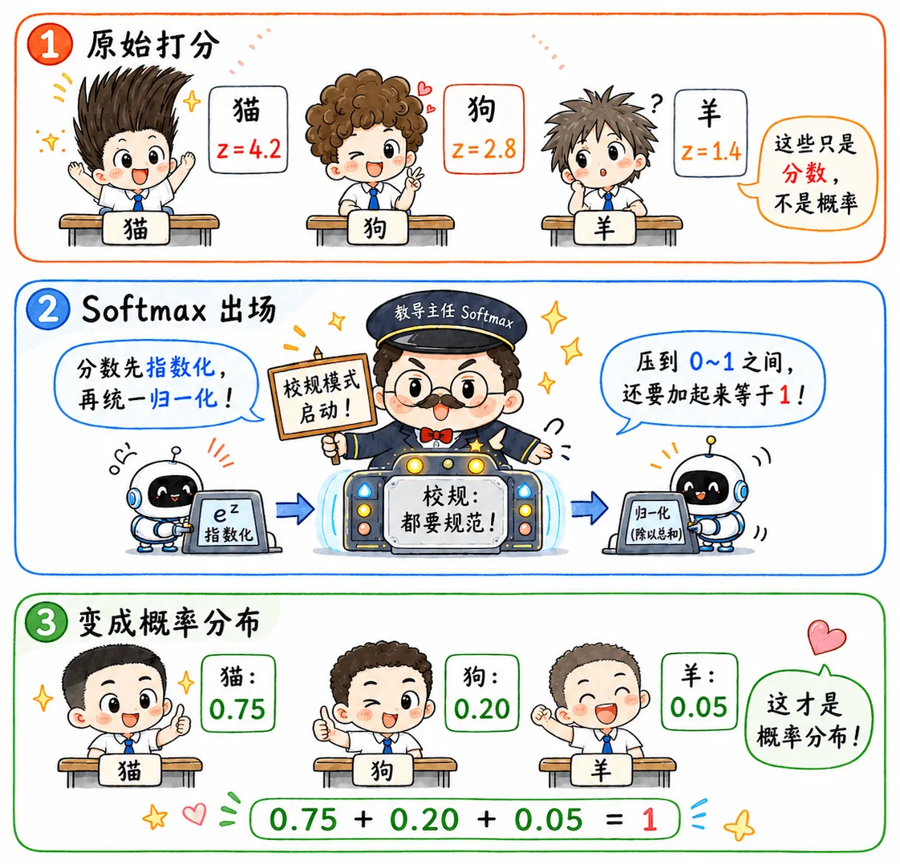
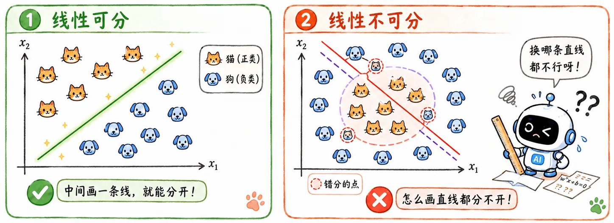
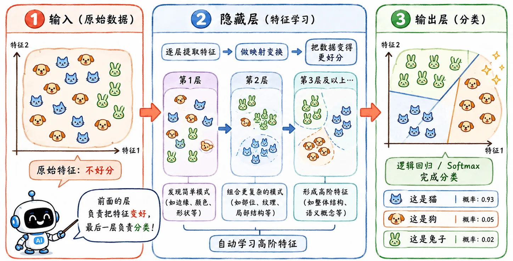

import FeatureTransformDemo from "../../components/blog/ml/FeatureTransformDemo.astro";

> 逻辑回归解决了二分类问题。
>
> 但现实场景往往更复杂：类别可能不止两个，边界也未必是一条直线。

## 多分类问题

### 实际场景

前面讨论逻辑回归时，我们一直默认在处理二分类问题，比如宠物店里只有猫和狗，此时模型只需要回答一个问题：

> 这只新来的宠物，是猫还是狗？

但现实中，宠物店里的实际种类可多了去了，兔子、仓鼠、鹦鹉、乌龟等等等等。

机器扫描完一只陌生宠物，提取到一堆特征 $x$，它要回答的就不应该，也不止是“是不是猫”了，而是：

> 它到底属于猫、狗、兔子、仓鼠、鹦鹉、乌龟...里的哪一类？

这就是**多分类问题**：如果说二分类是在做**判断题**；那多分类就更像是在做**选择题**。

### 一组分数

二分类时，模型只需要判断：目标样本属于类别 1，还是不属于类别 1？

> To be or not to be?

但多分类不一样。比如识别猫、狗、羊，模型需要同时给出多个类别的概率，即模型要给每个类别都打个分数。一般来说，有几个类别，就有几组参数：

- 一组参数负责判断“像不像猫”。
- 一组参数负责判断“像不像狗”。
- 一组参数负责判断“像不像羊”。

模型先输出多个类别的分数：

$$
\text{logits} = Wx + b
$$

这里的 `logits` 还不是概率，只是一组**原始分数**。

比如模型可能先算出：

$$
\text{猫：}4.2 \quad \text{狗：}2.8 \quad \text{羊：}0.1
$$

这些分数能比较大小，但还不能直接当概率。因为它们可能是负数，也不保证加起来等于 1。

### Softmax

Softmax 做的事，就是把这些分数变成概率分布：

$$
\hat y_i = \frac{e^{z_i}}{\sum_j e^{z_j}}
$$

它保证所有类别的概率加起来等于 1，输出结果变成：

$$
\text{猫：}0.75 \quad \text{狗：}0.20 \quad \text{羊：}0.05
$$

好消息，损失还是用**交叉熵**处理，没有又蹦出来一个什么新算法。

Softmax 就像是教导主任，面对各色发型的学生们，使用一招**校规**：统统给我剃成寸头（范围约束在 $[0, 1]$ 之间，且和为 $1$）！

这比二分类更符合现实：一只宠物当然不能既 80% 是猫，又 70% 是狗，甚至 160% 是羊， -160% 是牛！模型必须在多个类别之间做取舍。

## 线性不可分

### 线性分类的局限

针对分类问题讲了这么多，又是逻辑回归、又是 Softmax 处理，本质上都还是线性分类器。它们的分类边界都是线性的：二维里是一条直线，高维里是一个超平面。

如果数据线性可分，那当然没问题。比如猫和狗在特征空间里刚好分成两团，中间画一条线（一个面）就能切开。

但如果数据线性不可分呢？

### Function Set

这是线性模型的死穴。回想函数集概念，相当于这个 Function Set 里根本没有能解决问题的那条边界。

这和之前讲过的 bias 问题是接得上的：模型本身太简单，函数集合里没有正确答案，训练再久也只是原地为难自己。

## 特征变换

### 基本原理

解决线性不可分的一个办法是特征变换。

既然直线弯不了，那就把数据所在的空间掰弯。

我们希望原来糅杂的数据，经过特征变换后，会在新空间里被拉扯开，变得线性可分。

<FeatureTransformDemo />

在传统机器学习里，这种特征变换往往要人工设计。

### 人工特征工程

这是非常麻烦的工作，好比手工给模型配眼镜，只能一度一度的微调，祈祷突然配对，模型一下看清楚了。

所以难免提出进一步要求：

> 能不能避免人工设计特征，而是让模型自己学出更好分类的特征？

## 神经网络

### 自动特征变换

这里就自然引出了**神经网络**。

如果不想人工设计特征变换，那就让模型自己学。

可以粗略理解：

前面的层不断扭曲、折叠、升维、降维，把原始数据洗成更容易分类的样子。

神经网络就是在接着解决线性模型解决不了的问题。
