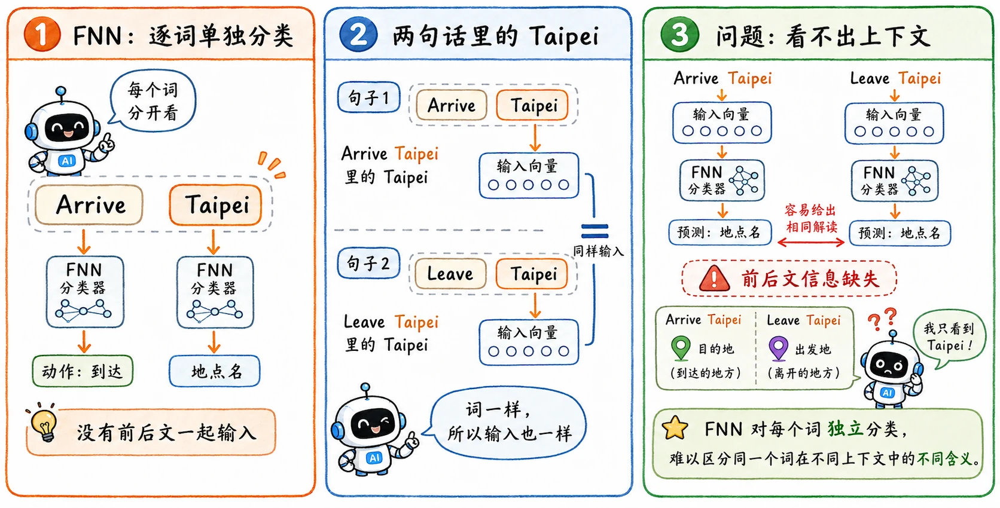
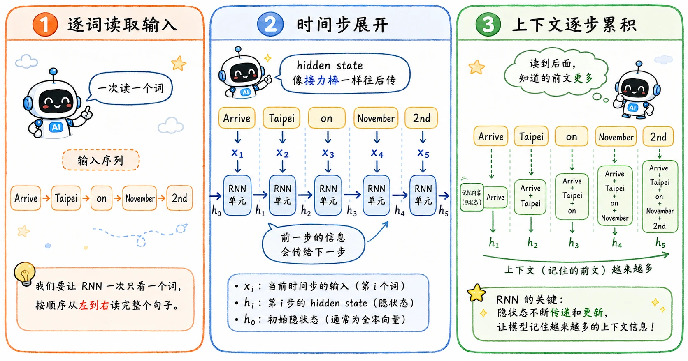

> 文本、语音、时间序列这类任务都有一个共同点：**当前信息的意义不是单一决定的，往往需要联系上下文**。
>
> 比如在订票系统里，单独看 `Taipei`，它只是一个地名。但如果前面是 `Arrive`，它大概率是目的地；如果前面是 `Leave`，它又是出发地。
>
> 这种依赖上下文的任务，FNN 力不从心，它一次性读取处理所有词，相当于把双层牛肉堡一巴掌拍扁，只能吃到风味，但想分辨层次的口感就难如登天了，当然，也有逐词孤立分类的 FNN，我在后文中会提到。

## 槽位填充

NLP 的经典任务：槽位填充（Slot Filling）。

它是一种信息提取任务。给模型一句自然语言，让模型把关键信息摘出来，放进预设好的槽位里。

比如输入：

> Arrive Taipei on November 2nd

希望输出：

- `Destination`: `Taipei`
- `Time of Arrival`: `November 2nd`
- 其他词：不是目标槽位

## 文本怎么变成数字

模型没有读字符串的能力，无论是 FNN 还是 RNN，第一步都要把词变成向量。

### One-hot

最直接，最不绕弯子的方法是建立词表。

假设词表是：

$$
\begin{array}{ll}
0: & \texttt{Arrive} \\
1: & \texttt{Leave} \\
2: & \texttt{Taipei} \\
3: & \texttt{November} \\
4: & \texttt{Other}
\end{array}
$$

那么 `Taipei` 就可以表示成向量形式：

$$
[0, 0, 1, 0, 0]
$$

这就是 one-hot，最直接，但也是最笨的方法：

- 维度巨大。如果词表有 50000 个词，每个词就是 50000 维。
- 向量极度稀疏。绝大多数位置都是 $0$。
- 词和词之间没有语义距离。`Taipei` 和 `HongKong` 的距离，跟 `Taipei` 和 `apple` 的距离没有本质区别。

（当然，考虑到不可能真的覆盖全部词汇，词表里有一个 others 项处理未登记词）

### Word Hashing

还有一种思路是 Word Hashing。

流程（以单词 good 举例）：

1. 前后加分隔符：`#good#`
2. 切字母三元组 (trigram)：`#go, goo, ood, od#`
3. 给所有字母三元组做哈希映射到固定维度向量，做 0/1 稀疏表示
4. 单词 = 所有三元组向量相加，得到**低维稀疏特征向量**

$$
\texttt{apple} \rightarrow \texttt{\#ap}, \texttt{app}, \texttt{ppl}, \texttt{ple}, \texttt{le\#}
$$

为啥要加井号呢，一个是为了防止词边界模糊，模型理解不到位；另一个是考虑到 `#a#` 和 `#to` 这些特殊情况。

这样做后的优势显而易见：

1. 压缩维度。不需要为每个完整词都准备一个巨大词表项。
2. 能处理一部分词表外词（OOV）。即使模型没见过某个完整单词，只要它的字符片段比较常见，模型仍然能拼出一个近似表示。

代价是 hash collision。

不同单词可能 trigram 相同，哪怕 trigram 不同也有可能映射到同一个 bucket。

所以可以把这个方案看作一种工程折中：用可接受的信息碰撞，换更小的表示空间和更强的 OOV 处理能力。

### Embedding Lookup

Word Hashing 有效解决了维度爆炸和稀疏性的问题，但没有解决根本问题：**模型无法自动理解词与词之间的语义关系**。为了让 `Taipei` 和 `HongKong` 的距离自然地比 `Taipei` 和 `apple` 更近，现代深度学习引入了**词嵌入查表（Embedding Lookup）**。

它的核心思想很简单：**不再直接输入稀疏的 0/1 向量，而是给每个词分配一个连续的、低维的、可学习的稠密向量（Dense Vector）。**

#### 怎么查？

假设我们的词表大小依然是 $V = 5$，我们想把每个词表示成一个 $d = 3$ 维的向量。

我们会偷偷在模型里初始化一个巨大的权重矩阵（Embedding Matrix） $E \in \mathbb{R}^{V \times d}$：

$$
E = \begin{bmatrix}
0.12 & -0.45 & 0.88 \\
-0.01 & 0.34 & -0.12 \\
0.67 & 0.89 & -0.34 \\
-0.76 & 0.11 & 0.55 \\
0.05 & -0.23 & 0.01
\end{bmatrix}
\begin{array}{l}
\leftarrow \text{0: Arrive} \\
\leftarrow \text{1: Leave} \\
\leftarrow \text{2: Taipei} \\
\leftarrow \text{3: November} \\
\leftarrow \text{4: Other}
\end{array}
$$

当程序读到 `Taipei`（索引为 2）时，直接去矩阵 $E$ 的第 2 行把那三个数拿出来：

$$[0.67, 0.89, -0.34]$$

这个“直接拿”的操作，在代码里就叫 **Lookup**。

#### 查表的数学本质

这里还有一个非常优雅的数学巧合：**Embedding Lookup 在数学上等价于 One-hot 向量乘以权重矩阵。**

可以算一下 `Taipei` 的 One-hot 向量乘以 $E$：

$$
[0, 0, 1, 0, 0] \times \begin{bmatrix}
\mathbf{e}_0 \\
\mathbf{e}_1 \\
\mathbf{e}_2 \\
\mathbf{e}_3 \\
\mathbf{e}_4
\end{bmatrix} = \mathbf{e}_2 = [0.67, 0.89, -0.34]
$$

因为 One-hot 向量里只有索引为 2 的地方是 $1$，矩阵相乘时，其他行的权重全被 $0$ 抹去，最后就是滤出了第 2 行。

**那为什么不直接做矩阵乘法，而要搞一个 Lookup 呢？**

答案是**工程性能**。如果词表有 50000 个词，矩阵乘法会产生大量的 $\times 0$ 无效计算；而 Lookup 是一次 $O(1)$ 的内存索引操作，效率高得飞起。在 PyTorch 里，`nn.Embedding` 本质上就是一个不带偏置项（bias）的线性层 `nn.Linear`，只不过前向传播被优化成了查表。

#### 优势之处

1. **维度压缩**

   一开始会误解——既然还是一个词对应一个向量，压在哪了？

   其实压缩的是**单个向量的长度**。One-hot 是“一个萝卜一个坑”的**局部表示**，词表有 50000 个词，每个词的向量就得是 50000 维（其中 49999 个是无用的 $0$）。

   而 Embedding 采用的是**分布式表示**，它用表把长度限制到了 256 或 512 维。到这一步你就明白了，这几百个维度，在神经网络里又可以看作是在刻画潜在特征。

   它用几百个填满信息的连续浮点数（稠密向量 Dense Vector），完美取代了几万个空洞的 $0$（稀疏向量 Sparse Vector）。

2. **权重的“前置”**

   One-hot 只是一个死板、没有语义的身份 ID。

   而 Embedding Lookup 相当于**把网络第一层的权重矩阵直接搬到了输入入口，当成一本字典**，即这个字典是**活的**（可调整的网络参数）。在模型训练时，误差会通过 BP 传回来。如果模型发现 `Taipei` 和 `HongKong` 总是出现在类似的上下文中，梯度就会在不断迭代中，把这两个词在矩阵中对应的行向量，推向高维空间里更近的位置。

   它真正学到了词与词之间的“语义距离”。

当然也有缺点，它和 One-hot 一样，一旦遇到 OOV（Out of Vocabulary）词汇，还是只能扔给 `Other`（或者叫 `[UNK]`）项。所以现在大模型更倾向于把 Word hashing 的切片段思想升级为 BPE/WordPiece 等子词（Subword）分词器，然后再去喂给 Embedding Lookup，把两者的优势结合起来。

### Word2Vec 怎么训练出 embedding

上面只说 Embedding Matrix 可以训练，但没有解释为什么机器能通过它学到语义。

一个经典方法是 Word2Vec。Jay Alammar 的 [The Illustrated Word2vec](https://jalammar.github.io/illustrated-word2vec/) 对这个过程有很清楚的可视化解释。

大致思路是：一个词的意义来自它经常和哪些词一起出现。模型用滑动窗口从文本里制造训练样本，再通过 Skip-gram 和 Negative Sampling，让真正相邻的词向量更接近，让随机采样的无关词更远。

## FNN 的问题

有了词向量之后，我们就可以把每个词丢进 FNN 了。

$$
x_t \rightarrow \text{FNN} \rightarrow y_t
$$

输入当前词向量，输出当前词属于各个槽位的概率。

问题是 FNN 只能孤立地处理每个词。

它看到 `Taipei` 时，不知道前面是 `Arrive` 还是 `Leave`。如果输入向量完全一样，FNN 的输出也会完全一样。

这就是 FNN 在序列任务上的根本缺陷。

## RNN 的记忆

RNN 在普通神经网络里加入了一个循环状态。

它不仅看当前输入 $x_t$，还看上一个时间步留下来的隐藏状态 $h_{t-1}$。

最基本的公式可以写成：

$$
h_t = \phi(W_x x_t + W_h h_{t-1} + b)
$$

其中：

- $x_t$ 是当前词向量。
- $h_{t-1}$ 是上一时刻的记忆。
- $h_t$ 是当前时刻更新后的记忆。
- $W_x$ 负责处理当前输入。
- $W_h$ 负责处理历史状态。

take it easy，其实就是在说：

> 当前理解 = 当前词 + 之前留下的上下文。

处理 `Arrive Taipei on November 2nd` 时，RNN 会一步一步读：

1. 读到 `Arrive`，生成状态 $h_1$。
2. 读到 `Taipei`，同时看 `Taipei` 的词向量和 $h_1$。
3. 因为 $h_1$ 里已经带着 `Arrive` 的信息，所以模型更容易判断 `Taipei` 是目的地。

改变词序，隐藏状态的传递路径也会改变，最终输出自然也会改变。

## Elman 和 Jordan

早期 RNN 有两个常见变体：Elman Network 和 Jordan Network。

### Elman Network

Elman Network 把隐藏层状态存入 memory，即下一步读取的是上一步的 hidden state。这也是现在讲基础 RNN 时最常见的形式：

$$
h_t = \phi(W_x x_t + W_h h_{t-1} + b)
$$

它记录的是模型内部对前文的抽象理解。

### Jordan Network

Jordan Network 存的是上一时刻的输出，也就是当前输入不仅参考当前词，还参考上一步已经预测出来的结果。

这在某些任务里很合理。比如槽位填充中，如果上一个词已经被判断为某种槽位，当前词的判断可能会受到它影响。

但输出层是更靠近任务目标的东西，不可避免的，错误也可能被一路传下去。

## 双向 RNN

单向 RNN 只知道过去，不知道未来。

但我们实际在读句子时，经常要看完整句子才能判断某个词的作用。

比如判断一个词是不是地名、时间、修饰语，后面的词也可能提供关键线索。

双向 RNN（Bidirectional RNN）同时训练两个方向：

- 一个从左往右读，得到前文记忆。
- 一个从右往左读，得到后文记忆。

最后把两个方向的隐藏状态合起来，再做当前时间步的预测。

$$
h_t = [\overrightarrow{h_t}; \overleftarrow{h_t}]
$$

这样判断第 $t$ 个词时，模型其实已经看过了完整句子。

代价很明显：无法实现实时生成。

因为如果要从右往左读，就必须先知道未来的词。这对于一边输入一边输出的生成任务，是不现实的。
