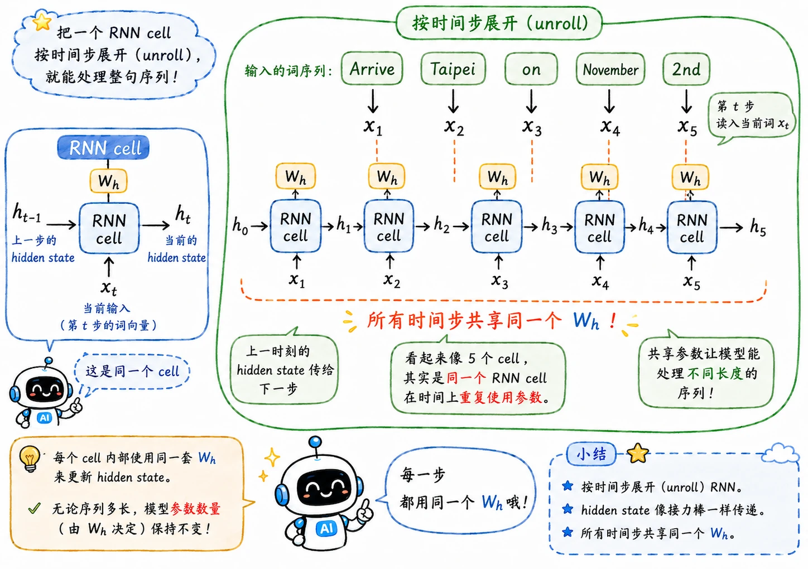

> RNN 的训练难点在于除开基础的 BP，它还要沿着时间反向传播。

## 时间展开

基础 RNN 的状态更新公式：

$$
h_t = \phi(W_x x_t + W_h h_{t-1} + b)
$$

其中的 $W_h$ 很关键，因为所有的时间步都共享同一份循环权重。

如果句子有 5 个词，RNN 会计算 5 次：

$$
h_1, h_2, h_3, h_4, h_5
$$

可以把它想象成把同一个 RNN 单元复制了 5 份，横着铺在时间轴上。

这就是 RNN 的**等效深度**，句子越长，复制的 cell 越多，展开后的网络越深。

这意味着 RNN 的时间深度除了会随着网络深度增加，还会被输入序列长度拉长。

## Loss 怎么算

不同任务的 loss 计算方式略有差异。

以槽位填充为例，每个词都需要输出一个标签。

输入：

> Arrive | Taipei | on | November | 2nd

输出：

> O | Destination | O | Time | Time

RNN 在每个时间步都会输出一个预测：

$$
y_1, y_2, y_3, y_4, y_5
$$

每个预测都和真实标签计算一次交叉熵：

$$
L_t = \text{CrossEntropy}(y_t, \hat{y}_t)
$$

整个序列的损失可以直接相加：

$$
L = \sum_{t=1}^{T} L_t
$$

还要补一句废话：训练 RNN 时不能打乱词序，这也是当然，因为词序本身就是模型会考虑的一个变量。

## BPTT

BPTT 全称 Backpropagation Through Time，随时间反向传播。

它不是一套完全陌生的新算法，本质还是链式法则。

区别在于，RNN 被展开成时间轴上的网络后，误差要从后面的时间步一路传回前面的时间步。

比如最终 loss 依赖 $h_5$，而 $h_5$ 依赖 $h_4$，$h_4$ 又依赖 $h_3$。

梯度就会沿着这条链路往回传：

$$
L \rightarrow h_5 \rightarrow h_4 \rightarrow h_3 \rightarrow h_2 \rightarrow h_1
$$

问题也正出在这里。

每往前传一步，梯度都会乘上一些和 $W_h$、激活函数导数有关的项。序列一长，连乘就会变得很可怕。

## Error Surface

基础 RNN 的 Error Surface 很糟糕，由大片平原和陡峭悬崖组成。

- 平原区梯度太小，loss 降不下去。
- 悬崖区梯度突然巨大，loss 剧烈震荡，甚至数值溢出。

换个激活函数试试？结果更糟糕了。

Sigmoid 加重梯度消失，ReLU 也没有根治。想真正解决这个问题，我们得更进一步，先想想为什么会出现这个现象。

## 和深层 FNN 的区别

深层 FNN/CNN 也有梯度消失或爆炸，但 RNN 的问题特殊在**连乘对象**不一样。

### 深层网络

深层 FNN 的梯度路径：

$$
\frac{\partial L}{\partial W_1}
\propto
W_3 \cdot W_2 \cdot W_1
$$

乘的是不同层的权重矩阵。

这些矩阵彼此独立。一层偏小，另一层可能偏大，整体还有一些抵消空间，而且网络深度固定。

### RNN

RNN 的梯度路径：

$$
\frac{\partial L}{\partial W_h}
\propto
(W_h)^{T_{\text{seq}}}
$$

它反复乘同一个循环权重矩阵。

只要 $W_h$ 的最大特征值略小于 $1$，序列一长梯度就会归零；略大于 $1$，梯度就会爆炸。

更麻烦的是，RNN 的等效深度由序列长度决定。所以你没有办法决定“我要让网络浅一点”。

## 梯度裁剪

梯度爆炸可以用一个工程方法压住：**Gradient Clipping**。

设一个阈值，比如 $15$。如果梯度范数超过 $15$，就把它按比例缩回去。

## LSTM 和 GRU

梯度消失需要更深的结构改造。

基础 RNN 的记忆更新是新状态由旧状态经过非线性变换后混合得到，旧信息每一步都要经过矩阵乘法和激活函数，这很容易被稀释。

LSTM 改让记忆走一条更直接的加法通道：

$$
c_t = f_t \odot c_{t-1} + i_t \odot \tilde{c}_t
$$

只要遗忘门 $f_t$ 接近 $1$，旧记忆就能沿着时间线比较稳定地传下去。

GRU 则是 LSTM 的轻量化版本。它减少门的数量，把遗忘和写入更紧密地联动起来，参数更少，训练也更快。
