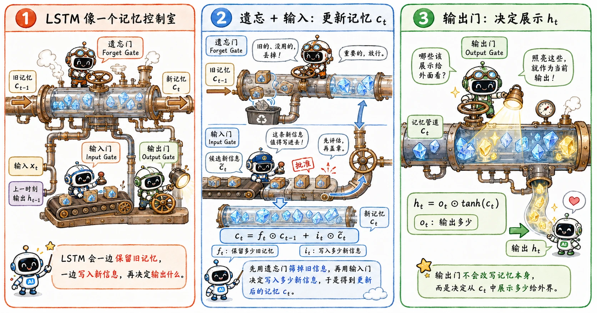

> RNN 拥有记忆，但基础 RNN 的记忆传递机制实在过于脆弱。
>
> LSTM（长短期记忆网络）直接让模型自己学会选择性地遗忘、写入和读取。

## 两条状态

基础 RNN 通常只传递一个隐藏状态 $h_t$。而 LSTM 选择了“双线并行”，同时维护两条状态流：

- $c_t$（cell state，细胞状态）：主内，偏向长期记忆的沉淀。
- $h_t$（hidden state，隐藏状态）：主外，偏向当前时刻的对外输出。

我们可以非常直观地这样理解：$c_t$ 是模型内部一本厚重的**私密账本**，而 $h_t$ 则是模型在当下这一刻决定对外**说出的话**。

账本里的记录可以原封不动地保留很久，但每一步具体要对外透露多少账本里的信息，完全由模型自己斟酌（通过门控决定）。

## 三个门

LSTM 引入了三个核心门控机制。

由于门的输出通常都经过 Sigmoid，所以它们每个维度的数值都会被压缩在 $0$ 到 $1$ 之间。可以把它们想象成有灵魂的水管阀门：

- 接近 $0$：阀门关紧，阻断信息。
- 接近 $1$：阀门全开，让信息流过。

### 遗忘门 Forget Gate

遗忘门决定旧记忆 $c_{t-1}$ 保留多少。

$$
f_t = \sigma(W_f [h_{t-1}, x_t] + b_f)
$$

如果 $f_t$ 某个维度接近 $1$，说明这部分旧记忆对当下依然很有价值，应该继续保留；如果接近 $0$，则说明这部分记忆已经过时，可以直接抹去。

有趣的是，虽然它叫遗忘门，但从数电的直觉来看，输出为 $1$ 才保留的行为更像是**记住**。

### 输入门 Input Gate

输入门决定当前步的新信息有多少可以写入记忆。

$$
i_t = \sigma(W_i [h_{t-1}, x_t] + b_i)
$$

与此同时，LSTM 会根据当前的输入和上一步的输出，草拟出一份**候选新记忆**：

$$
\tilde{c}_t = \tanh(W_c [h_{t-1}, x_t] + b_c)
$$

$i_t$ 可以看作滤网，$\tilde{c}_t$ 则是实际进滤网的内容，两者配合才决定了实际的新写入记忆量。

### 输出门 Output Gate

输出门决定当前内部记忆中，有多少内容需要暴露出去，成为当下的隐藏状态。

$$
o_t = \sigma(W_o [h_{t-1}, x_t] + b_o)
$$

最终的对外输出是这样计算的：

$$
h_t = o_t \odot \tanh(c_t)
$$

好像人心一般，就算内心（cell state）再是波澜壮阔，当下表现出来的状态（hidden state）也只是冰山一角。

## 记忆更新

搞懂了三个门，我们来看 LSTM 最关键的一步—— cell state 的更新：

$$
c_t = f_t \odot c_{t-1} + i_t \odot \tilde{c}_t
$$

这条公式干了两件事：

1. **留下该留的**：$f_t \odot c_{t-1}$ 决定了旧记忆保留多少。
2. **写下该写的**：$i_t \odot \tilde{c}_t$ 决定了新记忆汇入多少。

最后，用一个简单的**加法**将它们合并。

千万不要直接忽略这个加法。

在基础 RNN 中，记忆每走一步都要被迫经历一轮完整的**非线性矩阵运算（乘法）**；而在 LSTM 里，旧记忆被允许沿着 $c_t$ 这条通道以**加法**的形式平稳（无损失）地向后流淌。

如果某段信息极其重要，模型只需让遗忘门 $f_t \approx 1$，就可以让这份记忆在无数个时间步后依然清晰如初。同时，在梯度反向传播时，误差也可以沿着这条接近线性的通道顺畅地往回传，极大地缓解了长距离依赖中的梯度消失问题。

## 一个例子

让我们考虑这样一句跨度很长的话：

> I grew up in France ...叽里呱啦... I speak fluent French.

当模型读到 `France` 时，迅速意识到**语言背景**是一个非常关键的信息，需要写入长期记忆。

在这之后，中间可能隔了十几个毫不相干的修饰词。

如果是基础 RNN，“法国回忆”会在一次次的乘法中变得越来越淡，甚至消失。但 LSTM 可以通过门控轻松驾驭：

- 读到 `France` 时，**输入门**打开，把语言信息写进 $c_t$。
- 中间路过不痛不痒的修饰成分时，**遗忘门**保持接近 $1$，保护这份旧记忆不被破坏。
- 直到读到 `speak` 时，**输出门**打开，让语言相关记忆影响当前预测。

## 代价：参数量

力量总是伴随着代价。LSTM 确实比基础 RNN 强得多，但参数量也是一个暴增。

基础 RNN 每一步只需要算一个简单的状态：

$$
h_t = \phi(W [h_{t-1}, x_t] + b)
$$

而 LSTM 在每一个时间步都必须要计算四组数据：

- 遗忘门 $f_t$
- 输入门 $i_t$
- 候选记忆 $\tilde{c}_t$
- 输出门 $o_t$

这意味着，在输入维度和隐藏维度相同的情况下，LSTM 的参数量大约是普通 RNN 的 4 倍。

## 从单一细胞到向量化层

前面的公式是我们在严肃钻研一个单独的 LSTM 细胞结构。实际工程代码里，为了压榨 GPU 算力，我们会按向量并行计算。

假设我们构建了一层拥有 128 个隐藏单元的 LSTM。那么：

- $h_t$ 和 $c_t$ 都是 128 维的向量。
- $f_t, i_t, \tilde{c}_t, o_t$ 同样也都是 128 维的向量。

这 128 个维度里的每一个，都可以视作一个独立 LSTM cell 的状态。（可以看作是类似 CNN 的多通道，学习不同特征）

为了提高效率，主流框架通常会把计算这四组变量的权重矩阵拼在一起，搞一次巨大的**矩阵乘法**：

$$
\begin{bmatrix}
f_t \\
i_t \\
\tilde{c}_t \\
o_t
\end{bmatrix}
=
W [h_{t-1}, x_t] + b
$$

算完之后，再把这个长长的结果切成四段，分别去过 sigmoid 或 tanh 激活函数。

这就是**向量化实现**的意义——不改变任何底层的数学逻辑，只是把大批量的 cell 打包在一起同时处理，让并行计算的威力最大化。

## Peephole

有些 LSTM 变体还会引入 **peephole connection，窥视孔连接**。

普通的门控在做决定时，视野只局限于外部输入和上一步的输出：

$$
[h_{t-1}, x_t]
$$

而 Peephole 给这些门额外多开了一个猫眼，让它们能直接看到细胞状态：

$$
c_{t-1}
$$

## Stacked LSTM

单层的 LSTM 只能在时间轴（横向）上孤独地传递信息。为了提取更加抽象的高阶特征，我们通常会引入 Stacked LSTM（堆叠 LSTM）。

它在深度的方向上（纵向）叠加了多层网络。在同一个时间步 $t$ 里，第一层 LSTM 的输出 $h_t^{(1)}$ 会直接作为上一层（第二层） LSTM 的输入：

$$
x_t^{(2)} = h_t^{(1)}
$$

于是，整个架构交织成一张二维网：

- **横向（时间轴）**：从 $t-1$ 到 $t$，传递记忆。
- **纵向（深度轴）**：从低层到高层，提取更抽象的序列特征。

## GRU

如果觉得 LSTM 太过沉重，GRU（门控循环单元）是一个轻量化的替代方案。

LSTM 有三个门：输入门、遗忘门、输出门。

而 GRU 通常只保留两个门：**更新门**（Update Gate）和**重置门**（Reset Gate）。

巧妙的地方在于，它把“忘掉多少旧信息”和“写入多少新信息”绑定在了一起。

如果更新门决定保留大量的旧状态，那么新信息就只能少写一点；反之，如果决定清空旧状态，新信息就会大规模涌入。

由于少了一个门，GRU 的参数更少，训练速度更快，在大量现实任务中表现都可以说与 LSTM 旗鼓相当。因此在实际工程打磨中，究竟是用 LSTM 还是 GRU，是数据规模、任务复杂度、算力成本之间的 trade-off。
