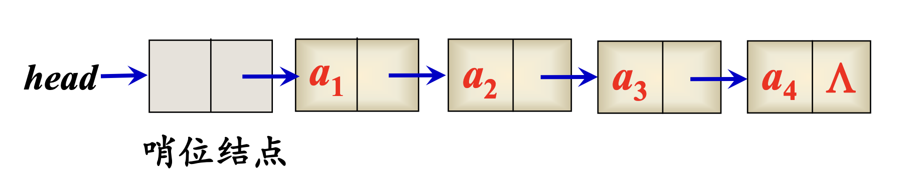
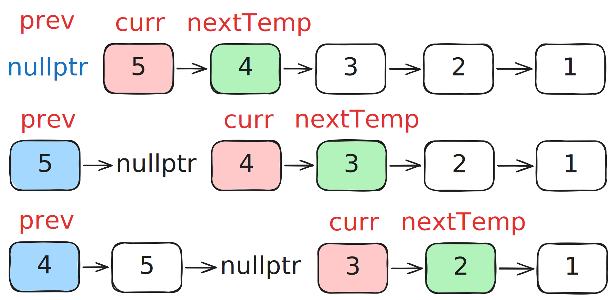
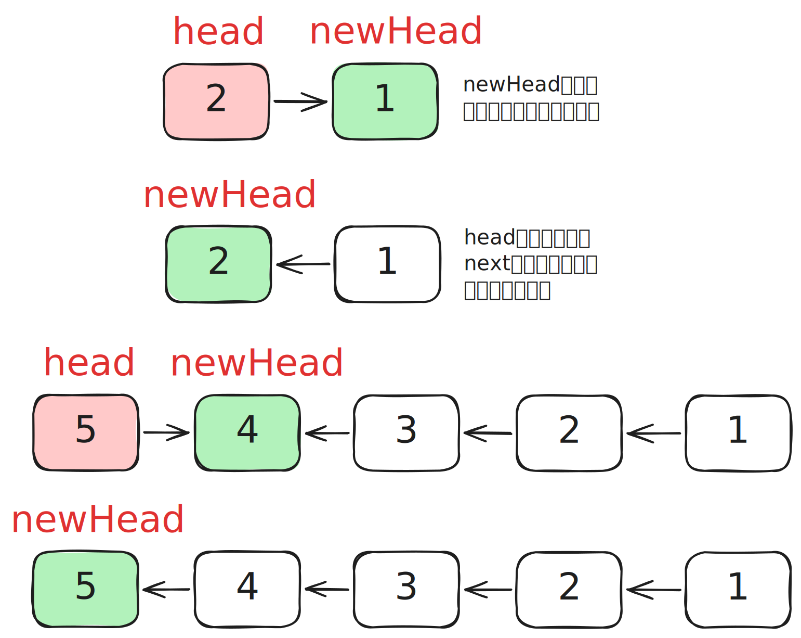
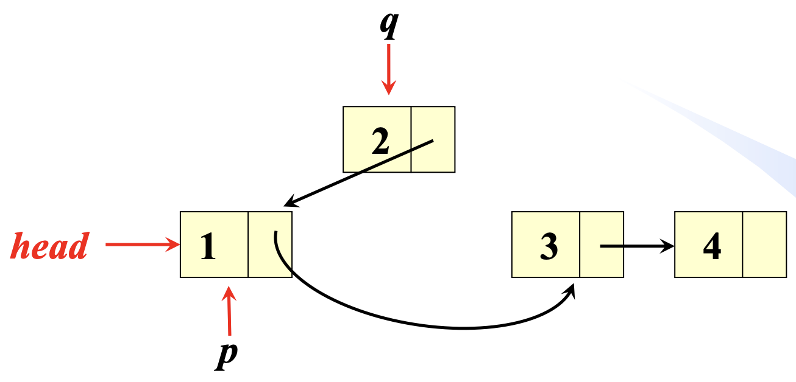
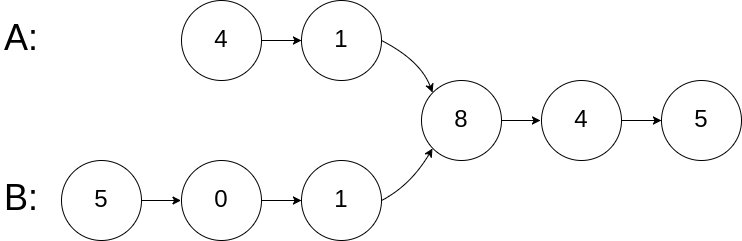

import IntersectionDemo from "../../components/blog/leetcode/IntersectionDemo.astro";

## 线性表的链接存储

> Lecture 03

```cpp
struct ListNode{
    int data;
    ListNode* next;
    // 更新更推荐的写法
    // ListNode(int d): data*(d), next(nullptr){};
    ListNode(int d){data=d; next=NULL;}
};
```

下文中线性表节点的默认结构体。

### 单链表

#### 哨兵节点

- 为便于在表头进行插入、删除操作，通常在表的前端增加一个特殊的表头结点，称其为哨位（哨兵）结点 。
- 哨位结点不被看作表中的实际结点，我们在讨论链表中第 k 个结点时均指第 k 个实际的结点。
- 表的长度：非哨位结点的个数。若表中只有哨位结点，则称其为空链表，即表长度为 0。



有了哨兵节点，在一些边界处理上就可以**一视同仁**了，比如删除节点时，不用再考虑头节点的头指针为空的特殊情况，所有节点实际代码一致。

哨兵节点还可以记录一些额外数据，比如链表长度，因为相当于自引用，维护起来也很方便。

#### 按值查找

```cpp
ListNode* Search(ListNode* head, int K){
    // 用for循环遍历链表
    for(ListNode* p=head->next; p!=NULL; p=p->next)
    if(p->data==K) return p;
    return NULL;
}
```

#### 新建/删除节点

```cpp
ListNode* s=new ListNode(K);

delete s;
```

### 循环链表

循环链表的尾节点不再置 `nullptr`，而是指向头结点，即可以从链表的任一节点开始访问任一节点。

#### 判断位置

代码默认含哨兵节点。

```cpp
// 判断表空
if (head -> next == head) return true;
// 判断到尾
if (p -> next == head) return true;
```

#### 约瑟夫问题

需要注意，虽然约瑟夫问题都是环形链表的背景，但一般都不会真正用到环形链表结构，而是用数组模拟，或者直接用数学方法求解。

##### 1. 好人坏人

$2k$ 个人站成一圈，从某个人开始数数，每次数到 $m$ 的人就被杀掉，然后下一个人重新开始数，直到最后只剩一个人。现在有一圈人，$k$ 个好人站在一起，$k$ 个坏人站在一起。从第一个好人开始数数。你要确定一个最小的 $m$，使得在 $k$ 个坏人均被杀死时 $k$ 个好人都存活。

```cpp
bool Check(int k, int m) {
  int n = 2 * k;  // 初始总人数
  int pos = 0;
  for (int i = 0; i < k; i++) {
    // 计算下一个要杀的人的索引
    pos = (pos + m - 1) % n;
    // 杀到好人
    if (pos < k) {
      return false;
    }
    // 杀掉坏人
    n--;
  }
  return true;
}

int main() {
  int k;
  if (cin >> k) {
    // m <= k，第一轮杀好人
    int m = k + 1;
    while (!Check(k, m)) {
      m++;
    }
    cout << m << endl;
  }
  return 0;
}
```

##### 2. 约瑟夫问题

$n$ 个人围成一圈，从第一个人开始报数,数到 $m$ 的人出列，再由下一个人重新从 $1$ 开始报数，数到 $m$ 的人再出圈，依次类推，直到所有的人都出圈，请输出依次出圈人的编号。

```cpp
int main() {
    int n, m;
    // 总人数 n 和报数间隔 m
    if (cin >> n >> m) {
        vector<int> people;
        for (int i = 1; i <= n; ++i) {
            people.push_back(i);
        }
        int pos = 0; // 起始位置
        while (!people.empty()) {
            // 计算索引
            pos = (pos + m - 1) % people.size();
            cout << people[pos] << " ";
            // erase 后，pos 指向下一个
            people.erase(people.begin() + pos);
        }
        cout << endl;
    }
    return 0;
}
```

### 双向链表

- 每个结点有两个指针域
- `prev` 指针指向其前驱，`next` 指针指向其后继；
- 优点：方便找结点的前驱。

```cpp
struct ListNode{
    int data;
    ListNode* prev;
    ListNode* next;
    // ListNode(int d): data(d), prev(nullptr), next(nullptr){};
    ListNode(int d){data=d; prev=next=NULL;}
};
```

遍历时避免了双指针的维护。但在插入/删除指针时，相当于前驱结点 + 本结点 + 后继结点共六个指针的维护，需要更清晰的逻辑。

而且在考虑边界情况时，单向链表只需考虑头节点，而双向链表需要兼顾头尾节点。这意味着即使加入哨兵节点，也需要头尾各一个。

或者使用**双向循环链表**，则只需要一个哨兵节点了。这也是 C++ 中 **`std::list`** 和**操作系统内核链表**的底层实现。

## 链表的双指针技巧

> Lecture 04
>
> 这一章以题目为主，我会挑选一些对我有启发的放进来。
>
> 当然，有一些题在 leetcode 文章中讲过类似的，也不在此赘述了。

### 876. 链表的中间结点

https://leetcode.cn/problems/middle-of-the-linked-list/description/

找单链表中间位置的结点，要求只遍历一次链表。若链表长度为偶数，返回两个中间结点中靠右的那个结点。


#### 示例

> **输入：** head = [1,2,3,4,5,6]
>
> **输出：** [4,5,6]
>
> **解释：** 链表共有 6 个结点，结点 4 位于中间靠右位置。

#### 提示

- 链表结点数范围是 `[1, 100]`。
- $1 \le \text{Node.val} \le 100$

#### 解法

这个用基本的快慢指针就行。

```cpp
ListNode* middleNode(ListNode* head) {
    ListNode *fast = head, *slow = head;
    while (fast && fast -> next) {
        fast = fast -> next -> next;
        slow = slow -> next;
    }
    return slow;
}
```

我放进来是因为这个题目的变体：**如果链表长度为偶数时返回中间靠左的结点呢？**

答案其实出乎意料的简单：只需要在遍历开始之前让快指针先走一步就行了。

### 206. 反转链表

https://leetcode.cn/problems/reverse-linked-list/description/

给你单链表的头节点 `head` ，请你反转链表，并返回反转后的链表。

#### 示例

> **输入：** head = [1,2,3,4,5]
>
> **输出：** [5,4,3,2,1]

#### 提示

- 链表中节点数目范围是 `[0, 5000]`。
- $-5000 \le \text{Node.val} \le 5000$

#### 迭代法

```cpp
ListNode* reverseList(ListNode* head) {
    ListNode* prev = nullptr; // 已反转部分头部
    ListNode* curr = head;    // 当前正在处理节点
    while (curr) {
        ListNode* nextTemp = curr->next;
        curr->next = prev;
        prev = curr;
        curr = nextTemp;
    }
    return prev;
}
```



#### 递归法

```cpp
ListNode* reverseList(ListNode* head) {
    // 基准情况：空链表/单节点
    if (!head || !head->next) {
        return head;
    }
    // 递归找到最后一个节点作为新头
    ListNode* newHead = reverseList(head->next);
    // 翻转
    head->next->next = head;
    head->next = nullptr;
    return newHead;
}
```



#### 头插法 - PPT解法

```cpp
ListNode* reverseList(ListNode* head) {
    if (head == nullptr) return head;
    ListNode *p = head, *q = head->next;
    while (q != nullptr) {
        p->next = q->next;
        q->next = head;
        head = q;
        q = p->next;
    }
    return head;
}
```

`p` 指针永远固定不动，从一开始的 `head` 逐渐滑落到队尾；`q` 指针指向 `p->next`，扮演被操作节点。

优势在于逻辑直接，且工作区一直维持在 `head` 和 `p` 之间，可以利用上 `head` 来操作。



### 160. 相交链表

https://leetcode.cn/problems/intersection-of-two-linked-lists/description/

给你两个单链表的头节点 `headA` 和 `headB`，请你找出并返回两个单链表相交的起始节点。如果两个链表没有交点，返回 `null` 。



#### 一般思路

1. 如果两个链表相交，则最后一个节点共有。
2. 分别遍历2个链表，分别记录尾节点和链表长度。若尾节点相等则相交；否则不相交。
3. 相交下，让较长链表头指针先走 `abs(lenA - lenB)` 步，然后两个链表同时走，直到找到第一个相同节点。

#### 高手解法

直接意会吧，不多说。

```cpp
ListNode *getIntersectionNode(ListNode *headA, ListNode *headB) {
    if (!headA || !headB) return nullptr;
    ListNode *pA = headA, *pB = headB;
    // 交点/nullptr
    while (pA != pB) {
        // 如果 pA 走到头，切换到 headB；否则继续走
        pA = (pA == nullptr) ? headB : pA->next;
        // 如果 pB 走到头，切换到 headA；否则继续走
        pB = (pB == nullptr) ? headA : pB->next;
    }
    return pA;
}
```

<IntersectionDemo />

## 138. 随机链表的复制

https://leetcode.cn/problems/copy-list-with-random-pointer/description/

题目太长，就不放在这里了，思路就是用[哈希表](/blog/leetcode01/#学习哈希)建立映射关系。

```cpp
Node* copyRandomList(Node* head) {
    if (!head) return nullptr;
    // 第一遍遍历：建立映射
    Node* cur = head;
    unordered_map<Node*, Node*> map;
    while (cur) {
        map[cur] = new Node (cur->val);
        cur = cur->next;
    }
    // 第二遍遍历：建立连接
    cur = head;
    while (cur) {
        map[cur]->next = map[cur->next];
        map[cur]->random = map[cur->random];
        cur = cur->next;
    }
    return map[head];
}
```
